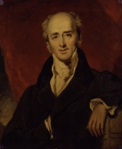
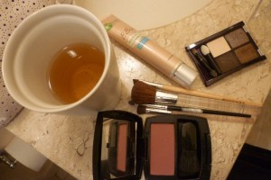
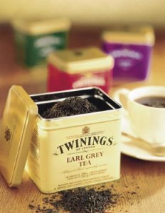
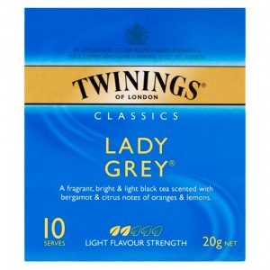
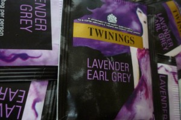
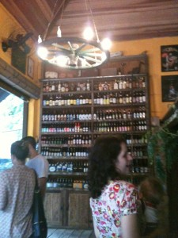
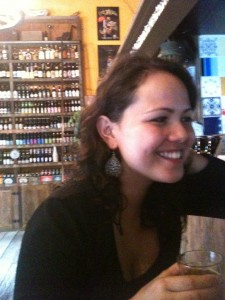
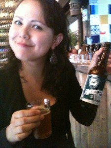

# esse tal de Earl Grey

3 março, 2013 | [outros chás](http://www.cerimoniadocha.com.br/posts/outros-chas/ "Ver todos os posts em outros chás"), [tea bar](http://www.cerimoniadocha.com.br/posts/tea-bar/ "Ver todos os posts em tea bar") | [4 comentários](http://www.cerimoniadocha.com.br/outros-chas/esse-tal-de-earl-grey/#comments)

Escrevo este *post* tomando, é claro, uma xícara de Earl Grey. Durante os três anos que morei em Paris eu tomava este chá todas as manhãs. A primeira coisa que eu fazia ao sair do banho era colocar água para ferver na chaleira elétrica e preparar a granola com iogurte e frutas. Enquanto a água esquentava, eu me arrumava (correndo) e comia (correndo). De volta à mini-cozinha, eu colocava um saquinho de Earl Grey na xícara e despejava água quente. O tempo da infusão era o tempo de preparar o pão de leite com manteiga e geleia, pegar uma daquelas embalagens individuais de leite (tipo de avião) e fazer o make básico. De volta, jogava o leitinho na xícara e adoçava, comia o pão e terminava de me arrumar. Eu sempre achava que dava tempo de fumar um cigarro rápido com o finzinho do chá. Esses cinco minutos eram os que me atrasavam e me faziam descer as escadas correndo, andar apressada, me jogar no metrô e chegar na hora.

É muito engraçado eu me lembrar disso tudo e ter de fundo a voz do Stephen Twining dizendo “*tea brings you gently to the world*“.

Um pouco contraditório com aquelas manhãs em que eu já acordava pilhada antes mesmo do chá – mas foi quando eu aprendi que posso me arrumar e sair de casa em meia hora. Hoje, eu continuo me arrumando rápido, mas gosto de dar leve enrolada, principalmente se tem chá…

Eu não me lembro quando conheci o *Earl Grey*, mas guardo a exata cena da primeira vez que tomei um chá preto na vida. Eu devia ter uns 16 anos e estava com febre no meio da aula de inglês. Fui para a sala dos professores e a *teacher* falou que ia ser legal eu tomar um chá. Naquela época, meu sonho era conhecer Londres e, mesmo doente, me achei tão *british* tomando um chá preto com adoçante em dois copinhos de plástico… Nunca mais abandonei. Em algum momento da minha vida (e eu desconfio que seja na época em que morei com o Andy), descobri o chá preto com leite. Gosto de adoçar com uma colher de café de mel. Principalmente *Earl Grey*. Acho uma das combinações mais felizes de sabor: chá preto e bergamota.

Nunca tinha parado para pensar na origem disso até conhecer Sthephen Twining. Foi em sua palestra que vi a cara do Conde que deu o nome ao chá. Charles Grey foi primeiro ministro britânico em 1830 e ganhou este *blend* de presente em uma de suas viagens. Ele pediu então para a Twinings reproduzir o *blend*, que foi batizada com seu nome. A mistura de chá preto com óleo de bergamota ficou tão popular que várias marcas começaram a reproduzi-la com o mesmo nome. Mas a original é da casa Twinings, que se orgulha de dizer que desde então, o chá não muda de sabor.

Ela é a minha referência também. Para mim, a embalagem amarela é sinônimo de credibilidade.

Toda vez que tomo um *Earl Grey* de qualquer marca e classifico como muito aromatizado ou muito fraco, meu parâmetro é sempre este. Na palestra do Stephen, descobri que os *tea tasters* que trabalham com eles se desdobram a cada safra para buscar qual a proporção e quais chás vão usar para manter exatamente o mesmo sabor, o mais tradicional da casa. Fico imaginando isso no meio de 30 mil tipos de chás que existem na “biblioteca” deles.

Resumidamente, a receita muda a cada ano para que o chá tenha o mesmo gosto.

Tudo pode mudar no mundo, menos o sabor do *Earl Grey*.

Há uns anos, comecei a explorar algumas variações. E sou igualmente fã de todas elas.

O *Lady Grey* (também da Twinings), é um pouco mais suave, para mocinhas (é um dos preferidos da minha irmã). Ele tem um sabor bem delicado… O chá preto é aromatizado com casca de limão e lima e um pouquinho de óleo de bergamota.

Eu costumo recomendá-lo para quem nunca tomou *Earl Grey* antes: é um chazinho aromático introdutório, leve, com cara de chá de meio da tarde. Para tomar no café do Cinesec antes de ir para a sessão das quatro num domingo de outono. Com ou sem leite.

Quem já passou por esses dois, pode se aventurar no *Earl Grey* com lavanda. O primeiro que tomei foi da Tealosophy (*by* Inés Berton) na Argentina. Ainda acho um chá delicado, mas como ela usa lavandas da Provence, talvez seja um pouco perfumado demais para quem não está acostumado. Eu guardo minha latinha marrom a sete chaves e prefiro tomar este puro, sem leite, em manhãs de inverno em que sei que vou ter um dia bem duro pela frente. Tomo para me fazer um agrado e saio de casa como se tivesse lido uma linda poesia… Recentemente, descobri uma versão da Twinings que faz parte de uma linha *premium* que infelizmente não tem ainda no Brasil.

Tomei este chá com a Grazi, em Campinas, quando ela esteve no início do ano no Brasil. Ela, que adora chás perfumados, com lichia, violeta etc. ficou encantada com o sabor da lavanda misturado ao chá.

Eu gosto tanto de *Earl Grey*, principalmente com leite (e prometo outro dia escrever um *post* só sobre o leite), que outro dia me peguei usando isso como adjetivo. Estava com a Cássia H. no Empório Sagarana e fiquei com vontade de tomar uma cerveja HARDCORE IPA, da fábrica escocesa Brew Dog. Ela é uma das cervejas *premium* que mais gosto. Mais doce no começo, forte, aromatizada e amarga.

No primeiro gole, já soltei que ela era bem *Earl Grey*.  Mais do que recomendada para quem busca uma variação na linha “chá de cevada” (piada clássica de toda palestra que dou para o pessoal de vendas  - leia “público essencialmente masculino”).

Deixo umas cenas levemente embriagadas do Sagarana e da garota propaganda que gentilmente cedeu suas imagens para este modesto blog!

Cheers!
