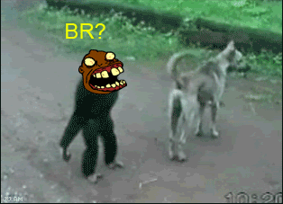
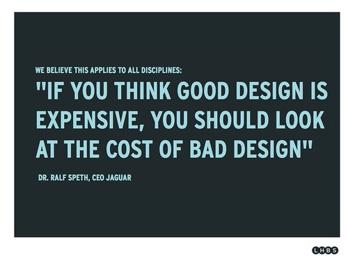

# Como me tornei persona non grata (ou: como eu não apoio mais tudo que é jogo nacional)

Daí que esses dias eu vi um comentário no grupo de Facebook sobre boardgames: “A febre de 2011-2012 de comprar tudo nacional já passou.”. Eu achava que era só eu que fazia isso.

Depois de alguns financiamentos e jogos nacionais que me decepcionaram muito, e o recente playtest de um outro jogo de cartas ai, eu tive uma epifania que demonstra o quanto eu sou lerdo / idiota: *"E se, nem TUDO que sai por aí nesse BRAZIU é realmente BOM?".* E a resposta é: *NÃO SÃO!*

**

Hoje tenho alguma propriedade pra julgar jogos melhor… trabalho e estudo eles todo dia praticamente. Depois da palestra sobre design de jogos independentes que participei no WRPGFest eu parei pra pensar o que me incomoda, e o que pode mudar… pq a ideia desse post não é só criticar por criticar que nem essa galera tetuda que existe por ai; é uma crítica construtiva pois eu realmente quero que o mercado de jogos nacional (digital, boards e qualquer outro tipo) cresça e amadureça.

Tive uma ideia: Vou fazer uma lista+1. Eu gosto de listas. Aqui vai:

**LISTA +1 | COISAS QUE ME INCOMODAM NOS JOGOS DO MERCADO INDEPENDENTE NACIONAL**

**1- Produção gráfica ruim.** Nosso parque gráfico não é o melhor do mundo e o amadorismo e picaretagem dos caras de gráficas, birôs e impressões rápidas impera. Se você quer produzir um jogo e não faz ideia de como imprimir ou fazer direito, das duas uma: procure alguém que saiba (um designer gráfico ou produtor gráfico bom) ou não faça. Se é pra lançar coisa porca eu prefiro nem lançar.

**2- Meu jogo meu Quico.** Só porque você acha o jogo um TESOURO isso não significa que ele seja e que você não deva se misturar com a gentalha (a.k.a. os jogadores e a comunidade). Ele pode ser um cocô disfarçado. Acredite eu já vi isso (e até já FIZ isso). Colete feedback e saiba mudar o que tem que mudar. Isso nos leva ao próximo ponto…

**3- Divas. Divas everywhere.** Não se ache acima de qualquer julgamento. No fim das contas o jogo é pros outros e não só pra você: aceite críticas, reconheça o que está ruim e se esforce pra melhorar. Tem um punhado de gente no mercado que tá se queimando exatamente pq não reconhece que o jogo não é essa Beyoncé toda e caga na cabeça de quem quer vê-lo melhorar.

**4- Game design “ruim”.** Nosso mercado é novo, então estamos aprendendo. Eu mesmo incluso. Não dá pra fazer o novo God of War e muito menos um board de sucesso que arrecade milhões no catarse (até dá, mas é bem difícil) na primeira tentativa. Existe uma diferença entre se inspirar em mecânicas e outros jogos, e fazer a mesma coisa com outra “cara” ou temática (como um amigo meu disse, era a “Munchkinização” dos jogos nacionais). Mas aqui, como falei, estamos aprendendo, e críticas são fundamentais (a não ser que você seja uma diva) para criarmos uma “escola” de design nacional.

**5- Financiamento coletivo não é pré-venda.** O que eu vejo de add-on inútil que não agrega valor à nada do jogo não tá no gibi. Sério, chaveiro e placa de porta de quarto que se cria uma regra pra justificar produzi-lo? Pesquise o que já foi feito… se inspirar nos que foram bem sucedidos é um caminho; mas atente: se inspirar e não COPIAR. As vezes o jogo pode até ser maneiro, mas um fc bosta bosteia ele todo.

**Conclusão:**Avalie antes de fazer ou investir seu dinheiro. Seja crítico, mas não seja babaca: só pq não é o seu tipo de jogo, não significa que ele é uma porcaria. OUVIR os outros é fundamental também. Tem um monte de gente com boas ideias por ai, mas só isso não basta: tem que ter planejamento.

[opiniao](http://dmaisum.tumblr.com/tagged/opiniao)
[financiamentocoletivo](http://dmaisum.tumblr.com/tagged/financiamentocoletivo)
[badgamedesign](http://dmaisum.tumblr.com/tagged/badgamedesign)
[mercadonacional](http://dmaisum.tumblr.com/tagged/mercadonacional)
