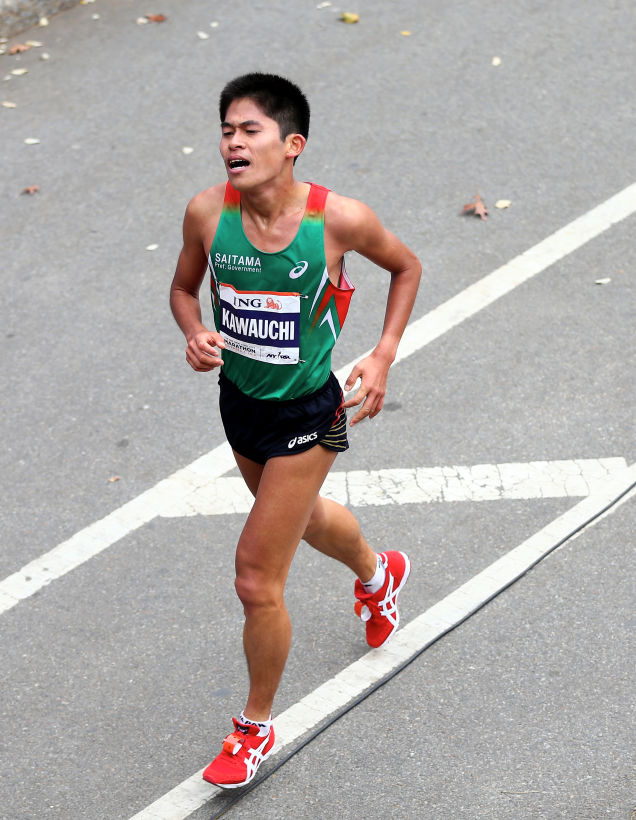

# How This Working Man Became Japan's Most Controversial Marathoner

Expand

One guy, one not-super-fast-or-important guy has sort of spanked the elite running establishments of Japan, and the US of A. That guy is Japanese government clerk [Yuki Kawauchi](http://japanrunningnews.blogspot.com/2014/03/the-kawauchi-counter.html), pronounced Kow wah OO chee. He'll be part of the elite men's field in Sunday's NYC Marathon.

First, the spanking. In 2013, Kawauchi, a self-coached, 40 hour/week government worker, ran eleven marathons (most top marathoners run two, maybe three, marathons per year). His average time in those eleven outings was faster than the top eleven US marathon times, run by all Americans. Four of Kawauchi's eleven marathons were sub-2:10 (still the benchmark for elite status, though East Africans are often five minutes faster). In the history of US marathoning, there was only one year in which the entire US produced more,five, sub-2:10 performances. The US is lucky to have three sub-2:10 performances in a given year, usually posted by three different people.

Though Japan's corporate running system has produced a raft of sub-2:10 marathon performances lately, that resurgence has largely been a reaction to Kawauchi's embarrassing takedown of Japan's top corporate star in the [2011 Tokyo Marathon](https://www.youtube.com/watch?v=StGekhxY-qg&list=PLL8fR16pzKfPk7bQE5q-v3nzr_U5nlBVt). Kawauchi, then an unknown 23-year-old with a full-time job, went by the corporate golden boy—who essentially ran for a living with salary, coaching, teammates, gear, all provided—at about 24 miles and placed third, the top Japanese runner, in 2:08:37. Kawauchi's best, 2:08:14, was set last year: His 2:09:36 this year is the second-fastest by a Japanese athlete.

Author of the blog [Japan Running News](http://japanrunningnews.blogspot.com/), and the English-speaking world's portal into the insular world of Japanese running, Brett Larner, said of Kawauchi's effect on that establishment, "He's been a provocateur, a catalyst. He's been very outspoken about the shortcomings of the corporate system and that pisses a lot of people off; some people really despise him. They will come to a race only to beat Yuki. He loves it; they're responding to him. Every year since his 2011 breakthrough, Japan has had ten sub-2:10 marathons."

But Kawauchi is not out to humiliate anyone; it's merely a by-product of his paradoxical nature. He's very nonconformist in a conformist culture ("It's hard to go your own way in Japan," said Larner); he's a runner who is "despised" by many in the running community but adored by the Japanese public; his success has come by being ruggedly independent and brave— traits associated with American culture—but he's embraced by the Japanese for bringing back traditional Japanese values of authenticity, honor, honesty, sincerity, humility—traits they find lacking in products of the corporate system. And, indeed, his actions, shaving his his head in shame when he failed to qualify for the 2012 Olympic team smack of 110% Japanese.

His unswerving honesty and sincerity seem almost child-like, yet his sense of responsibility and accountability toward his own code of ethics and his fans is a level of adulthood rarely observed in sports figures today. Witness: Prior to the October 3rd [Asian Games marathon](https://www.youtube.com/watch?v=0o2-vaWBOK0&feature=player_embedded) (one month ago—unthinkably close for any other runner), Kawauchi said if he didn't win gold, he would remove himself from contention for the 2015 World Championship team. In a teeth-gritted sprint finish, Kawauchi placed third, four seconds out of first. True to his word, he said he would not run any of the selection races for the World Championships and would not attempt another world-level berth until he's improved his marathon time.

Another paradox, watch the end of that video, or any of his [other finishes](https://www.youtube.com/watch?v=ustShmVw4cE) that find him collapsed, wrecked, carted off on a stretcher, and think about his insistence that he runs for fun.

"He's a rebel government clerk, which is an oxymoron in itself, and has been vocal in encouraging people to try other ways, that you don't have to be a cog in the system," said Larner, "but he's so dedicated to his job, he rarely runs outside Japan so he won't have to take a day off."

His running follows similarly contradictory patterns: He races almost every weekend (though to be fair, Larner said, he uses many half marathons as training runs for a less frequent target marathon), a program on which most top runners could not even survive much less show improvement. He refuses offers of sponsorship, a spot on a corporate team, even a gym membership, all things most elites think of as essential to getting the job done. Though Japan has had many distance running stars, Kawauchi said he is inspired by runners who have had long careers, like Lee Troop of Australia, Chema Martinez of Spain, and Haile Gebrselassie of Ethiopia.

In his second trip to New York City (he was 11th in last year's NYC Marathon in 2:12:29, see photo above), I sat down in the Javits Center with Kawauchi and Larner, who translated. Dressed in a Christmas-colored wind suit, Kawauchi bowed and shook my hand, spoke easily and laughed often. On our way out through the marathon expo, an experience he's had in different cities 33 times this year alone (this is his 40th career marathon, since 2009), he snapped photos, picked up brochures from other marathons and engaged in a little high-knee jogging. He seemed utterly delighted. Here's a little of the paradox that is Yuki Kawauchi:

**Why do you race so often?**

Two reasons: It serves as training for me. Because I'm on my own, I use races as workouts and to get race experience. It's more productive than just long periods of training. The other reason is that it's my dream to run marathons all around the world, in every country. Racing often is a way to make that dream happen.

**How many countries have you raced in so far?**

Eleven countries.

**I'm going to list off some goals. Tell me if this is important to you, if it's a goal, or not. To run a sub-2:08 marathon?**

Yes, and very soon. Maybe not here in New York though; the course is very tough. The Hofu Marathon in December will be a serious shot at going sub-2:08.

**To run a lot of races?**

Sort of. By the 2020 Tokyo Olympics, I want to have run 100 marathons.

**To elevate Japanese running, both in the sense of making Japan more competitive on a world scale, and to make it more visible to the rest of the world?**

Yes, very much so. Japanese marathoners have a reputation for being timid or weak. I want to show that Japanese runners can be tough, strong, and compete well outside Japan. [Larner later said Japanese runners view international races as an experience, a way to see how the rest of the world races, with little regard to actually trying to win. Consequently, Japanese runners often run poorly outside of Japan.]

**To demonstrate alternatives to the corporate system of elite running?**

Yeah, of course. There are lots of options out there for young runners. I want to show that they have choices.

**Have young runners been inspired by you? Have they chosen an independent path?**

Decades ago, some of the best Japanese runners operated outside the team structure. More recently, some athletes have quit {the corporate system] and continued as independents.

**To represent Japan at major championships?**

Yes, it is a goal. For most Japanese athletes, that's their only goal. It's not the be all end all for me.

**To have fun and travel?**

[laughs] That's the number one! The having fun part.

**Do you think you'd run faster if you raced less?**

Racing a lot is what my running means to me, it's a key element. If I raced less, it would be something different. It's hard to describe but racing a lot has meaning, it's the essence of my running.

**Your goal of running sub-2:08 and racing every weekend seem confllcting…**

[laughs] They're not mutually exclusive. If I raced less, it would effect my motivation. I might lose interest in running if I only raced a few times a year.

**How many km/week do you run?**

130kilometers to 140km [80 to 87 miles/week; most top marathoners put in 100 to 120 miles/week]

**Describe a typical week of training/racing.**

Monday and Tuesday, a 20km jog at 5min/km pace; Wednesday intervals; Thursday,Friday and Saturday, 20km jog; race Sunday. I work out once a day, in the morning. I work from 12:45 to 9:15 pm in the office of an adult continuing education school, accepting fees, answering the phone.

**And you're back in the office on Monday?**

Usually, yes.

**After New York, will you be back in the office Monday?**

Last year after New York, I got back early Tuesday afternoon and went immediately to work. This time I'm getting back Tuesday but will wait til Wednesday to go to work.

**Slacker.**

[laughs]

**Do you have an off season?**

When I'm not in a World Championship, there aren't a lot of races in August, so that's the closest thing I have to an off season.

**Do you do strength training or cross training?**

Monday, Wednesday, and Friday, I do basic things—bench press, lat pull down, adductor and abductor exercises. At home, not at a gym.

**Do you have weights at home, or equipment?**

[laughs] No, I made it myself from stuff I got at a home supply store.

**How are you able to avoid injury on such a relentless schedule?**

I race nonstop, but of course it's divided into main races and sub-races. I'm not hitting it hard every week. Also, I'm really careful with immediate post-race recovery—jogging, walking, icing, going to the onsen [Japanese hot springs]. If I have pain, I'll take time off, one day, and focus on things necessary to treat that pain. I've had some small things, but I'm very careful. Once or twice a month I go to a massage therapist for massage and acupuncture. On weekends, the group I train with, we give each other massages.

**Are you going to go to an onsen in New York?**

[laughs] If there is one, I'll go.

**Are you vegetarian?**

**Now this is rude but I'm going to go ahead and ask, how much did you make from races last year? How much do you make at your job?**

[After discussion, Larner said there are regulations about how much Kawauchi can make from racing because he's government employee, but suffice to say, he made more from running than from his salary.]

**Why not quit your job?**

[laughs] There's no reason to quit. Every year since I started running, I've set personal bests. This environment works for me. If I had more free time, it might not work.

**What is your plan for improvement?**

Definitely, the way I'm doing things now is good enough to get me there. 2:07 is in sight, in December at Hofu or in March in Seoul.

**Have you inspired others to try your independent, frequent racing method?**

In the group I train with [a loose group of working people, university runners, some corporate runners], some people are following that model, but they are running to win small local races, or break 2:30 in the marathon. It's true, good university runners still choose the corporate model. If they did what I'm doing, it would be interesting to see what might happen. [laughs]

*photo credit: Getty Images*
