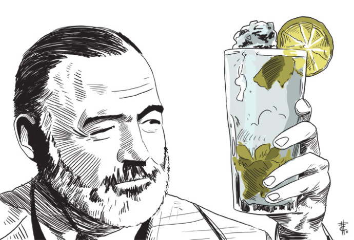
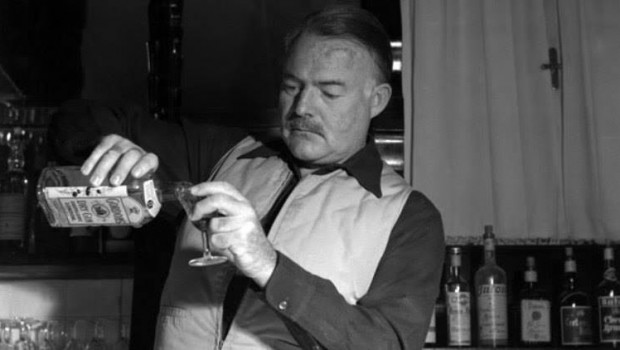

> “Um homem não existe até que fique bêbado.”**–** Ernest Hemingway

Além de ter ganho o Nobel e ter revolucionado a literatura e o cinema, com seu estilo conciso de “mostrar” em vez de “contar”, Hemingway também foi um inventor de drinques. Seu gosto etílico, inclusive, aparece em sua literatura. Quem leu *O sol também se levanta* deve ter ficado salivando de desejo de tomar um bom vinho, gelado nas águas, como se faz no sul da França; talvez também um inebriante Jerez, das terrazas sevilhanas.

Coquetéis à parte, um dia o beberrão – com todo respeito ao “papa”, como era conhecido, e ao álcool – sentou-se à mesa de um bar em Havana, Cuba, e inventou um drinque pelo qual ficaria conhecido. No La Bodeguita del Medio, Hemingway criou um de seus clássicos, e não estamos falando de livros, e sim do drinque: Mojito.

Antes de explicarmos como se prepara, é válido acrescentar que no mesmo bar em que Hemingway inventou o drinque, Brigitte Bardot, Nat King Cole, Jimmy Durante, Erroll Flynn e muitas outras celebridades tomaram o Mojito.

Mas resumindo a tertúlia, para prepará-lo, você vai precisar de**:**

o    5 folhas de hortelã + 1 ramo para decoração;

o    30ml de suco de limão;

o    60ml de rum leve;

o    gomo de limão;

o    20ml de xarope simples.\*

Com os ingredientes em mãos, amasse as folhas de hortelã em um copo alto, despejando logo depois o suco de limão, o xarope e o rum. Acrescente o gelo, decore o drinque com o gomo de limão e o ramo de hortelã e é só servi-lo!

**Um brinde a Ernest Hemingway e à camiseta *O Velho e o Bar* que estamos vendendo para homenagear o papa ([ver aqui](http://goo.gl/FyFKgw)).**

\*\*\*

**Bibliografia:**

BAILEY, Mark. *Guia De Drinques Dos Grandes Escritores Americanos.*Editora Zahar.

\*O xarope simples é uma solução feita com uma xícara de açúcar granulado e uma xícara de água. Coloque tudo numa panela em fogo médio. Espere até atingir um ponto de fervura baixo e depois cozinhe até que o açúcar se dissolva. Tire do fogo e deixe esfriar. Depois guarde o xarope numa garrafa e refrigere. Guarde por no máximo uma semana.

The post [Aprenda a fazer o ‘Mojito’, um dos drinques criados por Ernest Hemingway](http://homoliteratus.com/aprenda-fazer-o-mojito-um-dos-drinques-criados-por-ernest-hemingway/) appeared first on [Homo Literatus](http://homoliteratus.com).
