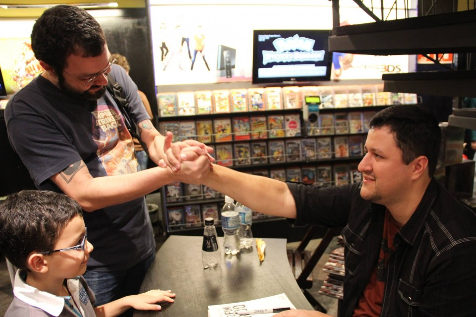
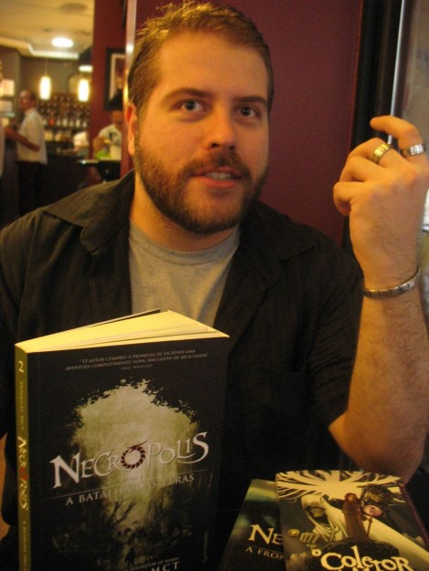
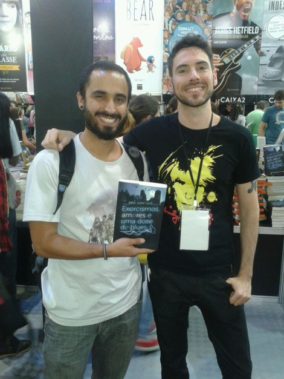
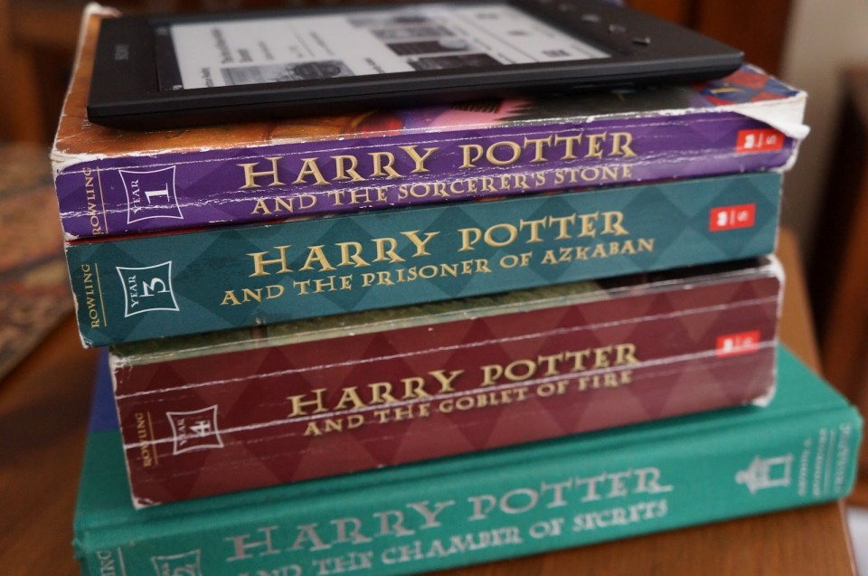

# Literatura nerd e brasileira? Sim, é possível. :)

## Aquele preconceito típico da década de 1990 vai aos poucos caindo por Terra e o leitor vai percebendo que, sim, seus conterrâneos consegue fazer boas histórias para um exigente público de interesses bem específicos...

Vamos fazer a internet pensar
  
**COMPARTILHE!**

Ele dedicou grande parte de seus 36 anos ao nobre exercício do jornalismo. Nerd confesso, começou a flertar com o cinema e, fã de gêneros que atraem todo fanático por cultura pop como fantasia (na melhor tradição de Tolkien), terror e ficção científica, lá foi ele experimentar o tortuoso caminho da literatura. Lançou seu primeiro livro, de ficção, laureado com a principal premiação do gênero em seu país natal. Já colocou dois materiais mais curtos em plataformas como a Amazon. E prepara a sua próxima incursão literária para breve.

Esta poderia ser a trajetória de um Brad Meltzer ou Orson Scott Card da vida, claro. Mas estamos falando de **Fábio M. Barreto**. Brasileiro, atualmente residindo em Los Angeles, ele não é apenas chapa do **JUDÃO**. É também autor de *Filhos do Fim do Mundo*, obra de tom apocalíptico lançada em 2013 AGRACIADA com o Prêmio Argos de Literatura Fantástica. Recentemente, lançou o conto *O Céu de Lilly* (com ares de Neil Gaiman) e *A Velha Casa da Colina*, terror especialmente escrito para o Halloween.

E, no ano que vem, deve ser publicado no Brasil seu segundo livro, *Snowglobe*, conceito no qual Barreto trabalha desde 2007. “Tenho um plano muito claro com os primeiros três livros: apresentar a ficção a marinheiros de primeira viagem, ou seja, nada de grandes detalhes técnicos ou mundos muito doidos. Logo, vou abordar o que acredito ser os três maiores pilares do gênero: Apocalipse, Viagem no Tempo e Exploração Espacial”, explica, em papo exclusivo com o **JUDÃO**.

Este que vos escreve, trintão e nerd de longa data, sabe bem que a produção cultural brasileira de cunho pop sofria, até pouco tempo atrás, um preconceito enorme por parte dos fãs. Os poucos lançamentos especializados, fossem quadrinhos, livros, filmes ou animações independentes de ficção ou terror, todos eram tratados como mero underground, relegados ao lado mais obscuro das prateleiras. “Livro brasileiro? Putz, literatura brasileira eu leio nas aulas do cursinho, valeu”, me confidenciou um amigo, certa vez, ainda na idade do vestibular, antes da virada dos anos 2000 (é, sou velho, me respeitem).

Nos dias de hoje, existe mais espaço nas prateleiras para a ficção do fim do mundo de Barreto, para os anjos de Eduardo Spohr, para os vampiros de André Vianco, para os zumbis de Alexandre Callari. Cada um deles com um séquito de fãs que, outrora, se interessariam apenas por Stephen King, William Gibson ou um certo Robert Kirkman. Barreto, que teve a chance de voltar ao Brasil para uma série de eventos de divulgação do livro em algumas cidades brasileiras, pareceu se impressionar com o carinho dos leitores dedicados.

Olhaí o nosso Barretão :)

“Quando o evento de São Paulo lotou, eu não acreditava”, confessa o autor. “Ver aquela fila gigantesca rolando, amigos antigos, rostos virtuais ganhando forma real, família e muita gente que só me ouvia pelos podcasts foi uma experiência muito legal por uma única razão: eles mostraram que é possível sonhar com literatura e compartilhar esse sonho. A cena se repetiu em Fortaleza com casa cheia, debate, gente sorridente, empolgada e doida para compartilhar aqueles minutos comigo. Nem me arrependi de ter corrido tanto de uma cidade para outra, praticamente sem dormir. (…) Achei que a galera ia aparecer, entregar o livro, eu assinava e pronto. O que aconteceu foi completamente diferente. Houve uma troca e, por si só, isso já valeu todo o esforço”.

“A literatura de fantasia e de ficção científica está passando pelo seu melhor momento no Brasil, e a tendência é que a expansão de público continue”, opina **Eric Novello**, que publicou por aqui recentemente a fantasia *Exorcismos, Amores e Uma Dose de Blues*. Pra ele, em parte, isso é um reflexo da popularidade que a fantasia conquistou lá fora de uns anos para cá quando *Senhor dos Anéis* ganhou os cinemas e *Harry Potter* se tornou fenômeno literário, renovando o interesse dos editores e leitores pelo gênero. “Como consumidor, nunca houve tanto material disponível por aqui. Muitas das grandes editoras colocaram fantasia e ficção científica nos seus catálogos”. Ele afirma que o sucesso de vendas do catálogo internacional também aumentou o interesse das editoras por autores nacionais. “E se a ficção científica ainda não achou seu best-seller, a fantasia já emplacou alguns nomes entre os mais vendidos. De cinco anos para cá, o maior burburinho nas Bienais tem sido causado por autores nacionais e não pelos convidados estrangeiros”, diz.

## Subliteratura?

É desta forma que Barreto aposta que a ficção científica e a fantasia ainda são, na maioria dos casos, vistas como subliteratura. “Isso, em partes, acontece pela falta de interesse dos cadernos de cultura dos grandes jornais e revistas, que, invariavelmente, sempre mantém os mesmos queridinhos em evidência; e também de muitos donos de livrarias, que preferem vender Dan Brown a Leonel Caldela, por exemplo”, explica.

Para Eric, se pensarmos em um concurso literário com o peso do Jabuti, a maior e mais conceituada premiação do segmento no Brasil, é provável que a literatura de fantasia e ficção fossem automaticamente inscritas na categoria juvenil, por exemplo. “Lembro de ler uma vez no jornal que se o Neil Gaiman não escrevesse fantasia, seria mais respeitado. Michael Chabon, que conquistou fama com uma literatura realista e depois passou a brincar com fantasia e ficção, também recebeu um coice ou outro”, relembra.

Douglas MCT

**Douglas MCT**, autor da saga além-vida iniciada em
*Necrópolis – A Fronteira das Almas*, deixa claro que a rejeição vai existir sempre, infelizmente. “Uma boa porcentagem de autores e leitores de ficção mainstream (que não fantástica) olham torto para esse tipo de material, como se fosse à margem da literatura. Muitos eventos, grandes sites e jornalistas, idem. Literatura é literatura, se ela narra o dia a dia de um pescador e seu filho doente, ou se narra as aventuras de uma menina gótica num mundo de ratos voadores acrobatas, não importa. Na verdade, importa. A literatura é tudo o que importa”.

Além de lembrar que a produção deste tipo de literatura sempre existiu – basta olharmos para a carreira de Gerson Lodi-Ribeiro, 54 anos, por exemplo, que escreve há décadas, tem livros fantásticos e faz mais sucesso em Portugal que no Brasil – Barreto aposta que o preconceito só vai ter fim quando estes autores deixarem de ser exceção para se tornarem a regra. “Isso só é possível graças à editora. E esse é um dos maiores preconceitos atuais, pois ela publica um livro do sujeito e já avalia a carreira toda baseado na performance e gênero desse único título. Não há muito espaço para segundas chances no mercado editorial”.

## Benção e maldição

Bastante presente nas redes sociais, Eric costuma interagir bastante com os fãs que passam a seguí-lo depois de terem contato com sua obra – e gosta dos resultados. “Aumenta o contato com os leitores, que acabam se tornando amigos. E leitores de fantasia são muito interativos e participativos. Quando eles gostam do livro, quando compram de verdade a ideia que você está vendendo, é como se passassem a habitar o universo que você criou. Eles palpitam sobre cada personagem, cada evento sobrenatural, querem saber quando vai sair a continuação, ajudam a divulgar o livro entre os amigos, prestam atenção a detalhes que nem o autor tinha notado”.

Além dos e-mails – sim, acredite, ainda tem gente que usa e-mail, caro leitor com menos de 20 anos de idade – Douglas revela que recebe cobranças por Twitter e Facebook praticamente todos os dias. “Outro dia, recebi uma mensagem enorme de uma leitora do norte, no qual ela teoriza sobre os rumos que eu posso tomar na série Necrópolis, o futuro e destino de alguns personagens. Ela fez isso junto do irmão mais novo, especularam juntos. Eu recebo um desses pelo menos uma ou duas vezes por mês. É o tempo todo”.

Eric Novello, um leitor e seu livro

Ambos concordam, no entanto, que é preciso estar disposto a apanhar de vez em quando. Afinal, tamanha proximidade faz o autor estar suscetível não apenas a elogios, mas também às críticas. “Ninguém agrada todo mundo, e nem acho que o papel do autor seja agradar alguém. Se bobear, nem a ele mesmo”, dispara Eric. “Parte do jogo está nas mãos do autor, parte nas mãos do leitor, e não há como controlar o que alguém vai enxergar no seu texto”.

Douglas acredita que certos autores têm dificuldade de receber críticas negativas. “Muitos preferem o puxa-saquismo, a mãozinha passando na cabeça. Não gosto que me atirem pedras (crítica sem fundamento) e menos ainda que me lambam (o puxa-saquismo sem fundamento). Toda obra tem seus defeitos e acertos, e cada uma vai atingir o leitor de uma maneira diferente”.

No entanto, Barreto vai na contramão e questiona a dependência das redes sociais, ao perguntar “estamos supervalorizando a internet e seu potencial ou o mundo offline realmente acabou?”. Afinal, sumir da internet significa sumir da atenção do público? “Depois de pensar que o Twitter tem 5% de alcance [de sua base total de seguidores] e o Facebook menos ainda, a não ser que você pague para aparecer mais, a impressão é que se trabalha muito para atingir pouquíssima gente e gerar a ilusão de sucesso, afinal, se todo mundo está dando RT ou compartilhando seus status, você é bom, certo? Não necessariamente”.

Para o escritor, há público e nem todo mundo sabe ou consegue viver conectado. “Criamos essa ilusão de que somos o ápice da cultura e consumo social, mas isso está muito longe de ser representativo em questão de volume populacional. Utilizar as mídias sociais é importante, viver apenas delas é suicídio. O universo leitor é muito maior que X mil seguidores no Twitter”.

## Digital ou impresso, eis a questão?

“Nós brincamos de fazer previsões nessa batalha de e-book vs papel, só que, na verdade, ninguém sabe de nada”, brinca Eric, assumindo seu lado Nostradamus. “Quando a fita VHS chegou ao mercado, houve o medo de que o cinema acabasse, e quem acabou desaparecendo foi a fita VHS. O DVD, algoz do VHS, causou o mesmo medo e agora está aí numa queda de braço com o Blu-ray que, diz a lenda, já nasceu com o pé na cova. Se pensarmos em música, quem diria que os vinis voltariam a ocupar posição de prestígio na época dos serviços de streaming por assinatura, e que o CD morreria nas mãos do MP3, que ninguém previu. Quando uma tecnologia fica acessível ao bolso, é inevitável que ela substitua a anterior, mas existe outro componente aí, que é a experiência”.

Barreto crava que o que não falta nesse mundo é catastrofista querendo derrubar tudo só pra dizer que estava certo. “Ainda bem que eles só são malucos, pois se estiverem certos, a mudança social pode ser muito grande para que a humanidade sobreviva. Já imaginou uma sociedade na qual só quem tem dinheiro e eletricidade podem ler? Seria uma versão hi-tech da Idade Média”. Falando sério, ele aposta que a solução para esse caso é uma mescla. “Se cada livro impresso incluir a cópia digital, não seria mais fácil para o leitor escolher a forma de leitura? Não faz sentido pagar pela cópia impressa e, se quiser, comprar novamente para ler no e-reader. Duvido que o livro físico vá acabar. Ele pode diminuir, mas a praticidade em relação ao e-reader é óbvia – não precisa de energia, se cair no chão não quebra, etc – e vai mantê-lo por aí”.

## Também quero escrever – por onde eu começo?

Fábio Barreto começa por um ponto que parece ser óbvio – mas, acredite, não é: saber escrever. E ele explica: “Ler muito não qualifica ninguém para escrever e isso é um fato. Faço muito trabalho de leitura crítica para jovens autores e um dos maiores problemas é a qualidade do texto. No atual estilo comercial brasileiro, o autor escreve o texto e submete à editora. No momento em que o editor abrir a primeira página e perceber que está mal escrito, ele, invariavelmente, vai fechar o arquivo e passar para o próximo. Quer contar histórias? Então treine bastante em contos curtos, estude estrutura de texto e gramática. Revisitar as bases é sempre bom e faz um bem danado a qualquer escritor e é preciso de tempos em tempos”.

Complementando a dica de Barreto, Douglas deixa claro que é importante saber lutar contra o ego. “Parentes e namorados(as) provavelmente vão te elogiar, mas uma pessoa com mínima carga literária, enquanto leitor, terá um feedback mais honesto. Ignore pessoas querendo te destruir ou lamber. Acate apenas as opiniões construtivas, que colaborem com seu texto de alguma maneira, e acate apenas o que você achar válido, mas acate se possível. Sem ego, sem preguiça e sempre pressa”.

Sobre a preguiça, aliás, MCT é incisivo: “Não enrole, saia do Facebook e vá escrever. Não dê desculpas, não fique com preguiça. Escreva, leia, reescreva, faça acontecer. Não vai cair uma editora no seu colo, corra atrás, mas não seja chato. Espaireça, faça outras coisas. Escreva e deixe o texto maturar, o abandone, retorne e então o reescreva”.

Eric ainda lembra que é importante não ter pressa para ser publicado. “Tenha certeza de que o seu texto está pronto antes de enviá-lo a alguém. Monte uma rede de amigos que trabalhem no meio editorial, troque uma ideia com outros autores para saber o que é preciso melhorar, e não corra para a primeira coletânea com chamada aberta que aparecer pela frente. Um trabalho ruim, depois de publicado, está eternizado e não tem volta. O mercado editorial às vezes parece lento e entendo a ansiedade que ele gera em quem está começando, mas é essencial aprender a usar essa lentidão a seu favor”.

Por último, as influências e referências. Douglas relembra que é importante consumir todo tipo de mídia, de todos os gêneros: filmes, séries, games, quadrinhos (comics, mangás, europeus, tirinhas, gibis nacionais etc), jogos de RPG, novelas, desenhos animados etc, qualquer meio que tenha narrativa, que conte uma história. “Procure aqueles autores e artistas que muitos falam e admiram. Se eles chegaram longe e são comentados até hoje, não é exatamente modinha, tem um ponto-chave que você pode descobrir para aprender ali”.
