# From ‘Mad Men’ to ‘Breaking Bad,’ the Top 10 dramas of all time

David Hinckley
22 Aug 06:00 AM

Ursula Coyote/AMC

Winning formula: Bryan Cranston and Anna Gunn on AMC’s ‘Breaking Bad.’

Whether or not "Breaking Bad" goes home with a final fistful of Emmys Monday night, you'll probably find it in almost any conversation about the best TV drama ever.

So while we're at it, what are, say, the best 10 television dramas of all time?

Let's mull that, after we briefly recap how "Breaking Bad" got here.

The show and its main stars — Bryan Cranston as Walter White, Anna Gunn as Skyler White, and Aaron Paul as Jesse Pinkman — already have a museum wing full of awards. Any further victories when this year's Emmy winners are announced Monday night (the ceremony airs 8 p.m. on NBC) would only further enshrine them.

That's a remarkable landing place for one of the unlikeliest great shows of all time.

Walter White was a high school chemistry teacher who became a ruthless meth kingpin. Many people around him, the innocent as well as the guilty, died.

He died himself, but only after arranging to take care of his loved ones — most of whom had rejected him.

The show required some suspension of disbelief here and there, but no matter. People got as hooked on the story and the characters as Walt's customers got hooked on his cooking.

So after this last round of Emmy dust settles Monday night, where will "Breaking Bad" stand in the pantheon of TV drama?

Well, it's gotta be in the top 10, which gets more impressive when you consider that having just 10 slots means some truly wonderful shows will end up on the other side of the window looking in.

9 Best TV Moments From Emmy Nominees

Entertainment Tonight



For me, the initial candidate list has to include shows like "The Wire," "Upstairs, Downstairs," "Hill Street Blues," "Homeland," "Sons of Anarchy," "ER," "NYPD Blue," "Roots," "My So-Called Life" and "Boardwalk Empire" — none of which end up making my Top 10.

Yeah, I know. It kills me, too. There's just no room at the inn.

Of course, if I did the list next week, things might change. Like sharks, Top10 lists have to stay in motion or die. But here's how it looks at the moment (counting backwards):

**10. "Game of Thrones" (HBO, 2011-).**

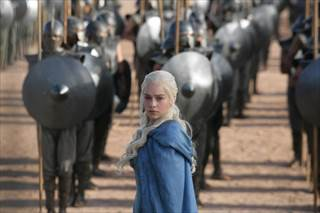

Keith Bernstein

 Queen of all dramas: Emilia Clarke earned her Emmy nomination for ‘Game of Thrones’

Sometimes the best way to see ourselves is to see someone else who at first doesn't seem to look like us at all.

The crowd in David Benioff and D.B. Weiss' "Game of Thrones," adapted from George R.R. Martin's books, takes a primitive survival-of-the-fittest approach to life in the mythical kingdom of Westeros.

The story gets dense fast, and the players don't always wear uniforms or numbers to help us out.

But the dynamics of power — getting it, defending it — soon take on a chilling familiarity.

At the same time, many "Thrones" viewers aren't in it for the profound sociopolitical metaphors, or the flights into dragon fantasy. They like that it tells a great story — which in the end is the difference between great TV drama and all the rest.

**9. "Downton Abbey" (PBS, 2010-).**

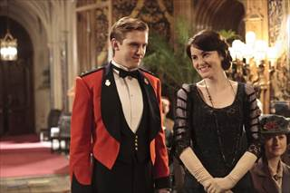

Photograph Nick Briggs. +44(0)2072780993. nick@nickbriggs.com

 Noble pursuits: Dan Stevens and Michelle Dockery are pictured in a 2011 episode of ‘Downton Abbey.’

I'm not including this because my wife would kill me if I didn't. Even though she would.

PBS has presented a lot of wonderful dramas over the years, from "Upstairs, Downstairs" to all those mystery series.

None has made the pieces fit as well as "Downton," the kind of show that gives soap operas a good name.

Creator Julian Fellowes knows what we've always considered delightful about the British — the droll wit, the accents — while simultaneously reminding us that even the ultraprivileged don't get a free pass in life.

"Downton" has been called frivolous and in some ways it is, which only makes it a more welcome counterpoint to so much other TV drama of late.

Much of the darker drama is superb. There's just room for "Downton Abbey," too, and it's the sort of show that one imagines will be just as charming in 2064 as it is in 2014.

**8. "Law & Order" (NBC, 1990-2010).**

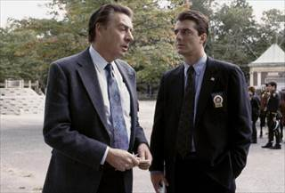

Jessica Burstein/NBC via Getty Images

 Case closed: ‘Law & Order’ stars Jerry Orbach and Chris Noth are pictured in a 1994 episode.

Yes, you can say that all Dick Wolf did with "Law & Order" was create a framework into which he could plug a new story every week.

That's not exactly like saying Irving Berlin plugged new songs into three-minute frameworks, but it does seriously underestimate both the show's initial creativity and the skill required to keep it interesting for two decades.

Did "Law & Order" soar like "Boardwalk Empire" or cut as close to the bone as "The Wire"?

Of course not. It was a weekly procedural that had to adhere to broadcast standards.

But over 20 years it tackled the tough ones, and it didn't pretend they all ended happily.

Its staccato drama was also a lot harder to execute than the casual viewer might think. If "L&O" were as easy as its critics say, we'd have seen a whole lot more of them.

**7. "The West Wing" (NBC, 1999-2006).**

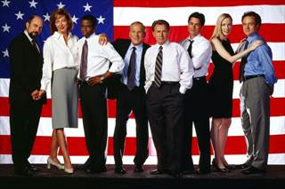

 Winning ticket: From left are "West Wing" cast members Richard Schiff, Allison Janney, Dule Hill, John Spencer, Martin Sheen, Rob Lowe, Janel Moloney and  Brad Whitford.

Creator Aaron Sorkin understands that politics is a spectator sport, so he made TV's best political drama by populating it with characters who could put on a show.

The cast of "West Wing," led by Martin Sheen as President Jed Bartlet, was way more glib than any two dozen random politicians you'd meet anywhere, even the good ones.

We believed them because that glibness greased the rails and made the stories fly right along.

Sorkin also understood that by giving us ongoing nuts-and-bolts stories about the political and legislative process, he could sometimes inject wonderful little digressions like Toby (Richard Schiff) arranging an honorable burial for a homeless veteran.

Sorkin also subtly argued, by the way, that most politicians are good people looking for a way to make their country better.

**6. "Breaking Bad" (AMC, 2008-2013).**

Creator/writer Vince Gilligan had to spin a few creative backstories to make Walter White's tale work. Like how Walt had been finessed out of a legitimate fortune by a shady partner earlier in life.

He was entitled. We've all got improbable dramas in our lives, and what mattered with Cranston's Walt was how he made things go forward.

By the third season or so, you could argue "Breaking Bad" had become a Western, just without any white hats.

Whatever you call it, it was compelling to watch.

**5. "I'll Fly Away" (NBC, 1991-1993).**

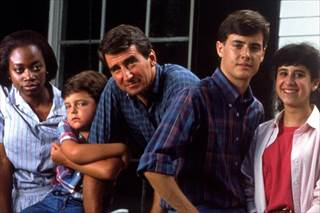

SNAP/Rex/REX USA

 Sam Waterson and Regina Taylor led the cast on NBC’s ‘I’ll Fly Away.’

My sleeper, "I'll Fly Away" was a wonderful snapshot of the American South in the early days of the modern civil rightvs movement.

Josh Brand and John Halsey wrote it, and Sam Waterston and Regina Taylor brought its two central characters to life.

Taylor played Lilly Harper, a housekeeper hired by Waterston's attorney Forrest Bedford.

Lilly is our window on the civil rights movement from the black side, Forrest from the white side.

While the images were often uncomfortable, they felt honest, acknowledging the terrible wrong that the movement was working to right while giving all the characters three dimensions.

From the movement it branched out to examine, quite movingly, the lives of the people around Lilly and Forrest.

It wasn't a story that America was dying to watch, unfortunately, since it was never a ratings hit. NBC, to its credit, gave it 38 episodes, and PBS filmed a wrapup movie eight months later.

**4. "The Sopranos" (HBO, 1999-2007).**

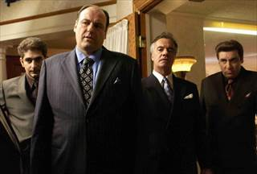

HO/REUTERS

 Mob rules: From left, Michael Imperioli, James Gandolfini, Tony Sirico and Steven Van Zandt on HBO’s ‘The Sopranos.’

To many fans, this is the tallest building on the TV block, and at its best, that's certainly an arguable thesis.

David Chase's story of the Soprano family benefited from the magnificent performance of the late James Gandolfini as patriarch Tony, then stretched way past that.

It was another American dream story, this one focusing more heavily on actions and ultimate consequences.

It was also hilarious, and really smart about popular culture.

It maybe went on a little too long, and I'm one of those who still doesn't like the ending. Too easy.

But it's earned its reputation.

**3. "The Twilight Zone" (CBS, 1959-1964).**

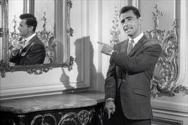

CBS Photo Archive/CBS via Getty Images

 Submitted for your approval: Rod Serling introduces episode ‘The Mirror’ of ‘Twilight Zone.’

Rod Serling wrote a staggering 156 episodes of "The Twilight Zone" over five seasons, and no, not all of them were gems.

The best, however, were.

Primitive as some of the filming looks to our eyes today, the stories grab you and don't let go.

Serling wrote sci-fi, but he really didn't. He wrote about the deepest and sometimes darkest corners of our real-life hearts.

All mystery drama that has followed, from "Star Trek" to "Lost," wanted to bottle what "The Twilight Zone" captured.

**2. "Mad Men" (AMC, 2007-2015).**

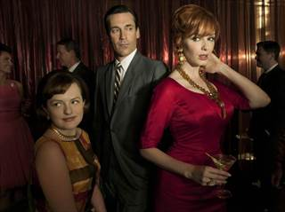

Frank Ockenfels / AMC

 Truth in advertising: From left are Elisabeth Moss, Jon Hamm and Christina Hendricks on AMC’s ‘Mad Men.’

Matt Weiner's drama revolving around a 1960s ad agency also illuminates the American dream — its dark side and, in more subtle ways, its promise.

He tells the story largely through Jon Hamm's Don Draper, but he also paints a rich picture of a dozen other lives, notably including Elisabeth Moss's Peggy Olson.

"Mad Men" has seven episodes, which are already filmed, to go. They may be Weiner's biggest challenge and nothing so far suggests he won't have risen to it.

**1. "Deadwood" (HBO, 2004-2006).**

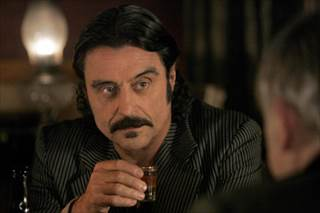

Handout

 Best western: Ian McShane on HBO"s ‘Deadwood.’

This was as close as TV could get to perfection.

It told a compelling story, rooted in the real-life history of the West at the time when it was starting to become just a little less wild.

Set in the would-be boom town of Deadwood, S.D., in the 1870s, it had hope, ambition, greed, wretched behavior and the seeds of something better. That is, it was the American dream for an hour every week on Sunday nights.

David Milch wrote it beautifully and the filming matched.

Ian McShane led a cast of actors who were skilled at their craft without the burden of superstardom.

As in the best ensemble pieces, they all made each other better: Timothy Olyphant, Molly Parker, Powers Boothe, Paula Malcomson, Anna Gunn, Kim Dickens, Brad Dourif, Robin Weigert and a dozen others.

"Deadwood" wasn't for everyone, if only because of the ultraviolence (if you ever thought a street fight was romantic or glamorous, watch the famous one here) and the barrage of foul language.

But the only real complaint for fans was it ended too soon, after three seasons and 36 episodes, a season short of what Milch himself originally projected.

A promised pair of wrapup movies never happened.

The silver lining is that the ending it did have — McShane's Al Swearingen on the floor, mopping up the blood — could not have been improved upon if it had run another 10 seasons.

[**ON A MOBILE DEVICE? CLICK HERE TO SEE VIDEO.**](http://landing.newsinc.com/shared/video.html?vcid=26536179&freewheel=90051&sitesection=nydailynews)

Promoted Stories

[

5 Apps That Will Help You Become a More Productive Person

Work Intelligently by Ricoh](https://www.workintelligent.ly/technology/mobile/2014-10-22-new-mobile-apps-for-business/?utm_campaign=ContentSyndication&utm_medium=NativeAd&utm_source=OutBrain&utm_content=&utm_term=productivity+mobile+apps) [

Later Childbirth Might Mean a Longer Life

OZY](http://www.ozy.com/acumen/later-childbirth-might-mean-a-longer-life/32804) [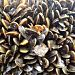

Forget About Piranhas, This Is the Most Dangerous Creature in…

OZY](http://www.ozy.com/rising-stars-and-provocateurs/the-crusade-of-marcela-uliano-da-silva/32937) [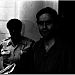

The Stories behind America's Worst Serial Killers

Learnist](http://learni.st/users/580043/boards/85691-the-stories-behind-america-s-worst-serial-killers?utm_source=outbrain&utm_medium=paid_cpc&utm_campaign=society) [

The Most Important Skill for Global Expansion Is Learning…

Why English Matters](http://ad.doubleclick.net/ddm/clk/285361162;112407005;p?http://whyenglishmatters.com/docuseries/brewing-global-success-video?pk_campaign=Outbrain-links) [

Your future flights may not include windows

The Economist](http://servedby.flashtalking.com/click/1/39932;1012864;50126;211;0/?ft_width=1&ft_height=1&url=6033538)

[Recommended by](http://m.nydailynews.com/entertainment/tv/breaking-bad-game-thrones-rank-time-best-dramas-list-article-1.1912409#)
