# Essas 15 flores parecem outras coisas

 [0](http://ocientista.com/essas-15-flores-parecem-outras-coisas/#comments)

Flores são órgãos reprodutores que evoluíram com um objetivo básico – atrair polinizadores, sejam eles insetos ou aves. Essa explosão evolutiva teve um resultado incrível: uma quantidade incontável de cores e formas, muitas das quais se assemelham a figuras comuns. Trata-se de um fenômeno da nossa mente chamado pareidolia.

A pareidolia acontece quando nossa mente insiste em dar significado a algo que aleatório. É o mesmo fenômeno que explica rostos humanos em Marte, formas de animais nas nuvens, ou divindades na torrada.

Nesse caso, separamos 15 flores onde podemos claramente perceber a pareidolia. Confira:

**Dracula Simia**

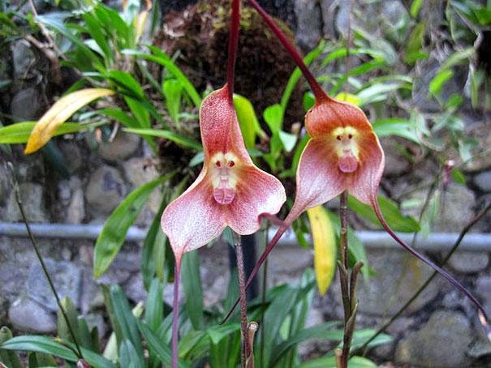

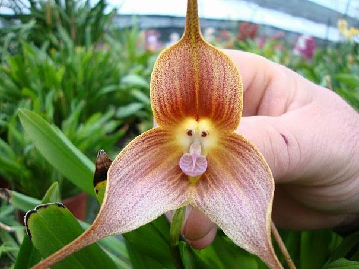

**Phalaenopsis**

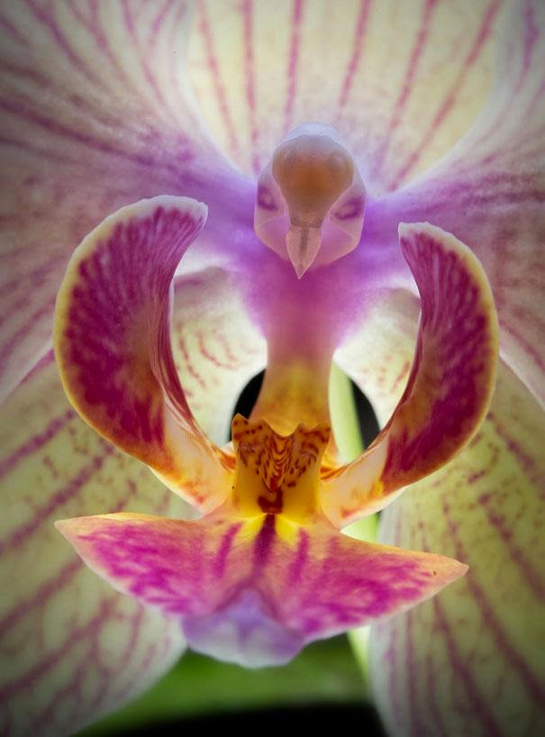

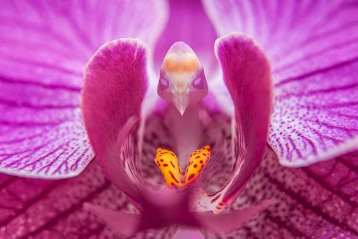

**Orchis Italica**

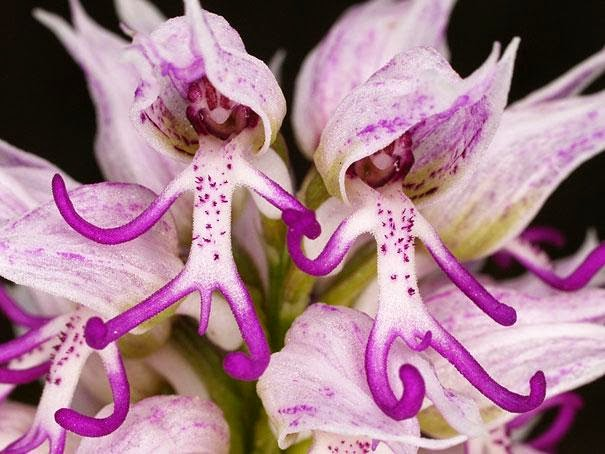

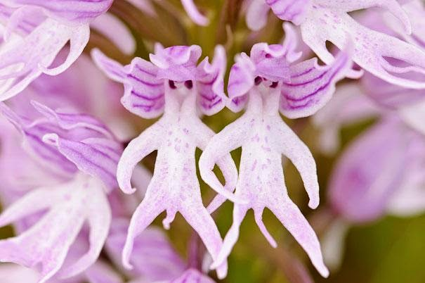

**Psychotria Elata**

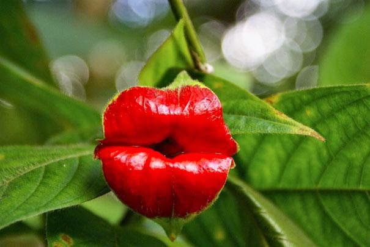

**Impatiens Bequaertii**

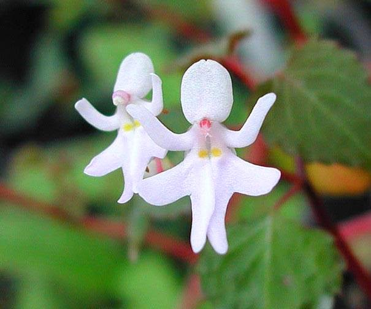

**Ophrys bomybliflora**

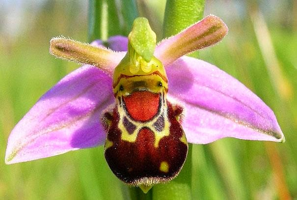

**Anguloa Uniflora**

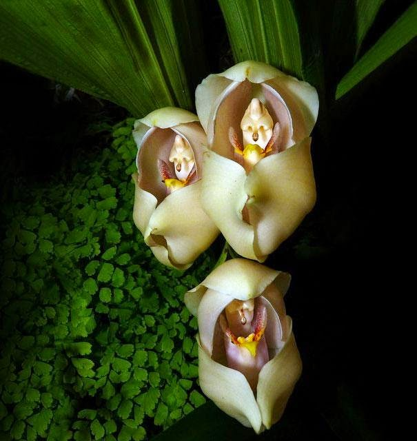

**Impatiens Psittacina**

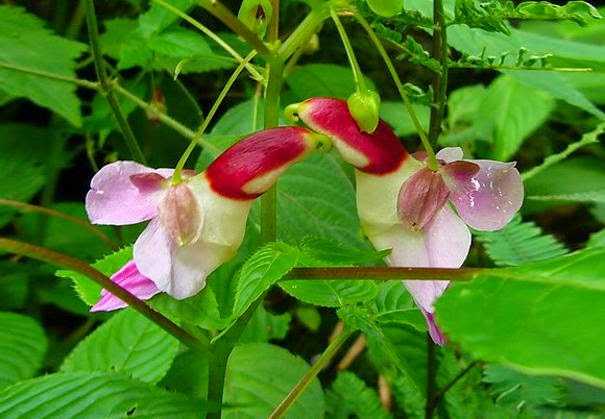

**Antirrhinum**

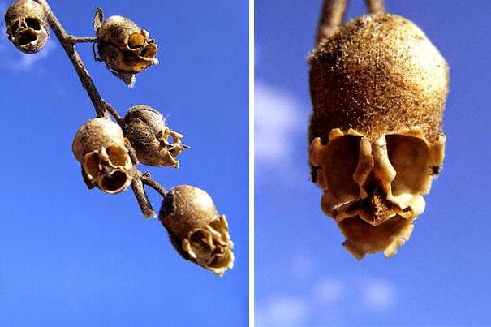

**Caleana Major**

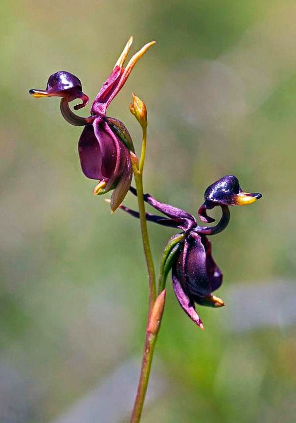

**Orquídea que parece um tigre**

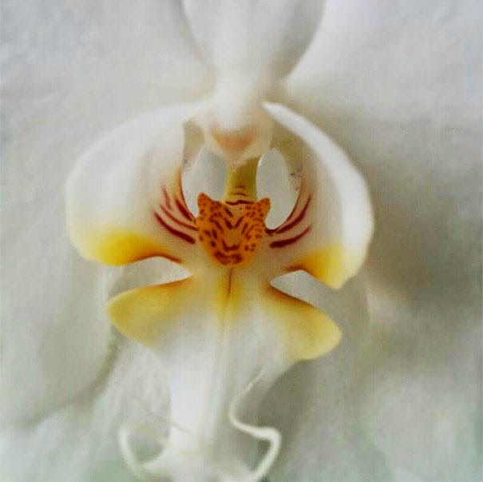

**Calceolaria Uniflora**

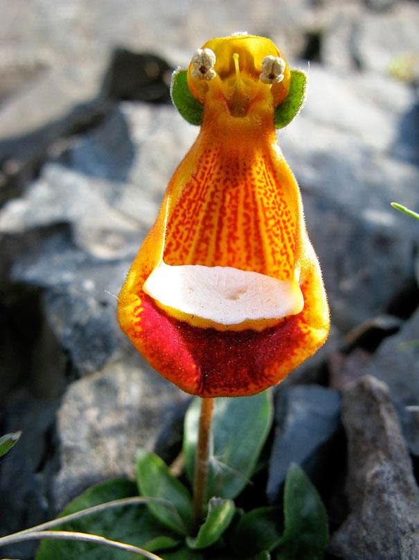

**Habenaria Grandifloriformis**

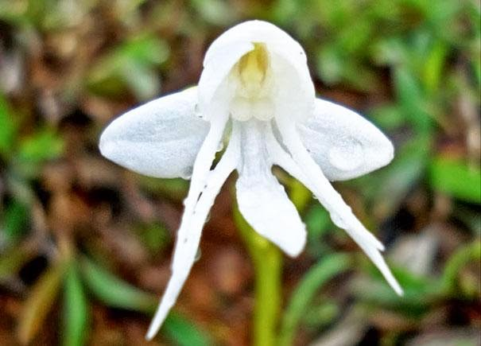

**Orquídea que parece uma bailarina**

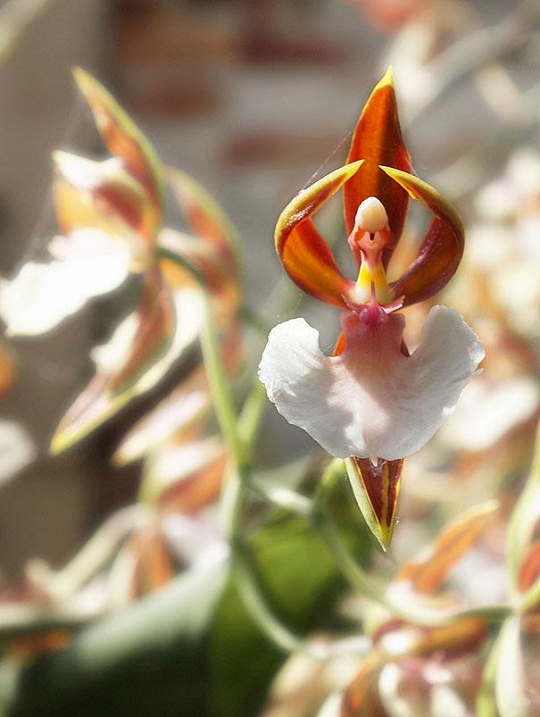

**Aristolochia Salvadorensis**

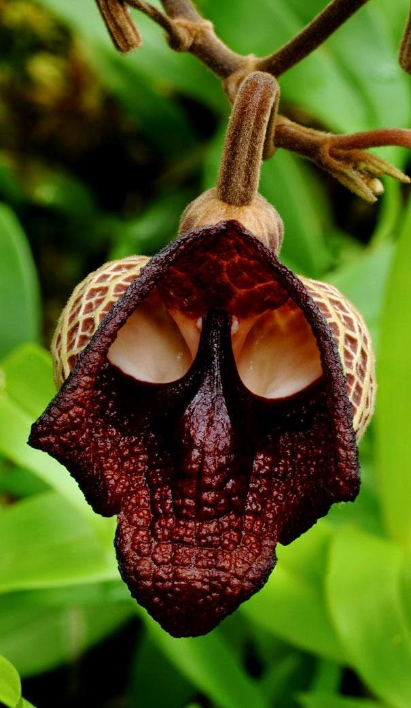
