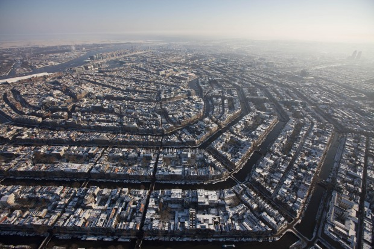
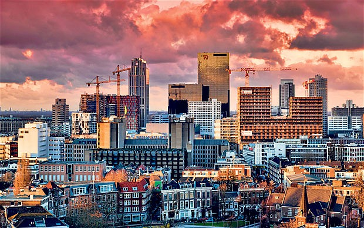
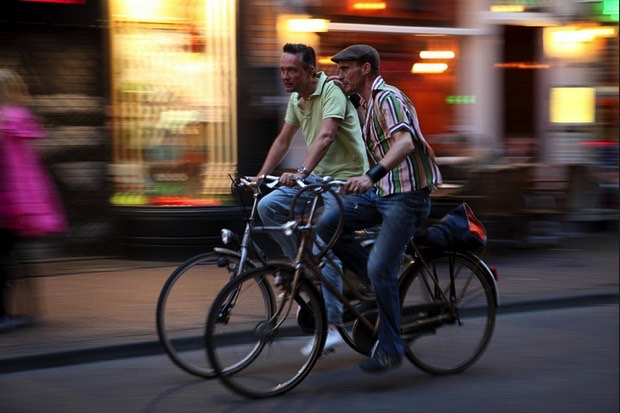

# Pragmatismo e tolerância: o que mais podemos aprender com a Holanda?

É ilegal. Mas, na real, sua vida é coisa sua.

A frase mal construída aí de cima serve como uma espécie de parâmetro para os caminhos que os holandeses iniciaram séculos atrás e aprofundaram de vez com os revolucionários anos 1960.

Apenas como exercício mental, vale lembrar que até a década dos Beatles, os ruivos e ruivas dos Países Baixos eram predominantemente provincianos, deitados eternamente na glória de colonizadores além-mar (e você acha que eles sempre foram essa galera massa de bicicletinha de lá para cá?). Religião era coisa séria, bem como seus rígidos padrões morais e sociais.

Amsterdã vista de cima e os canais que cortam a cidade (para ver maior, basta clicar na imagem)

Hoje, meio século depois da década de [*Mad Men*](http://www.imdb.com/title/tt0804503/), os holandeses que se amam e que por um acaso nasceram do mesmo sexo podem se casar naturalmente. Nada nem ninguém tem o direito de se impor contra eles. O porte de pequenas doses de drogas leves (maconha, por exemplo) é regulamentado. O mesmo vale para a prostituição e para eutanásia.

De onde brotou tanta clareza? Do mais puro pragmatismo.

Pense em qualquer um dos pontos abordados acima. Qualquer mortal que não acredite em  paredão, exílio ou segregação sabe que todos eles vão existir com ou sem a permissão do Estado. Então, se eles vão ocorrer de qualquer maneira, o caminho mais razoável seria incluí-los sob a lupa de toda sociedade. Logo, vem a conclusão óbvia de que é melhor legalizar, regular ou regulamentar cada um deles.

É interessante ver como esse pragmatismo é primo bastante próximo da tolerância. Se “o imoral” vai existir, é sempre melhor tolerá-lo do que proibi-lo. Por quê? Proibir é dizer com todas as letras maiúsculas que você vai perder o controle sobre o caminho das coisas.

O rei William II sacou isso de pronto. Esperto que era, percebeu o processo que se desenrolava pela Europa, aquele cheiro de revolução no ar, e chamou o conselheiro Johan Rudolf Thorbecke, de tendência liberal, e pediu que fosse escrita [uma nova Constituição](http://global.britannica.com/EBchecked/topic/593220/Johan-Rudolf-Thorbecke). A nova carta limitaria os poderes do rei, introduziria responsabilidade ministerial e criaria mecanismos para o funcionamento de um parlamento.

Privacidade de correspondência e liberdade de assembleia foram dados ao povo também [naquele outubro de 1848](http://pt.wikipedia.org/wiki/Monarquia_dos_Pa%C3%ADses_Baixos#Papel_constitucional). O reinado prevaleceria, mas agora com Thorbecke como primeiro-ministro. A monarquia ficaria ali para as fotos.

Enquanto a Igreja Reformada Neerlandesa era religião oficial, católicos e judeus eram aceitos na sociedade, não exterminados. No século 19, seria oficializado [o sistema de pilarização](http://www.palgrave-journals.com/cep/journal/v10/n3/full/cep20129a.html), em que grupos religiosos passavam a coexistir, ainda que separadamente. Da segregação surgiriam jornais oficiais, partidos políticos, sindicatos, escolas, empreiteiras, universidades e clubes de futebol (vide [o vitorioso Ajax](http://www.uefa.com/uefachampionsleague/season=2015/clubs/club=50143/index.html)).

Tempos depois, a televisão, o movimento hippie, a mobilidade e o intercâmbio social deixaram na cara que essa coisa de separação era a maior marca do atraso. Bastava olhar para o passado e ver que Amsterdã sempre foi uma cidade de imigrantes. Protestantes franceses e judeus espanhóis encontraram ali um local seguro para fugir das guerras de outrem. Numa cidade construída por canais e pelo comércio, a segregação religiosa e a pilarização era uma piada sem graça.

Rotterdam

A língua, [como você leu aqui](http://papodehomem.com.br/a-lingua-que-tudo-diz/), pode ser abrangente e específica ao mesmo tempo na Alemanha. E [esse pessoal alto](http://www.huffingtonpost.com/randal-olson/why-are-the-dutch-so-tall_b_5544085.html) que mora logo ali ao lado no norte europeu tem um dos idiomas mais distintos que o planeta conhece. Especialmente se você — como eu — pena com qualquer fala que não tenha parentesco com o latim. De maneira similar ao alemão, há no holandês palavras mais que filosóficas. [Gedogen](http://en.wikipedia.org/wiki/Gedogen) é uma delas.

Não há uma tradução exata para o português, mas vou atrever a explicar. Gedogen funciona como uma espécie de “vista grossa oficial por parte das instâncias governamentais” para tudo aquilo que seria ilegal, mas que a sociedade sabe que existe.

Ou seja: é ilegal, mas o governo não está nem aí.

Daí surge uma gedoogcultuur, uma espiral que tem feito a sociedade holandesa concretizar experiências humanas do calibre das vividas numa cidade como Amsterdã. Lembro o verdadeiro tilt (quase [uma tela branca do Akuma](http://1.bp.blogspot.com/_wPPeJrsh9cs/TB-vvG_rgSI/AAAAAAAAABw/L2UztN3Z0mQ/s1600/StreetFighterIV+2009-08-18+13-45-26-09.jpg) no *Street Fighter*) que minha cabeça dava ao ver como as peças funcionavam sem intervenção aparente de ninguém. Não são raros os momentos em que pedestres, bicicletas, bondes e carros dividem os mesmos espaços. Adicione aí a quase inexistência de semáforos, guardas de trânsito e afins.

**As pessoas estão na rua e devem, em primeiro lugar, tolerar os outros modais,** os turistas chapados e qualquer um que passar por entre aqueles mágicos canais. Há uma sensação inescapável no ar de que tudo pode ser diferente.

Urbanismo significa — ou deveria significar — circulação de pessoas. A solução seria então criar espaços para elas, não o contrário. Uma estação de trem vale muito mais que um empreendimento imobiliário. Uma praça é bem mais interessante que uma rodovia. É exatamente aí que os holandeses acertaram, especialmente lembrando da escassez de espaço no território oranje. A paisagem holandesa é uma criação humana. O país não existiria se não fosse pela intervenção humana.

E mesmo assim tudo parece redondamente natural.

As bicicletas surgiram como solução para uma questão meramente matemática. Como um dos países mais povoados do mundo — [são 450 habitantes por quilômetro quadrado](http://pt.wikipedia.org/wiki/Demografia_dos_Pa%C3%ADses_Baixos) –, seria impossível fazer com que as coisas funcionassem se tudo estivesse baseado no transporte individual motorizado, especialmente nos automóveis. A Holanda seria o país dos moinhos de vento com congestionamento, uma galera infeliz.

Batendo papo no horário de pico

Basta dar uma olhadinha na cara de felicidade do motorista do ônibus ou da moça de óculos escuros e SUV branco travado na Marginal Pinheiros. O bom e velho pragmatismo fez com que há 40 anos o governo decidisse entrar de cabeça na era das bicicletas. Como resultado, em média 40% dos deslocamentos feitos pela população de Amsterdã são feitos em seus mais de 400 km de ciclovias. O país já soma 20 mil km de faixas exclusivas para ciclistas. A cada 100 habitantes, o Departamento de Infraestrutura, Transporte e Tráfego de [Amsterdã contabilizava 73 bicicletas em 2008](http://movimentoconviva.com.br/bike-pelo-mundo-amsterdam/).

A Holanda [descriminalizou o consumo de maconha em 1976](http://g1.globo.com/mundo/noticia/2013/12/veja-como-e-legislacao-relativa-maconha-em-outros-paises.html) e [legalizou a prostituição em 2000](http://www1.folha.uol.com.br/folha/mundo/ult94u9418.shtml). Resultado: apenas três em cada mil holandeses fazem uso de drogas pesadas, menos da metade da média da Inglaterra, da Itália ou da Dinamarca. O [instituto Peil](http://www.noties.nl/peil.nl/), espécie de Ibope de tamancas de madeira, demonstrou que 57% dos holandeses nunca usaram drogas leves e outros 25% se contentaram com experimentá-las. Só 7% faz uso delas frequentemente. Apesar de um certo refluxo do debate, há muitos sedentos para que [a medida se espalhe pelo país](http://www.independent.co.uk/news/world/europe/why-dutch-mayors-want-to-cultivate-cannabis-9102858.html), incluindo Roterdã e seu prefeito [Ahmed Aboutaleb](http://en.wikipedia.org/wiki/Ahmed_Aboutaleb) (sim, ele é de origem árabe).

Não é razoável imaginar que, por lá, não há quem seja contrário a tudo e a todos.. Exemplos bizarros não faltam, aliás. Como [essa galera](http://community.seattletimes.nwsource.com/archive/?date=19900102&slug=1048752) e, principalmente, [essa aqui](http://www.economist.com/blogs/charlemagne/2014/03/dutch-far-right).  A monarquia segue firme por lá, vocês sabem bem.

Contudo, ao menos 6 milhões de tulipas vão florescer neste ano no país, fazendo da Holanda um dos únicos países a poder se orgulhar de ter como rotas turísticas a apreciação de campos extensos e floridos. Os holandeses sabem que nem o pessoal que não está muito afim de caminhar em direção ao bom funcionamento humano deve ser segregado.. Essa capacidade oranje de ser empiricamente pragmático só pode vir da certeza que o futuro é o dia a dia. Vale mais cultivar flores que semear o desmatamento e o agronegócio desenfreado.

É mais racional comprar uma bicicleta que financiar um carro novo. Estar ali traz com o ar que enche os pulmões a certeza que Higienópolis ainda vai chegar lá. E que um dia os moradores da região central de São Paulo vão rir com gosto de si mesmo ao lembrar que fizeram de tudo para apagar uma ciclofaixa.

### Mecenas : [Estude na Holanda](https://www.nesobrazil.org/)

[*Link YouTube*](https://www.youtube.com/watch?v=hqEh0iFWlgs)

*Quer conhecer mais de perto o pragmatismo, tolerância e hospitalidade holandesa? O OTS – Orange Tulip Scholarship oferece bolsa de estudos de até 24 mil Euros para brasileiros estudarem na Holanda. **São 76  vagas e 23 universidades participantes**.*

*A Holanda é considerada o 3° melhor ensino superior do mundo, com mais de 10 universidades no top 200 do Times Higher Education Ranking. A vida cultural lá é intensa e o custo de vida é baixo. Não precisa falar holandês para morar na Holanda, todos os cursos são integralmente ministrados em inglês e 87% da população é fluente em inglês.*

*Para participar, é preciso ser fluente em inglês, ter ótimo desempenho acadêmico, criatividade e facilidade de se adaptar a novas culturas. Mais detalhes você encontra [na página de requisitos para a candidatura](https://www.nesobrazil.org/requisitosots2015).* *Além do OTS Brazil existem mais de 60 programas de bolsas de estudo disponíveis na Holanda: conheça o site deles em [www.nesobrazil.org/bolsas](http://www.nesobrazil.org/bolsas).*

*T*ire suas dúvidas sobre as bolsas participando  da [Euro-Pós](http://www.nesobrazil.org/europos), em São Paulo. Conheça os outros eventos Nuffic Neso Brazil [www.nesobrazil.org/eventos](http://www.nesobrazil.org/eventos)**
