Um pouquinho de criatividade faria bem na hora de planejar as férias. Não que destinos tradicionais sejam ruins, claro. Como os brasileiros começaram a viajar mais nos últimos anos, é natural que as primeiras escolhas de muita gente sejam Orlando, Nova York e Paris.

Estive [na Ásia](http://www.360meridianos.com/2013/03/dicas-de-viagem-para-a-asia.html) em 2011. Na época era quase impossível achar informações sobre alguns lugares legais do continente. Pelo menos não em português. De lá pra cá muita coisa mudou: os brasileiros, depois de descobrirem a Europa e a América, agora miram na Ásia, na África e na Oceania, prova disso é que a internet já está cheia de relatos desses locais.

E isso é bom, afinal esse mundão sem porteira está cheio de lugares incríveis, destinos que só não viraram a nova moda do momento por uma questão de *timming*: vai rolar.

Dos destinos mais incomuns que já visitei, guardo [ótimas lembranças de Katmandu](http://www.360meridianos.com/2012/07/ja-ouviu-falar-de-katmandu.html), capital do Nepal. [Kuala Lumpur](http://www.360meridianos.com/2014/03/onde-ficar-em-kuala-lumpur-malasia.html), na Malásia, também costuma ficar de fora da lista de destinos turísticos brazucas. E olha que a cidade é vizinha de duas capitais do sudeste asiático que já começaram a bombar: Cingapura e Bangkok.

Em outros caso,s a situação é ainda mais complexa: se existem cidades que pouca gente ainda pensa em visitar, existem outras que a maioria de nós nem sabe que existe. E olha que são capitais de países e moradia para milhões de pessoas. Tipo…

### [Skopje](http://pt.wikipedia.org/wiki/Esc%C3%B3pia)

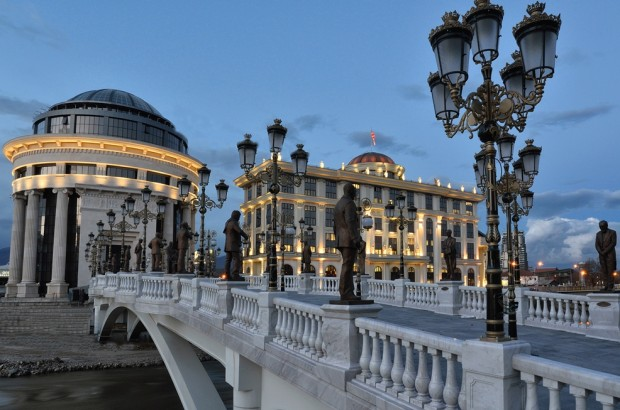

Habitada há 6 mil anos, Skopje já esteve nas mãos dos gregos, dos romanos, dos bizantinos e dos búlgaros. A capital da [Macedônia](http://pt.wikipedia.org/wiki/Rep%C3%BAblica_da_Maced%C3%B3nia) tem 500 mil habitantes e um centro histórico interessante.

Os macedônios se orgulham até hoje por terem sido liderados por ninguém menos que [Alexandre, o Grande](http://pt.wikipedia.org/wiki/Alexandre,_o_Grande), que é homenageado em monumentos, aeroportos e outros locais de Skopje.

### [Nouakchott](http://pt.wikipedia.org/wiki/Nouakchott)

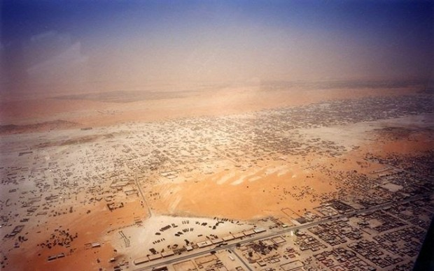

O Nome da capital e maior cidade da [Mauritânia](http://pt.wikipedia.org/wiki/Maurit%C3%A2nia) é difícil de falar: Nouakchott, que tem cerca de 1 milhão de habitantes, é uma das maiores cidades [no Saara](http://pt.wikipedia.org/wiki/Deserto_do_Saara).

### [Majuro](http://pt.wikipedia.org/wiki/Majuro)

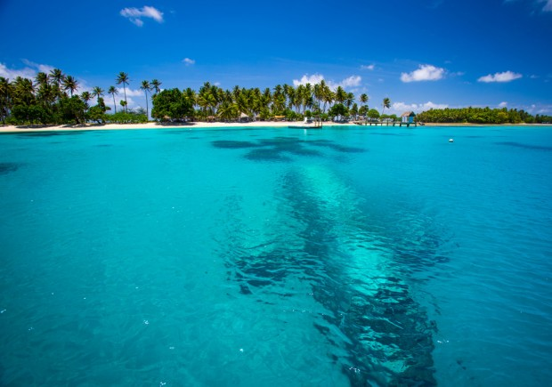

Ok, Majuro não é uma cidade grande: são só 25 mil habitantes. Mas a cidade é a capital [das Ilhas Marshall](http://pt.wikipedia.org/wiki/Ilhas_Marshall). Mesmo pequena, tem porto, aeroporto, comércio e alguns hotéis.

A maioria dos turistas — que são poucos — passa por ali a caminho das outras ilhas.

### [Tashkent](http://pt.wikipedia.org/wiki/Tashkent)

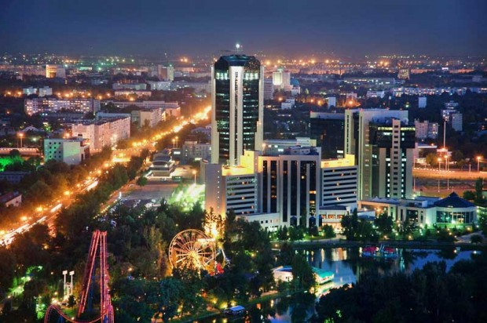

O Felipão morou lá, quando treinava o Bunyodkor, time do [Uzbequistão](http://pt.wikipedia.org/wiki/Uzbequist%C3%A3o). Tashkent tem mais de dois milhões de habitantes e história milenar, embora muitas construções tenham sido destruídas por guerras e terremotos.

Visitar Tashkent significa estar pertinho de [Bukhara](http://en.wikipedia.org/wiki/Bukhara), uma cidade que fez parte da [Rota da Seda](http://pt.wikipedia.org/wiki/Rota_da_Seda) e ainda tem construções fantásticas dessa época (e muito bem conservadas).

### [Nicósia](http://pt.wikipedia.org/wiki/Nic%C3%B3sia)

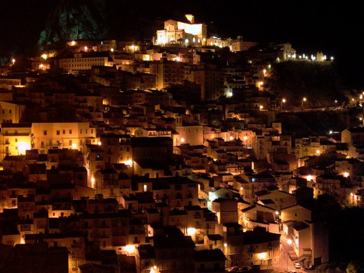

Pelas fotos, Nicosia parece ser incrível.

Com 300 mil habitantes, a cidade é a capital [do Chipre](http://pt.wikipedia.org/wiki/Reino_do_Chipre) e tem a fama de oferecer boa qualidade de vida. Além, claro, de paisagens fantásticas e cultura muito interessante.

### [Tbilisi](http://pt.wikipedia.org/wiki/Tbilisi)

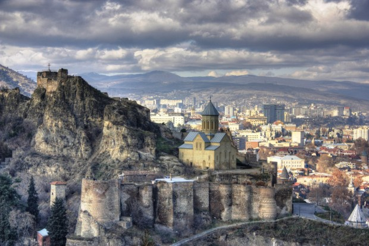

Fundada no século V, Tibilisi é um destino incrível para fãs de história e arquitetura. No entanto, aposto que você nunca se imaginou desembarcando na capital e maior cidade da [Geórgia](http://pt.wikipedia.org/wiki/Ge%C3%B3rgia).

No meio do caminho entre a Europa e a Ásia, essa é mais uma parada da famosa Rota da Seda e já foi disputada por diversos impérios. Hoje, tem se tornado um importante centro cultural e financeiro para a região.

### South Tarawa

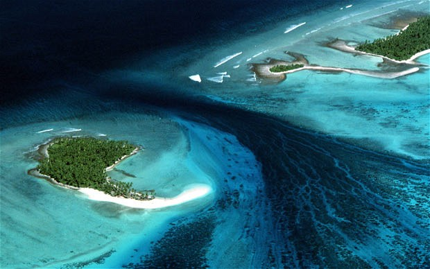

Se eu aposto que muita gente nunca nem ouviu falar [no Kiribati](http://pt.wikipedia.org/wiki/Kiribati), menos ainda conhecem sua capital, South Tarawa.

A cidade concentra cerca de metade da população do país, que é um arquipélago de pequenas ilhas no meio do Pacífico, rodeado de um mar azul-paraíso e de praias de areia branquinha. Esse é o primeiro lugar do mundo a dar boas vindas ao ano novo. Se você ficou interessado no lugar, compre sua passagem o quanto antes: [a existência do país está ameaçada](http://papodehomem.com.br/o-seu-pais-vai-deixar-de-existir-em-alguns-meses/) pelo aquecimento global.

### [Ljubljana](http://pt.wikipedia.org/wiki/Liubliana)

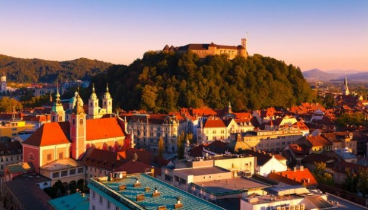

Não se assuste com o nome esquisito, a capital da [Eslovênia](http://pt.wikipedia.org/wiki/Eslov%C3%A9nia) era um segredo muito bem guardado na Europa até bem recentemente, quando os turistas começaram a chegar, embora bem timidamente.

A história da cidade remonta a uma lenda celta, que diz que, em 1144, a região era habitada por um dragão que costumava atear fogo nos habitantes através de uma das torres do castelo. Até que um dia o tal dragão se apaixonou por uma fêmea e teve um filho que mais parecia um lagarto e ainda tinha propensão artística. O pai chorou tanto de desgosto com o filho fracote que acabou fazendo subir as águas do Rio Ljubljana.

### [Riga](http://pt.wikipedia.org/wiki/Riga)

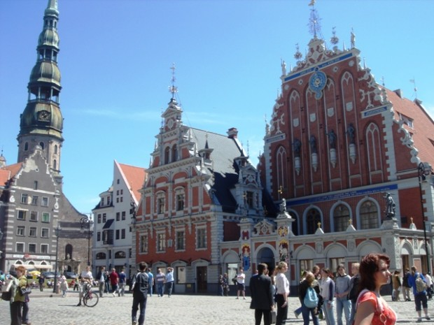

Outra capital europeia um pouco esquecida nos roteiros turísticos é Riga, maior cidade [da Letônia](http://pt.wikipedia.org/wiki/Let%C3%B3nia) e dos países Bálticos. A cidade impressiona pela sua arquitetura e chega a ser comparada com [Viena](http://pt.wikipedia.org/wiki/Viena), [São Petersburgo](http://pt.wikipedia.org/wiki/S%C3%A3o_Petersburgo) e [Barcelona](http://pt.wikipedia.org/wiki/Barcelona). Só que com um orçamento de viagem bem mais camarada.

### [Asmara](http://pt.wikipedia.org/wiki/Asmara)

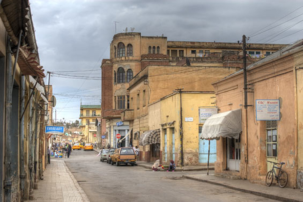

A [Eritreia](http://pt.wikipedia.org/wiki/Eritreia) não consta no Bucket List de ninguém que eu conheça, talvez porque muita gente tem receio de explorar a maior parte do continente africano. Pois vou dizer uma coisa: perdemos muito em termos de turismo e cultura por ignorarmos um parte tão extensa do globo, jogando tudo em um caldeirão de guerras, AIDS e fome.

Colonizada pela Itália, Asmara é um cidade cheia de vizinhanças tranquilas, cafés, restaurantes, confeitarias e ruas que parecem ter saído do sul da Europa. Para muitos, essa é uma das cidade mais agradáveis da África.

### [Thimphu](http://pt.wikipedia.org/wiki/Thimbu)

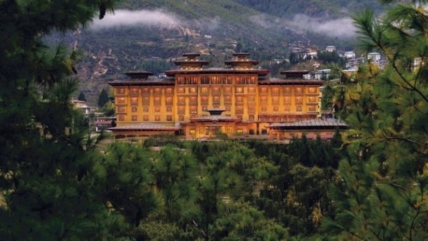

Imagine um país onde a riqueza da população não é medida pelo PIB, mas sim pela Felicidade Interna Bruta? Assim é [o Butão](http://pt.wikipedia.org/wiki/But%C3%A3o) e sua capital, Thimphu. Mas já vou avisando: o país tem um regime fechadíssimo e só dá pra entrar lá com pacote turístico fechado.

Mesmo os viajantes independentes precisam ter guia e motorista a disposição.

### [Valleta](http://pt.wikipedia.org/wiki/Valeta)

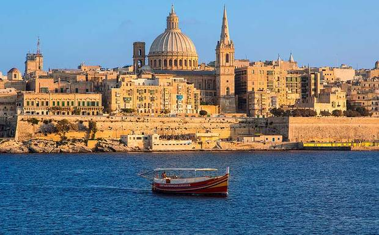

A menor capital da Europa fica na [República de Malta](http://pt.wikipedia.org/wiki/Malta). Valleta é também considerada patrimônio mundial e uma das cidades com maior densidade histórica do mundo, com 320 monumentos tombados concentrados em apenas uns 55 hectares.

### [Maputo](http://pt.wikipedia.org/wiki/Maputo)

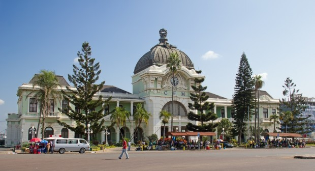

Quando estive na África do Sul, descobri que era em [Moçambique](http://pt.wikipedia.org/wiki/Mo%C3%A7ambique) que os sul-africanos iam passar as férias. Maputo, a capital do país, é conhecida como a “pérola do Oceano Índico” por sua arquitetura colonial da época da ocupação portuguesa. Além da riqueiza cultural do país, há algumas horas da capital você encontra praias paradisíacas e safaris interessantes.

### [Doha](http://pt.wikipedia.org/wiki/Doha)

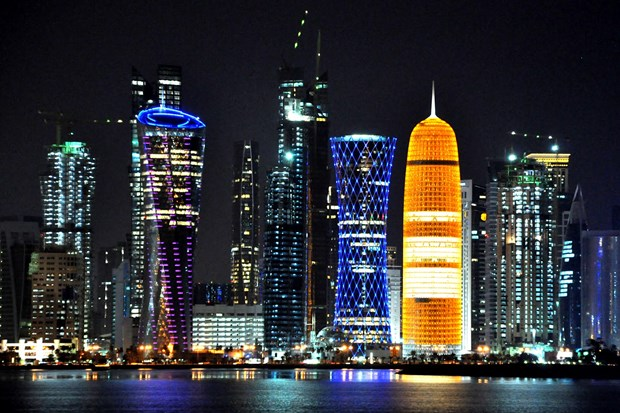

A moderna capital do [Qatar](http://pt.wikipedia.org/wiki/Catar) é cheia de arranha-céus futuristas, iluminação colorida e dona de um skyline para ninguém botar defeito. O Qatar é a sede das principais companhias de petróleo e gás natural do mundo, a base da economia do país.

### [Vaduz](http://pt.wikipedia.org/wiki/Vaduz)

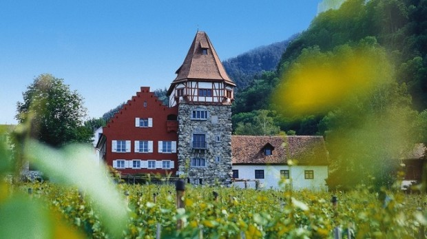

Se [Liechtenstein](http://pt.wikipedia.org/wiki/Liechtenstein) é um dos menores países do mundo, Vaduz, sua capital, só poderia ser uma das menores capitais do mundo também.

Com uma população de apenas cerca de 6.000 pessoas, tem como principal atração o belo castelo de Vaduz, onde vivem até hoje o príncipel liechtensteinense.

\* \* \*

Óbvio que não dá para comprar uma passagem e ir para todas essas cidades — eu não iria nesse momento para o Paquistão, por exemplo, por conta da instabilidade política que causa problemas e ataques terroristas no país. E olha que sou doido para conhecer [Lahore](http://pt.wikipedia.org/wiki/Lahore), que não é capital do país, mas parece ser muito interessante.

Nestes casos, resta torcer para que um dia que as coisas melhorem e uma visita seja possível. Enquanto não dá, só conhecer um pouco mais sobre essas cidades já vale a viagem.

  
 por Natália Becattini
  
  
 [[anexo ausente]](http://pubads.g.doubleclick.net/gampad/jump?iu=1051165/PdH_Feed_superbanner/leaderboard&sz=728x90&c=1439908171) 
[anexo ausente]
  
  
  
[[anexo ausente]](http://da.feedsportal.com/r/211597361737/u/49/f/530922/c/32911/s/40488f81/sc/19/rc/1/rc.htm)
  
[[anexo ausente]](http://da.feedsportal.com/r/211597361737/u/49/f/530922/c/32911/s/40488f81/sc/19/rc/2/rc.htm)
  
[[anexo ausente]](http://da.feedsportal.com/r/211597361737/u/49/f/530922/c/32911/s/40488f81/sc/19/rc/3/rc.htm)
  
  
[[anexo ausente]](http://da.feedsportal.com/r/211597361737/u/49/f/530922/c/32911/s/40488f81/sc/19/a2.htm)
[anexo ausente]

[[anexo ausente]](http://feeds.feedburner.com/~ff/PapodehomemLifestyleMagazine?a=v3I70u5H1XI:T1H7g9peA8Q:yIl2AUoC8zA)

[[anexo ausente]](http://feeds.feedburner.com/~ff/PapodehomemLifestyleMagazine?a=v3I70u5H1XI:T1H7g9peA8Q:qj6IDK7rITs)
[[anexo ausente]](http://feeds.feedburner.com/~ff/PapodehomemLifestyleMagazine?a=v3I70u5H1XI:T1H7g9peA8Q:-BTjWOF_DHI)

[anexo ausente]
