Quem vive cercado de prédios no trânsito lento da cidade grande acaba se afastando, sem se dar conta, da energia primária que obtemos através da natureza. Florestas, rios, praias, oceanos, cachoeiras, lagos e montanhas são fontes naturais de energia prontas para serem contempladas.

Os Mini Mundos nasceram da vontade de recriar essas paisagens através de cenários feitos da junção de plantas, pedras, conchas, cristais – muitas vezes coletados por nós mesmas – e personagens, que agregam a força e energia de todos os elementos, proporcionando um bem estar que nos toca sutilmente.

Os Mini Mundos são altares, eles são mundinhos paralelos onde energias se criam e se renovam. Cada elemento nele tem força e significado. Eles são ideais para quem mora em apartamento e tem pouco espaço com sol.

Quase todos se adaptam muito bem a ambientes com meia sombra. E pela baixa manutenção são ótimos pra quem não tem muito tempo para cuidar das suas plantinhas. Além de objetos de decoração belos e dinâmicos eles nos chamam a atenção para a grandeza da natureza e todo o universo que habita num simples musgo.

Nossa proposta é chamar a atenção das pessoas pro reino vegetal das plantas. Vivemos por demais afastados das energias primárias e na correria do dia-a-dia esquecemos de prestar atenção no sutil. Já existem vários estudos que comprovam os efeitos das plantas sobre nós, seja em casa, nos parques e até nos escritórios.

Por serem plantas de rápido crescimento torna-se sempre muito interessante observá-la crescer, se expandir, florir e se ramificar. Inclusive é um ótimo objeto para estimular a curiosidade das crianças, que costumam encarar o reino vegetal como algo inanimado. O simples observar de uma folha crescendo maravilha-nos de forma tão pura que acaba por fim nos revigorando e energizando.

Aqui, atendendo ao convite muito especial dos meninos PapodeHomem, vamos dar algumas dicas para você montar o seu próprio Mini Mundo em casa! Aproveitem, e depois compartilhem conosco no Instagram tirando uma foto com a hashtag #osminimundos! Nós vamos adorar participar da criação de vocês!

Você vai precisar de:

- Recipiente (vidro, cerâmica, barro, tênis, panela.. use sua criatividade!);
- Substrato preparado (3 partes de terra vegetal, 2 partes de areia e 1 parte de perlita);
- Pedrinhas e cascalhos;
- Mudas de plantas suculentas (de tamanho apropriado pro seu recipiente);
- Adereços (ao seu gosto, areia colorida, personagens, pedrinhas, tronquinhos, conchas, areia, etc).
- Ferramentas (você pode improvisar com: colher de diferentes tamanhos, pinça longa, pincel, etc).

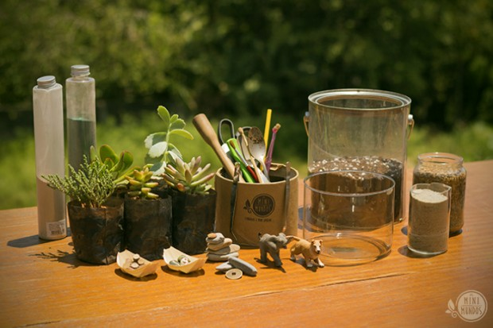

### Como fazer

Primeiro lave bem o seu recipiente com sabão, nunca se sabe o que pode ter dentro, assim evitamos que algum fungo ou larva de inseto se prolifere ali. Espere secar completamente.

Faça uma pequena camada com as pedrinhas ou cascalhos no fundo, para facilitar a drenagem caso haja um excesso de água (já que nosso recipiente não tem furos).

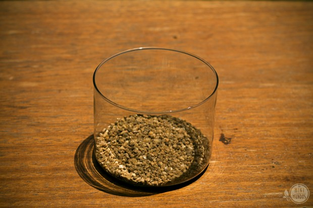

Agora use a sua imaginação e crie em sua cabeça mais ou menos o cenário que deseja reproduzir, assim não corre o risco de montar tudo e depois mudar de ideia.

Retire suas plantas dos vasinhos, tomando sempre cuidado para preservar o máximo que conseguir do torrão original de terra em volta de sua raiz, isso garante uma melhor adaptação da planta na nova casa. A partir daí, você já sabe a quantidade de terra que precisará para completar no seu recipiente. Caso o torrão seja grande, já coloque-o dentro do recipiente e vá completando com o substrato preparado até a altura desejada.

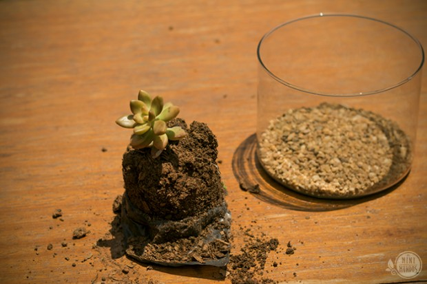

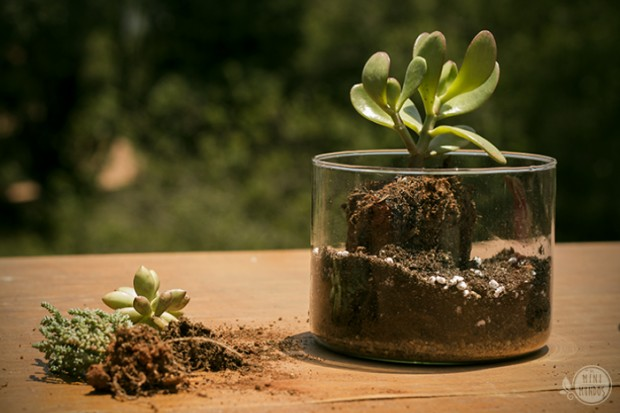

Colocadas as plantinhas, pressione levemente o solo em volta do tronco para que elas se acomodem melhor no novo solo.

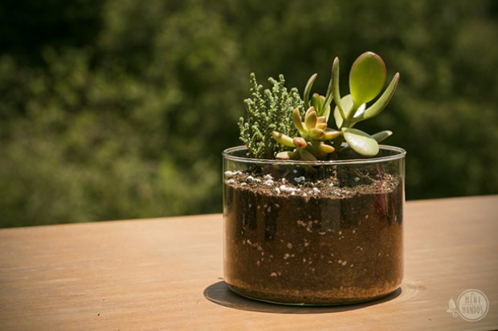

É sempre bom não deixar o solo exposto, isso faz com que água evapore mais rapidamente. Coloque uma pequena camada de pedrinhas e/ou areia.

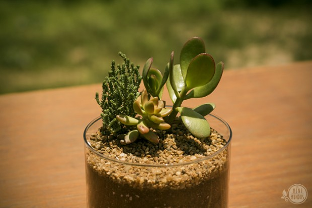

Feito isso, a parte mais “difícil” e técnica está feita! Sobra agora a parte criativa! Enfeite o seu cenário com o que achar de mais interessante, pedras, tronquinhos, mini gravetos, personagens, areia colorida, o que vier na sua cabeça! Tome seu tempo, aproveitar o processo é a parte mais legal! E existem diversas formas de enfeitar um mesmo terrário, veja só dois exemplos.

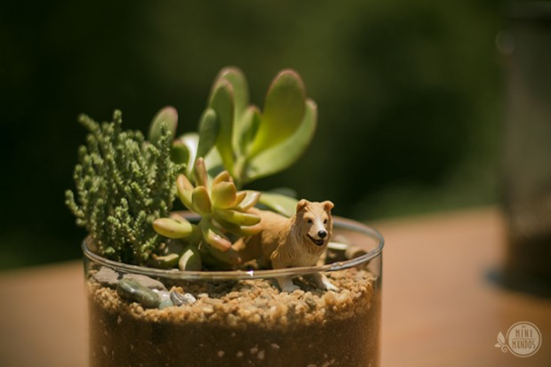

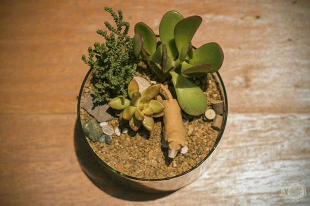

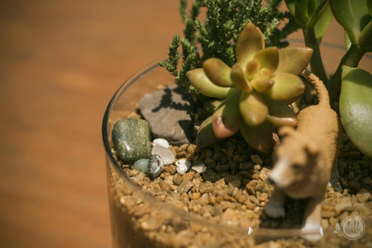

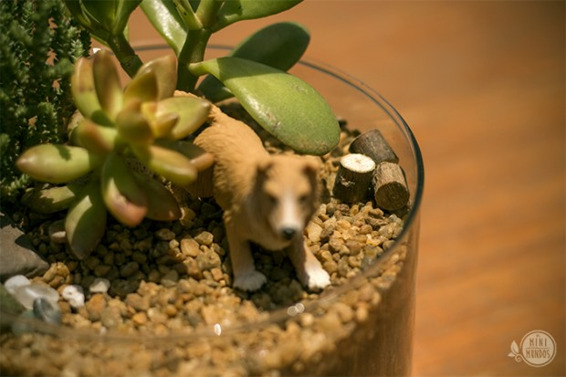

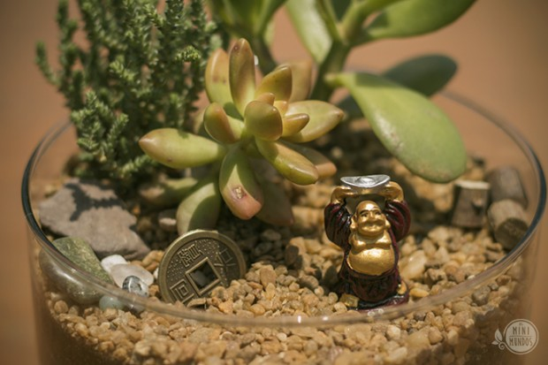

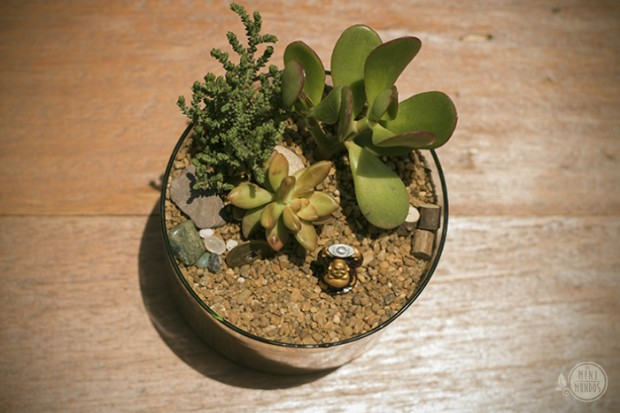

E voilá! Seu terrário está pronto!

### Curtiu? Aqui tem mais dicas:

Baixe aqui as nossas cartilhas de cuidados e veja seu mini mundo crescer!

Para conhecer mais do nosso trabalho, [veja o nosso site](http://www.osminimundos.com).

Para encomendar seu mini mundo ou pedir um orçamento em grandes quantidades é só [mandar um e-mail](mailto:contato@osminimundos.com).

Na nossa loja você pode [comprar algum que já está pronto](http://www.osminimundos.lojaintegrada.com.br).

Também pode nos acompanhar pelo [Facebook](http://www.facebook.com/osminimundos) ou [Instagram](http://www.instagram.com/osminimundos).

### Você gostaria de ensinar algo?

*“Deixa que eu faço” é a nova série colaborativa de textos mão na massa do PapodeHomem. A ideia é reunirmos pessoas dispostas a contribuírem com guias e tutoriais, ensinando a fazer as mais diversas tarefas, das rotineiras às inusitadas. Com o tempo, queremos ter um compilado com todo tipo de passo-a-passo, para tornar o PapodeHomem um espaço cada vez mais útil.*

*Pode se programar: toda sexta, um texto com um guia ensinando a fazer algo prático.*

*Tem alguma ideia? Manda pra gente no e-mail [deixaqueeufaco@papodehomem.com.br](mailto:deixaqueeufaco@papodehomem.com.br).*

*E, caso faça um dos tutoriais já publicados, põe a hashtag #deixaqueeufacopdh pra compartilhar com a gente. As mais legais a gente solta no [Instagram do PapodeHomem](http://instagram.com/papodehomem).*

  
 por Babi Vieira
  
  
 [[anexo ausente]](http://pubads.g.doubleclick.net/gampad/jump?iu=1051165/PdH_Feed_superbanner/leaderboard&sz=728x90&c=932231238) 
[anexo ausente]
  
  
  
[[anexo ausente]](http://da.feedsportal.com/r/211597812195/u/49/f/530922/c/32911/s/40b891b9/sc/19/rc/1/rc.htm)
  
[[anexo ausente]](http://da.feedsportal.com/r/211597812195/u/49/f/530922/c/32911/s/40b891b9/sc/19/rc/2/rc.htm)
  
[[anexo ausente]](http://da.feedsportal.com/r/211597812195/u/49/f/530922/c/32911/s/40b891b9/sc/19/rc/3/rc.htm)
  
  
[[anexo ausente]](http://da.feedsportal.com/r/211597812195/u/49/f/530922/c/32911/s/40b891b9/sc/19/a2.htm)
[anexo ausente]

[[anexo ausente]](http://feeds.feedburner.com/~ff/PapodehomemLifestyleMagazine?a=Ie4Pny4nhqY:TerjyFU9R8g:yIl2AUoC8zA)

[[anexo ausente]](http://feeds.feedburner.com/~ff/PapodehomemLifestyleMagazine?a=Ie4Pny4nhqY:TerjyFU9R8g:qj6IDK7rITs)
[[anexo ausente]](http://feeds.feedburner.com/~ff/PapodehomemLifestyleMagazine?a=Ie4Pny4nhqY:TerjyFU9R8g:-BTjWOF_DHI)

[anexo ausente]
