Bem vindos ao último “Minha roupa diz..” do ano!

Hoje voltamos ao tema que já rendeu [um bom texto lá atrás](http://papodehomem.com.br/bermuda-no-trabalho-a-dupla-realidade/) e que, dada a época do ano, retornará firme e forte no dia a dia do brasileiro: como trabalhar de bermuda e impor respeito no ambiente de trabalho?

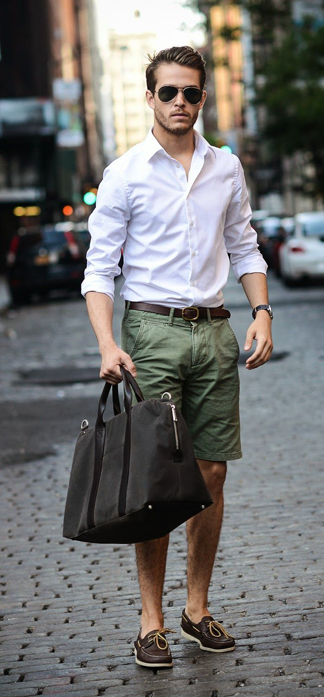

Antes de falarmos sobre o que pode ser feito para melhorar sua imagem, uma reflexão do que pode ser feito para melhorar sua visão.

### 1. Assinale as alternativas que você está de acordo:

(  ) Todo mundo deveria poder usar bermuda no trabalho!  
 (  ) É absurdo termos que usar manga comprida e calça  no verão brasileiro!  
 (  ) Um dia, quando tiver minha empresa, todos poderão usar bermudas para trabalhar.

Ah, moleque, assinalou tudo felizão né, safado?

### 2. Hora do segundo gabarito, escolha as alternativas que considera corretas:

(  ) Eu iria colocar em dúvida a credibilidade do meu advogado se ele aparecesse de bermuda para uma reunião aqui na empresa;  
 (  ) Se meu subordinado viesse trabalhar de chinelo, eu iria repreende-lo;  
 (  ) Ao chegar em uma consulta e encontrar o médico que irá me atender vestindo shorts, eu ficaria desconfiado de suas qualidades e talvez até de sua higiene.

### 3. Por fim, último teste. Novamente, escolha as sentenças que você concorda:

(  ) Não acho estranho ir a uma agência de publicidade e encontrar designers vestindo shorts;  
 (  ) Acho normal ir a um churrasco e encontrar amigos executivos vestindo bermudas;  
 (  )Meu pai, um cara bem arrumado, funcionário público, quando dá festas durante o dia em casa, constantemente recebe os amigos vestindo uma bermuda. Eu não acho que ele esteja mal vestido nestas ocasiões.

É bem provável que você tenha assinalado quase todas as alternativas dos três testes. O que isso nos permite dizer?

Que em determinado momento, você é a favor da liberdade de cada um se vestir de maneira condizente com o clima, que em outro momento você acha que o clima não é um fator principal e que não existe outra opção a não ser vestir calças. E, por último, você acha que é possível vestir bermudas sem perder o respeito e a credibilidade, mas que, para tanto, irá depender do ambiente onde você pretende fazer isto.

Interessante notarmos que nos posicionamos sobre o mesmo assunto de três maneiras diferentes, libertários, conservadores ou moderados.

O inferno são os outros.

Antes de irmos para o clássico discurso contra a hipocrisia e virarmos existencialistas questionadores, sejamos analíticos. Uma das coisas que torna a estética um campo de pesquisa muito interessante é que não há nela nenhuma razão absoluta. Ela nem sequer existe no analisado, apenas em quem a analisa.

Engana-se quem pensa que falar sobre estética é discutir a forma. Na verdade, conversar sobre estética nada mais é do que a interpretação contínua de contextos. Você pode estar achando o assunto um porre até o momento que entende que é ele que permite que você tenha três visões distintas sobre um mesmo tema sem se tornar um hipócrita.

– Bacana, posso soar contraditório e não ser um babaca, mas o que isso tem a ver com bermudas?

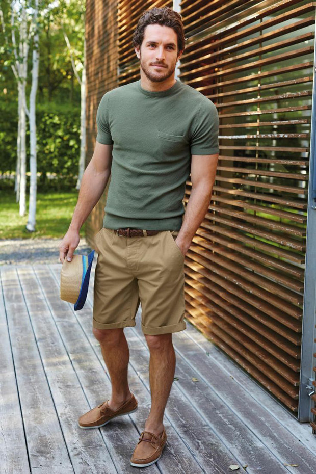

Você acaba de descobrir que é ingenuidade achar que a culpa de não poder usar bermudas no trabalho é do seu chefe. Tendemos a personificar as culpas e, ao fazermos isso, nublamos nosso raciocínio e nos colocamos a combater moinhos de vento. Pensando mais um pouco, este parece ser o caminho mais fácil. Passamos grande parte do nosso tempo procurando um culpado por nossa condição ou então alguém que legitime nossos comportamentos sociais. É como se não estivéssemos preparados para a liberdade.

Parece absurdo, não é? Mas o que você pensaria se fosse ao médico e ele estivesse vestido como um palhaço, de rosto pintado e nariz vermelho, com aqueles sapatões gigantes? Um louco, com certeza! Agora, se você estivesse adentrando no hospital infantil do Câncer e visse um dos famosos Doutores da Alegria, neste mesmo traje, o que acharia? Um herói, com certeza!

Afinal, qual foi a diferença? Simples. No primeiro caso, não existia contexto aparente para aquela vestimenta e, no segundo, não só existia, como era também legitimado pela sociedade.

Mas e se o médico se sentisse tão bem trabalhando vestido de palhaço que desejasse fazer isso no seu expediente normal, atendendo adultos, ele poderia? Não, pelo fato de não ser legitimado pela sociedade. Sinto muito, caso o faça, será considerado um louco e loucos não são levados a sério e não existe nada pior do que isso na vida em sociedade.

Pense comigo: você se considera dono de si, de suas vontades e de seus limites, mas não manda sequer nas suas próprias calças. O quão livre você realmente é?

Calma amigo, outra vez, não caia nessa cilada existencial!

Não se trata de ser ou não livre, mas de entender **quais das ferramentas disponíveis irá te trazer mais benefícios**. Não existe uma peça de roupa ruim (tirando o sapatênis), existe peça mal utilizada.

O “vestir” tem uma raiz primitiva extremamente simples, é necessário ter consciência que, esteticamente você só se veste para:

**A.** agradar a você mesmo;  
 **B.** agradar a alguém.

A aplicação de “A” não significa oposição a “B”. Inclusive, o ideal é que “A” e “B” sempre caminhem juntos, mas ideal não é sinônimo de real. Portanto, em diversos momentos não será possível aliar as duas opções. A vida profissional é o principal ambiente em que este caso ocorre.

Aqui fica o único ponto do tema em que ainda não compreendo em sentido lógico: em nossa vida pessoal, fazemos questão que nos aceitem como queremos ser, procuramos pessoas que gostem do nosso cabelo, do nosso jeito, da maneira como agimos e nos vestimos. Caso não nos aceitem como somos, continuamos nossa busca.

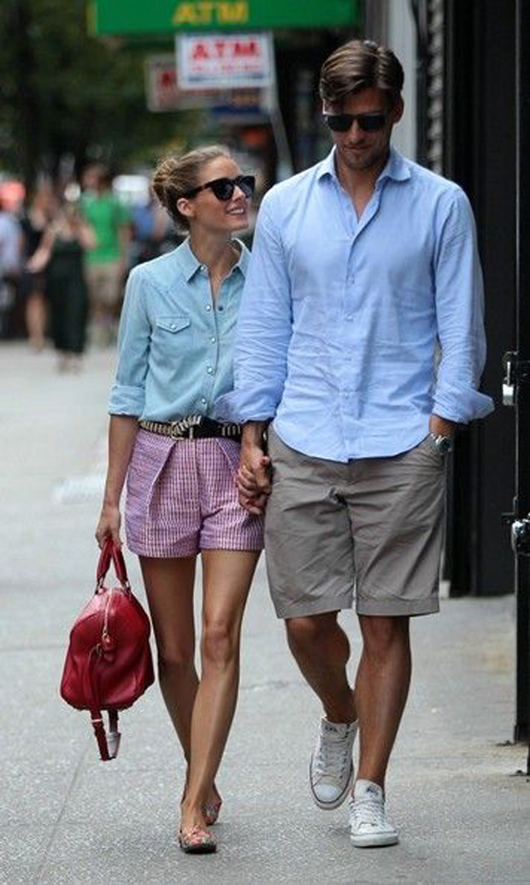

Já na vida profissional que, na minha opinião, tem bem menos importância que a pessoal, não. Nos curvamos à fôrma, replicamos um comportamento social que constantemente não é o nosso por receio de perder o cargo ou de não ascendermos.

Quantos homens usam terno e gravata pelo simples fato de ser tradição em suas profissões? Acredite quando digo, não existe nada pior para o mundo do que as tradições. Devemos governar e ser governados pelo raciocínio, pela coerência e pelo respeito. Não por convicções, tradições e reverências.

A última informação necessária de ser disposta aqui é a de contexto histórico.

Fique feliz sabendo que racionalidade é um fator crescente e permanente na história do vestuário, portanto, é possível dizer com certeza que um dia iremos todos trabalhar com roupas condizentes com nosso clima.

Fique triste sabendo que, no momento atual, o bem estar está longe de ser um fator prioritário neste gráfico, portanto, as mudanças serão lentas e gradativas e ocorrerão de maneira mais impetuosa em profissões com menor histórico cronológico, pois nelas a tradição tem menos relevância, ou seja, não é a toa que profissionais ligados a tecnologia na web tem os códigos de vestuário entre os mais flexíveis do espectro profissional.

Nesse momento, você já domina o tema e sabe que as coisas são como são. Falta ver algo de prático a respeito. Sem este conhecimento teórico, você não teria argumentos. Pois saiba que eles não servirão de nada se você for um preguiçoso ou um covarde.

Analise como e onde deve atacar na sua empresa e realize. Não precisa ser radical, basta estudar e descobrir por onde começar a incisão. Aqui quem fala é um empresário que no momento veste camisa de manga curta, shorts e chinelo e que se dispõe a ajudar a primeira empresa que entrar em contato, contanto que exista uma abertura, disponibilizarei o melhor meio de fazer a transição para uma norma de conduta mais confortável e atual (não é possível fazer isto de maneira genérica, então esqueçam a ideia de um manifesto geral no PdH).

E pra não ficarmos apenas na teoria, segue abaixo dois exemplos de homens que usam bermudas no trabalho e que serão analisados a seguir.

### Vinícius Cardoso

> “Sou um cara que tenta se vestir bem e  raramente consegue. Adoro ir trabalhar de social, mas amo usar bermuda. No meu trabalho foi liberado o uso de bermuda nos dias de calor, porém estou acostumado a trabalhar somente de camisa social e jeans.
>
> Gostaria de saber se é possível manter o estilo “social”, mas combinando a camisa com a bermuda?”

E lá vamos nós:

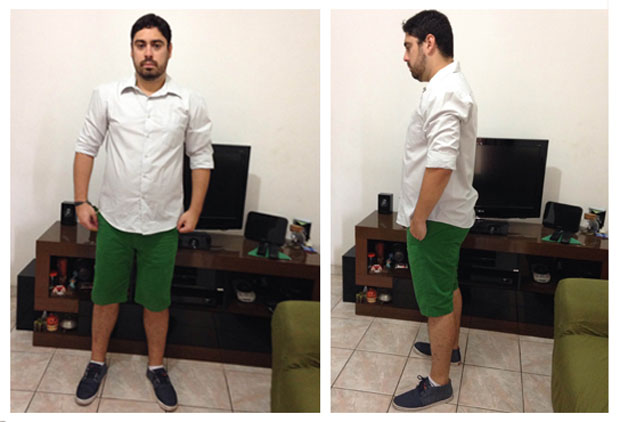

Começando por cima, o cabelo é bem escuro e volumoso, o que é bacana, porém seu contraste com a barba, que não é tão cheia (e que me parece mais clara também) não funciona bem. A recomendação é simples, cortar bem mais curto no começo da lateral e ir aumentando o tamanho gradativamente até chegar ao topo. Feito isso, o fim do cabelo terá uma transição mais suave e condizente com a barba.

Também sugiro que diminua a marca de desenho da barba, na extremidade superior (bochecha). Entre um pouquinho mais com a máquina bem rápido e suave e na extremidade inferior, próxima a orelha, pode deixar crescer mais. Assim, sua mandíbula ficará mais simétrica e volumosa (a marcação abaixo do queixo está ótima). Ponto bônus para a sobrancelha volumosa, ela é responsável por uma parcela considerável da expressão do nosso rosto.

Vamos para a camisa. Como o Vinicius já está se vestindo de maneira mais relaxada, é importante atenção para que esta descontração não se torne esculacho. Se nosso amigo optar por uma camisa com uma gola menor, ficará mais alinhado, pois este tipo de gola mais larga tende a abrir, fazendo com que ele corra o risco de se tornar um figurante da extinta [*Kubanacan*](http://pt.wikipedia.org/wiki/Kubanacan).

A cor branca é uma ótima opção e a peça ter um bolso a torna ainda mais coerente com a proposta, pois ele nos remete a movimentação física, assim como a bermuda. O mesmo ocorre com a manga dobrada que, embora não seja norma, se encaixa bem com a proposta mais tropical. Porém, nosso queridão se perdeu um tanto na hora de dobrar (o que é bastante normal). Repare como o braço esquerdo está estranho e como a proporção do braço não é exatamente a mais bacana.

Duas opções de ajuste simples: dobre o punho (a parte dura) dando apenas duas voltas e, se a camisa for slim, ele irá se prender ao seu antebraço e ficará ótimo. Caso não se prenda, dobra de maneira irregular fazendo “montinhos” até parar abaixo do cotovelo (cerca de 3 dedos abaixo é um bom referencial).

Hora da bermuda. Como a camisa é neutra, não se preocupe com a ousadia da cor. Caso tenha necessidade de uma proposta um pouco mais formal, opte por um valor (claro/escuro) mais escuro e levemente menos saturado. O corte desta peça é reto e funciona muito bem na composição por se assemelhar a modelagem clássica de alfaiataria (reto). Como única sugestão, eu dobraria uma vez a barra para mostrar parte do joelho, assim a sensação de estabilidade das pernas aumenta, pois as panturrilhas parecerão um pouco mais longas.

**Importante:** nesse tipo de combinação mais formal, evite o uso de bermudas com lavanderia marcada. Efeito de puído, vintage e afins nada tem a ver com sua proposta e irão destoar do todo.

Por fim, os pés. A cor do tênis combina com o acessório no punho e, por ser azul, reforça a sobriedade, assegurando que a bermuda não se torne um problema devido a sua matiz e alta saturação. A sola clara também encontra ressonância no branco da camisa, acentuando a harmonia entre pés e tronco.

Apenas a meia deve ser substituída, não devendo nunca aparecer, pois ficando a vista, ela adiciona um elemento street que não irá combinar com o tema.

E este foi o Vinícius, que já sabia quais peças deveria usar, apenas precisava de ajustes finos. Mantenho assim a minha saga de só receber fotos de pessoas bem encaminhadas.

Falando em pessoas que enviam fotos e já estão muito bem de mira, vamos para o segundo analisado do dia:

### Rafael Nardini

> “Acha massa pra cacete os ensaios da GQ americana, mas acredita mais naquilo que cai bem num determinado dia do que nas tais roupas da moda.
>
> De tanto ter visto o avô alfaiate costurando, julga ter desenvolvido algum senso estético, ainda que possa ser visto não raramente com camisas bizarramente estampadas. Ah, ele também não se lembra de ter comprado uma bermuda: calça velha é a melhor bermuda do planeta. Costureiras fazem milagres”

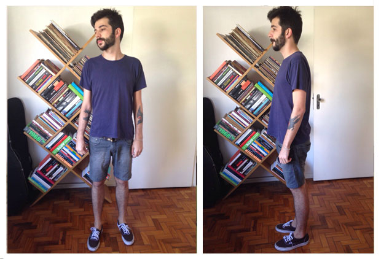

O Rafael tem senso estético apurado, cabelo e barba bem aparados, fala de si em terceira pessoa com leve sarcasmo, estante de livros na foto, usa(va) camisas estampadas. Se fosse para chutar, diria que num passado não muito remoto ele era o que hoje chamamos com desdém de hipster.

Se eu estiver certo, tal qual um Pokémon, Rafael seguiu o caminho da evolução estética como todo bom hipster de verdade e se tornou um adepto do [Normcore](http://en.wikipedia.org/wiki/Normcore), que nada mais é do que o “estilo normal”, o “básico”, ou seja, um resposta cíclica ao auge da preocupação do homem com o vestuário atual, que gerou alguns excessos [e momentos um tanto quanto “barrocos”](http://us.123rf.com/450wm/Prometeus/Prometeus1404/Prometeus140400358/27536734-surprised-young-man-in-glasses-and-a-beard-of-flowers-smoking-a-pipe.jpg) na concepção de imagem masculina moderna.

Como eu não sou o Dr. House da moda, talvez eu esteja falando um monte de bobagem sobre o Rafael ter sido ou não hipster, portanto, acabou a sessão de clarividência e começou a análise lógica.

Começando de cima, ótima barba, cavanhaque e costeleta levemente maiores que o resto dos pelos dão a barba um estilo menos produzido e mais natural. A linha da mandíbula está perfeita.

Ao subirmos para a cabeça é possível notar que o cabelo do nosso amigo é cuidadosamente desfiado, seguido por um topete responsa jogado para o lado. O topetão é bacana, parrudo e imponente, o corte é bem atual também, como única dica eu acredito que o cabelo deveria ser menos desfiado, pois embora este seja um corte bacana, ele me dá uma sensação muito forte de “saí do *cabelellelero* e corri pra balada”. Falta naturalidade. Às vezes o legal demais é realmente demais.

Descemos. Camiseta ótima para a proposta, bem solta e funciona bem no físico magro do nosso amigo. Não ter estampa também é uma ótima sacada, do contrário, ele correria o risco de soar adolescente devido a soma das peças. A saturação baixa do azul realça a naturalidade da composição (normcore, lembra?) e é mais um acerto.

Na bermuda temos o pulo do gato. Se ele não tivesse nos dito nada, poderíamos pensar “uhn, é, o cara se veste bem, mas deve fazer isso sem nem sequer pensar enquanto pega qualquer roupa do armário”. Ledo engano, meus amigos, alguém que manda uma calça para a costureira transformar em bermuda nunca faz nada por acaso!

Se o estilo dele é o básico, é porque ele quer que seja assim. Isso com certeza não foi um acidente, mas o mais bacana é que ele realmente conseguiu alcançar o que queria. Eu dificilmente poderia imaginar uma combinação neste estilo que soasse mais natural e discreta. Poderíamos dizer que seria até sem graça, mas isso se nosso sagaz amigo não fosse munido de tatuagens aparentes nos antebraços.

No punho, um fino cordãozinho claro, do tipo “é um acessório sim, mas eu nem ligo pra essas bobagens, por isso quase não dá pra ver”. Quase não dá, mas dá. Ligeiro. Sagaz. E é acessório sim.

Por fim, um tênis escuro bem urbano sem meia aparente vem para coroar a análise de um cara que já sabe muito bem o que quer transmitir na hora de se vestir.

Assim terminamos o último “minha roupa diz do ano”, aliás, aviso aos leitores que depois de 3 anos ininterruptos, eis que tirarei minhas primeiras férias do PdH, retornando somente fevereiro do ano que vem.

Aos que me enviaram fotos para a seção, não se aflijam, conforme o prometido, todos serão analisados. Aos que não me enviaram, mas adoram a sessão: Vocês são muito sem vergonha, parem com essa putaria e me mandem logo, este é um serviço que custa caro e o Papo de Homem provém sem nenhum custo pra você, rapaz. Sem vergonha. Fotos para o e-mail minharoupadiz@papodehomem.com.br.

Aliás, pra servir de inspiração, eis alguns outros bem encaminhados no quesito Bermuda/Social.

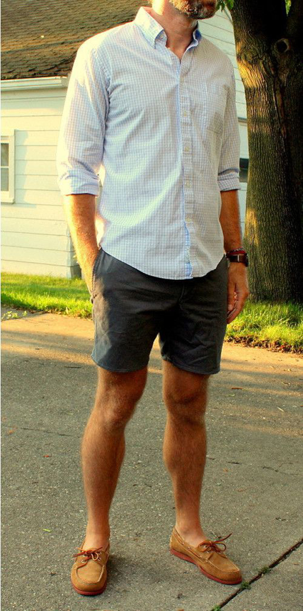

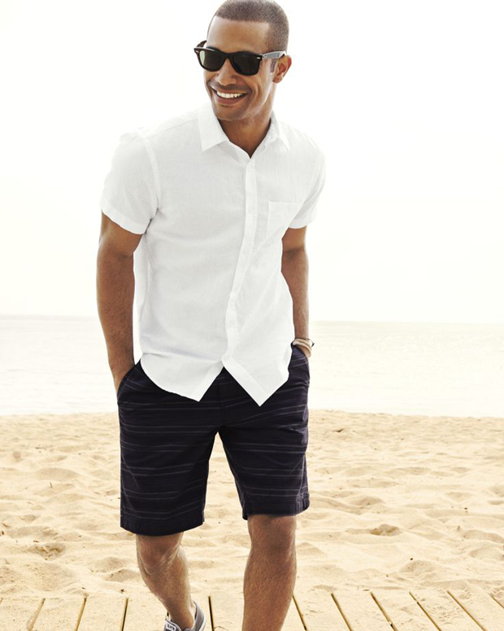

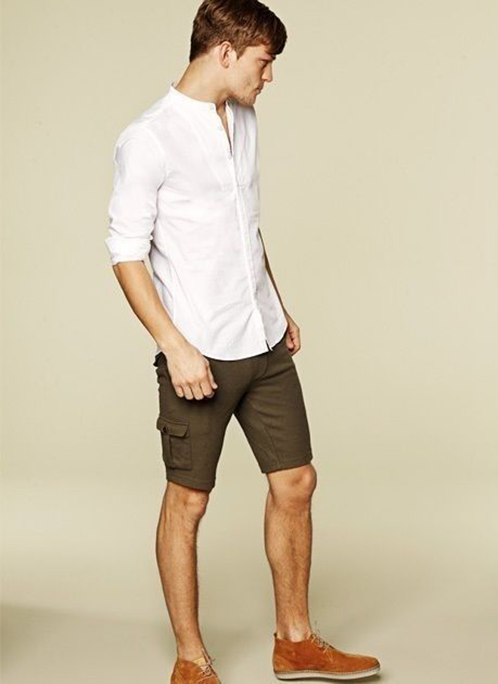

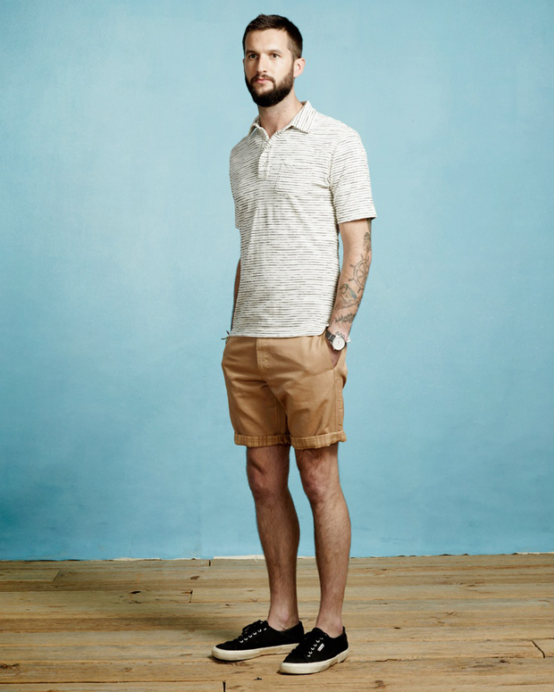

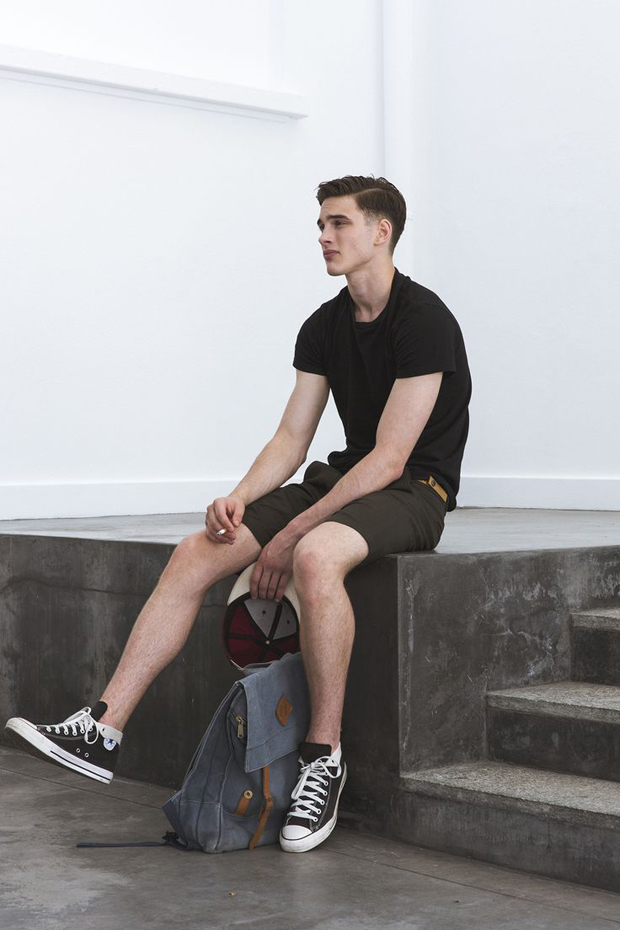

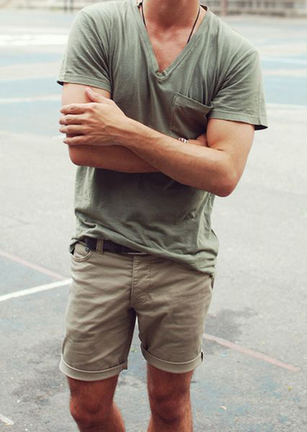

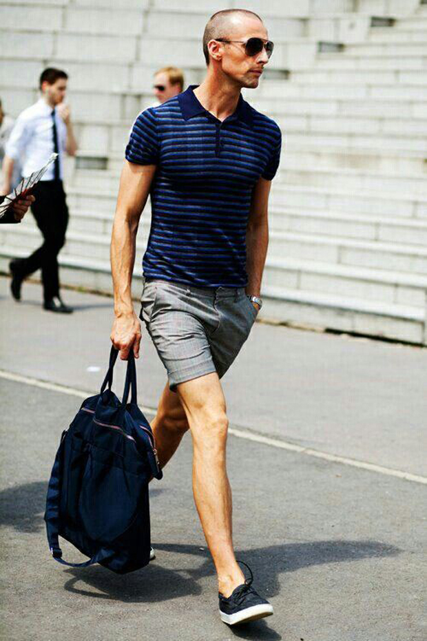

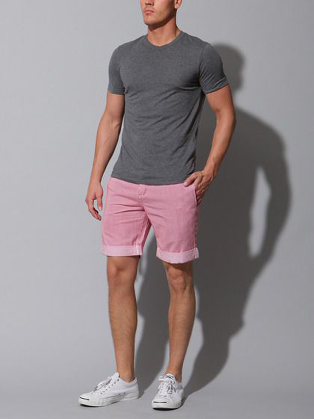

Por fim, desejo a mim boa sorte, estou partindo no fim do mês para uma jornada de 20 dias rumo ao desconhecido, para morar com pescadores e passar grande parte deste período embarcado no mar, pintando e esculpindo e o que mais as ondas permitirem.

Espero que tenham gostado dos textos, sentirei saudades. Como sempre, espero que tenha sido útil ou, ao menos, divertido!

Até fevereiro!

  
 por Bruno Passos
  
  
 [[anexo ausente]](http://pubads.g.doubleclick.net/gampad/jump?iu=1051165/PdH_Feed_superbanner/leaderboard&sz=728x90&c=494210781) 
[anexo ausente]
  
  
  
[[anexo ausente]](http://da.feedsportal.com/r/211597477191/u/49/f/530922/c/32911/s/4063a6b5/sc/19/rc/1/rc.htm)
  
[[anexo ausente]](http://da.feedsportal.com/r/211597477191/u/49/f/530922/c/32911/s/4063a6b5/sc/19/rc/2/rc.htm)
  
[[anexo ausente]](http://da.feedsportal.com/r/211597477191/u/49/f/530922/c/32911/s/4063a6b5/sc/19/rc/3/rc.htm)
  
  
[[anexo ausente]](http://da.feedsportal.com/r/211597477191/u/49/f/530922/c/32911/s/4063a6b5/sc/19/a2.htm)
[anexo ausente]

[[anexo ausente]](http://feeds.feedburner.com/~ff/PapodehomemLifestyleMagazine?a=qdPGCAIIj-s:rgv8bgSYk7k:yIl2AUoC8zA)
[[anexo ausente]](http://feeds.feedburner.com/~ff/PapodehomemLifestyleMagazine?a=qdPGCAIIj-s:rgv8bgSYk7k:D7DqB2pKExk)
[[anexo ausente]](http://feeds.feedburner.com/~ff/PapodehomemLifestyleMagazine?a=qdPGCAIIj-s:rgv8bgSYk7k:qj6IDK7rITs)
[[anexo ausente]](http://feeds.feedburner.com/~ff/PapodehomemLifestyleMagazine?a=qdPGCAIIj-s:rgv8bgSYk7k:-BTjWOF_DHI)

[anexo ausente]
