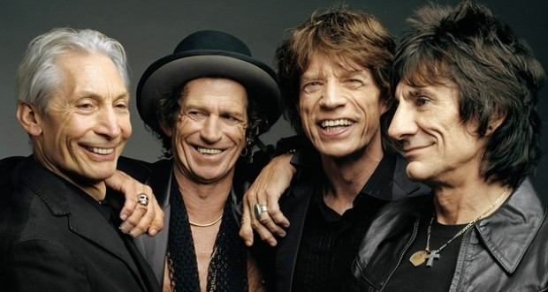

Você já deve ter ouvido alguém falar que “é muito bom/importante aprender outro idioma”, mas aposto que você nunca considerou que esse idioma pudesse ser… a música!

O Victor Wooten, um dos melhores e mais inovadores baixistas vivos, explica isso de um jeito simples e bonito (com legenda em português) nesse vídeo do TED-Ed, o braço educacional do TED, que traz videoaulas inspiradoras por parte de pessoas que têm conhecimento transformador a oferecer.

*[Link Youtube](https://www.youtube.com/watch?v=3yRMbH36HRE)*

Puxando da minha cabeça a história, sem consultar Wikipédia e afins, sei que quando o Victor tinha uns 3 anos de idade, largaram um contrabaixo elétrico nas mãozinhas dele, para que saísse tocando.

Como ele nasceu em uma família de músicos, foi só balbuciar as primeiras palavras que logo os diálogos começaram a brotar, exatamente como vemos acontecer com nossos filhos: parece mágica, mas em um dado momento você percebe que a pessoinha sabe falar coisas que você nem lembrava ter ensinado.

### Aprendendo a aprender

Esse tipo de aprendizado relatado por Wooten ressoa muito em mim: tentei aprender piano com uma professora tradicional, quando criança, e foi uma catástrofe. Todas aquelas regras, partituras, posições corretas dos dedos, cuidado com o andamento – era como aprender a andar podendo dar apenas um passo e voltar, um passo e voltar. Já viu alguma criança aprender a andar assim?

Também quando menino, tentei aprender russo com a minha avó materna, que é russa, com caderno, caligrafia, exercícios e tarefas. Ela tinha a melhor das intenções e não é que o método dela era ruim: eu apenas descobri, assim como com as aulas da Dona Diva, professora de piano, que eu aprendia de um jeito diferente.

Tanto é que, quando chegou a adolescência e eu ficava de bobeira depois da escola, comecei a tocar baixo e violão sozinho, tentando copiar o que ouvia e, eventualmente, lendo tablaturas (uma notação musical bem mais fácil, até tosca), memorizando alguns acordes e notas, na tentativa e erro. Pouco tempo depois passei a compor música, gravei muitas e hoje tenho até uma banda. Da mesma forma, comecei a me interessar por filmes, música e videogames, todos produzidos em inglês. E não é que eu aprendi a ler, escrever e falar inglês também?

O russo ficou um pouco em segundo plano, mas para não dizer que não houve progresso, quando fui a Moscou, com 19 anos, foi quando aprendi mais: ouvindo as pessoas falarem, assistindo à TV, ouvindo rádio.

### Imergir no universo do que quer aprender

Seguindo ainda a simples analogia de Wooten, chega um ponto no seu desenvolvimento em que você pode, por exemplo, entrar para uma faculdade de Letras e se especializar em diversos aspectos de um idioma, como o francês. As formas, os estilos, a literatura local: você entra fundo em cada detalhe e se torna um mestre na arte da língua. Assim como pode fazer um conservatório musical e ser versado em violoncelo como poucos, conhecendo todos os pormenores de escalas, harmonias, dissonâncias.

Mas há outro meio. Assim como a leitura pode torná-lo um melhor escritor, ouvir músicas de diferentes estilos abre a você um leque muito maior de recursos que pode usar na sua expressão musical. Apenas ouvir. Não precisa tentar copiar o que ouve, pois você está assimilando aquilo sem perceber, assim como vai falar um português mais afiado, sem esforço, lendo obras de bons autores brasileiros. O importante é diversificar o que ouve e a sua expressão vai mudando e sendo enriquecida com enorme naturalidade.

### Colocando em prática

Quando aprendemos a falar, não aspiramos uma carreira de conferencistas, certo? De porta-vozes, ases da comunicação em público. Nada disso. Falamos para nos comunicarmos com o próximo, exprimirmos ideias, opiniões e sentimentos. E quando aprendemos a escrever, poucos de nós querem, de imediato, tornar-se escritores, confeccionar *best sellers* e protagonizar noites de autógrafos dignas de cobertura da imprensa internacional. A maioria quer apenas poder usar a escrita para registrar informações, transmití-las pelo papel ou meios eletrônicos.

Mas ninguém desiste de falar porque não se torna um “falador” famoso ou de escrever porque não assinou contrato com uma editora, não é mesmo? A gente continua porque o ser humano tem necessidade de se expressar, faz parte de nós.

E foi justamente isso que demorei para entender, até demais – possivelmente até assistir ao vídeo do Wooten: a mesma frustração que pode vir de não se adaptar a um método de aprendizado é a mesmíssima de não “saber o que fazer” com a sua expressão musical. Muitos buscam o estrelato, querem ser guitarristas de uma banda famosa, compor canções que vão estourar nas paradas e fazer vídeos e shows que serão vistos e ouvidos por milhões.

Mas a gente não pode se esquecer: música é só uma forma que a gente tem de se expressar. Não é suficiente e até incrível conseguir “falar” uma língua tão rica e que, como Victor Wooten bem diz em sua aula, *“não precisa ser entendida para ser eficaz”*? Existem também muitas outras línguas, como das artes plásticas, a dança, a arquitetura, o cinema… se a música não é a sua, ou não é a única pela qual se interessa, qual é o problema?

### O ato final

Tocar e fazer música é prazeroso e tem o benefício de tocar o coração das pessoas, com pouquíssimos fatores intermediários. O som viaja no ar, o martelinho do ouvido vibra, o cérebro recebe e, quase sem processar, manda para o nosso centro gerador de emoções.

Você pode tocar flauta e derreter o seu namorado com uma música suave, de tons doces; pode mandar um pagode no cavaquinho que vai fazer sua tia se acabar de dançar no churrasco da família; pode cantar uma serenata horrorosa para sua esposa, ao pé da janela, mas fazê-la chorar de alegria só com a sua intenção desengonçada, na forma de música; pode se apresentar com um banquinho e um violão para meia-dúzia de bêbados em um bar do centro da cidade e só ouvir uns arrotos e soluços como resposta. O grande lance é entender que o prazer está no ato, e não se ele é bem-sucedido.

### Motivação sem objetivo

Já conheci muitos que queriam, de coração, aprender música e ficavam envergonhados de não saber nada, de começar, de arranhar o violão um pouquinho para logo desistir. “Não tenho o dom”, diziam. Já conheci quem, por outro lado, achasse que “precisava” saber música e se enfiou em cursos e mais cursos para se obrigar a aprender, mesmo que isso fosse apenas uma motivação racional, pouco alinhada com a real inclinação que a pessoa tinha dentro dela.

A minha insistência foi em fazer vingar uma banda, com minhas composições. Passado algum tempo, começo a entender que a vontade excessiva em mostrar minha música a muitos e conseguir viver disso foi justamente o que freou meu desenvolvimento. Assim como eu não me obriguei a aprender, não preciso me forçar a “fazer sucesso” com a música – e nem tenho mais tanto tempo livre para me preocupar com isso!

Estou aprendendo, aos pouquinhos, a resgatar o prazer de tocar, sem objetivo, apenas dando vazão àquelas informações que surgem dentro de mim e que só podem ser expressas por meio de sons, pela linguagem da música, que tive o privilégio de aprender naturalmente. É o que faço quando um tempinho livre aparece.

O próximo passo é comprar um violãozinho de criança para meu filho, que morre de ciúme quando pego o violão e fico “falando” aquela língua que ele ainda não sabe. Quando eu fizer isso, aviso por aqui como foi.

E você, tem interesse em aprender uma nova linguagem? Se você quer mesmo, acredite: é muito mais fácil do que você imagina.

  
 por Allan Zaarour
  
  
 [[anexo ausente]](http://pubads.g.doubleclick.net/gampad/jump?iu=1051165/PdH_Feed_superbanner/leaderboard&sz=728x90&c=2075106946) 
[anexo ausente]
  
  
  
[[anexo ausente]](http://da.feedsportal.com/r/211597517941/u/49/f/530922/c/32911/s/4066e223/sc/21/rc/1/rc.htm)
  
[[anexo ausente]](http://da.feedsportal.com/r/211597517941/u/49/f/530922/c/32911/s/4066e223/sc/21/rc/2/rc.htm)
  
[[anexo ausente]](http://da.feedsportal.com/r/211597517941/u/49/f/530922/c/32911/s/4066e223/sc/21/rc/3/rc.htm)
  
  
[[anexo ausente]](http://da.feedsportal.com/r/211597517941/u/49/f/530922/c/32911/s/4066e223/sc/21/a2.htm)
[anexo ausente]

[[anexo ausente]](http://feeds.feedburner.com/~ff/PapodehomemLifestyleMagazine?a=iQlwPhoOyog:2cemnPtEo-I:yIl2AUoC8zA)

[[anexo ausente]](http://feeds.feedburner.com/~ff/PapodehomemLifestyleMagazine?a=iQlwPhoOyog:2cemnPtEo-I:qj6IDK7rITs)
[[anexo ausente]](http://feeds.feedburner.com/~ff/PapodehomemLifestyleMagazine?a=iQlwPhoOyog:2cemnPtEo-I:-BTjWOF_DHI)

[anexo ausente]
