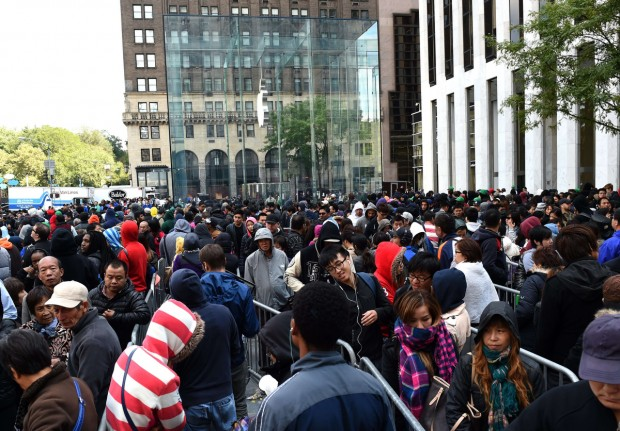

As campanhas eleitorais terminaram, mas a política não se encerra nas urnas. Votamos e retornamos a impressão de encerramento, mas todo dia é dia de eleição, afinal “toda vez que você gasta dinheiro, está dando um voto ao tipo de mundo que deseja ver”. A frase é da [Anna Lappé](http://en.wikipedia.org/wiki/Anna_Lapp%C3%A9).

Soa mesquinho vincular dinheiro a política, mas se tirarmos qualquer juízo de valor, perceberemos que essas coisas andam juntas: sempre andaram e sempre andarão. Da mesma forma que campanhas eleitorais requerem dinheiro (público e/ou privado), iniciativas sociais também, mesmo que pareça igualmente mesquinho vincular dinheiro a ação social.

Políticos e empresas sabem bem disso e usufruem muito bem essa ideia de que o dinheiro tem efeito no mundo. Já nós, cidadãos republicanos, não. Quando o assunto é dinheiro, empresas e políticos são mais espertos do que os cidadãos.

Nós podemos passar o dia todo fingindo que não influenciamos em nada o estado das coisas, sendo que, a bem da verdade, estamos o dia todo votando. O que nos engana é não entendermos o sistema eleitoral da nossa principal cédula, o dinheiro.

Esse tem uma lógica própria que produz efeitos à revelia dos nossos eventuais anseios mais altruístas. Com dinheiro na mão, costumamos agir justificando o pressuposto do consumidor maximizador, que enxerga apenas a relação custo-benefício.

Fila para comprar um novo celular

Assim, acabamos acumulando votos aos setores sociais que nos produzem benefícios diretos, evidentes e quantificáveis. Bancos e empresas concentram riqueza e poder no mundo porque os seus produtos e serviços são requisitados. Existem pessoas dispostas a votar (dinheiro) por isso.

A racionalidade egoísta do dinheiro nos empurra a fazer escolhas que, se bem examinadas, são contraproducentes em relação àquilo que queremos ver acontecer no mundo.

Uma consequência clara da maneira como nós gastamos nosso dinheiro é o grau de sua concentração em determinados setores de produção e a diferença de remuneração entre eles. Em uma pesquisa conduzidada pela BusinessWeek sobre salários de profissionais com MBA depois de 10 anos de formação, o salário médio para um profissional com MBA em Stanford trabalhando no setor privado era de 400 mil dólares por ano. Enquanto isso, na mesma faixa etária e com a mesma qualificação, um profissional que trabalhasse como CEO de uma organização que combate a fome recebia 84 mil dólares por ano.

Sem querer entrar em um profundo debate econômico, uso as palavras do ativista Dan Palotta:

> “Não existe como você convencer uma pessoa com talento para ganhar 400 mil dólares a fazer um sacrifício anual de 316 mil dólares porque quer trabalhar no combate à fome.
>
> Algumas pessoas podem dizer: ‘Bem, mas é porque esses tipinhos MBA são gananciosos’.
>
> Não necessariamente. Eles podem ser espertos. É mais barato para essa pessoa doar 100 mil dólares para uma instituição anualmente, economizando 50 mil em impostos, […] ser chamado de filantropo, provavelmente estar no conselho de administração dessa ONG e ainda supervisionar o pobre coitado que decidiu se tornar o CEO”.

Esse cenário de extrema desigualdade na distribuição de recursos (visto acima apenas como diferença de remuneração, mas que [pode ser explorado sobre tantas outras perspectivas](http://www.ted.com/talks/dan_pallotta_the_way_we_think_about_charity_is_dead_wrong?language=pt-br), é reflexo do constante mal-uso social que fazemos do dinheiro. Nós cidadãos não temos consciência do efeito que nosso dinheiro tem no mundo e, em um cenário como esse, quase todos os projetos de impacto social, ambiental e político não-estatais estarão sempre condenados a impactos marginais sobre o todo.

> E em algum lugar, ainda existe luz.
>
> Pode não ser muita luz, mas ela vence a escuridão.
>
> – [Charles Bukowski](http://pensador.uol.com.br/frase/MTUwODc5MQ/).

[Michel De Certeau](http://pt.wikipedia.org/wiki/Michel_de_Certeau), um historiador jesuíta francês, desconfiava que as ciências sociais, muito adeptas às macro teorizações, deixavam escapar grandes acontecimentos que se passavam no microcosmo.

Em razão de sua suspeita, De Certeau se tornou um grande observador das micro-práticas, dos pequenos gestos do cotidiano que costumam fugir do escopo de outros cientistas. E foi nessa procura que o jesuíta francês descobriu aquilo que ele chamava de “pequenas resistências”.

Cozinhar em casa é um ato político

Não importa quão opressor fosse o macro universo, os indivíduos encontravam saídas. Em seus espaços mais íntimos — **nem sempre privados** — as pessoas vivem em constante reapropriação e ressignificação do sistema. Segundo o historiador, nesses gestos encontra-se uma abundância de oportunidades para pessoas comuns subverterem os rituais e representações que as instituições buscam impor sobre eles.

O dinheiro, como todo símbolo, é também sujeito a reapropriações. É possível no uso do dinheiro resistir à lógica de consumo nele embutida. A única forma de ressignificar o dinheiro é doá-lo.

É possível reduzir desigualdades e fomentar um setor social mais forte re-usando o sistema, re-usando o dinheiro. Há quem acredite que a solução para o setor social dependa da criação de uma cultura de pedir; já eu, eu acredito que essa mudança deva ser fruto de uma cultura de doação.

Acredito que você que está lendo isso agora precisa doar da mesma forma que você comprou seu último par de calças jeans. Não chegou alguém te implorando para comprá-la, ninguém te ligou e falou que a indústria estava desesperadamente precisando desse dinheiro, que a empresa precisava pagar os seus funcionários; você foi lá, procurou, encontrou, experimentou, gostou e comprou. Pois bem, você deveria aplicar essa mesma lógica às suas doações.

Se bancos e empresas lucram é porque os seus produtos e serviços são requisitados. Existem pessoas dispostas a pagar dinheiro por isso. A sociedade — o enorme grupo de pessoas que compram coisas e serviços — será sempre capaz de influenciar significativamente as empresas que lucram e as empresas que não, os negócios que vingam e os que não. Dá até para dizer que, coletivamente, o que escolhemos comprar pode mudar o curso da história.

Reconheço que muito do dinheiro do mundo escapa à lógica do vender e comprar, e que, ainda assim, muito do consumo está além da nossa zona de decisão. Todavia, existe uma margem relevante de dinheiro, algo que deve variar de pessoa para pessoa, sobre a qual o consumidor tem sim poder de escolha.

Isso não é uma questão ligada apenas aos trabalhos sociais empreendidos por ONGs; isso é também um debate político. A autonomia da sociedade civil é parte fundamental de um processo de aprofundamento da democracia, e não existe autonomia sem recursos. Não existe autonomia sem doações.

De um lado, as ONGs precisam se envolver com a sociedade desorganizada, de outro a sociedade desorganizada precisa se envolver mais com as ONGs.

### Conheça o projeto [Desafio Brasil de Crowdfunding](http://desafio.doemaisdoemelhor.org.br/)

[*Link YouTube*](http://youtu.be/262vxSF2Wk4)

Foi nesse espírito que nasceu o [Desafio Brasil de Crowdfunding](http://desafio.doemaisdoemelhor.org.br/). Um desafio destinado às ONGs e às pessoas, **que vai premiar um projeto de crowdfunding com R$ 50 mil** para que ele multiplique por 10 esse dinheiro. O desafio é que, com essa grana, um projeto social consiga mobilizar meio milhão de reais via crowdfunding. Para ajudar nisso, os organizadores do Desafio ([Benfeitoria](http://benfeitoria.com/), [Doare](https://doare.org/), [Juntos.com.vc](http://www.juntos.com.vc/) e [SITAWI](http://sitawi.org.br/)) oferecem um prêmio de R$ 50 mil e mais a consultoria completa ao longo da campanha.

O desafio tem o objetivo de estimular Organizações Sociais a vincularem sua captação de recursos com a mobilização de pessoas, afinal muitas delas, dada a baixa cultura de doação, preferem buscar recursos quase que exclusivamente com empresas e governos. Queremos mostrar que o crowdfunding não é apenas uma estratégia eficiente de captação, mas também o mecanismo mais legítimo para envolver a sociedade civil em suas causas.

As doações são uma forma de mini-resistência, de subversão do sistema. Você não precisa ser um franciscano nem aderir a um voto de pobreza, mas se você se incomoda com o mundo e quer fazer algo a respeito, você terá que sacrificar parte do que você tem em benefício do coletivo.

Você não terá que largar tudo e ir trabalhar no setor social, você pode produzir impacto exatamente de onde está. Doe!

  
 por Ricardo Borges Martins
  
  
 [[anexo ausente]](http://pubads.g.doubleclick.net/gampad/jump?iu=1051165/PdH_Feed_superbanner/leaderboard&sz=728x90&c=1261984637) 
[anexo ausente]
  
  
  
[[anexo ausente]](http://da.feedsportal.com/r/211597787759/u/49/f/530922/c/32911/s/40a74279/sc/27/rc/1/rc.htm)
  
[[anexo ausente]](http://da.feedsportal.com/r/211597787759/u/49/f/530922/c/32911/s/40a74279/sc/27/rc/2/rc.htm)
  
[[anexo ausente]](http://da.feedsportal.com/r/211597787759/u/49/f/530922/c/32911/s/40a74279/sc/27/rc/3/rc.htm)
  
  

[anexo ausente]

[[anexo ausente]](http://feeds.feedburner.com/~ff/PapodehomemLifestyleMagazine?a=tn8hfN3zaWk:drAhEpzMZJ4:yIl2AUoC8zA)
[[anexo ausente]](http://feeds.feedburner.com/~ff/PapodehomemLifestyleMagazine?a=tn8hfN3zaWk:drAhEpzMZJ4:D7DqB2pKExk)
[[anexo ausente]](http://feeds.feedburner.com/~ff/PapodehomemLifestyleMagazine?a=tn8hfN3zaWk:drAhEpzMZJ4:qj6IDK7rITs)
[[anexo ausente]](http://feeds.feedburner.com/~ff/PapodehomemLifestyleMagazine?a=tn8hfN3zaWk:drAhEpzMZJ4:-BTjWOF_DHI)

[anexo ausente]
