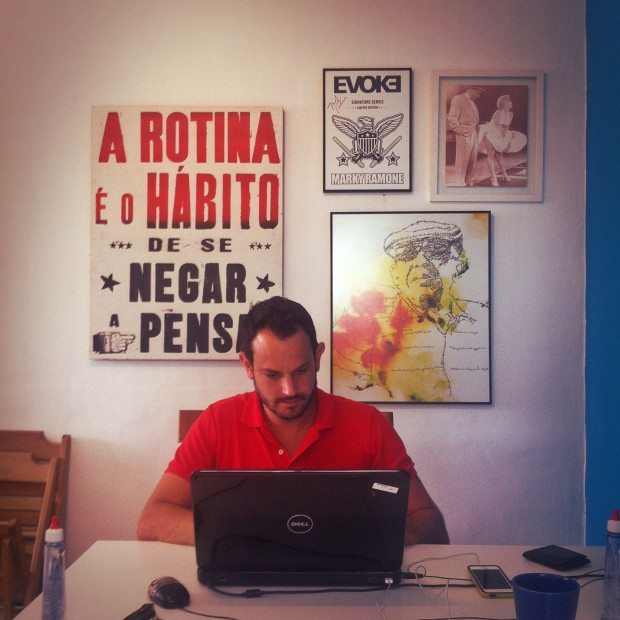
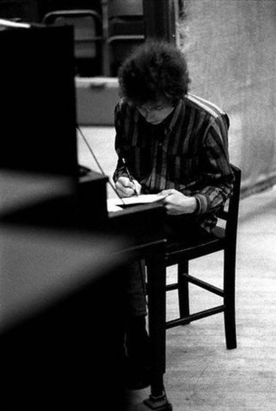

Quando visitei o PapodeHomem pela primeira vez em 2012, pude observar uma placa, logo na porta de entrada. Nela, tinha gravado os dizeres: *“A rotina é o hábito de se negar a pensar”*. Como tudo que envolve o PapodeHomem, essa era apenas uma isca filosófica, uma fagulha proposital para estimular uma linha de pensamento ainda maior.

Rotina é, sem dúvida, o ato de se negar a pensar, mas isso não é exatamente tão ruim quanto parece.

Felipe Ramos em meio à sua rotina

Considere que todas as nossas decisões exigem certo esforço, mas este esforço não surge do nada, ele vai consumindo um recurso escasso, que se não for usado estrategicamente acaba se esgotando.

### Força de vontade é um elemento limitado

Você acordou e decidiu que iria começar na academia. Levantou, vestiu sua roupa *fitness* e dirigiu focado para o centro de treinamento. Parabéns, este foi o primeiro dia. Você acabou de consumir uma grande parte do seu reservatório de força de vontade. Pode parecer bobeira, mas é assim que funciona. Provavelmente, se precisar negar uma fatia de bolo ou tomar alguma outra decisão difícil ao longo do dia, não se sairá tão bem.

Sempre que quebramos um padrão para tomar uma determinada decisão, estamos consumindo energia mental.

Michael Lewis, enquanto fazia o [perfil de Barack Obama para o Vanity Fair](http://www.vanityfair.com/politics/2012/10/michael-lewis-profile-barack-obama), teve a oportunidade de questionar o presidente americano: *“Imagine que você deixará de ser presidente em trinta minutos, me prepare para assumir seu lugar, o que você me diria?”*. A primeira dica foi sobre uma rotina diária de exercícios físicos, a segunda foi um pouco mais interessante: *“Você pode observar, eu apenas uso ternos azuis e cinzas. Eu tento reduzir a quantidade de decisões que tomo. Não quero decidir o que vou vestir ou comer, já tenho muitas outras decisões para tomar.”*

Isso também serve para todos nós. Quanto mais decisões e escolhas precisarmos fazer, maior o desgaste que sofremos para executar outras tarefas que necessitam de força de vontade.

### Automatizando para realizar mais

Sem um padrão diário estruturado é muito difícil – ou quase impossível – realizar qualquer coisa que exija dedicação de longo prazo. Por isso, para qualquer projeto que exija consistência, é necessário transformá-lo em rotina. Não apenas em termos de realizar sempre, mas de automatizar tanto, com o menor número de variáveis possível, para que não seja mais necessário pensar sobre aquilo, apenas manter a execução.

Neste ponto, cada elemento conta. Fazer exatamente a mesma coisa, do mesmo jeito, na mesma hora. Controlar o ambiente para oferecer a menor quantidade de opções e se manter consistente por tempo o suficiente para que determinada tarefa não seja mais considerada um esforço, se torne apenas um ponto no seu dia.

Obviamente não é possível, todos os dias, ter a mesma performance em tudo. Supondo que você decide criar uma rotina para frequentar a academia, existem dias bons, que você vai motivado, dias ruins, que você vai cumprir tabela e dias comuns, que você foi e fez o que deveria ser feito, sem maiores emoções. O importante é estabelecer um ritmo, tornar aquele hábito frequente o suficiente para que, fugir dele se torne um esforço.

O *coaching* tradicional costuma apontar 21 dias consecutivos como tempo necessário para criar um novo hábito, mas hoje sabemos que isso é um mito. Estudos mostram que na verdade pessoas demoram [entre 18 a 254 dias para formar um novo hábito](http://onlinelibrary.wiley.com/doi/10.1002/ejsp.674/abstract), sem muito padrão fora disso. O mesmo estudo também aponta que perder um dia não afeta a formação de novos hábitos, o que também nos faz concluir que não é uma questão de tudo ou nada, dando pra ser flexível.

### E como aplicar isso na minha vida?

É aqui que a coisa fica realmente boa. Dá para automatizar praticamente todos os processos da vida cotidiana, transformar tudo em elementos de simples execução. Os resultados são sempre positivos.

A melhor forma de controlar a alimentação, por exemplo, é restringir seu cardápio ao mínimo de variações. Café da manhã igual, almoço e janta iguais. Sem muitas alterações, apenas comer e seguir o dia. Se a combinação de elementos for ideal, não tem erro. Em pouco tempo a vontade de trocar sua salada por uma lasanha vai desaparecer, podendo ser saciado em algum outro dia dedicado para este tipo de quebra da rotina.

Quer escrever mais? Escreva diariamente. Uma linha, dois parágrafos, um texto. Não importa. Defina um horário. Seja na hora do almoço ou depois do trabalho. Tenha o horário da escrita, que algo vai sair da sua mente e se tornar texto. No curto prazo pode parecer que não está surgindo efeito, mas futuramente estes pedaços vão se combinar, sua habilidade de construir textos se expande e em breve você não sentirá mais como um esforço, mas como um momento do seu longo dia, como escovar os dentes ou tomar banho.

O [Luciano](http://papodehomem.com.br/author/lucianoribeiro/), editor aqui do PapodeHomem, passou a dedicar um momento do dia, todos os dias, apenas para tocar guitarra. Fosse ensaiar ou apenas de bobeira, ele pegava a guitarra e tirava algo. Em pouco tempo várias músicas novas foram criadas neste processo. Tinha dias que fazia pequenas partes, outras que testava coisas novas, ao final este monte de retalhos acabou se combinando e ele até já está em processo de gravação de algumas dessas criações.

Qualquer tipo de atividade pode – e deve – ser transformado em rotina, para isso é interessante seguir os seguintes passos:

- **Assuma o futuro hábito como algo inadiável e insubstituível**: futuramente ele será.
- **Comece pequeno**: correr 40 minutos de primeira pode te desmotivar, que tal começar andando 5 minutos por dia?
- **Seja específico**: reorganizar alimentação é muito vago. E se começarmos mudando apenas o almoço?
- **Peça ajuda**: amigos que podem fazer um bom acompanhamento e evitar que você fuja do seu objetivo.
- **Foco no longo prazo**:  começar a procurar resultados positivos logo de inicio certamente vai te desmotivar. As atitudes de agora só refletem no futuro, lembre-se disso e siga em frente.
- **Seja flexível**: ser consistente é o ideal, mas se falhar um dia não precisa largar tudo. Importante é não parar.

### Para quebrar, é necessário construir

De fato, considero que sair da rotina é algo interessante e pode nos ajudar a ver coisas sob óticas diferentes. Mudar o percurso que usa para ir trabalhar, fazer algo que não está acostumado, comer num restaurante exótico e assim por diante são ótimas ferramentas para se colocar em outras perspectivas. Nossa criatividade exige que quebremos um pouco os padrões diários.

O equilíbrio consiste em possuir uma rotina estruturada o suficiente para garantir a economia dessa energia mental, promovendo uma quantidade de produtividade que seja interessante e, ao mesmo tempo, libere energia para que as escapadas do cotidiano não comprometam os resultados esperados em outras pontos.

Todo o trabalho de automatizar a vida consiste em liberar forças para gastar com coisas que realmente necessitam desse esforço extra.

E você? Quais hábitos tenta incorporar na rotina? Como tem feito para equilibrar suas decisões e conseguir se manter produtivo? Enriqueça o conteúdo na caixa de comentários.

  
 por Alberto Brandão
  
  
 [[anexo ausente]](http://pubads.g.doubleclick.net/gampad/jump?iu=1051165/PdH_Feed_superbanner/leaderboard&sz=728x90&c=841299589) 
[anexo ausente]
  
  
  
[[anexo ausente]](http://da.feedsportal.com/r/211597956260/u/49/f/530922/c/32911/s/40cb769e/sc/19/rc/1/rc.htm)
  
[[anexo ausente]](http://da.feedsportal.com/r/211597956260/u/49/f/530922/c/32911/s/40cb769e/sc/19/rc/2/rc.htm)
  
[[anexo ausente]](http://da.feedsportal.com/r/211597956260/u/49/f/530922/c/32911/s/40cb769e/sc/19/rc/3/rc.htm)
  
  
[[anexo ausente]](http://da.feedsportal.com/r/211597956260/u/49/f/530922/c/32911/s/40cb769e/sc/19/a2.htm)
[anexo ausente]

[[anexo ausente]](http://feeds.feedburner.com/~ff/PapodehomemLifestyleMagazine?a=HOqWLhDuf5A:SL94wORkjXQ:yIl2AUoC8zA)
[[anexo ausente]](http://feeds.feedburner.com/~ff/PapodehomemLifestyleMagazine?a=HOqWLhDuf5A:SL94wORkjXQ:D7DqB2pKExk)
[[anexo ausente]](http://feeds.feedburner.com/~ff/PapodehomemLifestyleMagazine?a=HOqWLhDuf5A:SL94wORkjXQ:qj6IDK7rITs)
[[anexo ausente]](http://feeds.feedburner.com/~ff/PapodehomemLifestyleMagazine?a=HOqWLhDuf5A:SL94wORkjXQ:-BTjWOF_DHI)

[anexo ausente]
