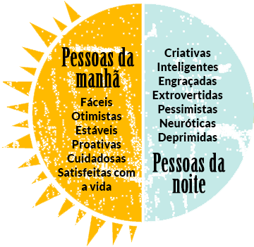

Quantas vezes ouvimos o conselho de acordar mais cedo? Seja porque as [pessoas produtivas acordam loucamente cedo](http://www.fastcompany.com/3013856/how-to-be-a-success-at-everything/why-productive-people-get-up-insanely-early), ou [artistas famosos acordarem cedo](http://www.slate.com/articles/arts/culturebox/features/2013/daily_rituals/daily_rituals_is_waking_up_early_the_secret_to_artistic_success.html), ou porque acordar cedo é o [segredo para o sucesso](http://www.entrepreneur.com/article/226910).

Na verdade não tenho problema com esse conselho porque naturalmente tendo a acordar cedo. Sou aquele tipo de pessoa que não aguenta acordar tarde e quando isso ocorre, sinto como se o dia tivesse passado por mim.

Não, o meu problema foi sempre com a forma particular de conselhos para acordar que sugere acordar cedo para escrever. Sendo já uma escritora e alguém que acorda cedo (é um traço comum em escritores – talvez não por coincidência), zombei de muitos posts de blog que sugeriam que eu acordasse ainda mais cedo para escrever.

Exatamente como alguém tentando abandonar um vício, eu seguia dizendo para mim mesma que, se eu quisesse, eu conseguiria acordar mais cedo. Mas não estava convencida dos benefícios de fazer isso. Afinal de contas, escrevo o dia todo de qualquer forma. Por que acordar ainda mais cedo para escrever mais?

### Meu experimento

Recentemente decidi tentar o seguinte: comecei a acordar 6h da manhã para escrever. Faço um café, escrevo até às 7h, tomo um banho e começo meu dia normalmente.

Embora eu não tenha sido capaz de fazer isso todo dia, me surpreendi vendo o quanto é benéfico, e estou convencida a incorporar isso como um hábito diário.

**Produtiva às 7h da manhã**

Adoro a sensação de que já consegui fazer um bocado de coisas. Uma das melhores coisas de começar o dia escrevendo é se sentir produtivo antes mesmo de ir para o chuveiro. Depois de fazer um café, geralmente consigo de 40 a 45 minutos de escrita ininterrupta. Uso esse tempo para escrever apenas (nada de pesquisas, melhorar rascunhos, etc.) e assim tenho conseguido escrever cerca de 1000 palavras numa manhã.

**Acordando meu cérebro**

Uma dos motivos que sempre me fez ser contra a ideia de escrever direto após acordar é que me sinto grogue de sono. Sempre pensei que precisava de algum tempo para acordar, antes de criar algo de valor. Mas o que parece é que a [citação de Hemingway](http://99u.com/articles/6954/the-1-step-plan-for-super-productivity) é verdadeira em mais de um sentido:

> Não há ninguém para perturbar, e está fresco ou frio e se pode aquecer-se enquanto se escreve…

Não só eu me esquento fisicamente enquanto escrevo, mas também meu cérebro. Quando chegam 7h da manhã, meu pensamento está bem claro, e estou pronta para encarar o dia.

**Trabalhar nas minhas próprias coisas**

Lembra que uma de minhas objeções a acordar cedo é que eu escrevo o dia todo de qualquer modo? O que eu não estava vendo é a diferença entre trabalhar em meus próprios projetos e trabalhar para pagar as contas. Quando as duas coisas são feitas com as mesmas habilidades, é fácil não priorizar os próprios projetos.

Desde que comecei a escrever pela manhã tenho sido capaz de publicar um post novo em meu blog cada sexta-feira, e comecei um novo projeto de conteúdo.

**Pensando em palavras**

O investidor Paul Graham diz que [escrever ajuda a formar ideias](http://www.paulgraham.com/essay.html):

> Expressar ideias ajuda a lhes dar forma. De fato, “ajuda” é fraco demais. A maior parte do que acaba em meus ensaios só pensei quando sentei para escrever. É por isso que os escrevo.

Descobri que isso é especialmente verdadeiro quando escrevo no início da manhã. Escrevendo para mim mesma no silêncio e na escuridão, tenho sido capaz de deixar de lado a pressão que normalmente sinto quando escrevo para os outros, ou para o trabalho. É o único momento em que me permito improvisar na escrita.

Devido a esse enfoque, descobri que posso explorar muitas ideias interessantes logo no início da manhã, e usar a escrita para me ajudar a pensar melhor as coisas e ter novas ideias.

### Por que você devia tentar

Estes são benefícios que descobri, mas talvez eles não se apliquem a você. Ainda assim, se você estiver pensando em tentar o “acordar cedo, escrever todos os dias” de [Sean McCabe](http://seanwes.com/2014/early-wake-daily-write-how-to-make-a-name-for-yourself/), há várias evidências que mostram que provavelmente será tão bom para sua saúde quanto para sua escrita.

Quem cedo madruga tende a se sentir [mais feliz e mais saudável](http://www.artsci.utoronto.ca/main/newsitems/morning-people-happier) do que as “corujas”, o que pode estar ligado ao fato de que o trabalho e os momentos sociais estão mais alinhados com as horas em que o madrugador fica acordado. Quem cedo madruga também tende a [ser mais proativo e se sentir mais em controle de suas vidas](http://www.bakadesuyo.com/2010/01/are-early-risers-more-proactive-than-night-ow/).

Estudos mostraram que as corujas tendem a ser mais criativas, [inteligentes e extrovertidas](http://hbr.org/2010/07/defend-your-research-the-early-bird-really-does-get-the-worm/ar/1) do que quem prefere a manhã, mas no que diz respeito a produtividade, os madrugadores parecem [estar com a vantagem](http://www.inc.com/news/articles/2010/07/research-says-morning-people-are-more-proactive.html).

Os madrugadores também tendem a se [alimentar melhor](http://www.northwestern.edu/newscenter/stories/2011/05/night-owls-weight-gain.html), comer menos *fast food* e mais frutas e vegetais. As corujas são mais propensas a engordar devido a sua tendência a consumir mais calorias à noite antes de deitar.

E não para aí: as corujas sofrem [maior risco de depressão](http://hbr.org/2010/07/defend-your-research-the-early-bird-really-does-get-the-worm/ar/1), qualidade de sono pior, e [consomem mais álcool e tabaco](http://www.newscientist.com/article/dn24292-first-physical-evidence-of-why-youre-an-owl-or-a-lark.html#.VB9hFYFWfKy) do que os membros do outro grupo.

Claro, acordar cedo não necessariamente mudará qualquer destes fatores, mas esses hábitos podem estar ligados a quando se dão as horas em que permanecemos acordados.

Cerca de [50% de seu cronótipo](http://www.newscientist.com/article/dn24292-first-physical-evidence-of-why-youre-an-owl-or-a-lark.html#.VB9hFYFWfKy), que determina se você é um madrugador, uma coruja ou está em algum lugar entre os dois, é predeterminado pela genética. Então, você pode mudar um pouco seus hábitos de sono, mas uma mudança dramática pode ser bem difícil, ou pelo menos desconfortável. Por exemplo, Sean McCabe acorda cedo quando está trabalhando, mas logo que sai de férias [volta a suas tendências naturais de coruja](http://seanwes.com/podcast/075-why-early-birds-beat-night-owls/).

A resposta não é necessariamente acordar mais cedo. [Forçar contra seu cronótipo natural pode ser prejudicial para sua saúde](http://well.blogs.nytimes.com/2013/10/17/everyday-jet-lag/). Mas se realmente quer ajustar os hábitos de sono, procure a exposição à luz natural durante o dia, o que pode [puxar um pouco o cronótipo](http://www.newscientist.com/article/dn24292-first-physical-evidence-of-why-youre-an-owl-or-a-lark.html#.VB9hFYFWfKy) para o sono mais cedo e o despertar idem.

### Como foi que eu fiz

Embora eu goste de acordar cedo, meu novo experimento não foi fácil. Eu comecei no fim do inverno, início da primavera, e dessa forma as manhãs ainda estavam frias, sendo difícil sair da cama antes do sol nascer.

Até agora, o que me ajudou foi isso:

**Persistência**

Se está tentando acordar várias horas mais cedo, pode tentar se ater ao [conselho de Leo Babauta](http://zenhabits.net/early/) e decrementar o alarme 15 minutos de cada vez. Já que eu só queria acordar uma hora mais cedo, simplesmente coloquei meu alarme diretamente em 6h. Por algumas semanas passei dormindo por cima do alarme, mas por preguiça deixei na mesma hora. Num determinado momento, porém, a persistência funcionou, e agora acordo às 6h duas ou três vezes por semana.

**Recompensas**

Antes de deitar uma palavra na tela, eu faço um café. Há algo recompensador em sentar para escrever com um café recém-preparado a seu lado. Esta é uma das ferramentas de barganha que uso comigo mesma quando 6h parecem cedo demais para sair da cama. A outra ferramenta é lembrar que percebo uma diferença em minha produtividade e em meu temperamento quando me forço a acordar cedo, isto é, lembrar que sem dúvida vale a pena.

“Mas primeiro, café”

**Acordar antes de se levantar**

Algumas vezes eu acordo às 6h, mas é uma luta sair da cama porque ela está tão quentinha e confortável. Duvido que alguém confirme isso, mas por acidente descobri que quando fico deitada olhando as notificações no celular, lendo e-mails e me atualizando no Twitter, o esforço mental e a tela brilhante me ajudam a acordar. Depois de cerca de 15 minutos disso geralmente desisto e me levanto, já que eu não consigo voltar a dormir imediatamente de todo modo.

**Preparar tópicos com antecedência**

Sentar para escrever às 6h não é a experiência mais agradável do mundo. Levo algum tempo acordar meu corpo e meu cérebro. Lá pelas 7h da manhã já estou no meu ritmo. É só uma questão de trabalhar em meio à sonolência.

Preparar um tópico de antecedência de forma que eu apenas precise sentar e começar a divagar sobre ele torna tudo mais fácil. A questão do assunto a ser tratado não é algo que desejo focar logo pela manhã.

**Acordar na mesma hora todos os dias**

Tenho um aviso no meu celular que toca todos os dias às 6h para eu tomar um remédio. Todas as manhãs eu tomo o remédio, mesmo tendo dormido muito tarde ou sendo fim de semana. Muitas vezes (incluindo aí muitos dias normais da semana) volto direto a dormir, mas essa hora regular do remédio me condicionou a ser capaz de acordar às 6h.

**Ir para cama mais tarde**

Esta dica final é contra intuitiva, portanto demorei até tentar. Inicialmente pensei que ir para a cama mais cedo me ajudaria a acordar igualmente cedo, mas não funcionou muito bem. Tendo a estar pronta para dormir entre 20h30 e 21h, mas isso significa acordar cedo demais – entre as 4 ou 5h. Sabendo que é cedo demais, volto a dormir, e acabo dormindo até 8h30 ou 9h. Isso me deixa sentindo cansada de dormir tanto, e começa mal meu dia, porque não começo a trabalhar até bem tarde na manhã, e chega a hora da janta, invariavelmente já estou sem energia igual.

Agora geralmente fico acordada lendo até 10 ou 11h, se o consigo, o que me permite 7 ou 8h de sono, acordando às 6h. Isso é o ideal, e acho muito mais fácil acordar cedo (nem sempre sair da cama) quando vou dormir mais tarde.

Se você ainda zomba dos benefícios de acordar cedo, não o culpo. Não funciona para todos. Não obstante, sugiro pelo menos tentar por algumas semanas. A pior parte de criar um hábito de acordar cedo para escrever é a tentativa e erro. O que funciona para você não vai ser exatamente o mesmo que [funciona para os outros](https://medium.com/matter/waking-up-is-hard-to-do-c720dc9617a8), e portanto é preciso estar disposto a colocar um tempo nisso, tentar coisas diferentes. Se você encontrar as mudanças positivas de temperamento ou produtividade que eu encontrei, verá que vale a pena.

\* \* \*

***Nota da tradução:****Este texto foi publicado originalmente no blog [Pick Crew](http://blog.pickcrew.com/wake-up-early/).*

  
 por Belle Beth Cooper
  
  
 [[anexo ausente]](http://pubads.g.doubleclick.net/gampad/jump?iu=1051165/PdH_Feed_superbanner/leaderboard&sz=728x90&c=287886869) 
[anexo ausente]
  
  
  
[[anexo ausente]](http://da.feedsportal.com/r/211597363297/u/49/f/530922/c/32911/s/404663a7/sc/25/rc/1/rc.htm)
  
[[anexo ausente]](http://da.feedsportal.com/r/211597363297/u/49/f/530922/c/32911/s/404663a7/sc/25/rc/2/rc.htm)
  
[[anexo ausente]](http://da.feedsportal.com/r/211597363297/u/49/f/530922/c/32911/s/404663a7/sc/25/rc/3/rc.htm)
  
  
[[anexo ausente]](http://da.feedsportal.com/r/211597363297/u/49/f/530922/c/32911/s/404663a7/sc/25/a2.htm)
[anexo ausente]

[[anexo ausente]](http://feeds.feedburner.com/~ff/PapodehomemLifestyleMagazine?a=nxm-oC1ECgE:P_rpQapij_Q:yIl2AUoC8zA)

[[anexo ausente]](http://feeds.feedburner.com/~ff/PapodehomemLifestyleMagazine?a=nxm-oC1ECgE:P_rpQapij_Q:qj6IDK7rITs)
[[anexo ausente]](http://feeds.feedburner.com/~ff/PapodehomemLifestyleMagazine?a=nxm-oC1ECgE:P_rpQapij_Q:-BTjWOF_DHI)

[anexo ausente]
