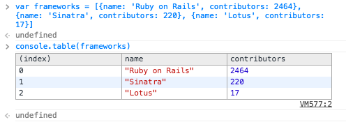
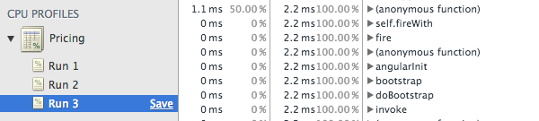
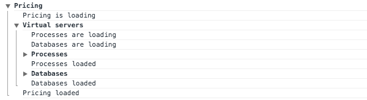

# 5 functions of the Console object you didn’t know

Not everybody knows that apart from the simplest `console.log()` used for logging, the Console object has a couple of other equally useful function. I have chosen and described the 5 most interesting but unpopular methods, which can be successfully utilized in everyday work.

*All of the functions described have been tested and work properly in Google Chrome 38*

## console.assert(expression, message)

If the value passed in the first argument is false, the function will log a message given as the second argument in the web console. If the expression is true, nothing is logged.

```
> console.assert(document.querySelector('body'), "Missing 'body' element")

> console.assert(document.querySelector('.foo'), "Missing '.foo' element")
[Error] Assertion failed: Missing '.foo' element
```

## console.table(object)

This function displays the provided object or array as a table:



*For more details on `console.table()` see the article ["Advanced JavaScript Debugging with console.table()"](http://blog.mariusschulz.com/2013/11/13/advanced-javascript-debugging-with-consoletable) by Marius Schulz*

## console.profile(name)

`console.profile(name)` starts a CPU profiler in the console. You can use the name of a report as an argument. Each run of the profiler is saved as a separate tab and grouped in a dropdown list. Remember to end profiling using the `console.profileEnd()`.



## console.group(message)

The `console.group(message)` groups all logs that follow after it until the `console.groupEnd()` is called to a dropdown list. Lists can be nested. `console.groupCollapsed(message)` works analogically, but the created list is collapsed by default.



## console.time(name)

`console.time(name)` starts the timer with the name provided as the argument, which counts down the time in milliseconds until it is stopped by the `console.timeEnd(name)`. Exactly the same name must be used in both functions.

```
> console.time('Saving user')
> console.log('User saved')
> console.timeEnd('Saving user')
Saving user: 2.750ms
```

*More on all functions available can be found in [Console API description](https://developer.chrome.com/devtools/docs/console-api) and [article on console usage](https://developer.chrome.com/devtools/docs/console) at the Google Chrome web pages*

---

Shelly Cloud is a platform for hosting Ruby and Ruby on Rails applications. You can focus on development without getting distracted by deployment, optimization and maintenance.

[Deploy your app now, for free](https://shellycloud.com/sign_up)

---
