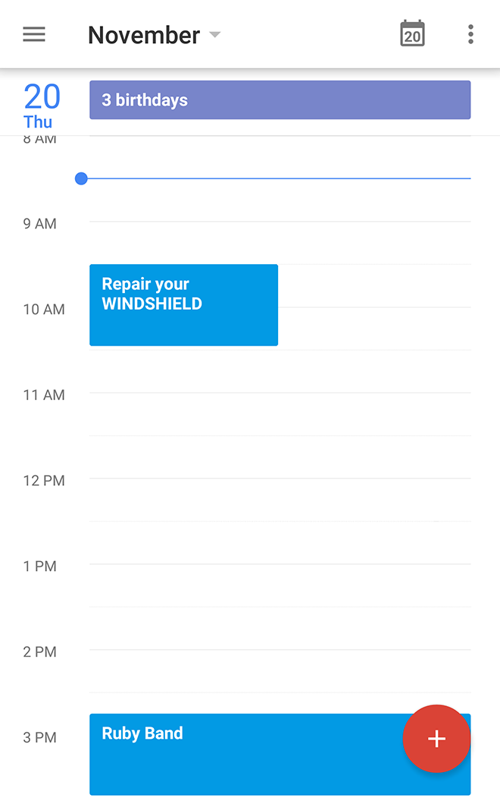
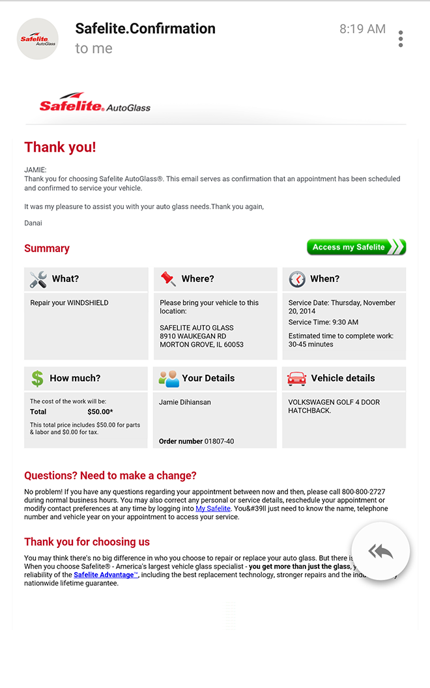
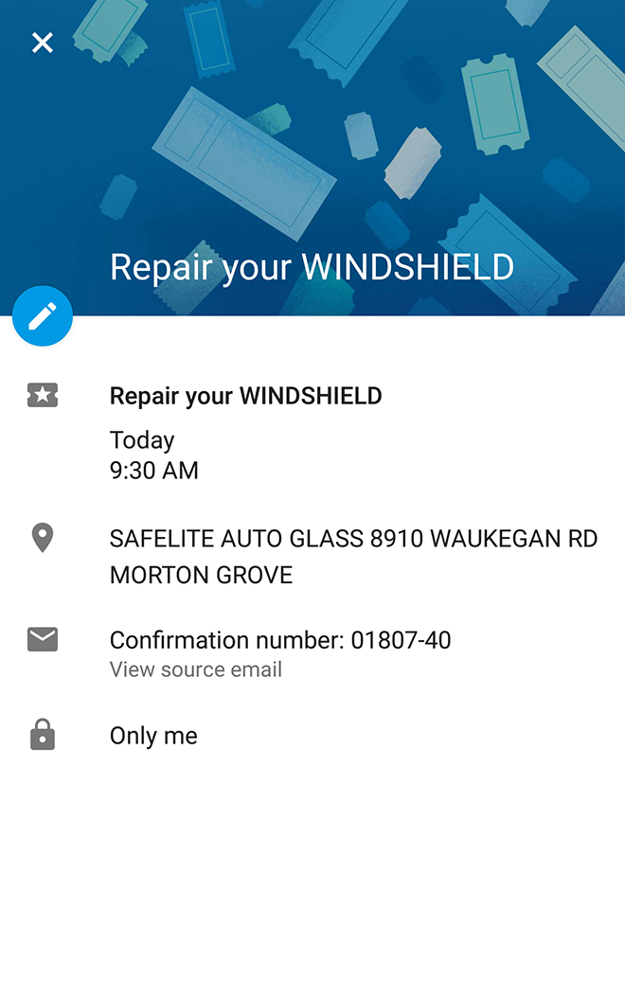
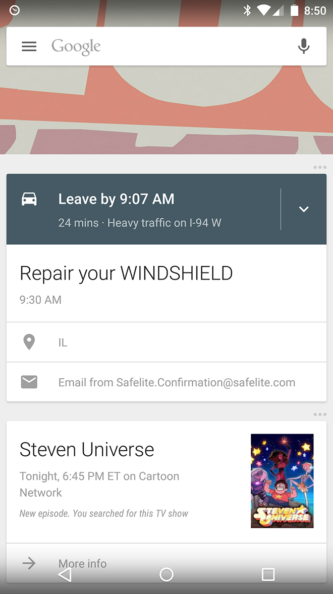

At 8:15 AM I called [Safelite Auto Glass](http://www.safelite.com/) for a quote to fix a chip in my car’s windshield. I wasn’t expecting to get the work done today, but the customer service rep gave me a great deal. We scheduled the appointment for 9:30 AM. Then he asked if he could send me an email confirmation.

Normally I don’t give out my email address because I don’t want to get on another mailing list. However, in my past experience there’s been miscommunication between the corporate call center and the place of service. In truth, the $50 Safelite quote was way below the $140 dealer quote I got the day before. An email confirmation of the quote would clear up any issues should they arise. So I obliged.

What I usually do next is put the appointment in my calendar. It’s a habit I tried very hard to make over the years. No matter how soon the appointment is put it in the calendar to remember to do it!

A funny thing happened when I opened my calendar. There was an event there that said **Repair your WINDSHIELD** already. It had the proper time and everything.

Took me a minute to realize what had happened. The email confirmation was sent to my personal email. I use Google’s Gmail.

Turns out Google made a calendar event based on the information in that email. I use Google Calendar too. Gmail + Calendar + Google stuff was able to parse the proper event name, the time, and the location.

Then at 8:50 AM, my phone buzzed. A notification told me to leave by 9:07 AM because there is heavy traffic on the way there. I even got driving directions. By the way, there’s always heavy traffic in Chicago.

By 10:30 AM I left the Safelite shop with a repaired windshield.

I felt like I had a personal assistant this morning. I had a glimpse of artificial intelligence, but not once did I feel like I was in a sci-fi movie.

The coolest thing about my “personal assistant” experience is that it didn’t require sci-fi technology. It was amazing for sure, but I didn’t call out to Siri or ask my non-existent robot butler. It all started with a simple low tech thing: email.

[[anexo ausente]](http://feeds.feedburner.com/~ff/37signals/beMH?a=UXzUjlHPyos:rwUge0wmc6o:yIl2AUoC8zA)
[[anexo ausente]](http://feeds.feedburner.com/~ff/37signals/beMH?a=UXzUjlHPyos:rwUge0wmc6o:7Q72WNTAKBA)

[anexo ausente]
