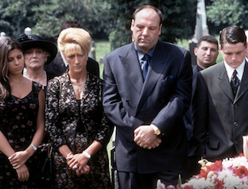
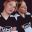

# Writers Guild Names 101 Best-Written Shows Ever: What Made the List? What Got Snubbed?

By [Michael Ausiello](http://tvline.com/author/michael-ausiello/ "Posts by Michael Ausiello") / 
June 3 2013, 6:10 AM PST

- [*651*](http://tvline.com/2013/06/03/100-best-written-tv-shows-ever-the-sopranos/#tvline-comments-437254)
 

The Writers Guild of America unveiled its picks for the 101 best-written TV series of all time over the weekend, and [***The Sopranos***](http://tvline.com/tag/the-sopranos/) whacked the competition.

HBO’s seminal mob drama snagged the top spot on the highly subjective and sure-to-be-picked-apart list (*Sex and the City* ahead of *Game of Thrones*? *Dexter* ahead of *The Shield*? Bupkis for *The Tonight Show with Johnny Carson*?)

**PHOTOS** | [30 Actors on Cancelled TV Series We Want Back on TV *Now*](http://tvline.com/2013/05/30/cancelled-shows-actors-matthew-perry-go-on/)

Review the selections below and then hit the comments with your snappy judgements.

1. *The Sopranos*  
2. *Seinfeld*  
3. *The Twilight Zone*  
4. *All in the Family*  
5. *M\*A\*S\*H*  
6. *The Mary Tyler Moore Show*  
7. *Mad Men*  
8. *Cheers*  
9. *The Wire*  
10. *The West Wing*  
11. *The Simpsons*  
12. *I Love Lucy*  
13. *Breaking Bad*  
14. *The Dick Van Dyke Show*  
15. *Hill Street Blues*  
16. *Arrested Development*  
17. *The Daily Show with Jon Stewart*  
18. *Six Feet Under*  
19. *Taxi*  
20. *The Larry Sanders Show*  
21. *30 Rock*  
22. *Friday Night Lights*  
23. *Frasier*  
24. *Friends*  
25. *Saturday Night Live*  
26. *The X-Files*  
27. *Lost*  
28. *ER*  
29. *The Cosby Show*  
30. *Curb Your Enthusiasm*  
31. *The Honeymooners*  
32. *Deadwood*  
33. *Star Trek*  
34. *Modern Family*  
35. *Twin Peaks*  
36. *NYPD Blue*  
37. *The Carol Burnett Show*  
38. *Battlestar Galactica* (2005)  
39. *Sex & The City*  
40. *Game of Thrones*  
41. *The Bob Newhart Show* and *Your Show of Shows* (tie)  
43. *Downton Abbey, Law & Order* and *Thirtysomething* (tie)  
46. *Homicide: Life on the Street* and *St. Elsewhere* (tie)  
48. *Homeland*  
49. *Buffy the Vampire Slayer*  
50. *The Colbert Report*, *The Good Wife* and the UK *Office* (tie)  
53. *Northern Exposure*  
54. *The Wonder Years*  
55. *L.A. Law*  
56. *Sesame Street*  
57. *Columbo*  
58. *Fawlty Towers* and *The Rockford Files* (tie)  
60. *Freaks and Geeks* and *Moonlighting* (tie)  
62. *Roots*  
63. *Everybody Loves Raymond* and *South Park* (tie)  
65. *Playhouse 90*  
66. *Dexter* and the US *Office* (tie)  
68. *My So-Called Life*  
69. *Golden Girls*  
70. *The Andy Griffith Show*  
71. 2*4, Roseanne* and *The Shield*  
74. *House* and *Murphy Brown* (tie)  
76. *Barney Miller* and *I, Claudius* (tie)  
78. *The Odd Couple*  
79. *Alfred Hitchcock Presents, Monty Python’s Flying Circus, Star Trek: The Next Generation* and *Upstairs, Downstairs* (tie)  
83. *Get Smart*  
84. *The Defenders* and *Gunsmoke* (tie)  
86. *Justified,* *Sgt. Bilko*/*The Phil Silvers Show* (tie)  
88. *Band of Brothers*  
89. *Rowan & Martin’s Laugh-In*  
90. *The Prisoner*  
91. *Absolutely Fabulous* and *The Muppet Show* (tie)  
93. *Boardwalk Empire*  
94. *Will & Grace*  
95. *Family Ties*  
96. *Lonesome Dove* and *Soap*  
98. *The Fugitive*, *Late Night with David Letterman* and *Louie*  
101. *Oz*

[Add a Comment](http://tvline.com/2013/06/03/100-best-written-tv-shows-ever-the-sopranos/#commentform-437254)

TAGS: [Homeland](http://tvline.com/tag/homeland/), [Mad Men](http://tvline.com/tag/mad-men/), [Seinfeld](http://tvline.com/tag/seinfeld/), [The Sopranos](http://tvline.com/tag/the-sopranos/)

GET MORE: [Lists](http://tvline.com/category/lists/)

-  
  [**](https://twitter.com/@michaelausiello)
  - Follow Michael Ausiello
  - Founder & Editor-In-Chief
  - [Archive](http://tvline.com/author/michael-ausiello/ "Michael Ausiello")

[by Taboola](http://www.taboola.com/en/popup?template=colorbox&taboola_utm_source=pmc-tvline&taboola_utm_medium=bytaboola&taboola_utm_content=hybrid-thumbs-1r-up:Below%20Article%20Thumbnails%20Top:)

[Promoted Links](http://www.taboola.com/en/popup?template=colorbox&taboola_utm_source=pmc-tvline&taboola_utm_medium=bytaboola&taboola_utm_content=hybrid-thumbs-1r-up:Below%20Article%20Thumbnails%20Top:)

You May Like

[Katey Sagal Joins Kurt Sutter's New FX Drama The Bastard Executioner](http://tvline.com/2014/11/17/the-bastard-executioner-fx-cast-katey-sagal/ "Katey Sagal Joins Kurt Sutter's New FX Drama The Bastard Executioner")

[The Best, Worst, and Most Overdone at the VMAsThe Cut](http://nymag.com/thecut/2014/08/best-worst-and-most-overdone-at-the-vmas.html?mid=toolab_cut_slideshow "The Best, Worst, and Most Overdone at the VMAs")

[The Blacklist Fall Finale Recap: Berlin's Walls Come Down](http://tvline.com/2014/11/10/the-blacklist-red-kills-berlin-dies-season-2-fall-finale-recap/ "The Blacklist Fall Finale Recap: Berlin's Walls Come Down")

[This Woman Is the Most Stylish Athlete Right NowThe Cut](http://nymag.com/thecut/2014/08/this-woman-is-the-most-stylish-athlete-right-now.html?mid=toolab_cut_slideshow "This Woman Is the Most Stylish Athlete Right Now")

[Stana Katic Ponders Her Castle Future: 'For Me It's About Art Over Finance'](http://tvline.com/2014/11/17/stana-katic-castle-season-8-staying-leaving-new-contract/ "Stana Katic Ponders Her Castle Future: 'For Me It's About Art Over Finance'")

[What Will Replace the BlackBerry?Ricoh Work Intelligent.ly](http://www.workintelligent.ly/technology/mobile/who-will-fill-the-blackberry-void/?utm_campaign=ContentSyndication&utm_medium=NativeAd&utm_source=Taboola&utm_content=Ritika+Puri&utm_term=the+blackberry+void&utm_content=pmc-tvline "What Will Replace the BlackBerry?")

 

### 

Comments are monitored, so don’t go off topic, don’t frakkin’ curse and don’t bore us with how much your coworker’s sister-in-law makes per hour. Talk smart about TV!

651 Comments

1. [anexo ausente] [Esaul](http://http//awallflowersperspective.wordpress.com) says:

   [June 3, 2013 at 6:14 AM](http://tvline.com/2013/06/03/100-best-written-tv-shows-ever-the-sopranos/#comment-list-wrapper)

   L&O and Downton at 43, sweet. :D Don’t think I’ll ever watch anything in the top ten. Can’t stand Seinfield. Maybe I’ll watch Mad Men or The West Wing at most.

   [Reply](http://tvline.com/2013/06/03/100-best-written-tv-shows-ever-the-sopranos/?replytocom=1094056#respond)

   - [anexo ausente] lyn says:

     [June 3, 2013 at 7:07 AM](http://tvline.com/2013/06/03/100-best-written-tv-shows-ever-the-sopranos/#comment-list-wrapper)

     If you don’t watch M\*A\*S\*H you will miss out on something very special. IMO

     [Reply](http://tvline.com/2013/06/03/100-best-written-tv-shows-ever-the-sopranos/?replytocom=1094181#respond)

     - [anexo ausente] [Esaul](http://http//awallflowersperspective.wordpress.com) says:

       [June 3, 2013 at 7:14 AM](http://tvline.com/2013/06/03/100-best-written-tv-shows-ever-the-sopranos/#comment-list-wrapper)

       Good point. :P My grandparents used to watch it. I wonder if they have the DVDs. xD

       [Reply](http://tvline.com/2013/06/03/100-best-written-tv-shows-ever-the-sopranos/?replytocom=1094198#respond)

       - [anexo ausente] lyn says:

         [June 3, 2013 at 7:38 AM](http://tvline.com/2013/06/03/100-best-written-tv-shows-ever-the-sopranos/#comment-list-wrapper)

         If you get TV Land on your provider they run it quite a bit. Otherwise you can get it on DVD from your public library and keep it for a week at a time.

         [Reply](http://tvline.com/2013/06/03/100-best-written-tv-shows-ever-the-sopranos/?replytocom=1094236#respond)

         - [anexo ausente] meme says:

           [June 3, 2013 at 8:22 AM](http://tvline.com/2013/06/03/100-best-written-tv-shows-ever-the-sopranos/#comment-list-wrapper)

           Hallmark Channel and RetroTV also both run MASH.
         - [anexo ausente] A says:

           [June 3, 2013 at 9:40 AM](http://tvline.com/2013/06/03/100-best-written-tv-shows-ever-the-sopranos/#comment-list-wrapper)

           1.the sopranos  
           2.the wire  
           3.i love lucy  
           4.arrested development  
           5.breaking bad
         - [anexo ausente] JB says:

           [June 3, 2013 at 7:18 PM](http://tvline.com/2013/06/03/100-best-written-tv-shows-ever-the-sopranos/#comment-list-wrapper)

           The ME TV network shows them as well.  
           IMHO, I don’t think it has aged well. .
       -  [Dayanara Ryelle](http://www.facebook.com/JamiesFanGirl) says:

         [June 3, 2013 at 11:03 AM](http://tvline.com/2013/06/03/100-best-written-tv-shows-ever-the-sopranos/#comment-list-wrapper)

         MeTV has it 7-8 Sunday-Friday nights. I love watching M\*A\*S\*H and folding my laundry. :D

         [Reply](http://tvline.com/2013/06/03/100-best-written-tv-shows-ever-the-sopranos/?replytocom=1094735#respond)
     - [anexo ausente] Kvivik says:

       [June 3, 2013 at 8:41 AM](http://tvline.com/2013/06/03/100-best-written-tv-shows-ever-the-sopranos/#comment-list-wrapper)

       M\*A\*S\*H should totally be 1 or 2, not 5. Other than that I totally agree with the top 10.

       [Reply](http://tvline.com/2013/06/03/100-best-written-tv-shows-ever-the-sopranos/?replytocom=1094405#respond)
   - [anexo ausente] jenna says:

     [June 3, 2013 at 8:16 AM](http://tvline.com/2013/06/03/100-best-written-tv-shows-ever-the-sopranos/#comment-list-wrapper)

     recently started watching the west wing and am loving it! You can tell a shift in the writing once aaron sorkin left the show but now i’m invested enough that I want to see it through

     [Reply](http://tvline.com/2013/06/03/100-best-written-tv-shows-ever-the-sopranos/?replytocom=1094332#respond)

     - [anexo ausente] Gailkate says:

       [September 16, 2013 at 3:11 PM](http://tvline.com/2013/06/03/100-best-written-tv-shows-ever-the-sopranos/#comment-list-wrapper)

       Where do you find it? I’ve always been sorry I didn’t get in on that early; then it seemed too late to catch up.

       [Reply](http://tvline.com/2013/06/03/100-best-written-tv-shows-ever-the-sopranos/?replytocom=1232271#respond)
   - [anexo ausente] kitkat says:

     [June 3, 2013 at 2:55 PM](http://tvline.com/2013/06/03/100-best-written-tv-shows-ever-the-sopranos/#comment-list-wrapper)

     Twilight Zone should be #1  
     The Wire should be top 5  
     Lost is ranked too low  
     Boardwalk Empire is too low.  
     Deadwood, and G.O.T.are ranked low.  
     Arrested Development is too high.  
     Rome should have made the list.

     [Reply](http://tvline.com/2013/06/03/100-best-written-tv-shows-ever-the-sopranos/?replytocom=1095472#respond)

     - [anexo ausente] Lee says:

       [June 3, 2013 at 3:29 PM](http://tvline.com/2013/06/03/100-best-written-tv-shows-ever-the-sopranos/#comment-list-wrapper)

       I agree–Lost is ranked too low. IMO it should at least be in the Top Ten.

       [Reply](http://tvline.com/2013/06/03/100-best-written-tv-shows-ever-the-sopranos/?replytocom=1095515#respond)
     - [anexo ausente] Jan says:

       [June 4, 2013 at 10:09 AM](http://tvline.com/2013/06/03/100-best-written-tv-shows-ever-the-sopranos/#comment-list-wrapper)

       I also agree –Lost should be in the top ten and what criteria was used to decide this list–HOW did All in the family and Seinfeld make the top 5??? Homeland, Twin Peaks, Dexter and Six Feet Under are also all ranked too low.

       [Reply](http://tvline.com/2013/06/03/100-best-written-tv-shows-ever-the-sopranos/?replytocom=1097865#respond)

       - [anexo ausente] Jalos says:

         [July 1, 2013 at 1:03 AM](http://tvline.com/2013/06/03/100-best-written-tv-shows-ever-the-sopranos/#comment-list-wrapper)

         Seinfeld is one of the most respected shows of all time — the original friends in a cafe show- it explores the essence of comedy, laziness. It is a show about nothing and a hell of a good one! 30 rock is my personal fav comedy though- im a sucker for Tina fey

         [Reply](http://tvline.com/2013/06/03/100-best-written-tv-shows-ever-the-sopranos/?replytocom=1133230#respond)

         - [anexo ausente] Jakez says:

           [August 12, 2013 at 7:11 PM](http://tvline.com/2013/06/03/100-best-written-tv-shows-ever-the-sopranos/#comment-list-wrapper)

           You couldn’t have said it any better, about Seinfeld !!!
     - [anexo ausente] Joao says:

       [June 5, 2013 at 1:41 AM](http://tvline.com/2013/06/03/100-best-written-tv-shows-ever-the-sopranos/#comment-list-wrapper)

       I agree. Also, I don’t get what is Sex And The City doing there.

       [Reply](http://tvline.com/2013/06/03/100-best-written-tv-shows-ever-the-sopranos/?replytocom=1099442#respond)
     - [anexo ausente] Chris Padwick says:

       [June 6, 2013 at 5:07 AM](http://tvline.com/2013/06/03/100-best-written-tv-shows-ever-the-sopranos/#comment-list-wrapper)

       Hi A token Brit here: Dr Who (since 2005) should definitely be included. We have a load of sitcoms that I suspect some TV execs would die of apoplexy just at the idea of them being broadcast int the US – check ‘em out if you can find them, they’re hilarious, weird, outrageous and usually quite sick – The League of Gentlemen; Gimme, Gimme, Gimme; Father Ted; I’m Alan Partridge. While you’re at it check out QI with Stephen Fry – it’s a sort of quiz show with comedians: an ingenious masterpiece.

       [Reply](http://tvline.com/2013/06/03/100-best-written-tv-shows-ever-the-sopranos/?replytocom=1101286#respond)

       - [anexo ausente] rasp says:

         [August 8, 2013 at 3:49 AM](http://tvline.com/2013/06/03/100-best-written-tv-shows-ever-the-sopranos/#comment-list-wrapper)

         True. Many uk shows are better written and acted than some of these.

         [Reply](http://tvline.com/2013/06/03/100-best-written-tv-shows-ever-the-sopranos/?replytocom=1178552#respond)
       - [anexo ausente] Jim H says:

         [September 10, 2013 at 7:15 PM](http://tvline.com/2013/06/03/100-best-written-tv-shows-ever-the-sopranos/#comment-list-wrapper)

         I agree about Dr. Who… but I wouldn’t limit it to the recent series. While the earliest episodes were quite campy, during Tom Baker’s reign the writing improved noticeably.

         [Reply](http://tvline.com/2013/06/03/100-best-written-tv-shows-ever-the-sopranos/?replytocom=1220199#respond)
     - [anexo ausente] Sameer Anand says:

       [July 23, 2013 at 10:30 AM](http://tvline.com/2013/06/03/100-best-written-tv-shows-ever-the-sopranos/#comment-list-wrapper)

       Lost is one of my mistakes of my life that i began to realize at the beginning of the 4th season and the worst part – it carries on till the end.

       [Reply](http://tvline.com/2013/06/03/100-best-written-tv-shows-ever-the-sopranos/?replytocom=1160218#respond)
     - [anexo ausente] Marina says:

       [August 12, 2013 at 12:42 PM](http://tvline.com/2013/06/03/100-best-written-tv-shows-ever-the-sopranos/#comment-list-wrapper)

       Rome DEFINATELY should be in there!! And Northern Exposure at number 53 behind Buffy the Vampire Slayer is an insult to a funny, touching show!

       [Reply](http://tvline.com/2013/06/03/100-best-written-tv-shows-ever-the-sopranos/?replytocom=1183988#respond)

       - [anexo ausente] shinki says:

         [August 25, 2013 at 9:42 AM](http://tvline.com/2013/06/03/100-best-written-tv-shows-ever-the-sopranos/#comment-list-wrapper)

         You’re an idiot.

         [Reply](http://tvline.com/2013/06/03/100-best-written-tv-shows-ever-the-sopranos/?replytocom=1199760#respond)
     - [anexo ausente] [Mok](http://nunya/) says:

       [September 18, 2013 at 3:37 PM](http://tvline.com/2013/06/03/100-best-written-tv-shows-ever-the-sopranos/#comment-list-wrapper)

       Rome only lasted 2 seasons then was cancelled.

       [Reply](http://tvline.com/2013/06/03/100-best-written-tv-shows-ever-the-sopranos/?replytocom=1237959#respond)

       -  [David Bofinger](https://plus.google.com/100676990293480160371) says:

         [November 24, 2013 at 4:06 AM](http://tvline.com/2013/06/03/100-best-written-tv-shows-ever-the-sopranos/#comment-list-wrapper)

         Which was weird. The show was actually popular but got cancelled before that was obvious and once the actors had been released, sets given up, etc., there was no going back. So they jammed a season and a half of plot into the second half of Season Two, bit like Serenity did for Firefly.

         [Reply](http://tvline.com/2013/06/03/100-best-written-tv-shows-ever-the-sopranos/?replytocom=1378522#respond)
     - [anexo ausente] MRC says:

       [March 5, 2014 at 1:49 AM](http://tvline.com/2013/06/03/100-best-written-tv-shows-ever-the-sopranos/#comment-list-wrapper)

       Lost was a drawn out pile of disappointment.

       [Reply](http://tvline.com/2013/06/03/100-best-written-tv-shows-ever-the-sopranos/?replytocom=1855980#respond)
   - [anexo ausente] J says:

     [July 14, 2013 at 9:03 AM](http://tvline.com/2013/06/03/100-best-written-tv-shows-ever-the-sopranos/#comment-list-wrapper)

     If u don’t like Seinfeld u don’t have good taste in tv

     [Reply](http://tvline.com/2013/06/03/100-best-written-tv-shows-ever-the-sopranos/?replytocom=1147802#respond)

     - [anexo ausente] [Esaul](http://http//awallflowersperspective.wordpress.com) says:

       [July 14, 2013 at 9:32 AM](http://tvline.com/2013/06/03/100-best-written-tv-shows-ever-the-sopranos/#comment-list-wrapper)

       To each their own. I think I have excellent taste in television, since I do watch enough of it. However, that’s fine if you don’t agree with my opinion. I cannot stand Jerry Seinfeld.

       [Reply](http://tvline.com/2013/06/03/100-best-written-tv-shows-ever-the-sopranos/?replytocom=1147823#respond)
     - [anexo ausente] Thomas says:

       [September 10, 2013 at 10:54 AM](http://tvline.com/2013/06/03/100-best-written-tv-shows-ever-the-sopranos/#comment-list-wrapper)

       Your an idiot “No TV for you , 1 year”

       [Reply](http://tvline.com/2013/06/03/100-best-written-tv-shows-ever-the-sopranos/?replytocom=1219223#respond)
     - [anexo ausente] Thomas says:

       [September 10, 2013 at 10:55 AM](http://tvline.com/2013/06/03/100-best-written-tv-shows-ever-the-sopranos/#comment-list-wrapper)

       Your bright

       [Reply](http://tvline.com/2013/06/03/100-best-written-tv-shows-ever-the-sopranos/?replytocom=1219229#respond)

       - [anexo ausente] Boozler says:

         [December 5, 2013 at 8:24 AM](http://tvline.com/2013/06/03/100-best-written-tv-shows-ever-the-sopranos/#comment-list-wrapper)

         you’re\*…. that was ironic

         [Reply](http://tvline.com/2013/06/03/100-best-written-tv-shows-ever-the-sopranos/?replytocom=1408068#respond)
   - [anexo ausente] Anton says:

     [July 30, 2013 at 10:43 PM](http://tvline.com/2013/06/03/100-best-written-tv-shows-ever-the-sopranos/#comment-list-wrapper)

     List messed up.  
     Writers ????  
     Sopranos, in a writing jam, return to the bar and show some T&A.  
     Think of Sopranos, did it shed any light on anything.  
     Think about daughter’s arc: any insight?

     The Wire was insanely good. I taught in urban setting. You want to learn how it felt, watch The Wire.

     [Reply](http://tvline.com/2013/06/03/100-best-written-tv-shows-ever-the-sopranos/?replytocom=1167569#respond)

     - [anexo ausente] rasp says:

       [August 8, 2013 at 3:51 AM](http://tvline.com/2013/06/03/100-best-written-tv-shows-ever-the-sopranos/#comment-list-wrapper)

       The wire is incredible. While sopranos is very good, the wire is a good head above the rest.

       [Reply](http://tvline.com/2013/06/03/100-best-written-tv-shows-ever-the-sopranos/?replytocom=1178555#respond)
   - [anexo ausente] Holdeen Cushing says:

     [September 23, 2013 at 8:29 PM](http://tvline.com/2013/06/03/100-best-written-tv-shows-ever-the-sopranos/#comment-list-wrapper)

     List is Ok, actually good until they get to #7, Mad men come on’ they only been on for a few seasons and they considered better than shows that broke boundaries in the way television was portrayed, changed how we thought about life in America and against shows that had staying power and captivated decades of Americans. Do these writers actually watch TV? At best Mad Man being a bunch of self serving wankers will dissipate and be forgotten.

     [Reply](http://tvline.com/2013/06/03/100-best-written-tv-shows-ever-the-sopranos/?replytocom=1250322#respond)
   - [anexo ausente] [dwqbfehj dsgery](http://qewjfnhwrge/) says:

     [December 2, 2013 at 8:23 AM](http://tvline.com/2013/06/03/100-best-written-tv-shows-ever-the-sopranos/#comment-list-wrapper)

     debhacvshfbsjebfseguvfjwehgfsebvfgwehgfwehjbfweui

     [Reply](http://tvline.com/2013/06/03/100-best-written-tv-shows-ever-the-sopranos/?replytocom=1399611#respond)
   - [anexo ausente] [dwqbfehj dsgery](http://qewjfnhwrge/) says:

     [December 2, 2013 at 8:24 AM](http://tvline.com/2013/06/03/100-best-written-tv-shows-ever-the-sopranos/#comment-list-wrapper)

     erkjjjjjasukhawefubhfeghsbfsdhfs

     [Reply](http://tvline.com/2013/06/03/100-best-written-tv-shows-ever-the-sopranos/?replytocom=1399613#respond)
   - [anexo ausente] [dwqbfehj dsgery](http://qewjfnhwrge/) says:

     [December 2, 2013 at 8:25 AM](http://tvline.com/2013/06/03/100-best-written-tv-shows-ever-the-sopranos/#comment-list-wrapper)

     trimbletech

     [Reply](http://tvline.com/2013/06/03/100-best-written-tv-shows-ever-the-sopranos/?replytocom=1399614#respond)
   - [anexo ausente] Jordan Papp says:

     [February 22, 2014 at 1:55 PM](http://tvline.com/2013/06/03/100-best-written-tv-shows-ever-the-sopranos/#comment-list-wrapper)

     You don’t think you’ll watch the twilight zone!? You are retarded. Twilight zone whether you like it or not (which you prly never watched it cuz you sound like a new age kind of person) has impacted our society like none other. It talked about topics we still deal with today in society. It set the path for tv shows and is still referenced today all over the media in plays, shows, skits, news, etc. Get your mind right!

     [Reply](http://tvline.com/2013/06/03/100-best-written-tv-shows-ever-the-sopranos/?replytocom=1767866#respond)

     - [anexo ausente] [Esaul](http://http//awallflowersperspective.wordpress.com) says:

       [February 22, 2014 at 7:30 PM](http://tvline.com/2013/06/03/100-best-written-tv-shows-ever-the-sopranos/#comment-list-wrapper)

       Yes I’m part of the “new age”, but that’s a bit far to classify myself as retarded. I watch a lot of television. I can’t keep up with everything I want to watch. On top of that other shows I want to watch sit on the back burning almost indefinitely. There’s plenty of shows that I haven’t watched and don’t plan on either that people absolutely love and I don’t see the appeal, i.e. Seinfeld or Friends.

       [Reply](http://tvline.com/2013/06/03/100-best-written-tv-shows-ever-the-sopranos/?replytocom=1769497#respond)
2. [anexo ausente] eyahn says:

   [June 3, 2013 at 6:16 AM](http://tvline.com/2013/06/03/100-best-written-tv-shows-ever-the-sopranos/#comment-list-wrapper)

   yeah right… :D why not take breaking bad out of the list all togeter? :D

   [Reply](http://tvline.com/2013/06/03/100-best-written-tv-shows-ever-the-sopranos/?replytocom=1094058#respond)
3. [anexo ausente] [disorientednomad](http://strangebride.wordpress.com/) says:

   [June 3, 2013 at 6:18 AM](http://tvline.com/2013/06/03/100-best-written-tv-shows-ever-the-sopranos/#comment-list-wrapper)

   Firefly? Where is FF? And HOW does L&O get into this at all?

   [Reply](http://tvline.com/2013/06/03/100-best-written-tv-shows-ever-the-sopranos/?replytocom=1094062#respond)

   - [anexo ausente] [Esaul](http://http//awallflowersperspective.wordpress.com) says:

     [June 3, 2013 at 6:26 AM](http://tvline.com/2013/06/03/100-best-written-tv-shows-ever-the-sopranos/#comment-list-wrapper)

     Because L&O is a staple franchise that endured several cast changes and spawned spinoffs that were successful in their own right. I doubt we will see a drama last twenty years again with the current shows we have. Maybe NCIS, but who knows. And as a result CSI and JAG created spinoffs as well, not necessarily directly because of L&O but it doesn’t hurt. The mothership always stayed true to its premise. Stories over character development. Today it’s typically about the shippers, i.e Castle, Bones. And asking how L&O got on the list is asking how West Wing or The Sopranos got on. WGA feels the writing of the show merits a place. I hate Seinfield but clearly the writing of the show means others feel that it’s good.

     [Reply](http://tvline.com/2013/06/03/100-best-written-tv-shows-ever-the-sopranos/?replytocom=1094088#respond)

     - [anexo ausente] Miranda says:

       [June 4, 2013 at 12:53 AM](http://tvline.com/2013/06/03/100-best-written-tv-shows-ever-the-sopranos/#comment-list-wrapper)

       How is stories over character development a good thing? You’d think better writing would be both. That’s the reason I stopped watching all the CSI’s and L&O’s. Buffy had good story development and character development, and it wasn’t all about the shippers. And yet, L&O beat it? Having enough viewers to last twenty years is not the same thing as good writing. I’d call the show’s writing repetitive.

       [Reply](http://tvline.com/2013/06/03/100-best-written-tv-shows-ever-the-sopranos/?replytocom=1096583#respond)

       - [anexo ausente] [Esaul](http://http//awallflowersperspective.wordpress.com) says:

         [June 4, 2013 at 4:25 AM](http://tvline.com/2013/06/03/100-best-written-tv-shows-ever-the-sopranos/#comment-list-wrapper)

         You can only do so much with character development after so much time. Example: Look at Bones. I find the show rather bland now after Booth and Bones got together. There’s just no life in it. Plus, you get fans who are emotionally attached to characters. You get a lot of times where they quit if something happens to them. It happened with SVU when Christopher Meloni left. A lot of people quit. The mothership lasted because of the show’s writing and the ability to use the concept of a revolving door of lead actors. And it’s only your opinion that the writing got repetitive. To me, and to the WGA, I also never stated that all shows were about the shippers. But yes, CSI did have its fair share of shipping going on with Grissom and Sara. Even William Petersen didn’t want the two to end up together like that. He wasn’t even made aware what was going on with his character after he left. Of course, it depends on the show to justify story > character. With L&O, it wouldn’t have last twenty years if it was always about the characters with the amount that was introduced. I prefer learning something new about them from time to time. NCIS has a perfect blend of story and character that makes me happy. There are the Tiva shippers that sometimes the show teases/promotes, but it’s not all about that. .

         [Reply](http://tvline.com/2013/06/03/100-best-written-tv-shows-ever-the-sopranos/?replytocom=1097237#respond)
       -  mawhi says:

         [June 4, 2013 at 5:43 AM](http://tvline.com/2013/06/03/100-best-written-tv-shows-ever-the-sopranos/#comment-list-wrapper)

         But by establishing that formula, they’ve perfected something that shows have been trying to imitate for years, and that merits recognition.

         [Reply](http://tvline.com/2013/06/03/100-best-written-tv-shows-ever-the-sopranos/?replytocom=1097303#respond)
   - [anexo ausente] Rowan77 says:

     [June 3, 2013 at 10:20 AM](http://tvline.com/2013/06/03/100-best-written-tv-shows-ever-the-sopranos/#comment-list-wrapper)

     The original L&O was genius. Well written tight stories where all the far was trimmed out. I was two shows in one and without all the car chases, personal stories (for the regulars) and transitional scenes so what would have been an hour long show about cops became a taut 1/2 hour show. Same with the legal side. It totally deserves to be up there.

     [Reply](http://tvline.com/2013/06/03/100-best-written-tv-shows-ever-the-sopranos/?replytocom=1094647#respond)

     - [anexo ausente] [Esaul](http://http//awallflowersperspective.wordpress.com) says:

       [June 4, 2013 at 4:28 AM](http://tvline.com/2013/06/03/100-best-written-tv-shows-ever-the-sopranos/#comment-list-wrapper)

       I’m always able to be drawn into an original L&O from any interval of the show. It doesn’t matter if it’s five minutes in, or five minutes left. This is especially the case with Sam Waterston. He could be making his closing argument before the verdict, and I won’t even know what the case is about, but it’s enough to make me hooked. That’s only happened one other time where I don’t need to watch the full episode to be drawn in (Criminal Minds with Hotch fighting the Reaper). Generally I hate watching a show if I miss any time at all. :P

       [Reply](http://tvline.com/2013/06/03/100-best-written-tv-shows-ever-the-sopranos/?replytocom=1097239#respond)
     - [anexo ausente] Pat D. says:

       [June 4, 2013 at 7:32 PM](http://tvline.com/2013/06/03/100-best-written-tv-shows-ever-the-sopranos/#comment-list-wrapper)

       The sad thing was that L&O had recently started being consistently very good again, and then they cancelled it. I consider its golden years to be the ones with Ben Bratt and Lenny Briscoe. My favorite detective team.

       [Reply](http://tvline.com/2013/06/03/100-best-written-tv-shows-ever-the-sopranos/?replytocom=1098903#respond)
   - [anexo ausente] Jan says:

     [June 4, 2013 at 10:25 AM](http://tvline.com/2013/06/03/100-best-written-tv-shows-ever-the-sopranos/#comment-list-wrapper)

     Firefly and Lost should be in the top ten–Firefly should never have been canceled so early–one of the most amazing shows ever–go Browncoats!!

     [Reply](http://tvline.com/2013/06/03/100-best-written-tv-shows-ever-the-sopranos/?replytocom=1097896#respond)

     - [anexo ausente] Pete says:

       [June 16, 2013 at 5:17 AM](http://tvline.com/2013/06/03/100-best-written-tv-shows-ever-the-sopranos/#comment-list-wrapper)

       The 2 most well written shows of all time and did not last: Firefly and Life.

       [Reply](http://tvline.com/2013/06/03/100-best-written-tv-shows-ever-the-sopranos/?replytocom=1115285#respond)

       - [anexo ausente] Robert says:

         [July 11, 2013 at 3:02 PM](http://tvline.com/2013/06/03/100-best-written-tv-shows-ever-the-sopranos/#comment-list-wrapper)

         Honestly, Firely was not that well written but I do understand that it does have a cult following.

         [Reply](http://tvline.com/2013/06/03/100-best-written-tv-shows-ever-the-sopranos/?replytocom=1145080#respond)
     - [anexo ausente] Holdeen Cushing says:

       [September 23, 2013 at 8:39 PM](http://tvline.com/2013/06/03/100-best-written-tv-shows-ever-the-sopranos/#comment-list-wrapper)

       Deluded about those two shows. They can’t hold a light to the top 20 except for Mad Men.

       [Reply](http://tvline.com/2013/06/03/100-best-written-tv-shows-ever-the-sopranos/?replytocom=1250349#respond)
   - [anexo ausente] rasp says:

     [August 8, 2013 at 3:52 AM](http://tvline.com/2013/06/03/100-best-written-tv-shows-ever-the-sopranos/#comment-list-wrapper)

     Totally agree. Firefly should be high on this list too!

     [Reply](http://tvline.com/2013/06/03/100-best-written-tv-shows-ever-the-sopranos/?replytocom=1178556#respond)
   -  [Chip Reynolds](https://www.facebook.com/chip.reynolds.77) says:

     [August 23, 2013 at 4:36 PM](http://tvline.com/2013/06/03/100-best-written-tv-shows-ever-the-sopranos/#comment-list-wrapper)

     Firefly for sure! Rome! List is a bit broken.

     [Reply](http://tvline.com/2013/06/03/100-best-written-tv-shows-ever-the-sopranos/?replytocom=1198385#respond)
4. [anexo ausente] Susan says:

   [June 3, 2013 at 6:19 AM](http://tvline.com/2013/06/03/100-best-written-tv-shows-ever-the-sopranos/#comment-list-wrapper)

   No Gilmore GIrls…really?

   [Reply](http://tvline.com/2013/06/03/100-best-written-tv-shows-ever-the-sopranos/?replytocom=1094066#respond)

   - [anexo ausente] jalahyacinth says:

     [June 3, 2013 at 6:41 AM](http://tvline.com/2013/06/03/100-best-written-tv-shows-ever-the-sopranos/#comment-list-wrapper)

     Exactly what I was going to say. Some of the best writing on television, by far. \*sigh\*

     [Reply](http://tvline.com/2013/06/03/100-best-written-tv-shows-ever-the-sopranos/?replytocom=1094123#respond)

     - [anexo ausente] canadian ninja says:

       [June 3, 2013 at 8:55 AM](http://tvline.com/2013/06/03/100-best-written-tv-shows-ever-the-sopranos/#comment-list-wrapper)

       \*cough\* except for the last three years \*cough\*

       [Reply](http://tvline.com/2013/06/03/100-best-written-tv-shows-ever-the-sopranos/?replytocom=1094431#respond)

       -  Ally Oop says:

         [June 3, 2013 at 10:34 AM](http://tvline.com/2013/06/03/100-best-written-tv-shows-ever-the-sopranos/#comment-list-wrapper)

         I happened to really like the last three years. Gilmore girls should have been on this list. The writing was very good all-around.

         [Reply](http://tvline.com/2013/06/03/100-best-written-tv-shows-ever-the-sopranos/?replytocom=1094673#respond)
       - [anexo ausente] LaurenMC says:

         [June 3, 2013 at 12:23 PM](http://tvline.com/2013/06/03/100-best-written-tv-shows-ever-the-sopranos/#comment-list-wrapper)

         It was really just the last season that was crappy.

         [Reply](http://tvline.com/2013/06/03/100-best-written-tv-shows-ever-the-sopranos/?replytocom=1095080#respond)

         -  Ally Oop says:

           [June 3, 2013 at 12:42 PM](http://tvline.com/2013/06/03/100-best-written-tv-shows-ever-the-sopranos/#comment-list-wrapper)

           The problem was that we never really got to see Luke and Lorelei truly together. We just saw them quickly get back together in the final episode. Also, Rory refusing Logan’s engagement, while fitting, left me unsatisfied. I would have liked to see one more season to see how things panned out. For such a long-running show, it didn’t get a true series finale–it was more of a season finale which left too many open-ended questions. A reunion movie taking place five years later would help give viewers more closure.
         -  Ally Oop says:

           [June 3, 2013 at 12:45 PM](http://tvline.com/2013/06/03/100-best-written-tv-shows-ever-the-sopranos/#comment-list-wrapper)

           The last three seasons were well-written. Unfortunately, they just weren’t satisfying because people who watched them didn’t get the big pay-off in the end.
   - [anexo ausente] Josh says:

     [June 3, 2013 at 7:43 AM](http://tvline.com/2013/06/03/100-best-written-tv-shows-ever-the-sopranos/#comment-list-wrapper)

     I didn’t even realize no Gilmore Girls! Boooo! I think Modern Family is too high…I LOVE Modern Family…have seen every episode but come on…

     [Reply](http://tvline.com/2013/06/03/100-best-written-tv-shows-ever-the-sopranos/?replytocom=1094249#respond)

     - [anexo ausente] Jason says:

       [June 3, 2013 at 2:07 PM](http://tvline.com/2013/06/03/100-best-written-tv-shows-ever-the-sopranos/#comment-list-wrapper)

       I agree Modern Family is good because of the cast. The writing is a rip off of the Office(talking to a camera to joke aboutthe events) and a million other sitcoms. The cast elevate it to another level! Manny could possibly be one of the worst written characters in the history of television. Completely unbelievable and one dimensional character. Without Ed O Niel, Julie Bowen, Sarah Hyland and the actor that plays Phil the show would be nearly!

       Buffy The Vampire Slayer is too low! Should be in the top 20! The writing staff was brilliant. So much so that Joss Whedon became a household name and an A list film director.

       [Reply](http://tvline.com/2013/06/03/100-best-written-tv-shows-ever-the-sopranos/?replytocom=1095404#respond)

       - [anexo ausente] Laura E. says:

         [June 3, 2013 at 3:05 PM](http://tvline.com/2013/06/03/100-best-written-tv-shows-ever-the-sopranos/#comment-list-wrapper)

         Agree about Modern Family. Almost every episode is the same–Gloria shouts something in Spanish, Mitchell and Cameron fight, and Phil does something stupid. All wrapped up in a treacly voiceover at the end.

         [Reply](http://tvline.com/2013/06/03/100-best-written-tv-shows-ever-the-sopranos/?replytocom=1095484#respond)
   - [anexo ausente] Ann says:

     [June 3, 2013 at 7:45 AM](http://tvline.com/2013/06/03/100-best-written-tv-shows-ever-the-sopranos/#comment-list-wrapper)

     I think the last 3 years of Gilmore Girls knocked it off the list. It wasn’t great. The best years of Gilmore Girls were the first 4 years…

     [Reply](http://tvline.com/2013/06/03/100-best-written-tv-shows-ever-the-sopranos/?replytocom=1094257#respond)

     - [anexo ausente] scooby says:

       [June 16, 2013 at 10:36 AM](http://tvline.com/2013/06/03/100-best-written-tv-shows-ever-the-sopranos/#comment-list-wrapper)

       What’s with this “last 3″ stuff people are saying? It’s last 2. The last season with Amy where she ran it into the ground with April aka Cousin Oliver, then the final season, that counts 2 to me. Besides, if a couple lackluster seasons are enough to knock a show off the list, season 5 and 6 of West Wing should send it plummeting from the top 20 at the very least. The idea of Dick Van Dyke not being top 10 is ludicrous. The influence it had alone puts it up there. If Johnny Carson isn’t anywhere on the list, it’s null and void anyway. Letterman made it, and you know he worshipped Johnny to the point that HE’D probably say it was ridiculous to be ranked above him.

       [Reply](http://tvline.com/2013/06/03/100-best-written-tv-shows-ever-the-sopranos/?replytocom=1115429#respond)
   - [anexo ausente] Liz says:

     [June 3, 2013 at 8:20 AM](http://tvline.com/2013/06/03/100-best-written-tv-shows-ever-the-sopranos/#comment-list-wrapper)

     It’s nuts! GG was so well written! (except for that last season… Ok, last two seasons).

     [Reply](http://tvline.com/2013/06/03/100-best-written-tv-shows-ever-the-sopranos/?replytocom=1094343#respond)

     - [anexo ausente] Josh says:

       [June 3, 2013 at 10:39 AM](http://tvline.com/2013/06/03/100-best-written-tv-shows-ever-the-sopranos/#comment-list-wrapper)

       So shows with more seasons of good writing should be knocked off the list because for a couple years it was so well written?

       [Reply](http://tvline.com/2013/06/03/100-best-written-tv-shows-ever-the-sopranos/?replytocom=1094683#respond)

       - [anexo ausente] jalahyacinth says:

         [June 3, 2013 at 11:05 AM](http://tvline.com/2013/06/03/100-best-written-tv-shows-ever-the-sopranos/#comment-list-wrapper)

         If by a couple you mean 5… Then yes. There are several that \*may\* have had a few good EPISODES, Gilmore Girls had 5 good SEASONS.

         [Reply](http://tvline.com/2013/06/03/100-best-written-tv-shows-ever-the-sopranos/?replytocom=1094740#respond)

         - [anexo ausente] Miranda says:

           [June 4, 2013 at 1:04 AM](http://tvline.com/2013/06/03/100-best-written-tv-shows-ever-the-sopranos/#comment-list-wrapper)

           Not to mentions how witty some of the dialogue was, and enough pop culture references to warrant a booklet. It certainly should’ve made this list.
     -  [Kaan Şensoy](http://www.facebook.com/kaan.sensoy.96) says:

       [July 11, 2013 at 6:01 AM](http://tvline.com/2013/06/03/100-best-written-tv-shows-ever-the-sopranos/#comment-list-wrapper)

       It’s when Luka’s daughter came in, period.! That bitch ruined everything!!! I loved how Rory and Lorelai broke up in 6 it was very real in my opinion. I didn’t find anything wrong about 5.

       [Reply](http://tvline.com/2013/06/03/100-best-written-tv-shows-ever-the-sopranos/?replytocom=1144292#respond)

       -  [Kaan Şensoy](http://www.facebook.com/kaan.sensoy.96) says:

         [July 11, 2013 at 6:03 AM](http://tvline.com/2013/06/03/100-best-written-tv-shows-ever-the-sopranos/#comment-list-wrapper)

         I’m sorry I meant Luke.

         [Reply](http://tvline.com/2013/06/03/100-best-written-tv-shows-ever-the-sopranos/?replytocom=1144294#respond)
   - [anexo ausente] talismangirl says:

     [June 3, 2013 at 8:25 AM](http://tvline.com/2013/06/03/100-best-written-tv-shows-ever-the-sopranos/#comment-list-wrapper)

     Seriously! I can’t believe they left it off the list. Wow

     [Reply](http://tvline.com/2013/06/03/100-best-written-tv-shows-ever-the-sopranos/?replytocom=1094362#respond)
   - [anexo ausente] Gina says:

     [June 3, 2013 at 9:11 AM](http://tvline.com/2013/06/03/100-best-written-tv-shows-ever-the-sopranos/#comment-list-wrapper)

     I was thinking the same thing. If you’re gonna have a list of best written shows Gilmore Girls should at least have made the list if not the top ten. I watched the Soprano’s and liked it but I can’t see how that’s #1 in terms of writing. And Seinfeld? Was something that you watched between Friends and Frasier. SNL and The Simpsons should have ranked higher. Their longevity alone is a testament to good writing.

     [Reply](http://tvline.com/2013/06/03/100-best-written-tv-shows-ever-the-sopranos/?replytocom=1094455#respond)

     -  [Kaan Şensoy](http://www.facebook.com/kaan.sensoy.96) says:

       [July 11, 2013 at 6:04 AM](http://tvline.com/2013/06/03/100-best-written-tv-shows-ever-the-sopranos/#comment-list-wrapper)

       I didn’t see anything that good in The Sopranos’ writing?! I’m sorry for you! :/

       [Reply](http://tvline.com/2013/06/03/100-best-written-tv-shows-ever-the-sopranos/?replytocom=1144297#respond)
   - [anexo ausente] QueenJ says:

     [June 3, 2013 at 9:37 AM](http://tvline.com/2013/06/03/100-best-written-tv-shows-ever-the-sopranos/#comment-list-wrapper)

     Agreed. No Veronica Mars is a travesty too.

     [Reply](http://tvline.com/2013/06/03/100-best-written-tv-shows-ever-the-sopranos/?replytocom=1094523#respond)

     - [anexo ausente] Cheryl says:

       [June 4, 2013 at 12:32 AM](http://tvline.com/2013/06/03/100-best-written-tv-shows-ever-the-sopranos/#comment-list-wrapper)

       Yes! VM had some of the most amazing lines in TV.

       [Reply](http://tvline.com/2013/06/03/100-best-written-tv-shows-ever-the-sopranos/?replytocom=1096566#respond)
     - [anexo ausente] MusicSpaceTV says:

       [January 30, 2014 at 1:48 PM](http://tvline.com/2013/06/03/100-best-written-tv-shows-ever-the-sopranos/#comment-list-wrapper)

       I’m extremely disappointed that Veronica Mars isnt on this list. It is literally one of the smartest and most underratrd shows ever on TV. It should be in the top 20s if not 10.

       [Reply](http://tvline.com/2013/06/03/100-best-written-tv-shows-ever-the-sopranos/?replytocom=1607368#respond)
   - [anexo ausente] LEH says:

     [June 3, 2013 at 4:32 PM](http://tvline.com/2013/06/03/100-best-written-tv-shows-ever-the-sopranos/#comment-list-wrapper)

     Before I even read the list, I looked for Gilmore Girls! I was surprised and disappointed to see it didn’t get the recognition it truly deserves! ANY and ALL seasons were something special.

     [Reply](http://tvline.com/2013/06/03/100-best-written-tv-shows-ever-the-sopranos/?replytocom=1095598#respond)
   - [anexo ausente] DC says:

     [June 4, 2013 at 9:54 PM](http://tvline.com/2013/06/03/100-best-written-tv-shows-ever-the-sopranos/#comment-list-wrapper)

     I agree

     [Reply](http://tvline.com/2013/06/03/100-best-written-tv-shows-ever-the-sopranos/?replytocom=1099196#respond)
   - [anexo ausente] chriss1519 says:

     [September 8, 2013 at 4:43 PM](http://tvline.com/2013/06/03/100-best-written-tv-shows-ever-the-sopranos/#comment-list-wrapper)

     they have Golden Girls. That’s close enough

     [Reply](http://tvline.com/2013/06/03/100-best-written-tv-shows-ever-the-sopranos/?replytocom=1215715#respond)
   - [anexo ausente] MRC says:

     [March 5, 2014 at 1:54 AM](http://tvline.com/2013/06/03/100-best-written-tv-shows-ever-the-sopranos/#comment-list-wrapper)

     Because it had little impact on anything and the writing honestly isn’t special enough to be in the best of all time, might be sweet and clever, but its not worthy.

     [Reply](http://tvline.com/2013/06/03/100-best-written-tv-shows-ever-the-sopranos/?replytocom=1856050#respond)
5. [anexo ausente] amycorvus says:

   [June 3, 2013 at 6:20 AM](http://tvline.com/2013/06/03/100-best-written-tv-shows-ever-the-sopranos/#comment-list-wrapper)

   Deadwood at #32? List invalid.

   [Reply](http://tvline.com/2013/06/03/100-best-written-tv-shows-ever-the-sopranos/?replytocom=1094069#respond)

   - [anexo ausente] Rowan77 says:

     [June 3, 2013 at 10:08 AM](http://tvline.com/2013/06/03/100-best-written-tv-shows-ever-the-sopranos/#comment-list-wrapper)

     This was a head-scratcher for me, too.

     [Reply](http://tvline.com/2013/06/03/100-best-written-tv-shows-ever-the-sopranos/?replytocom=1094596#respond)

     - [anexo ausente] rockgolf says:

       [June 3, 2013 at 12:01 PM](http://tvline.com/2013/06/03/100-best-written-tv-shows-ever-the-sopranos/#comment-list-wrapper)

       Yeah, that’s probably lice you have, Rowan.

       [Reply](http://tvline.com/2013/06/03/100-best-written-tv-shows-ever-the-sopranos/?replytocom=1094928#respond)
   - [anexo ausente] Amanda says:

     [June 3, 2013 at 12:26 PM](http://tvline.com/2013/06/03/100-best-written-tv-shows-ever-the-sopranos/#comment-list-wrapper)

     Why are there missing numbers on here? This isn’t the whole list?

     [Reply](http://tvline.com/2013/06/03/100-best-written-tv-shows-ever-the-sopranos/?replytocom=1095114#respond)

     - [anexo ausente] [Casey](http://stanrizzo.tumblr.com/) says:

       [June 3, 2013 at 12:45 PM](http://tvline.com/2013/06/03/100-best-written-tv-shows-ever-the-sopranos/#comment-list-wrapper)

       Not every number is listed because a lot of shows are tied for a certain spot on the list. It still equals 100 though.

       [Reply](http://tvline.com/2013/06/03/100-best-written-tv-shows-ever-the-sopranos/?replytocom=1095216#respond)
6.  mawhi says:

   [June 3, 2013 at 6:21 AM](http://tvline.com/2013/06/03/100-best-written-tv-shows-ever-the-sopranos/#comment-list-wrapper)

   I still think Parks and Recreation is underrated, but I’m not going to make a fuss.

   [Reply](http://tvline.com/2013/06/03/100-best-written-tv-shows-ever-the-sopranos/?replytocom=1094072#respond)

   - [anexo ausente] jordan says:

     [June 3, 2013 at 6:41 AM](http://tvline.com/2013/06/03/100-best-written-tv-shows-ever-the-sopranos/#comment-list-wrapper)

     You should make a fuss! Parks and Rec is one of the best written shows on television. There are only a few weak episodes over the course of five seasons. And this list includes crap like Modern Family and Friends? No. If they were measuring formula writing and lack of creativity, they nailed it.

     [Reply](http://tvline.com/2013/06/03/100-best-written-tv-shows-ever-the-sopranos/?replytocom=1094120#respond)

     - [anexo ausente] Lauren says:

       [June 3, 2013 at 6:46 AM](http://tvline.com/2013/06/03/100-best-written-tv-shows-ever-the-sopranos/#comment-list-wrapper)

       Thank you. Nuff said

       [Reply](http://tvline.com/2013/06/03/100-best-written-tv-shows-ever-the-sopranos/?replytocom=1094132#respond)
     - [anexo ausente] Hannah says:

       [June 3, 2013 at 7:12 AM](http://tvline.com/2013/06/03/100-best-written-tv-shows-ever-the-sopranos/#comment-list-wrapper)

       Truth. I love Modern Family and Friends, but there is no way in hell anyone with half a brain would consider those shows to have better writing than Parks and Rec.

       [Reply](http://tvline.com/2013/06/03/100-best-written-tv-shows-ever-the-sopranos/?replytocom=1094193#respond)

       - [anexo ausente] Jamie says:

         [June 3, 2013 at 9:14 AM](http://tvline.com/2013/06/03/100-best-written-tv-shows-ever-the-sopranos/#comment-list-wrapper)

         Yeah. Gonna have to agree with this especially since the list was compiled by the Writers Guild. Whilst I think Modern Family gets a lot of undeserved hate despite the writers consistently serving up some reliable comedy and good writing, if a contemporary comedy from this era of television was going to be nominated I think Parks and Rec and Community (despite its strange 3rd season and middling 4th season) should’ve been considered instead.

         Clearly my opinion is subjective, but I don’t think it’s a farcry to say that the characters on Community and Parks and Recreation are much more developed and nuanced than Modern Family, and the comedy writing is much more risque and experimental (especially Community in it’s 2nd and 3rd seasons) than the increasingly formulaic Modern Family.

         Just had to vent a bit as well :)

         [Reply](http://tvline.com/2013/06/03/100-best-written-tv-shows-ever-the-sopranos/?replytocom=1094458#respond)

         - [anexo ausente] Jason says:

           [June 3, 2013 at 2:10 PM](http://tvline.com/2013/06/03/100-best-written-tv-shows-ever-the-sopranos/#comment-list-wrapper)

           They are mostly only picking huge hits obviously. There are a few smaller shows on the list like Freaks and Geeks and My So Called Life but they seem to be sticking with the monsters. Personally I would like to see some brilliantly written sketch comedy shows on there like Mr. Show and The State!
       - [anexo ausente] Josh says:

         [June 3, 2013 at 10:41 AM](http://tvline.com/2013/06/03/100-best-written-tv-shows-ever-the-sopranos/#comment-list-wrapper)

         You know Hannah, you’d help your cause if you didn’t insult people with tastes that differ from yours. \*The more you know\* cue shooting star.

         [Reply](http://tvline.com/2013/06/03/100-best-written-tv-shows-ever-the-sopranos/?replytocom=1094693#respond)
       - [anexo ausente] LaurenMC says:

         [June 3, 2013 at 12:25 PM](http://tvline.com/2013/06/03/100-best-written-tv-shows-ever-the-sopranos/#comment-list-wrapper)

         You can’t compare Friends to Parks. Friends was written in the 90’s and things were totally different in comedy television back then.

         [Reply](http://tvline.com/2013/06/03/100-best-written-tv-shows-ever-the-sopranos/?replytocom=1095095#respond)
       - [anexo ausente] Pat D. says:

         [June 4, 2013 at 7:35 PM](http://tvline.com/2013/06/03/100-best-written-tv-shows-ever-the-sopranos/#comment-list-wrapper)

         I, too, like Modern Family…but quite honestly, Ed’s other big career show (and the role he will FOREVER be known for!) should have made this list instead of MF. There’s nothing innovative at all about Modern Family. Just a bunch of really good actors and solid writing (most of the time).

         [Reply](http://tvline.com/2013/06/03/100-best-written-tv-shows-ever-the-sopranos/?replytocom=1098912#respond)
     - [anexo ausente] Adam says:

       [June 3, 2013 at 10:00 AM](http://tvline.com/2013/06/03/100-best-written-tv-shows-ever-the-sopranos/#comment-list-wrapper)

       Parks and Recreation should be on the list, but so should Friends and Modern Family for their work in their earlier seasons.

       [Reply](http://tvline.com/2013/06/03/100-best-written-tv-shows-ever-the-sopranos/?replytocom=1094571#respond)
     - [anexo ausente] Devi says:

       [August 30, 2013 at 11:31 PM](http://tvline.com/2013/06/03/100-best-written-tv-shows-ever-the-sopranos/#comment-list-wrapper)

       Crap like Friends????…I think your brain’s crapped enough…

       [Reply](http://tvline.com/2013/06/03/100-best-written-tv-shows-ever-the-sopranos/?replytocom=1206249#respond)
   - [anexo ausente] Laura E. says:

     [June 3, 2013 at 3:06 PM](http://tvline.com/2013/06/03/100-best-written-tv-shows-ever-the-sopranos/#comment-list-wrapper)

     Make a fuss! There’s so much depth to the writing, they’ve developed even minor characters really well, while also being one of the funniest shows ever.

     [Reply](http://tvline.com/2013/06/03/100-best-written-tv-shows-ever-the-sopranos/?replytocom=1095485#respond)
   - [anexo ausente] Parker says:

     [June 3, 2013 at 3:08 PM](http://tvline.com/2013/06/03/100-best-written-tv-shows-ever-the-sopranos/#comment-list-wrapper)

     Parks should have made the list! Is has great writing since season 2!

     [Reply](http://tvline.com/2013/06/03/100-best-written-tv-shows-ever-the-sopranos/?replytocom=1095490#respond)
   - [anexo ausente] Jalos says:

     [July 1, 2013 at 1:09 AM](http://tvline.com/2013/06/03/100-best-written-tv-shows-ever-the-sopranos/#comment-list-wrapper)

     I agree- however 30 rock and the office opened so many doors for tv shows- 30 rock will always have a place in my heart except season 4.

     [Reply](http://tvline.com/2013/06/03/100-best-written-tv-shows-ever-the-sopranos/?replytocom=1133231#respond)
7. [anexo ausente] linda says:

   [June 3, 2013 at 6:21 AM](http://tvline.com/2013/06/03/100-best-written-tv-shows-ever-the-sopranos/#comment-list-wrapper)

   nypd blue should be higher!

   [Reply](http://tvline.com/2013/06/03/100-best-written-tv-shows-ever-the-sopranos/?replytocom=1094073#respond)
8. [anexo ausente] scooterbb says:

   [June 3, 2013 at 6:21 AM](http://tvline.com/2013/06/03/100-best-written-tv-shows-ever-the-sopranos/#comment-list-wrapper)

   “I Love Lucy” should be in the Top 5. That’s classic TV at its finest hour.

   [Reply](http://tvline.com/2013/06/03/100-best-written-tv-shows-ever-the-sopranos/?replytocom=1094074#respond)

   - [anexo ausente] rockgolf says:

     [June 3, 2013 at 6:47 AM](http://tvline.com/2013/06/03/100-best-written-tv-shows-ever-the-sopranos/#comment-list-wrapper)

     I’d disagree. There’s not one show ahead of I Love Lucy that doesn’t deserve its place.

     [Reply](http://tvline.com/2013/06/03/100-best-written-tv-shows-ever-the-sopranos/?replytocom=1094135#respond)

     - [anexo ausente] Ann says:

       [June 3, 2013 at 7:47 AM](http://tvline.com/2013/06/03/100-best-written-tv-shows-ever-the-sopranos/#comment-list-wrapper)

       I agree with you. The list is for best-written shows…Lucille Ball and company did a great job bringing out the comedy with their natural abilites…that doesn’t mean the shows were well written.

       [Reply](http://tvline.com/2013/06/03/100-best-written-tv-shows-ever-the-sopranos/?replytocom=1094264#respond)

       -  Ally Oop says:

         [June 3, 2013 at 1:31 PM](http://tvline.com/2013/06/03/100-best-written-tv-shows-ever-the-sopranos/#comment-list-wrapper)

         I think that can be said for most of the shows written on this list prior to the 90s. You can’t really compare old shows with new ones. As should be expected, television writing has evolved and improved over the years. Other than a few gems like M\*A\*S\*H and All In the Family which had incredibly good writing (especially considering the era of television in which they came from) for the most pre-90s shows, when looking at today’s higher standards, were very poorly written.

         [Reply](http://tvline.com/2013/06/03/100-best-written-tv-shows-ever-the-sopranos/?replytocom=1095347#respond)

         - [anexo ausente] LLA says:

           [June 3, 2013 at 5:46 PM](http://tvline.com/2013/06/03/100-best-written-tv-shows-ever-the-sopranos/#comment-list-wrapper)

           I wouldn’t say shows have necessarily improved since the 90s. They are just allowed more freedom in the writing. For the restrictions of the early siticoms from the 50s- early 70s–I love Lucy had brilliant writing. That’s one reason it holds up even today. I wouldn’t say any sitcom was better than I Love Lucy–just different eras.
         -  [bloggiechick](http://bloggiechick.wordpress.com/) says:

           [June 25, 2013 at 10:00 PM](http://tvline.com/2013/06/03/100-best-written-tv-shows-ever-the-sopranos/#comment-list-wrapper)

           Evolved, yes. Improved, no. People just grow tired of the same formula overtime, so the writing has to change; ideas must be different and innovative. Many of the pre-90’s sitcoms/shows may seem to pale in comparison to what we have now but that’s because audiences’ tastes have changed, not the quality of writing.
9. [anexo ausente] Dawn says:

   [June 3, 2013 at 6:23 AM](http://tvline.com/2013/06/03/100-best-written-tv-shows-ever-the-sopranos/#comment-list-wrapper)

   Supernantural!!!!

   [Reply](http://tvline.com/2013/06/03/100-best-written-tv-shows-ever-the-sopranos/?replytocom=1094077#respond)

   - [anexo ausente] rawley says:

     [June 3, 2013 at 7:46 AM](http://tvline.com/2013/06/03/100-best-written-tv-shows-ever-the-sopranos/#comment-list-wrapper)

     Really really not. It’s an enjoyable show but the writing is nowhere near good enough to put it up here.

     [Reply](http://tvline.com/2013/06/03/100-best-written-tv-shows-ever-the-sopranos/?replytocom=1094261#respond)
   - [anexo ausente] Rowan77 says:

     [June 3, 2013 at 10:17 AM](http://tvline.com/2013/06/03/100-best-written-tv-shows-ever-the-sopranos/#comment-list-wrapper)

     Supernatural had two middling seasons where even the actors talked about scenes where their characters dialogue was so bad they complained and asked to change it (save two or three amazing episodes). There was a creative resurgence this past season, but it’s hard to ignore the writing of seasons. 6 & 7.

     [Reply](http://tvline.com/2013/06/03/100-best-written-tv-shows-ever-the-sopranos/?replytocom=1094638#respond)

     -  [Melody Paris](http://www.facebook.com/melody.paris.5) says:

       [June 3, 2013 at 6:23 PM](http://tvline.com/2013/06/03/100-best-written-tv-shows-ever-the-sopranos/#comment-list-wrapper)

       Every show has bad episodes and even bad seasons (examples that are from the list above: The Simpsons, Mad Men, The X-Files). Overall, I’d still have put Supernatural on the list.

       [Reply](http://tvline.com/2013/06/03/100-best-written-tv-shows-ever-the-sopranos/?replytocom=1095748#respond)

       - [anexo ausente] Miranda says:

         [June 4, 2013 at 1:02 AM](http://tvline.com/2013/06/03/100-best-written-tv-shows-ever-the-sopranos/#comment-list-wrapper)

         I adore Supernatural, but speaking from a creative standpoint (as a writer myself) the writing is certainly lacking. Especially after season three. The gems are the two main actors themselves and the monsters they’ve fought, not the writing. But I do have to agree it should have made this list if the likes of the Simpsons and certain other series are on here.

         [Reply](http://tvline.com/2013/06/03/100-best-written-tv-shows-ever-the-sopranos/?replytocom=1096598#respond)

         - [anexo ausente] Miranda says:

           [June 4, 2013 at 1:05 AM](http://tvline.com/2013/06/03/100-best-written-tv-shows-ever-the-sopranos/#comment-list-wrapper)

           And the car and music.
         - [anexo ausente] misha says:

           [June 4, 2013 at 8:25 AM](http://tvline.com/2013/06/03/100-best-written-tv-shows-ever-the-sopranos/#comment-list-wrapper)

           the simpsons was groundbreaking for its time, while the shows writing has declined over the years in its prime it is certainly one of the best shows
         - [anexo ausente] Rob Watkins says:

           [June 4, 2013 at 4:32 PM](http://tvline.com/2013/06/03/100-best-written-tv-shows-ever-the-sopranos/#comment-list-wrapper)

           I think Season 4 is one of the most consistently good seasons of the show. It built to that finale beautifully. Season 5 wasn’t as consistent, but I think it had more 10/10 episodes.

           A number of the shows made it on the list based on certain barriers they broke, as opposed to simply being well written. I enjoy Will and Grace, but there are a number of shows that are better written and/or funnier. Examples: Community, The Office (US), SPN (of course), Veronica Mars, Gilmore Girls…

           Rowan77, can you point to an interview or video where they said that the dialog was so bad they had to complain to get it changed? Changes are a natural part of the creative process, there’s no shame in that. Season 6 and 7 were uneven seasons, but bad Supernatural is still great, or at the very least good, TV.
       -  [Chip Reynolds](https://www.facebook.com/chip.reynolds.77) says:

         [August 23, 2013 at 4:43 PM](http://tvline.com/2013/06/03/100-best-written-tv-shows-ever-the-sopranos/#comment-list-wrapper)

         I would certainly place Supernatural above The Simpsons, and on the whole above X Files. I’m a fan of the show. Other better written shows didn’t make the list. Rome was pretty awesome. Firefly definitely should be in a top 100. Breaking Bad I would put in the top five.

         [Reply](http://tvline.com/2013/06/03/100-best-written-tv-shows-ever-the-sopranos/?replytocom=1198391#respond)
10.  bobby927 says:

    [June 3, 2013 at 6:24 AM](http://tvline.com/2013/06/03/100-best-written-tv-shows-ever-the-sopranos/#comment-list-wrapper)

    Where is “Six Feet Under?”

    [Reply](http://tvline.com/2013/06/03/100-best-written-tv-shows-ever-the-sopranos/?replytocom=1094079#respond)

    - [anexo ausente] Emily says:

      [June 3, 2013 at 6:26 AM](http://tvline.com/2013/06/03/100-best-written-tv-shows-ever-the-sopranos/#comment-list-wrapper)

      Number 18…

      [Reply](http://tvline.com/2013/06/03/100-best-written-tv-shows-ever-the-sopranos/?replytocom=1094087#respond)
    - [anexo ausente] Hannah says:

      [June 3, 2013 at 7:13 AM](http://tvline.com/2013/06/03/100-best-written-tv-shows-ever-the-sopranos/#comment-list-wrapper)

      Lolz, that’s what I first skimmed the list for, too. It’s at #18.

      [Reply](http://tvline.com/2013/06/03/100-best-written-tv-shows-ever-the-sopranos/?replytocom=1094195#respond)
    - [anexo ausente] Carol says:

      [November 8, 2013 at 8:59 AM](http://tvline.com/2013/06/03/100-best-written-tv-shows-ever-the-sopranos/#comment-list-wrapper)

      Gilmore Girls! My all time favorite.

      [Reply](http://tvline.com/2013/06/03/100-best-written-tv-shows-ever-the-sopranos/?replytocom=1341562#respond)
11. [anexo ausente] Katy says:

    [June 3, 2013 at 6:24 AM](http://tvline.com/2013/06/03/100-best-written-tv-shows-ever-the-sopranos/#comment-list-wrapper)

    i love how there are a lot of ties at the bottom of the list so they can get away with naming more than 101 shows.

    [Reply](http://tvline.com/2013/06/03/100-best-written-tv-shows-ever-the-sopranos/?replytocom=1094080#respond)

    - [anexo ausente] [Esaul](http://http//awallflowersperspective.wordpress.com) says:

      [June 3, 2013 at 6:28 AM](http://tvline.com/2013/06/03/100-best-written-tv-shows-ever-the-sopranos/#comment-list-wrapper)

      And if that were the case why call it 101? Make a list that large with a group of people and see how many disagreements/ties you come up with. I doubt it’s easy ;) I couldn’t do it. :P

      [Reply](http://tvline.com/2013/06/03/100-best-written-tv-shows-ever-the-sopranos/?replytocom=1094095#respond)
    - [anexo ausente] Susan says:

      [June 3, 2013 at 6:29 AM](http://tvline.com/2013/06/03/100-best-written-tv-shows-ever-the-sopranos/#comment-list-wrapper)

      Whenever there’s a tie, they skip number so there’s still 101 shows :)

      [Reply](http://tvline.com/2013/06/03/100-best-written-tv-shows-ever-the-sopranos/?replytocom=1094097#respond)
    - [anexo ausente] Sean says:

      [June 3, 2013 at 6:30 AM](http://tvline.com/2013/06/03/100-best-written-tv-shows-ever-the-sopranos/#comment-list-wrapper)

      Actually, for each tie they counted multiple spots in the rankings. Look at how the numbers in the rankings jump.

      [Reply](http://tvline.com/2013/06/03/100-best-written-tv-shows-ever-the-sopranos/?replytocom=1094099#respond)
    - [anexo ausente] Alice Felden says:

      [June 3, 2013 at 6:43 AM](http://tvline.com/2013/06/03/100-best-written-tv-shows-ever-the-sopranos/#comment-list-wrapper)

      If you could read, you would see that the show after the tied numbers started after the total of tied shoes (tied at 71 was 3 shows, so the next one was number 74

      [Reply](http://tvline.com/2013/06/03/100-best-written-tv-shows-ever-the-sopranos/?replytocom=1094125#respond)
12. [anexo ausente] Thea says:

    [June 3, 2013 at 6:27 AM](http://tvline.com/2013/06/03/100-best-written-tv-shows-ever-the-sopranos/#comment-list-wrapper)

    Buffy at 49 behind half of those shows? Annnnd, done.

    [Reply](http://tvline.com/2013/06/03/100-best-written-tv-shows-ever-the-sopranos/?replytocom=1094089#respond)

    - [anexo ausente] Dee Dee says:

      [June 3, 2013 at 6:41 AM](http://tvline.com/2013/06/03/100-best-written-tv-shows-ever-the-sopranos/#comment-list-wrapper)

      Ditto!

      [Reply](http://tvline.com/2013/06/03/100-best-written-tv-shows-ever-the-sopranos/?replytocom=1094121#respond)
    - [anexo ausente] Liz says:

      [June 3, 2013 at 8:18 AM](http://tvline.com/2013/06/03/100-best-written-tv-shows-ever-the-sopranos/#comment-list-wrapper)

      Amen to that!

      [Reply](http://tvline.com/2013/06/03/100-best-written-tv-shows-ever-the-sopranos/?replytocom=1094338#respond)
    -  [Rebecca Veight](http://www.facebook.com/rebecca.veight) says:

      [June 3, 2013 at 9:08 AM](http://tvline.com/2013/06/03/100-best-written-tv-shows-ever-the-sopranos/#comment-list-wrapper)

      I know Buffy should be in top slots like 24 should of been, & Boardwalk Empire. Seriously!!

      [Reply](http://tvline.com/2013/06/03/100-best-written-tv-shows-ever-the-sopranos/?replytocom=1094450#respond)
    - [anexo ausente] Jamie says:

      [June 3, 2013 at 9:16 AM](http://tvline.com/2013/06/03/100-best-written-tv-shows-ever-the-sopranos/#comment-list-wrapper)

      Yeah when I saw that the Buffy writers who delivered The Body and Hush were ranked behind Sex and the City and Modern Family, not gonna lie I was outraged. Clearly it’s in the running for most underrated show ever….

      [Reply](http://tvline.com/2013/06/03/100-best-written-tv-shows-ever-the-sopranos/?replytocom=1094467#respond)

      - [anexo ausente] Liz says:

        [June 3, 2013 at 10:16 AM](http://tvline.com/2013/06/03/100-best-written-tv-shows-ever-the-sopranos/#comment-list-wrapper)

        “Hush”, now that was a great episode. And so original. There was also the episode where everyone was singing. And the whole story between Buffy & Angel/Angelus, there were some incredible performance in that storyline… Etc etc… What a great show.

        [Reply](http://tvline.com/2013/06/03/100-best-written-tv-shows-ever-the-sopranos/?replytocom=1094632#respond)

        - [anexo ausente] bobbie says:

          [June 3, 2013 at 10:52 AM](http://tvline.com/2013/06/03/100-best-written-tv-shows-ever-the-sopranos/#comment-list-wrapper)

          Once More With Feeling

          [Reply](http://tvline.com/2013/06/03/100-best-written-tv-shows-ever-the-sopranos/?replytocom=1094717#respond)
        - [anexo ausente] Emily says:

          [June 3, 2013 at 3:29 PM](http://tvline.com/2013/06/03/100-best-written-tv-shows-ever-the-sopranos/#comment-list-wrapper)

          I was feeling nostalgic a few weeks ago and am in the middle of a rewatch right now. I’d forgotten what a groundbreaking show it was. BtVS is a coming of age show done so right. Makes me all the more disappointed in the “high school” nonsense CW shows and Glee are peddling.

          [Reply](http://tvline.com/2013/06/03/100-best-written-tv-shows-ever-the-sopranos/?replytocom=1095516#respond)
    - [anexo ausente] xx says:

      [June 3, 2013 at 11:06 AM](http://tvline.com/2013/06/03/100-best-written-tv-shows-ever-the-sopranos/#comment-list-wrapper)

      Buffy and the Good Wife behind some absolute crap is what irritated me. Law & Order better than either of them? SERIOUSLY? I know the first couple of seasons were pretty good, but dear god, the late teen seasons count too.

      [Reply](http://tvline.com/2013/06/03/100-best-written-tv-shows-ever-the-sopranos/?replytocom=1094743#respond)
    - [anexo ausente] W says:

      [June 3, 2013 at 11:20 AM](http://tvline.com/2013/06/03/100-best-written-tv-shows-ever-the-sopranos/#comment-list-wrapper)

      Yes to this!!!

      [Reply](http://tvline.com/2013/06/03/100-best-written-tv-shows-ever-the-sopranos/?replytocom=1094781#respond)
    - [anexo ausente] EmJ00 says:

      [June 4, 2013 at 8:07 AM](http://tvline.com/2013/06/03/100-best-written-tv-shows-ever-the-sopranos/#comment-list-wrapper)

      Total boy list. Buffy is too low, no Veronica Mars, no HIMYM, no Gilmore Girls.

      [Reply](http://tvline.com/2013/06/03/100-best-written-tv-shows-ever-the-sopranos/?replytocom=1097603#respond)

      - [anexo ausente] mary says:

        [June 16, 2013 at 12:55 PM](http://tvline.com/2013/06/03/100-best-written-tv-shows-ever-the-sopranos/#comment-list-wrapper)

        Yep, that’s what I thought when I scanned the top 10. The only show that had a female lead was the Mary Tyler Moore show. It’s not that surprising considering that the Writer’s Guild, like most of Hollywood, is made up by men. Women are still struggling to break that glass ceiling in a lot of places.

        [Reply](http://tvline.com/2013/06/03/100-best-written-tv-shows-ever-the-sopranos/?replytocom=1115495#respond)
13. [anexo ausente] DAS says:

    [June 3, 2013 at 6:27 AM](http://tvline.com/2013/06/03/100-best-written-tv-shows-ever-the-sopranos/#comment-list-wrapper)

    China Beach?

    [Reply](http://tvline.com/2013/06/03/100-best-written-tv-shows-ever-the-sopranos/?replytocom=1094092#respond)
14. [anexo ausente] Maggie says:

    [June 3, 2013 at 6:31 AM](http://tvline.com/2013/06/03/100-best-written-tv-shows-ever-the-sopranos/#comment-list-wrapper)

    Sons of Anarchy? Gilmore Girls? Parenthood? On its worst days, each of those shows is so much better than Sex and the City on its best day. This is a bogus list.

    [Reply](http://tvline.com/2013/06/03/100-best-written-tv-shows-ever-the-sopranos/?replytocom=1094102#respond)

    - [anexo ausente] Tony says:

      [June 3, 2013 at 6:38 AM](http://tvline.com/2013/06/03/100-best-written-tv-shows-ever-the-sopranos/#comment-list-wrapper)

      Yeah. This list lost me with no SOA and Parenthood. How these shows continue to get overlooked by many is astonishing

      [Reply](http://tvline.com/2013/06/03/100-best-written-tv-shows-ever-the-sopranos/?replytocom=1094113#respond)

      -  Ally Oop says:

        [June 3, 2013 at 12:51 PM](http://tvline.com/2013/06/03/100-best-written-tv-shows-ever-the-sopranos/#comment-list-wrapper)

        Once again, I completely agree. All three shows should have made this over the likes of Sex In the City, Everyone Loves Raymond and Modern Family. PUH-lease. And why in the world is Sesame Street and The Muppets on this list? If they wanted to include children’s shows, I could argue the inclusion of a whackload of other ones.

        [Reply](http://tvline.com/2013/06/03/100-best-written-tv-shows-ever-the-sopranos/?replytocom=1095259#respond)
    - [anexo ausente] SylwekG says:

      [June 3, 2013 at 6:40 AM](http://tvline.com/2013/06/03/100-best-written-tv-shows-ever-the-sopranos/#comment-list-wrapper)

      Nope, it’s not. SoA is not really that great. It had tremendous season 2, but the rest was only good. Gilmore Girls and Parenthood are only light, entertaining family shows. Sex and The City was something completely new, groundbreaking and amazingly written.

      [Reply](http://tvline.com/2013/06/03/100-best-written-tv-shows-ever-the-sopranos/?replytocom=1094117#respond)

      - [anexo ausente] Sam says:

        [June 3, 2013 at 7:15 AM](http://tvline.com/2013/06/03/100-best-written-tv-shows-ever-the-sopranos/#comment-list-wrapper)

        Lolz

        [Reply](http://tvline.com/2013/06/03/100-best-written-tv-shows-ever-the-sopranos/?replytocom=1094199#respond)
      - [anexo ausente] [Mellie](https://docs.google.com/document/d/1zN0OzZ_p_cIoSMx78ZoITRWVBapdU4P12tj6DO6kgXU/edit?usp=sharing) says:

        [June 3, 2013 at 7:25 AM](http://tvline.com/2013/06/03/100-best-written-tv-shows-ever-the-sopranos/#comment-list-wrapper)

        Parenthood is a light, entertaining family show? Entertaining, yes. But light? If every show leaving 90% of it’s viewers in a puddle of kleenex and sadness, sure. Very light. Definitely lighter than “Sex and the City” or “Friends”… And with some of it’s themes I’m not sure Parenthood is entirely appropriate for children…

        [Reply](http://tvline.com/2013/06/03/100-best-written-tv-shows-ever-the-sopranos/?replytocom=1094218#respond)
      - [anexo ausente] M says:

        [June 3, 2013 at 8:20 AM](http://tvline.com/2013/06/03/100-best-written-tv-shows-ever-the-sopranos/#comment-list-wrapper)

        how is sex and the city not a light show!?

        [Reply](http://tvline.com/2013/06/03/100-best-written-tv-shows-ever-the-sopranos/?replytocom=1094344#respond)
      - [anexo ausente] meme says:

        [June 3, 2013 at 8:26 AM](http://tvline.com/2013/06/03/100-best-written-tv-shows-ever-the-sopranos/#comment-list-wrapper)

        Seriously? Sex and the City had a template, and every episode used that template. Someone had boyfriend troubles. Someone had job troubles. Someone had personal troubles, etc. Just rotate them among Carrie, Charlotte, Miranda, and Samantha, and that was your show. Every freaking week, the same thing. Snore.

        [Reply](http://tvline.com/2013/06/03/100-best-written-tv-shows-ever-the-sopranos/?replytocom=1094363#respond)

        -  Ally Oop says:

          [June 3, 2013 at 10:36 AM](http://tvline.com/2013/06/03/100-best-written-tv-shows-ever-the-sopranos/#comment-list-wrapper)

          Sex In the City was horribly written. I tried watching it a few times and I found it complete garbage.

          [Reply](http://tvline.com/2013/06/03/100-best-written-tv-shows-ever-the-sopranos/?replytocom=1094679#respond)
      - [anexo ausente] [kmek13](http://hikingenpleinair.wordpress.com/) says:

        [June 3, 2013 at 8:29 AM](http://tvline.com/2013/06/03/100-best-written-tv-shows-ever-the-sopranos/#comment-list-wrapper)

        SATC is totally light – in line with Friends and really not all that ground breaking in hindsight. Parenthood is well written and agree with the comment about leaving you in a puddle, week in and week out. No other show on TV takes you to such emotional depths.

        [Reply](http://tvline.com/2013/06/03/100-best-written-tv-shows-ever-the-sopranos/?replytocom=1094375#respond)
      - [anexo ausente] Jamie says:

        [June 3, 2013 at 9:19 AM](http://tvline.com/2013/06/03/100-best-written-tv-shows-ever-the-sopranos/#comment-list-wrapper)

        Perhaps. This would certainly put some context behind the Sex and the City placement if you consider the cultural context, but personally I think good writing should be able to stand the test of time, and I personally feel like Sex and City doesn’t in comparison to a show like The Sopranos. Parks and Rec should be on there personally IMO

        [Reply](http://tvline.com/2013/06/03/100-best-written-tv-shows-ever-the-sopranos/?replytocom=1094483#respond)
      -  Ally Oop says:

        [June 3, 2013 at 12:57 PM](http://tvline.com/2013/06/03/100-best-written-tv-shows-ever-the-sopranos/#comment-list-wrapper)

        Huh?! Gilmore Girls and Parenthood were only light, entertaining family shows? How are either light? Both are jam-packed with content and drama. Entertaining, yes. And how in the world does its existence as a “family show” exclude it from good writing? The Andy Griffith Show, Roseanne, The Wonder years and Modern Family are all “family shows” and they made this list. Your comment really irks me. Did you even watch more than a couple episodes of said shows?

        [Reply](http://tvline.com/2013/06/03/100-best-written-tv-shows-ever-the-sopranos/?replytocom=1095277#respond)
15. [anexo ausente] Caro says:

    [June 3, 2013 at 6:34 AM](http://tvline.com/2013/06/03/100-best-written-tv-shows-ever-the-sopranos/#comment-list-wrapper)

    I think this list looks pretty good though I would have put MASH at number one and moved Buffy up on the list. One addition should be Studio Sixty on the Sunset Strip; it only got one season but the writing was amazing! Sharp, witty, character driven, compelling and so much better than most of what is on this list!

    [Reply](http://tvline.com/2013/06/03/100-best-written-tv-shows-ever-the-sopranos/?replytocom=1094107#respond)

    - [anexo ausente] rockgolf says:

      [June 3, 2013 at 6:45 AM](http://tvline.com/2013/06/03/100-best-written-tv-shows-ever-the-sopranos/#comment-list-wrapper)

      I’m an Aaron Sorkin fan too, but Sports Night, not Studio 60, is the real missing entry from his work.  
      Possibly also missing Ernie Kovacs, any representation of Paddy Chayevsky, Futurama or King of the Hill. but not really anything outrageous to complain about.

      [Reply](http://tvline.com/2013/06/03/100-best-written-tv-shows-ever-the-sopranos/?replytocom=1094130#respond)

      - [anexo ausente] canadian ninja says:

        [June 3, 2013 at 8:58 AM](http://tvline.com/2013/06/03/100-best-written-tv-shows-ever-the-sopranos/#comment-list-wrapper)

        Damn straight!

        [Reply](http://tvline.com/2013/06/03/100-best-written-tv-shows-ever-the-sopranos/?replytocom=1094434#respond)
    - [anexo ausente] lyn says:

      [June 3, 2013 at 7:11 AM](http://tvline.com/2013/06/03/100-best-written-tv-shows-ever-the-sopranos/#comment-list-wrapper)

      I would also put M\*A\*S\*H at No1. I’m glad TVLand runs it on a pretty regular basis.

      [Reply](http://tvline.com/2013/06/03/100-best-written-tv-shows-ever-the-sopranos/?replytocom=1094189#respond)
    - [anexo ausente] Alice says:

      [June 4, 2013 at 12:36 PM](http://tvline.com/2013/06/03/100-best-written-tv-shows-ever-the-sopranos/#comment-list-wrapper)

      I could not agree more – I was crushed when it didn’t get renewed – Some of the best writing I have ever seen on network television

      [Reply](http://tvline.com/2013/06/03/100-best-written-tv-shows-ever-the-sopranos/?replytocom=1098173#respond)
16. [anexo ausente] Drew says:

    [June 3, 2013 at 6:37 AM](http://tvline.com/2013/06/03/100-best-written-tv-shows-ever-the-sopranos/#comment-list-wrapper)

    Stupid list. These lists are always useless because it depends entirely on taste. I tried Breaking Bad and thought that they managed to break bad in the first episode, yet others love it. There is no right or wrong in that debate.

    [Reply](http://tvline.com/2013/06/03/100-best-written-tv-shows-ever-the-sopranos/?replytocom=1094110#respond)

    - [anexo ausente] Tony says:

      [June 3, 2013 at 6:40 AM](http://tvline.com/2013/06/03/100-best-written-tv-shows-ever-the-sopranos/#comment-list-wrapper)

      Breaking Bad is a show that you have to give a chance. Its hard to follow in the first few episodes. But once it picks up, its truly like a runaway train that just doesn’t stop.

      [Reply](http://tvline.com/2013/06/03/100-best-written-tv-shows-ever-the-sopranos/?replytocom=1094118#respond)

      - [anexo ausente] BA says:

        [June 3, 2013 at 6:59 AM](http://tvline.com/2013/06/03/100-best-written-tv-shows-ever-the-sopranos/#comment-list-wrapper)

        Totally agree! Breaking Bad is one of my personal top five, up there with The Wire.

        [Reply](http://tvline.com/2013/06/03/100-best-written-tv-shows-ever-the-sopranos/?replytocom=1094162#respond)
      - [anexo ausente] rockgolf says:

        [June 3, 2013 at 6:59 AM](http://tvline.com/2013/06/03/100-best-written-tv-shows-ever-the-sopranos/#comment-list-wrapper)

        I disagree. The first episode was what drew me in like flies to poop. If you didn’t like the first episode, move on.

        [Reply](http://tvline.com/2013/06/03/100-best-written-tv-shows-ever-the-sopranos/?replytocom=1094164#respond)

        - [anexo ausente] lyn says:

          [June 3, 2013 at 7:14 AM](http://tvline.com/2013/06/03/100-best-written-tv-shows-ever-the-sopranos/#comment-list-wrapper)

          What an apt analogy. Poop indeed.

          [Reply](http://tvline.com/2013/06/03/100-best-written-tv-shows-ever-the-sopranos/?replytocom=1094196#respond)
        - [anexo ausente] misha says:

          [June 3, 2013 at 8:13 AM](http://tvline.com/2013/06/03/100-best-written-tv-shows-ever-the-sopranos/#comment-list-wrapper)

          well someone is judgmental…

          [Reply](http://tvline.com/2013/06/03/100-best-written-tv-shows-ever-the-sopranos/?replytocom=1094324#respond)
      - [anexo ausente] JBC says:

        [June 3, 2013 at 8:51 AM](http://tvline.com/2013/06/03/100-best-written-tv-shows-ever-the-sopranos/#comment-list-wrapper)

        I have recently watched first 4 seasons of Breaking Bad on Netflix. You just can’t beat the storytelling in this show with the amazing character development. I look forward to seeing S5. The acting is fantastic. Walt and Jesse’s wild ride..whoa!! The only thing I dislike is in that in some of the episodes there are places that too graphic with the gore. That is where my fast forward button came in handy.

        [Reply](http://tvline.com/2013/06/03/100-best-written-tv-shows-ever-the-sopranos/?replytocom=1094423#respond)
      - [anexo ausente] Drew says:

        [June 3, 2013 at 9:18 AM](http://tvline.com/2013/06/03/100-best-written-tv-shows-ever-the-sopranos/#comment-list-wrapper)

        I forced myself as far as I could. Made it near the end of season 2 and then just forgot to force myself to watch it. The show just does nothing for me. I thought I would like it because I like some shows the focus on less than honorable characters (Dexter, Sons of Anarchy) but I felt absolutely nothing while watching Breaking Bad.

        It is kinda unusual for me. I am a TV junky. I watch a ton of shows and don’t think all of them are great but can usually at least enjoy not liking them. I am completely indifferent to Breaking Bad.

        [Reply](http://tvline.com/2013/06/03/100-best-written-tv-shows-ever-the-sopranos/?replytocom=1094480#respond)

        - [anexo ausente] Jason says:

          [June 3, 2013 at 2:27 PM](http://tvline.com/2013/06/03/100-best-written-tv-shows-ever-the-sopranos/#comment-list-wrapper)

          If you stopped at Season 2 you have completely missed the point. Seasons three, four and the first half of five are where the show really got cooking ( no pun intended)!! Walter’s character evolution and the tight writing of the show are spectacular!! At the end of season two walter had barely started his journey to the dark side. Vince Gilligan should write the new Star Wars movies.

          [Reply](http://tvline.com/2013/06/03/100-best-written-tv-shows-ever-the-sopranos/?replytocom=1095438#respond)

          - [anexo ausente] Drew says:

            [June 3, 2013 at 8:01 PM](http://tvline.com/2013/06/03/100-best-written-tv-shows-ever-the-sopranos/#comment-list-wrapper)

            I don’t understand. Shouldn’t I feel something toward the characters or the story by the end of two seasons? I can understand a multi-season arc, but after two seasons I should feel somewhat invested, shouldn’t I?
        - [anexo ausente] Nils says:

          [September 26, 2013 at 4:47 PM](http://tvline.com/2013/06/03/100-best-written-tv-shows-ever-the-sopranos/#comment-list-wrapper)

          It’s hard to feel for the people in BB unlike those in Dexter, but the Dexter Season finale sucks!

          [Reply](http://tvline.com/2013/06/03/100-best-written-tv-shows-ever-the-sopranos/?replytocom=1257975#respond)
    - [anexo ausente] [Esaul](http://http//awallflowersperspective.wordpress.com) says:

      [June 3, 2013 at 6:44 AM](http://tvline.com/2013/06/03/100-best-written-tv-shows-ever-the-sopranos/#comment-list-wrapper)

      Aren’t shows we watch in general depend entirely on our taste anyway? I don’t like Seinfield, can’t stand it. I saw how someone didn’t understand how L&O made the list, but I’m excited and passionate about that. What works for others might not work for you.

      [Reply](http://tvline.com/2013/06/03/100-best-written-tv-shows-ever-the-sopranos/?replytocom=1094127#respond)

      - [anexo ausente] bobbie says:

        [June 3, 2013 at 10:59 AM](http://tvline.com/2013/06/03/100-best-written-tv-shows-ever-the-sopranos/#comment-list-wrapper)

        Law and Order was really the best. They discussed all sides of issues “plucked right from the headlines”. Excellent writing and acting, very powerful and engrossing. If you were an up and coming talented actor in the years it was on the air, you were in an episode of Law and Order, sometimes more than once. One of the best shows ever.

        [Reply](http://tvline.com/2013/06/03/100-best-written-tv-shows-ever-the-sopranos/?replytocom=1094725#respond)
    - [anexo ausente] B says:

      [June 3, 2013 at 8:11 AM](http://tvline.com/2013/06/03/100-best-written-tv-shows-ever-the-sopranos/#comment-list-wrapper)

      I tried the first season of breaking bad and wasn’t hooked but decided to keep watching. The show significantly gets better over time. If its a show that you think you might be interested in, i would definitely recommend a second viewing

      [Reply](http://tvline.com/2013/06/03/100-best-written-tv-shows-ever-the-sopranos/?replytocom=1094322#respond)
    - [anexo ausente] Guy says:

      [June 3, 2013 at 9:49 AM](http://tvline.com/2013/06/03/100-best-written-tv-shows-ever-the-sopranos/#comment-list-wrapper)

      That’s okay. We don’t all have to like the same things. I, for example, think Mad Men is mind-numbingly boring.

      [Reply](http://tvline.com/2013/06/03/100-best-written-tv-shows-ever-the-sopranos/?replytocom=1094547#respond)
    -  Ally Oop says:

      [June 3, 2013 at 10:37 AM](http://tvline.com/2013/06/03/100-best-written-tv-shows-ever-the-sopranos/#comment-list-wrapper)

      While I am not a big fan of Breaking Bad (it just didn’t hold my interest among all the other shows on TV) I will say it had very good writing.

      [Reply](http://tvline.com/2013/06/03/100-best-written-tv-shows-ever-the-sopranos/?replytocom=1094680#respond)
17. [anexo ausente] Camelia says:

    [June 3, 2013 at 6:39 AM](http://tvline.com/2013/06/03/100-best-written-tv-shows-ever-the-sopranos/#comment-list-wrapper)

    I can’t believe Everybody Loves Raymond (not to mention Buffy) are rated higher than OZ! That was screenwriting at its best!

    [Reply](http://tvline.com/2013/06/03/100-best-written-tv-shows-ever-the-sopranos/?replytocom=1094115#respond)

    - [anexo ausente] rockgolf says:

      [June 3, 2013 at 6:58 AM](http://tvline.com/2013/06/03/100-best-written-tv-shows-ever-the-sopranos/#comment-list-wrapper)

      My favorite Oz episode was the one where the convict unexpectedly died.

      No, wait, that was every Oz episode.

      [Reply](http://tvline.com/2013/06/03/100-best-written-tv-shows-ever-the-sopranos/?replytocom=1094160#respond)
    - [anexo ausente] Jamie says:

      [June 3, 2013 at 9:21 AM](http://tvline.com/2013/06/03/100-best-written-tv-shows-ever-the-sopranos/#comment-list-wrapper)

      Buffy was capable of delivering episodes like The Body and Hush which are some of the most amazing episodes of television I have ever watched and some of the best writing I’ve ever seen. It’s not implausible that it was ranked above Oz. I understand the Everybody Loves Raymond gripe though.

      [Reply](http://tvline.com/2013/06/03/100-best-written-tv-shows-ever-the-sopranos/?replytocom=1094489#respond)

      - [anexo ausente] Jason says:

        [June 3, 2013 at 2:31 PM](http://tvline.com/2013/06/03/100-best-written-tv-shows-ever-the-sopranos/#comment-list-wrapper)

        Personally I like the writing in episodes like Doppelgangland, Helpless, Becoming The Zeppo , Tabla Rasa then the episodes everyone always cites as the best. Hush was brilliant but The Body is not one of my favorites! I prefer the comedy to the drama on Buffy!

        [Reply](http://tvline.com/2013/06/03/100-best-written-tv-shows-ever-the-sopranos/?replytocom=1095446#respond)

        - [anexo ausente] Nicholas Brendon says:

          [December 28, 2013 at 11:56 AM](http://tvline.com/2013/06/03/100-best-written-tv-shows-ever-the-sopranos/#comment-list-wrapper)

          Oh, The Zeppo, I loved that episode, grabbed a character who barely helps to the essence of the show and making him the main star in a non-cheesy way like most shows do when they try it. Xander was pretty badass on that episode

          [Reply](http://tvline.com/2013/06/03/100-best-written-tv-shows-ever-the-sopranos/?replytocom=1532184#respond)
18. [anexo ausente] Goku says:

    [June 3, 2013 at 6:44 AM](http://tvline.com/2013/06/03/100-best-written-tv-shows-ever-the-sopranos/#comment-list-wrapper)

    Six Feet Under and Friends should be higher, while Modern Family and Game of Thrones should be lower(I watch and enjoy them both, but they aren’t really that great).

    [Reply](http://tvline.com/2013/06/03/100-best-written-tv-shows-ever-the-sopranos/?replytocom=1094129#respond)
19. [anexo ausente] Tatiana says:

    [June 3, 2013 at 6:46 AM](http://tvline.com/2013/06/03/100-best-written-tv-shows-ever-the-sopranos/#comment-list-wrapper)

    The West wing at #10?? Really? And no Gilmore girls?? Some of the shows are entertaining but not what I would think of as well written. i wouldn’t classify Sex and the City as well written (IMO).

    [Reply](http://tvline.com/2013/06/03/100-best-written-tv-shows-ever-the-sopranos/?replytocom=1094131#respond)
20.  jaxthevampire says:

    [June 3, 2013 at 6:47 AM](http://tvline.com/2013/06/03/100-best-written-tv-shows-ever-the-sopranos/#comment-list-wrapper)

    I was gonna scream if Battlestar Galactica didn’t make this list. But it did. So I’m good. By far the best written sci-fi show in history. Definitely happy FNL made it on here. Thought for sure it would get a snub.

    [Reply](http://tvline.com/2013/06/03/100-best-written-tv-shows-ever-the-sopranos/?replytocom=1094137#respond)

    - [anexo ausente] Yoho says:

      [June 3, 2013 at 6:58 AM](http://tvline.com/2013/06/03/100-best-written-tv-shows-ever-the-sopranos/#comment-list-wrapper)

      BSG probably could’ve been higher if it weren’t for those stupid ‘one off’ episodes that SyFy made them do (Black Market, the Woman King, etc.). No matter what shows may come I don’t think anything will ever be as wonderful and powerfully written as BattleStar Galactica. It kicked off the new golden age of television.

      [Reply](http://tvline.com/2013/06/03/100-best-written-tv-shows-ever-the-sopranos/?replytocom=1094161#respond)
    - [anexo ausente] [Amanda](http://adaintydoll.wordpress.com/) says:

      [June 3, 2013 at 7:24 AM](http://tvline.com/2013/06/03/100-best-written-tv-shows-ever-the-sopranos/#comment-list-wrapper)

      Me, too. the BSG remake is what really introduced me to how good “sci-fi” television could be. So brilliantly acted and shot as well…

      [Reply](http://tvline.com/2013/06/03/100-best-written-tv-shows-ever-the-sopranos/?replytocom=1094215#respond)
    - [anexo ausente] Em says:

      [June 3, 2013 at 10:30 AM](http://tvline.com/2013/06/03/100-best-written-tv-shows-ever-the-sopranos/#comment-list-wrapper)

      Agreed! BSG for the win!

      [Reply](http://tvline.com/2013/06/03/100-best-written-tv-shows-ever-the-sopranos/?replytocom=1094665#respond)
21. [anexo ausente] [Jon Rybka-Wachhaus](http://www.facebook.com/jon.rybkawachhaus) says:

    [June 3, 2013 at 6:48 AM](http://tvline.com/2013/06/03/100-best-written-tv-shows-ever-the-sopranos/#comment-list-wrapper)

    I have to agree with Gilmore Girls. It was so amazingly written.

    [Reply](http://tvline.com/2013/06/03/100-best-written-tv-shows-ever-the-sopranos/?replytocom=1094141#respond)

    - [anexo ausente] Rowan77 says:

      [June 3, 2013 at 10:07 AM](http://tvline.com/2013/06/03/100-best-written-tv-shows-ever-the-sopranos/#comment-list-wrapper)

      Only for the first four years, then it sank like a stone. Until that point it was appointment TV for me.

      [Reply](http://tvline.com/2013/06/03/100-best-written-tv-shows-ever-the-sopranos/?replytocom=1094591#respond)

      -  Ally Oop says:

        [June 3, 2013 at 10:39 AM](http://tvline.com/2013/06/03/100-best-written-tv-shows-ever-the-sopranos/#comment-list-wrapper)

        It was always appointment TV for me. Just recently watched the the whole show again on TV as it reran and the writing of the final few seasons was still very good, if not the same as earlier. I actually liked the college years more than the high school years.

        [Reply](http://tvline.com/2013/06/03/100-best-written-tv-shows-ever-the-sopranos/?replytocom=1094685#respond)
22.  [Mike B. (@epenthesis)](http://twitter.com/epenthesis) says:

    [June 3, 2013 at 6:52 AM](http://tvline.com/2013/06/03/100-best-written-tv-shows-ever-the-sopranos/#comment-list-wrapper)

    Will and Grace, Law and Order, and the original Star Trek made the cut, but not Veronica Mars? That’s objectively incorrect.

    [Reply](http://tvline.com/2013/06/03/100-best-written-tv-shows-ever-the-sopranos/?replytocom=1094150#respond)

    - [anexo ausente] [Esaul](http://http//awallflowersperspective.wordpress.com) says:

      [June 3, 2013 at 6:59 AM](http://tvline.com/2013/06/03/100-best-written-tv-shows-ever-the-sopranos/#comment-list-wrapper)

      I’m happy the said shows you mentioned made the list, but to say over Veronica Mars is a bit overdrastic. I agree that Veronica Mars SHOULD be on the list, I wouldn’t say that it should be in over those. Maybe removing one of the other shows on the list already :P But I’d be too biased to make a call like that. xD

      [Reply](http://tvline.com/2013/06/03/100-best-written-tv-shows-ever-the-sopranos/?replytocom=1094163#respond)
23. [anexo ausente] mia says:

    [June 3, 2013 at 6:55 AM](http://tvline.com/2013/06/03/100-best-written-tv-shows-ever-the-sopranos/#comment-list-wrapper)

    this is a surprisingly fair list; lots of different types of shows, different genres, etc.

    (though I think Buffy should have ranked higher)

    [Reply](http://tvline.com/2013/06/03/100-best-written-tv-shows-ever-the-sopranos/?replytocom=1094155#respond)

    - [anexo ausente] The Beach says:

      [June 3, 2013 at 10:39 AM](http://tvline.com/2013/06/03/100-best-written-tv-shows-ever-the-sopranos/#comment-list-wrapper)

      I think they should have two lists…one for drama and another for comedy.  
      Also, I think they should consider which series had consistently excellent writing over all seasons (Sopranos, BB, Deadwood, etc) versus shows like Twin Peaks whose first season was awesome and second one was awful.

      [Reply](http://tvline.com/2013/06/03/100-best-written-tv-shows-ever-the-sopranos/?replytocom=1094689#respond)

      - [anexo ausente] lyn says:

        [June 3, 2013 at 11:48 AM](http://tvline.com/2013/06/03/100-best-written-tv-shows-ever-the-sopranos/#comment-list-wrapper)

        And where would you place M\*A\*S\*H, because it was both.

        [Reply](http://tvline.com/2013/06/03/100-best-written-tv-shows-ever-the-sopranos/?replytocom=1094864#respond)

        - [anexo ausente] The Beach says:

          [June 3, 2013 at 4:20 PM](http://tvline.com/2013/06/03/100-best-written-tv-shows-ever-the-sopranos/#comment-list-wrapper)

          On both:-)

          [Reply](http://tvline.com/2013/06/03/100-best-written-tv-shows-ever-the-sopranos/?replytocom=1095578#respond)
      - [anexo ausente] Jan says:

        [June 4, 2013 at 10:38 AM](http://tvline.com/2013/06/03/100-best-written-tv-shows-ever-the-sopranos/#comment-list-wrapper)

        The reason Twin Peaks second season was not as good was because David Lynch knew it was being cancelled and had to rush the last episodes– that is a problem for shows when they are cancelled too early and the entire story cannot be played out as intended–I still think TP should have rated higher than it did

        [Reply](http://tvline.com/2013/06/03/100-best-written-tv-shows-ever-the-sopranos/?replytocom=1097931#respond)
24. [anexo ausente] rockgolf says:

    [June 3, 2013 at 6:57 AM](http://tvline.com/2013/06/03/100-best-written-tv-shows-ever-the-sopranos/#comment-list-wrapper)

    I watched the live webcast on the WGA site. (Sadly, not archived.) Merrill Markoe moderated a panel with Carl Reiner, Norman Lear, Steven Boccho, James L Brooks, Matthew Weiner, Vince Gilligan, and about a half dozen others. It was terrific. The Lear/Reiner bit alone went about half an hour overtime.

    [Reply](http://tvline.com/2013/06/03/100-best-written-tv-shows-ever-the-sopranos/?replytocom=1094156#respond)

    -  Ally Oop says:

      [June 3, 2013 at 10:40 AM](http://tvline.com/2013/06/03/100-best-written-tv-shows-ever-the-sopranos/#comment-list-wrapper)

      Those are all male names. Any females on that panel?

      [Reply](http://tvline.com/2013/06/03/100-best-written-tv-shows-ever-the-sopranos/?replytocom=1094692#respond)

      - [anexo ausente] rockgolf says:

        [June 3, 2013 at 12:04 PM](http://tvline.com/2013/06/03/100-best-written-tv-shows-ever-the-sopranos/#comment-list-wrapper)

        Yes, besides Markoe there was Gail Parent (Carol Burnett Show) and Winnie Holzman (My So-Called Life).

        [Reply](http://tvline.com/2013/06/03/100-best-written-tv-shows-ever-the-sopranos/?replytocom=1094935#respond)
25. [anexo ausente] Ari says:

    [June 3, 2013 at 7:04 AM](http://tvline.com/2013/06/03/100-best-written-tv-shows-ever-the-sopranos/#comment-list-wrapper)

    I’m not totally sold on the order but damn I have good taste in television.

    [Reply](http://tvline.com/2013/06/03/100-best-written-tv-shows-ever-the-sopranos/?replytocom=1094173#respond)
26. [anexo ausente] Robin says:

    [June 3, 2013 at 7:05 AM](http://tvline.com/2013/06/03/100-best-written-tv-shows-ever-the-sopranos/#comment-list-wrapper)

    SCANDAL?!? Just saying!

    [Reply](http://tvline.com/2013/06/03/100-best-written-tv-shows-ever-the-sopranos/?replytocom=1094175#respond)

    - [anexo ausente] jenna says:

      [June 3, 2013 at 8:08 AM](http://tvline.com/2013/06/03/100-best-written-tv-shows-ever-the-sopranos/#comment-list-wrapper)

      don’t get me wrong I love scandal but is really more of a primetime soap opera than a well written show

      [Reply](http://tvline.com/2013/06/03/100-best-written-tv-shows-ever-the-sopranos/?replytocom=1094310#respond)

      - [anexo ausente] Bianca says:

        [June 3, 2013 at 8:52 AM](http://tvline.com/2013/06/03/100-best-written-tv-shows-ever-the-sopranos/#comment-list-wrapper)

        I have to disagree… IMO Scandal is changing television.  
        I’d add Ally McBeal. Flashpoint and Parenthood.

        [Reply](http://tvline.com/2013/06/03/100-best-written-tv-shows-ever-the-sopranos/?replytocom=1094426#respond)

        - [anexo ausente] [LaurenTVEA (@LaurenTVEA)](http://twitter.com/LaurenTVEA) says:

          [June 3, 2013 at 9:06 AM](http://tvline.com/2013/06/03/100-best-written-tv-shows-ever-the-sopranos/#comment-list-wrapper)

          Flashpoint is a Canadian show…not a part of WGA

          [Reply](http://tvline.com/2013/06/03/100-best-written-tv-shows-ever-the-sopranos/?replytocom=1094443#respond)

          - [anexo ausente] rockgolf says:

            [June 3, 2013 at 12:05 PM](http://tvline.com/2013/06/03/100-best-written-tv-shows-ever-the-sopranos/#comment-list-wrapper)

            But neither were several BBC shows. If there was 1 Canadian program that deserved to make the list, I’d say it was Slings & Arrows.
        - [anexo ausente] Jamie says:

          [June 3, 2013 at 9:23 AM](http://tvline.com/2013/06/03/100-best-written-tv-shows-ever-the-sopranos/#comment-list-wrapper)

          I completely disagree. Scandal is a strong, entertaining show with good writing but I don’t think the writing behind the show is in an way, shape or form groundbreaking writing IMO.

          [Reply](http://tvline.com/2013/06/03/100-best-written-tv-shows-ever-the-sopranos/?replytocom=1094494#respond)
        - [anexo ausente] B says:

          [June 3, 2013 at 9:31 AM](http://tvline.com/2013/06/03/100-best-written-tv-shows-ever-the-sopranos/#comment-list-wrapper)

          have to ask…how do you think scandal is changing television?

          [Reply](http://tvline.com/2013/06/03/100-best-written-tv-shows-ever-the-sopranos/?replytocom=1094515#respond)
        - [anexo ausente] Rowan77 says:

          [June 3, 2013 at 10:05 AM](http://tvline.com/2013/06/03/100-best-written-tv-shows-ever-the-sopranos/#comment-list-wrapper)

          How on earth is Scandal changing television? It’s very well written, but it’s hardly groundbreaking.

          [Reply](http://tvline.com/2013/06/03/100-best-written-tv-shows-ever-the-sopranos/?replytocom=1094589#respond)
        - [anexo ausente] Erika says:

          [June 3, 2013 at 1:18 PM](http://tvline.com/2013/06/03/100-best-written-tv-shows-ever-the-sopranos/#comment-list-wrapper)

          It’s changing television (hopefully) in proving that you can have a successful show with a diverse cast and an African-American woman as the lead. However, that has nothing to do with the writing. It’s a great show though.

          [Reply](http://tvline.com/2013/06/03/100-best-written-tv-shows-ever-the-sopranos/?replytocom=1095322#respond)

          - [anexo ausente] Erika says:

            [June 3, 2013 at 1:22 PM](http://tvline.com/2013/06/03/100-best-written-tv-shows-ever-the-sopranos/#comment-list-wrapper)

            Successful drama I should say.
      - [anexo ausente] misha says:

        [June 3, 2013 at 9:32 AM](http://tvline.com/2013/06/03/100-best-written-tv-shows-ever-the-sopranos/#comment-list-wrapper)

        I’ve got to agree with you. The whole billy chambers return, rowan being revealed as olivia’s father = very soap opera-like plot lines

        [Reply](http://tvline.com/2013/06/03/100-best-written-tv-shows-ever-the-sopranos/?replytocom=1094516#respond)
27. [anexo ausente] Aleesha says:

    [June 3, 2013 at 7:10 AM](http://tvline.com/2013/06/03/100-best-written-tv-shows-ever-the-sopranos/#comment-list-wrapper)

    SouthLAnd???

    [Reply](http://tvline.com/2013/06/03/100-best-written-tv-shows-ever-the-sopranos/?replytocom=1094187#respond)

    - [anexo ausente] amycorvus says:

      [June 3, 2013 at 2:15 PM](http://tvline.com/2013/06/03/100-best-written-tv-shows-ever-the-sopranos/#comment-list-wrapper)

      MTE!

      [Reply](http://tvline.com/2013/06/03/100-best-written-tv-shows-ever-the-sopranos/?replytocom=1095423#respond)
    -  Kris says:

      [December 27, 2013 at 1:46 AM](http://tvline.com/2013/06/03/100-best-written-tv-shows-ever-the-sopranos/#comment-list-wrapper)

      I agree : where’s Southland ?

      [Reply](http://tvline.com/2013/06/03/100-best-written-tv-shows-ever-the-sopranos/?replytocom=1526273#respond)
28. [anexo ausente] Deanne says:

    [June 3, 2013 at 7:12 AM](http://tvline.com/2013/06/03/100-best-written-tv-shows-ever-the-sopranos/#comment-list-wrapper)

    Where is Ally McBeal? Didn’t Calista Flockhart as “Ally” make the cover of Time Magazine and yet the show is not even on the list? Taste is subjective so I will not quibble over the Sopranos being number 1 but Seinfled could fall futher down the list, a lot further, in my opinion and some other shows move up – like St. Elsewhere, Ally, Murphy Brown, you get my drift here.

    [Reply](http://tvline.com/2013/06/03/100-best-written-tv-shows-ever-the-sopranos/?replytocom=1094192#respond)

    - [anexo ausente] [khristen arnold](http://none/) says:

      [April 17, 2014 at 4:15 PM](http://tvline.com/2013/06/03/100-best-written-tv-shows-ever-the-sopranos/#comment-list-wrapper)

      i agree st,elsewhere is the best drama or dramedey series in american television history.the writing is unparalleled with its complexity and uniqueness.i can’t stop watching it, even now. everyone used to say the writing was the best part of it, so why is it not number 1? I’ve watched almost all of the other shows in the top 100 and they are very good, but st.elsewhere is an other worldly experience. Bruce Paltrow did a great job, running the ship for 6 years.

      [Reply](http://tvline.com/2013/06/03/100-best-written-tv-shows-ever-the-sopranos/?replytocom=2133267#respond)
29. [anexo ausente] Kiarup says:

    [June 3, 2013 at 7:13 AM](http://tvline.com/2013/06/03/100-best-written-tv-shows-ever-the-sopranos/#comment-list-wrapper)

    I’m sorry for the absence of “Prison Break”, “Studio 60″ and “parenthood”, but I’m glad “Friday Night Lights” is so high in the list :)

    [Reply](http://tvline.com/2013/06/03/100-best-written-tv-shows-ever-the-sopranos/?replytocom=1094194#respond)

    - [anexo ausente] Miranda says:

      [June 4, 2013 at 1:19 AM](http://tvline.com/2013/06/03/100-best-written-tv-shows-ever-the-sopranos/#comment-list-wrapper)

      I don’t understand how Friday Night Lights is such a beloved series, I recently tried watching the first episode and only managed to get halfway through before I had to call it quits. The cinematography and storytelling techniques were just dull to me. And I’m a TV addict who can so often watch anything at least once (except reality TV). The only highlight of the episode was Adrianne Palicki’s character… And the very small moments where Connie Britton was front a centre.

      [Reply](http://tvline.com/2013/06/03/100-best-written-tv-shows-ever-the-sopranos/?replytocom=1096612#respond)

      - [anexo ausente] Jim says:

        [July 31, 2013 at 3:45 PM](http://tvline.com/2013/06/03/100-best-written-tv-shows-ever-the-sopranos/#comment-list-wrapper)

        Thank you for including Friday Night Lights on the list. I used to love watching tv, but of late, I can only find 1 or 2 shows that I really look forward to watching. Friday Night Lights was one of those shows. The characters became real, and that simply comes down to great acting and most important – great writing!!!

        [Reply](http://tvline.com/2013/06/03/100-best-written-tv-shows-ever-the-sopranos/?replytocom=1168583#respond)
30. [anexo ausente] ultimate player says:

    [June 3, 2013 at 7:19 AM](http://tvline.com/2013/06/03/100-best-written-tv-shows-ever-the-sopranos/#comment-list-wrapper)

    Avatar: The Last Airbender should have been on this list, and placed very high. Maybe the fact that it’s a Nickelodeon produced show incorrectly had it stereotyped as a “kids” show (of which there are none on this list anyway) had something to do with it. IMO, the fact that it is very relevant for kids AND adults gives it a power well beyond most if the rest of this list. It is a paradigm of writing for both character and story.

    [Reply](http://tvline.com/2013/06/03/100-best-written-tv-shows-ever-the-sopranos/?replytocom=1094207#respond)

    - [anexo ausente] Jamie says:

      [June 3, 2013 at 9:24 AM](http://tvline.com/2013/06/03/100-best-written-tv-shows-ever-the-sopranos/#comment-list-wrapper)

      I wouldn’t disagree with this at all. Such an intelligent, powerful show that was able to deliver meaning for both adults and children. I loved it as well.

      [Reply](http://tvline.com/2013/06/03/100-best-written-tv-shows-ever-the-sopranos/?replytocom=1094499#respond)
    - [anexo ausente] Lucy says:

      [June 3, 2013 at 2:34 PM](http://tvline.com/2013/06/03/100-best-written-tv-shows-ever-the-sopranos/#comment-list-wrapper)

      I completely agree. Avatar really showed what a well-thought out plan could produce in television. My sister and I (both adults with no kids) watch the series through probably every six months, and lament the current state of television writing.

      [Reply](http://tvline.com/2013/06/03/100-best-written-tv-shows-ever-the-sopranos/?replytocom=1095449#respond)
31. [anexo ausente] [Mellie](https://docs.google.com/document/d/1zN0OzZ_p_cIoSMx78ZoITRWVBapdU4P12tj6DO6kgXU/edit?usp=sharing) says:

    [June 3, 2013 at 7:22 AM](http://tvline.com/2013/06/03/100-best-written-tv-shows-ever-the-sopranos/#comment-list-wrapper)

    Everything I thought of is here… Except for Fringe. :(

    [Reply](http://tvline.com/2013/06/03/100-best-written-tv-shows-ever-the-sopranos/?replytocom=1094213#respond)

    - [anexo ausente] Missmurray says:

      [June 3, 2013 at 7:33 AM](http://tvline.com/2013/06/03/100-best-written-tv-shows-ever-the-sopranos/#comment-list-wrapper)

      Fringe is NOT a well written show. I don’t care what you say.

      [Reply](http://tvline.com/2013/06/03/100-best-written-tv-shows-ever-the-sopranos/?replytocom=1094228#respond)

      -  Ashok says:

        [June 5, 2013 at 5:23 AM](http://tvline.com/2013/06/03/100-best-written-tv-shows-ever-the-sopranos/#comment-list-wrapper)

        FRINGE was a VERY well written show, I don’t care what you say. Peter, White Tulip, Over There, Olivia, The Box, The Plateau, Entrada, etc…. I could go on an on. Those episodes alone should have nailed FRINGE a slot in a Top 101 list. There may have been select episodes that were poorly written, but I could say the same about many shows on this WGA list. I mean, come on, 24 made the list over FRINGE? Sex & The City? What a joke.

        [Reply](http://tvline.com/2013/06/03/100-best-written-tv-shows-ever-the-sopranos/?replytocom=1099635#respond)
      - [anexo ausente] Chris says:

        [June 20, 2013 at 9:56 PM](http://tvline.com/2013/06/03/100-best-written-tv-shows-ever-the-sopranos/#comment-list-wrapper)

        Fringe was one the most creative shows ever recorded, and always swung for the fences but late season 3 and season 4 were sporadic because of the alternate universe realities were confusing for many viewers. Re-watch the series in order and it will be easier for you to grasp the concepts.

        [Reply](http://tvline.com/2013/06/03/100-best-written-tv-shows-ever-the-sopranos/?replytocom=1122258#respond)
    -  [Abhijit Dasgupta (@webbedfeet)](http://twitter.com/webbedfeet) says:

      [June 3, 2013 at 9:56 AM](http://tvline.com/2013/06/03/100-best-written-tv-shows-ever-the-sopranos/#comment-list-wrapper)

      Fringe wasn’t a well-written show..it lost its way several times. The brilliance was in the premise and the performances, John Noble’s in particular. And I’m saying this as a Fringe fanboy.

      [Reply](http://tvline.com/2013/06/03/100-best-written-tv-shows-ever-the-sopranos/?replytocom=1094561#respond)

      - [anexo ausente] Josh says:

        [June 4, 2013 at 11:45 PM](http://tvline.com/2013/06/03/100-best-written-tv-shows-ever-the-sopranos/#comment-list-wrapper)

        Fringe was brilliant in its ability to make each episode enjoyable to a total novice, as opposed to JJ’s other baby, Lost. It was a fine line to walk with storyboard advancement. They failed, at times, in the latter. It’s in my top 20 for sure, possibly because of Walter Bishop alone. Noble was fantastic, but he didn’t write his part. Writers should be credited for putting the words to Noble’s music. That he was largely ignored during award season is absurd.

        [Reply](http://tvline.com/2013/06/03/100-best-written-tv-shows-ever-the-sopranos/?replytocom=1099352#respond)
      -  ashok0 says:

        [June 5, 2013 at 5:24 AM](http://tvline.com/2013/06/03/100-best-written-tv-shows-ever-the-sopranos/#comment-list-wrapper)

        The brilliance was its performances and its stellar writing, particularly in Season 2+3. Even the worst written seasons were better than quite a few series on this WGA list.

        [Reply](http://tvline.com/2013/06/03/100-best-written-tv-shows-ever-the-sopranos/?replytocom=1099637#respond)
    - [anexo ausente] Drew says:

      [June 3, 2013 at 12:28 PM](http://tvline.com/2013/06/03/100-best-written-tv-shows-ever-the-sopranos/#comment-list-wrapper)

      I agree. Fringe was one of the greatest scifi shows ever. But this just shows once again how subjective the list is. I would put Fringe on it. Take off the Star Treks they have and put DS9 on it if they wanted a Trek series. Needless to say, my list would look very different.

      Man, now I feel like watching Fringe.

      [Reply](http://tvline.com/2013/06/03/100-best-written-tv-shows-ever-the-sopranos/?replytocom=1095121#respond)
32. [anexo ausente] AJ says:

    [June 3, 2013 at 7:29 AM](http://tvline.com/2013/06/03/100-best-written-tv-shows-ever-the-sopranos/#comment-list-wrapper)

    Should have been higher:  
    Battlestar Galactica  
    Buffy the Vampire Slayer  
    Northern Exposure  
    My So-Called Life  
    House

    Should have been lower:  
    The Sopranos  
    Arrested Development  
    Friends  
    Lost

    How the hell did you make it on this list:  
    Star Trek (really, wtf?)

    Missing:  
    Sports Night (really, Star trek is on here by not SN?)  
    Gilmore Girls  
    Joan of Arcadia  
    I’m sure more that i can’t think of

    [Reply](http://tvline.com/2013/06/03/100-best-written-tv-shows-ever-the-sopranos/?replytocom=1094222#respond)

    - [anexo ausente] M says:

      [June 3, 2013 at 8:23 AM](http://tvline.com/2013/06/03/100-best-written-tv-shows-ever-the-sopranos/#comment-list-wrapper)

      the second season was probably what sent joan of arcadia off the list, its a shame that it went so far downhill after an amazing first season

      [Reply](http://tvline.com/2013/06/03/100-best-written-tv-shows-ever-the-sopranos/?replytocom=1094356#respond)

      - [anexo ausente] Rowan77 says:

        [June 3, 2013 at 10:04 AM](http://tvline.com/2013/06/03/100-best-written-tv-shows-ever-the-sopranos/#comment-list-wrapper)

        Agreed. The second season had the misfortune of too much network interference in the storytelling.

        [Reply](http://tvline.com/2013/06/03/100-best-written-tv-shows-ever-the-sopranos/?replytocom=1094580#respond)
    -  [Rebecca Veight](http://www.facebook.com/rebecca.veight) says:

      [June 3, 2013 at 9:16 AM](http://tvline.com/2013/06/03/100-best-written-tv-shows-ever-the-sopranos/#comment-list-wrapper)

      Which Star Trek do they mean, cuz the original come on not good writing, just innovative premise when it came out, even the actors make fun of the cheese factor the orignal had. Will someone explain why so called unscripted shows get on a best writing list?

      [Reply](http://tvline.com/2013/06/03/100-best-written-tv-shows-ever-the-sopranos/?replytocom=1094472#respond)

      - [anexo ausente] ajintexas says:

        [June 3, 2013 at 1:48 PM](http://tvline.com/2013/06/03/100-best-written-tv-shows-ever-the-sopranos/#comment-list-wrapper)

        Star Trek refers to the original TV series. Always has, always will. The names of all the spinoffs are different, which is why you see The Next Generation down the list.

        [Reply](http://tvline.com/2013/06/03/100-best-written-tv-shows-ever-the-sopranos/?replytocom=1095374#respond)
    - [anexo ausente] jw says:

      [June 3, 2013 at 9:18 AM](http://tvline.com/2013/06/03/100-best-written-tv-shows-ever-the-sopranos/#comment-list-wrapper)

      Yeah, Sports Night belongs on the list.

      [Reply](http://tvline.com/2013/06/03/100-best-written-tv-shows-ever-the-sopranos/?replytocom=1094481#respond)

      - [anexo ausente] EL says:

        [June 3, 2013 at 10:46 PM](http://tvline.com/2013/06/03/100-best-written-tv-shows-ever-the-sopranos/#comment-list-wrapper)

        YES!

        [Reply](http://tvline.com/2013/06/03/100-best-written-tv-shows-ever-the-sopranos/?replytocom=1096358#respond)
    -  Ally Oop says:

      [June 3, 2013 at 10:41 AM](http://tvline.com/2013/06/03/100-best-written-tv-shows-ever-the-sopranos/#comment-list-wrapper)

      I had forgotten about Joan of Arcadia. It was a well-written show although I can accept that it didn’t make this list. It would definitely make 125 list though.

      [Reply](http://tvline.com/2013/06/03/100-best-written-tv-shows-ever-the-sopranos/?replytocom=1094694#respond)
    - [anexo ausente] Jj says:

      [June 3, 2013 at 5:29 PM](http://tvline.com/2013/06/03/100-best-written-tv-shows-ever-the-sopranos/#comment-list-wrapper)

      Everything you said except Star Trek. I guess you mean the original, but Next Generation totally deserves to be on the list. I wouldn’t cry if they left the original Star Trek off though!!

      [Reply](http://tvline.com/2013/06/03/100-best-written-tv-shows-ever-the-sopranos/?replytocom=1095678#respond)
33. [anexo ausente] Maria says:

    [June 3, 2013 at 7:31 AM](http://tvline.com/2013/06/03/100-best-written-tv-shows-ever-the-sopranos/#comment-list-wrapper)

    Fringe and Gilmore Girls are glaring absentees for me.

    [Reply](http://tvline.com/2013/06/03/100-best-written-tv-shows-ever-the-sopranos/?replytocom=1094225#respond)
34. [anexo ausente] Para says:

    [June 3, 2013 at 7:32 AM](http://tvline.com/2013/06/03/100-best-written-tv-shows-ever-the-sopranos/#comment-list-wrapper)

    where is newsroom?

    [Reply](http://tvline.com/2013/06/03/100-best-written-tv-shows-ever-the-sopranos/?replytocom=1094226#respond)

    - [anexo ausente] Guy says:

      [June 3, 2013 at 9:20 AM](http://tvline.com/2013/06/03/100-best-written-tv-shows-ever-the-sopranos/#comment-list-wrapper)

      On a separate list titled “101 worst written television shows of all time.”

      [Reply](http://tvline.com/2013/06/03/100-best-written-tv-shows-ever-the-sopranos/?replytocom=1094486#respond)

      - [anexo ausente] ajintexas says:

        [June 3, 2013 at 1:49 PM](http://tvline.com/2013/06/03/100-best-written-tv-shows-ever-the-sopranos/#comment-list-wrapper)

        Bazinga lol

        [Reply](http://tvline.com/2013/06/03/100-best-written-tv-shows-ever-the-sopranos/?replytocom=1095375#respond)
35. [anexo ausente] Chloe says:

    [June 3, 2013 at 7:40 AM](http://tvline.com/2013/06/03/100-best-written-tv-shows-ever-the-sopranos/#comment-list-wrapper)

    What about Gilmore Girls? Prison Break? SCANDAL?!

    [Reply](http://tvline.com/2013/06/03/100-best-written-tv-shows-ever-the-sopranos/?replytocom=1094245#respond)

    -  Ally Oop says:

      [June 3, 2013 at 10:42 AM](http://tvline.com/2013/06/03/100-best-written-tv-shows-ever-the-sopranos/#comment-list-wrapper)

      Prison Break had some very good seasons.It actually got better with every season.

      [Reply](http://tvline.com/2013/06/03/100-best-written-tv-shows-ever-the-sopranos/?replytocom=1094697#respond)

      - [anexo ausente] Pat D. says:

        [June 4, 2013 at 7:44 PM](http://tvline.com/2013/06/03/100-best-written-tv-shows-ever-the-sopranos/#comment-list-wrapper)

        Can’t agree there AT ALL. The last 2 seasons were some of the most laughably bad screenwriting I’ve ever seen. Which is amazing because 1-2 were fantastic.

        [Reply](http://tvline.com/2013/06/03/100-best-written-tv-shows-ever-the-sopranos/?replytocom=1098927#respond)
36. [anexo ausente] megan says:

    [June 3, 2013 at 7:43 AM](http://tvline.com/2013/06/03/100-best-written-tv-shows-ever-the-sopranos/#comment-list-wrapper)

    Sons of Anarchy. Only the first 2 seasons though.

    [Reply](http://tvline.com/2013/06/03/100-best-written-tv-shows-ever-the-sopranos/?replytocom=1094250#respond)
37.  erin says:

    [June 3, 2013 at 7:44 AM](http://tvline.com/2013/06/03/100-best-written-tv-shows-ever-the-sopranos/#comment-list-wrapper)

    I would have put The West Wing at #1 and included Scandal on the list, but this is pretty solid overall.

    [Reply](http://tvline.com/2013/06/03/100-best-written-tv-shows-ever-the-sopranos/?replytocom=1094253#respond)
38. [anexo ausente] Julie says:

    [June 3, 2013 at 7:53 AM](http://tvline.com/2013/06/03/100-best-written-tv-shows-ever-the-sopranos/#comment-list-wrapper)

    No Scrubs or Married With Childen?

    [Reply](http://tvline.com/2013/06/03/100-best-written-tv-shows-ever-the-sopranos/?replytocom=1094270#respond)

    - [anexo ausente] B says:

      [June 3, 2013 at 8:23 AM](http://tvline.com/2013/06/03/100-best-written-tv-shows-ever-the-sopranos/#comment-list-wrapper)

      scrubs should absolutely be on the list!

      [Reply](http://tvline.com/2013/06/03/100-best-written-tv-shows-ever-the-sopranos/?replytocom=1094358#respond)

      - [anexo ausente] Pat D. says:

        [June 4, 2013 at 7:33 PM](http://tvline.com/2013/06/03/100-best-written-tv-shows-ever-the-sopranos/#comment-list-wrapper)

        Scrubs was amazingly funny in its earlier seasons, but my God…the last few…..

        [Reply](http://tvline.com/2013/06/03/100-best-written-tv-shows-ever-the-sopranos/?replytocom=1098907#respond)
39. [anexo ausente] kelsey says:

    [June 3, 2013 at 7:56 AM](http://tvline.com/2013/06/03/100-best-written-tv-shows-ever-the-sopranos/#comment-list-wrapper)

    Some great shows on here. And though not all jive with my personal tastes, I think the list is pretty solid overall.

    [Reply](http://tvline.com/2013/06/03/100-best-written-tv-shows-ever-the-sopranos/?replytocom=1094277#respond)
40. [anexo ausente] Christine says:

    [June 3, 2013 at 7:57 AM](http://tvline.com/2013/06/03/100-best-written-tv-shows-ever-the-sopranos/#comment-list-wrapper)

    Sex And The City? Seriously?

    [Reply](http://tvline.com/2013/06/03/100-best-written-tv-shows-ever-the-sopranos/?replytocom=1094284#respond)

    - [anexo ausente] meme says:

      [June 3, 2013 at 8:28 AM](http://tvline.com/2013/06/03/100-best-written-tv-shows-ever-the-sopranos/#comment-list-wrapper)

      This

      [Reply](http://tvline.com/2013/06/03/100-best-written-tv-shows-ever-the-sopranos/?replytocom=1094371#respond)
41. [anexo ausente] jj says:

    [June 3, 2013 at 8:06 AM](http://tvline.com/2013/06/03/100-best-written-tv-shows-ever-the-sopranos/#comment-list-wrapper)

    No Fringe? No Stargate Universe? Stupid list!

    [Reply](http://tvline.com/2013/06/03/100-best-written-tv-shows-ever-the-sopranos/?replytocom=1094304#respond)

    - [anexo ausente] PH says:

      [June 3, 2013 at 8:27 AM](http://tvline.com/2013/06/03/100-best-written-tv-shows-ever-the-sopranos/#comment-list-wrapper)

      Stargate Universe? I thought I saw it there, oh wait! That was battlestar galactica.

      [Reply](http://tvline.com/2013/06/03/100-best-written-tv-shows-ever-the-sopranos/?replytocom=1094367#respond)

      - [anexo ausente] Brian says:

        [June 3, 2013 at 4:11 PM](http://tvline.com/2013/06/03/100-best-written-tv-shows-ever-the-sopranos/#comment-list-wrapper)

        Zing!

        [Reply](http://tvline.com/2013/06/03/100-best-written-tv-shows-ever-the-sopranos/?replytocom=1095567#respond)
42. [anexo ausente] Librarian says:

    [June 3, 2013 at 8:08 AM](http://tvline.com/2013/06/03/100-best-written-tv-shows-ever-the-sopranos/#comment-list-wrapper)

    No Castle? No Magnum? No Soap? Seinfeld #2(the most over-rated show ever!)? NEXT!

    [Reply](http://tvline.com/2013/06/03/100-best-written-tv-shows-ever-the-sopranos/?replytocom=1094308#respond)

    - [anexo ausente] rockgolf says:

      [June 3, 2013 at 8:40 AM](http://tvline.com/2013/06/03/100-best-written-tv-shows-ever-the-sopranos/#comment-list-wrapper)

      Soap made the list (#96, next to the word “Dove”). Traditional detective shows did not. (Rockford Files was atypical, but introduced Tom Selleck as a proto-Magnum character.)

      [Reply](http://tvline.com/2013/06/03/100-best-written-tv-shows-ever-the-sopranos/?replytocom=1094404#respond)

      - [anexo ausente] Librarian says:

        [June 3, 2013 at 9:30 AM](http://tvline.com/2013/06/03/100-best-written-tv-shows-ever-the-sopranos/#comment-list-wrapper)

        Missed that. Thanks for pointing it out.

        [Reply](http://tvline.com/2013/06/03/100-best-written-tv-shows-ever-the-sopranos/?replytocom=1094513#respond)
      - [anexo ausente] Rowan77 says:

        [June 3, 2013 at 10:01 AM](http://tvline.com/2013/06/03/100-best-written-tv-shows-ever-the-sopranos/#comment-list-wrapper)

        Rockford was a fantastic show. The writing was consistently sharp and funny and the plotting was solid. But Selleck’s character, Lance was not a Magnum prototype. He was a smarmy jackass – not Magnum-like at all.

        [Reply](http://tvline.com/2013/06/03/100-best-written-tv-shows-ever-the-sopranos/?replytocom=1094572#respond)
    - [anexo ausente] LaurenMC says:

      [June 3, 2013 at 12:30 PM](http://tvline.com/2013/06/03/100-best-written-tv-shows-ever-the-sopranos/#comment-list-wrapper)

      Ok, I love Castle, but it doesn’t belong on this list. Sorry. Just not well written enough.

      [Reply](http://tvline.com/2013/06/03/100-best-written-tv-shows-ever-the-sopranos/?replytocom=1095141#respond)
    - [anexo ausente] regina says:

      [June 3, 2013 at 7:56 PM](http://tvline.com/2013/06/03/100-best-written-tv-shows-ever-the-sopranos/#comment-list-wrapper)

      if Seinfeld was so overrated, then it wouldn’t be one of the heaviest shows on syndication, and one of the biggest moneymakers of all time! Still going strong even 15 years since the series finale.You want to talk overrated? I really liked Arrested Development and was one of the few who actually watched it when it aired on fox. I remember telling people how funny the show was, but to say it had better writing than shows like The Wonder Years, Deadwood, Lost, Twin Peaks, Boardwalk Empire, and many others…I don’t think so.

      [Reply](http://tvline.com/2013/06/03/100-best-written-tv-shows-ever-the-sopranos/?replytocom=1095912#respond)
    - [anexo ausente] VMO2 says:

      [June 16, 2013 at 4:50 AM](http://tvline.com/2013/06/03/100-best-written-tv-shows-ever-the-sopranos/#comment-list-wrapper)

      Magnum, p.i. is missing

      [Reply](http://tvline.com/2013/06/03/100-best-written-tv-shows-ever-the-sopranos/?replytocom=1115266#respond)

      - [anexo ausente] Jim Lieurance says:

        [June 26, 2013 at 12:59 AM](http://tvline.com/2013/06/03/100-best-written-tv-shows-ever-the-sopranos/#comment-list-wrapper)

        Yes I was very surprised to see this.

        [Reply](http://tvline.com/2013/06/03/100-best-written-tv-shows-ever-the-sopranos/?replytocom=1127883#respond)
43. [anexo ausente] Annie says:

    [June 3, 2013 at 8:16 AM](http://tvline.com/2013/06/03/100-best-written-tv-shows-ever-the-sopranos/#comment-list-wrapper)

    May I say where the hell is Sherlock (BBC) though? There’s only been 6 episodes and it’s still some of the most brilliant writing I’ve seen in years.  
    And if we could nominate shows for only segments of it, NCIS should be on there for its riveting seasons 3-6, and The Vampire Diaries should be on there for its addictive and truly twisty season 1.

    [Reply](http://tvline.com/2013/06/03/100-best-written-tv-shows-ever-the-sopranos/?replytocom=1094331#respond)

    - [anexo ausente] rockgolf says:

      [June 3, 2013 at 8:41 AM](http://tvline.com/2013/06/03/100-best-written-tv-shows-ever-the-sopranos/#comment-list-wrapper)

      Sherlock didn’t qualify due to the number of episodes. There had to be a minimum of 8 episodes to be eligible.

      [Reply](http://tvline.com/2013/06/03/100-best-written-tv-shows-ever-the-sopranos/?replytocom=1094407#respond)

      -  [Abhijit Dasgupta (@webbedfeet)](http://twitter.com/webbedfeet) says:

        [June 3, 2013 at 9:58 AM](http://tvline.com/2013/06/03/100-best-written-tv-shows-ever-the-sopranos/#comment-list-wrapper)

        So, speaking of Steven Moffatt productions, where is the new Doctor Who, post 2005. Between Russell T Davies and Steven Moffatt and a group of fantastic guest writers, there has been some brilliant writing.

        [Reply](http://tvline.com/2013/06/03/100-best-written-tv-shows-ever-the-sopranos/?replytocom=1094563#respond)

        - [anexo ausente] Mac says:

          [June 3, 2013 at 3:06 PM](http://tvline.com/2013/06/03/100-best-written-tv-shows-ever-the-sopranos/#comment-list-wrapper)

          ^^ THIS! Though I do prefer the RTD era, you are completely right. Even though I haven’t watched the Classic Who yet, I believe the writing before the relaunch had to be subperb, unless it wouldn’t have survived for 50 years!

          So where is Doctor Who?

          [Reply](http://tvline.com/2013/06/03/100-best-written-tv-shows-ever-the-sopranos/?replytocom=1095488#respond)
        - [anexo ausente] Troy Stone says:

          [November 22, 2013 at 9:21 PM](http://tvline.com/2013/06/03/100-best-written-tv-shows-ever-the-sopranos/#comment-list-wrapper)

          Doctor Who, at best is mildly entertaining if you are15yrs old. At worst, it is severely overrated and can’t really compete with the best American shows.

          [Reply](http://tvline.com/2013/06/03/100-best-written-tv-shows-ever-the-sopranos/?replytocom=1376696#respond)
44. [anexo ausente] Liz says:

    [June 3, 2013 at 8:17 AM](http://tvline.com/2013/06/03/100-best-written-tv-shows-ever-the-sopranos/#comment-list-wrapper)

    Where was Gilmore Girls?? Stargate SG1? Ally Mc Beal?! True Blood?

    Or Dr Quinn? I know, I know, but that show was very good to describe the history of the US, and Native Americans…

    And Games of Thrones, House, Downtown Abbey and especially BUFFY should be higher!

    [Reply](http://tvline.com/2013/06/03/100-best-written-tv-shows-ever-the-sopranos/?replytocom=1094335#respond)

    - [anexo ausente] Rowan77 says:

      [June 3, 2013 at 10:12 AM](http://tvline.com/2013/06/03/100-best-written-tv-shows-ever-the-sopranos/#comment-list-wrapper)

      The list isn’t about what dealt with history the best. It’s about the storylines, characters and dialogue. Dr. Quinn was not on the level of any of the shows on the list. Either was Stargate. Fun, escapist fare, but hardly top notch writing.

      [Reply](http://tvline.com/2013/06/03/100-best-written-tv-shows-ever-the-sopranos/?replytocom=1094615#respond)

      - [anexo ausente] Liz says:

        [June 3, 2013 at 10:19 AM](http://tvline.com/2013/06/03/100-best-written-tv-shows-ever-the-sopranos/#comment-list-wrapper)

        I disagree, there were wonderful storylines. Agree to disagree on that one.

        [Reply](http://tvline.com/2013/06/03/100-best-written-tv-shows-ever-the-sopranos/?replytocom=1094642#respond)
      -  Ally Oop says:

        [June 3, 2013 at 10:44 AM](http://tvline.com/2013/06/03/100-best-written-tv-shows-ever-the-sopranos/#comment-list-wrapper)

        Dr. Quinn was actually very well-written. However, it was a “family show” and I think those shows are never judged fairly in competitions like this. A family show has a lot more rules to follow so its hard to judge it against cable shows that were allowed everything they wanted.

        [Reply](http://tvline.com/2013/06/03/100-best-written-tv-shows-ever-the-sopranos/?replytocom=1094702#respond)

        - [anexo ausente] Liz says:

          [June 3, 2013 at 11:11 AM](http://tvline.com/2013/06/03/100-best-written-tv-shows-ever-the-sopranos/#comment-list-wrapper)

          I guess you’re right. “Little House on the Prairie” had wonderful storylines as well, but it’s not in this list.

          [Reply](http://tvline.com/2013/06/03/100-best-written-tv-shows-ever-the-sopranos/?replytocom=1094756#respond)
    - [anexo ausente] K says:

      [June 3, 2013 at 2:09 PM](http://tvline.com/2013/06/03/100-best-written-tv-shows-ever-the-sopranos/#comment-list-wrapper)

      Downton Abbey should be considerably lower, IMO. The first season was nearly perfect, but the second two were dreadful soap opera saved only by catchy dialogue and great performances. But I agree about Buffy.

      [Reply](http://tvline.com/2013/06/03/100-best-written-tv-shows-ever-the-sopranos/?replytocom=1095409#respond)
45. [anexo ausente] ASHLEY says:

    [June 3, 2013 at 8:20 AM](http://tvline.com/2013/06/03/100-best-written-tv-shows-ever-the-sopranos/#comment-list-wrapper)

    YES MICHAEL. DEXTER AHEAD OF THE SHIELD. DEXTER DESERVED TO BE ON THE TOP 20 AT LEAST.

    [Reply](http://tvline.com/2013/06/03/100-best-written-tv-shows-ever-the-sopranos/?replytocom=1094346#respond)

    - [anexo ausente] Pat D. says:

      [June 4, 2013 at 7:46 PM](http://tvline.com/2013/06/03/100-best-written-tv-shows-ever-the-sopranos/#comment-list-wrapper)

      I love Dexter….one of my “must see shows” when its on. I wouldnt put it ahead of the Shield due to quite a few seasons being uneven, and one really bad season (3, with Miguel)

      [Reply](http://tvline.com/2013/06/03/100-best-written-tv-shows-ever-the-sopranos/?replytocom=1098934#respond)
46. [anexo ausente] Liz says:

    [June 3, 2013 at 8:21 AM](http://tvline.com/2013/06/03/100-best-written-tv-shows-ever-the-sopranos/#comment-list-wrapper)

    Oh! And where is Veronica Mars? A girl solving her own rape, but still in a show that’s funny and so well written!

    [Reply](http://tvline.com/2013/06/03/100-best-written-tv-shows-ever-the-sopranos/?replytocom=1094347#respond)
47. [anexo ausente] tlh45 says:

    [June 3, 2013 at 8:21 AM](http://tvline.com/2013/06/03/100-best-written-tv-shows-ever-the-sopranos/#comment-list-wrapper)

    CSI NY was one of the best written shows…especially the episode “Indelible” with the 9/11 tribute and Brooklyn Wall of Remembrance.

    [Reply](http://tvline.com/2013/06/03/100-best-written-tv-shows-ever-the-sopranos/?replytocom=1094349#respond)

    - [anexo ausente] rockgolf says:

      [June 3, 2013 at 8:43 AM](http://tvline.com/2013/06/03/100-best-written-tv-shows-ever-the-sopranos/#comment-list-wrapper)

      One episode does not a well-written series make. Most episodes were just crime-of-the-week stuff, which didn’t make it any different than a hundred other similar series.

      [Reply](http://tvline.com/2013/06/03/100-best-written-tv-shows-ever-the-sopranos/?replytocom=1094412#respond)

      - [anexo ausente] Jamie says:

        [June 3, 2013 at 9:26 AM](http://tvline.com/2013/06/03/100-best-written-tv-shows-ever-the-sopranos/#comment-list-wrapper)

        THIS completely. People there is a difference between a good show/episode and a show that features truly groundbreaking and innovative writing.

        [Reply](http://tvline.com/2013/06/03/100-best-written-tv-shows-ever-the-sopranos/?replytocom=1094506#respond)
48. [anexo ausente] tahina says:

    [June 3, 2013 at 8:44 AM](http://tvline.com/2013/06/03/100-best-written-tv-shows-ever-the-sopranos/#comment-list-wrapper)

    No Grey’s? Shonda must be pissed! :D

    [Reply](http://tvline.com/2013/06/03/100-best-written-tv-shows-ever-the-sopranos/?replytocom=1094413#respond)

    - [anexo ausente] GottaHaveEmAll says:

      [June 3, 2013 at 10:55 AM](http://tvline.com/2013/06/03/100-best-written-tv-shows-ever-the-sopranos/#comment-list-wrapper)

      Seriously. She’s probably having a conniption.

      [Reply](http://tvline.com/2013/06/03/100-best-written-tv-shows-ever-the-sopranos/?replytocom=1094722#respond)

      - [anexo ausente] meme says:

        [June 3, 2013 at 12:14 PM](http://tvline.com/2013/06/03/100-best-written-tv-shows-ever-the-sopranos/#comment-list-wrapper)

        She probably is, but her show is dreck.

        [Reply](http://tvline.com/2013/06/03/100-best-written-tv-shows-ever-the-sopranos/?replytocom=1095008#respond)

        - [anexo ausente] Liz says:

          [June 3, 2013 at 2:12 PM](http://tvline.com/2013/06/03/100-best-written-tv-shows-ever-the-sopranos/#comment-list-wrapper)

          No, everyone knows she doesn’t care about Grey’s, hasn’t cared for years. First, it was all about PP, now she only talks about Scandal. She doesn’t like Ellen Pompeo & many others on Grey’s…

          [Reply](http://tvline.com/2013/06/03/100-best-written-tv-shows-ever-the-sopranos/?replytocom=1095416#respond)
    - [anexo ausente] Brian says:

      [June 3, 2013 at 4:03 PM](http://tvline.com/2013/06/03/100-best-written-tv-shows-ever-the-sopranos/#comment-list-wrapper)

      Entourage…

      [Reply](http://tvline.com/2013/06/03/100-best-written-tv-shows-ever-the-sopranos/?replytocom=1095554#respond)

      - [anexo ausente] dallas says:

        [June 4, 2013 at 10:37 AM](http://tvline.com/2013/06/03/100-best-written-tv-shows-ever-the-sopranos/#comment-list-wrapper)

        Entourage doesn’t get enough credit. It should have made this list. I’m looking forward to the Entourage movie they are making.

        [Reply](http://tvline.com/2013/06/03/100-best-written-tv-shows-ever-the-sopranos/?replytocom=1097929#respond)
49. [anexo ausente] Chris says:

    [June 3, 2013 at 8:50 AM](http://tvline.com/2013/06/03/100-best-written-tv-shows-ever-the-sopranos/#comment-list-wrapper)

    No Community. No Mystery Science Theater. The Office (British) higher than the Office (US). The Simpsons higher than I Love Lucy. Arrested Developement as high as it is. This list is blasphemy.

    [Reply](http://tvline.com/2013/06/03/100-best-written-tv-shows-ever-the-sopranos/?replytocom=1094420#respond)

    - [anexo ausente] [kikiyo2011](http://randomreflectionsofaragabash.wordpress.com/) says:

      [June 4, 2013 at 10:03 AM](http://tvline.com/2013/06/03/100-best-written-tv-shows-ever-the-sopranos/#comment-list-wrapper)

      Also, HAPPY ENDINGS!! C’mon, that show is genius!! And, COMMUNITY totally should have made the list. In top ten, in fact. And Parenthood too. Oh, ad they snubbed Mystery Science Theater too. Not a good list.

      [Reply](http://tvline.com/2013/06/03/100-best-written-tv-shows-ever-the-sopranos/?replytocom=1097848#respond)
50. [anexo ausente] lyn says:

    [June 3, 2013 at 8:50 AM](http://tvline.com/2013/06/03/100-best-written-tv-shows-ever-the-sopranos/#comment-list-wrapper)

    Glaring omissions [IMO] are: Gilmore Girls and The Waltons.

    [Reply](http://tvline.com/2013/06/03/100-best-written-tv-shows-ever-the-sopranos/?replytocom=1094421#respond)

    - [anexo ausente] kenny says:

      [June 6, 2013 at 10:50 AM](http://tvline.com/2013/06/03/100-best-written-tv-shows-ever-the-sopranos/#comment-list-wrapper)

      YES i agree!! And also Rhoda.

      [Reply](http://tvline.com/2013/06/03/100-best-written-tv-shows-ever-the-sopranos/?replytocom=1101655#respond)

[See All Comments](http://tvline.com/2013/06/03/100-best-written-tv-shows-ever-the-sopranos/comment-page-2/#comments)
