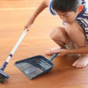

12 *Nov 2014*

## Onde comprar produtos de organização

Uma leitora solicitou este post no grupo [Vida Organizada – Leitor](https://www.facebook.com/groups/voleitor/) no Facebook. Aliás, você já faz parte? Participe do grupo para sugerir ideias de maneira mais próxima e conversarmos bastante sobre o que acontece no blog.

Vou listar aqui onde comprar produtos organizadores, tentando ao máximo não me ater a lojas locais, para facilitar para quem mora fora de São Paulo. O foco será o Brasil e não outros países.

- **Leroy Merlin -** A rede de lojas possui até uma seção inteira sobre organização. É um excelente lugar para comprar caixas, cestos, organizadores de gavetas, porta-roupa de cama, sapateiras, gaveteiros, estantes, prateleiras. É uma loja bastante completa e que oferece muitas opções. Não é das mais baratas mas, com um bom olho, dá para achar produtos em conta. A vantagem é poder fazer diversas compras em um único lugar. Não vende online por enquanto.
- **Tok&Stok -** Outra rede de lojas que possui produtos diferenciados – ou seja, originais, diferentes do padrão – e que, por esse diferencial, tem um precinho acima da média também. Para comprar poucas e boas coisas, a Tok&Stok é excelente (e vai muito do poder aquisitivo de cada um também, é claro). Particularmente, gosto de fazer compras na Tok&Stok. Ir à loja é sempre um passeio que adoramos fazer por aqui, pois tem novidades mensalmente. Dá para comprar cestos, caixas, acessórios, colméias organizadoras e outros produtos relacionados. Também vende móveis como estantes, arquivos e gaveteiros. Vende [online](http://www.tokstok.com.br/).
- **Lojas de 1,99 -** Hoje em dia essas lojas não vendem mais produtos a 1,99, mas continuam conhecidas assim. Geralmente são lojas de bairro que vendem produtos baratos para casa e uso pessoal. Sempre dá para fazer excelentes compras nessas lojas. Compro cestos, caixas, divisores de gavetas, capas para eletrodomésticos, potes, fruteiras, organizadores de bijous e uma série de outros acessórios. Vale a pena garimpar o que há perto de você e conversar com o proprietário. De repente, ele pode até encomendar produtos específicos de acordo com a sua demanda.
- **Loja da OZ -** A Organize Sua Vida – OZ, que ministra cursos profissionalizantes na área de organização, também tem uma [loja online](http://www.lojaoz.com.br/) que vende muitos produtos de organização. É referência na área e vende para todo o Brasil.
- **Tudo Organizado -** A loja já foi parceira do blog e vende muitos produtos organizadores em diversas categorias. Também [vende online](http://www.tudoorganizado.com.br/) para todo o Brasil.
- **Revista da Avon Casa -** A Avon possui uma revistinha que não é para cosméticos, mas para vender produtos relacionados a casa e uso pessoal. Sempre traz muitos produtos legais para organização e com boas promoções. Dá para comprar em todo o Brasil através do site ou consultando uma revendedora.
- **Alixpress -** [Este site](http://pt.aliexpress.com/) é uma espécie de lojão da Internet que vende produtos de vendedores específicos (pessoas comuns) do mundo todo. Vale a pena testar e depois indicar, pois indicações são a base das boas compras no site. Dá para comprar de tudo por lá e os produtos saem bem baratos, apesar de a entrega ser mais demorada (os produtos vêm de outros países, como a Coréia). Precisa ter cartão internacional para realizar as compras.
- **Etna -** Assim como a Tok&Stok, a Etna é uma rede de lojas espalhada por todo o Brasil e traz móveis e produtos para casa, o que inclui organizadores. Além de produtos tradicionais (como caixas e cestos), traz produtos com inspiração oriental, como baús e móveis rústicos, que podem ser utilizados para organizar a sua casa. Vende [online](http://www.etna.com.br/).
- **Kalunga -** Rede de lojas com produtos para escritório, a Kalunga traz sempre muitas opções para organizar a casa também. Caixas de entrada, porta-clipes, divisores de gavetas, pastas, caixas e muita, muita coisa mesmo. Acaba sendo um dos lugares que mais gosto de ir para comprar produtos de organização, tamanha sua utilidade. Vende [online](http://www.kalunga.com.br/).
- **Hipermercados -** Seja Carrefour, Extra, Sondas, Záffari ou Walmart, todos esses hipermercados sempre têm sua seção de produtos para casa que costumo dar uma olhada quando faço compras. Dá para encontrar produtos organizadores de todos os tipos, mas principalmente aqueles mais padrão: caixas, cestos, potes, ganchos.
- **Saraiva -** É uma grande rede de livrarias, mas traz também alguns produtos que podem ajudar na organização, como capas para tablets (eu uso para os mais diversos fins), pastas, porta-canetas, post-its diferentes, cadernos, agendas e outros. Vende [online](http://www.saraiva.com.br/).
- **Uatt -** Rede de lojas com produtos fofos diversos. Dá para comprar acessórios para viagens, caixinhas, agendas diferentes, almofadas para notebooks, capas para tablets e chaveiros. Vende [online](http://lojauatt.com.br/).
- **Supermercado Digital -** Uma loja [exclusivamente online](http://www.supermercadodigital.com.br/) que vende diversos produtos organizadores para casa. Tem bastante variedade!

### Em São Paulo

Para quem mora em São Paulo, algumas dicas específicas:

- **Região da rua 25 de Março -** Mesmo quem não mora aqui já deve ter ouvido falar da rua 25 de Março, que é a maior região comercial de São Paulo, com MUITAS lojas, vendedores ambulantes e galerias com produtos de toda a sorte sendo vendidos. Não há uma loja específica para produtos organizadores, mas consegue-se encontrar alguns deles fazendo um passeio geral. O que você pode encontrar lá: porta-bijous, organizadores de gavetas, potes, cestos, caixas de todos os tipos, muitos organizadores de acrílicos (para maquiagem, por exemplo), saquinhos de pano para usar em viagens e muito mais.
- **Daiso -** É uma loja que vende produtos importados do Japão. Tem bastante variedade e produtos de papelaria a produtos para usar em casa. Bentôs, aquelas famosas marmitas japonesas, são vendidos lá, além de ganchinhos, pastas diferentes e outros produtos que facilitam a limpeza da casa, como suporte para esponjas e outros cacarecos úteis do tipo. Vale a visita! Tem em dois endereços: Rua Direita, 247 (Sé) e Shopping Boulevard Tatuapé (Metrô Tatuapé).
- **Região da Liberdade -** O bairro da Liberdade é famoso em São Paulo pela feira aos domingos e pela cultura japonesa e chinesa em cada canto do bairro. Há diversas lojas na região que vendem produtos organizadores diversos, mas mais voltados à decoração (caixinhas diferentes, mais decoradas, por exemplo). Uma das minhas preferidas é a Lucky Cat, uma loja pequena que fica na própria Praça da Liberdade e sempre tem muitas novidades, especialmente de papelaria.
- **Zara Home -** No Shopping Iguatemi JK, você encontra a versão casa da famosa rede de lojas espanhola, a Zara. Há produtos mais refinados e, apesar de não ter uma seção com produtos organizadores, dá para comprar alguns produtinhos para organizar a sua casa e seu escritório. Vale o passeio, mas prepare o bolso.
- **Pedreira -** Esta é uma cidade um pouco afastada, perto de Campinas, que é conhecida por vender muitos produtos de marcenaria e feitos em pedra. Comprei meu criado-mudo lá por 60 reais. É realmente muito barato e dá para encontrar móveis e alguns produtos organizadores voltados para o lado mais artesanal mesmo, como aqueles porta-ovos, painéis para colocar papel-toalha, porta-bijous, nessa linha.
- **Embu das Artes -** Outra cidade fora de São Paulo, mas mais perto (dá para ir de ônibus). Também é conhecida pelo seu comércio mais artesanal e semelhante à Pedreira. Tire um dia inteiro para fazer o passeio, de preferência aos domingos, porque tem uma feirinha local também.

### Dica final

Muitos produtos organizadores que vemos em sites como o Pinterest podem ser feitos em casa ou podemos mandar fazer em marceneiros de bairro. Saem mais baratos e a gente não precisa comprar exatamente igual. Também dá para encomendar com costureiras ou buscar soluções alternativas. Existem produtos maravilhosos no mercado, mas é necessário comprar aos poucos, porque costumam ser caros. Até lá, busque soluções mais em conta e use sua criatividade para organizar. Aqui no blog, há uma [categoria](http://vidaorganizada.com/categoria/solucoes/diy-faca-voce-mesmao/) só com dicas de “faça você mesma(o)”. Mãos à massa!

Escrito por [Thais Godinho](http://vidaorganizada.com/sobre/ "Thais Godinho")

em [Produtos organizadores](http://vidaorganizada.com/categoria/solucoes/produtos-organizadores/ "Produtos organizadores")

- [2 comentários](http://vidaorganizada.com/solucoes/produtos-organizadores/onde-comprar-produtos-de-organizacao/#comments)

### Textos relacionados:

- 
- 
- 
- 
- 
