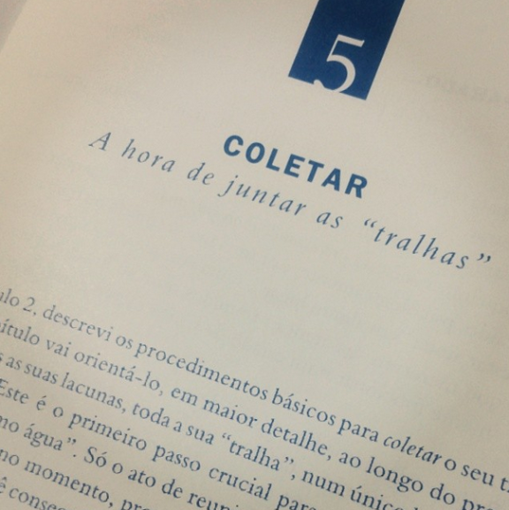

# Reflexões atuais sobre a coleta no GTD

Venho refletindo ultimamente sobre a utilidade da coleta nos mais diversos sentidos. Geralmente pensamos que temos que coletar o que precisamos fazer, mas **a lista é infinita**. Cada vez mais acredito no poder da coleta ao longo do dia e DOS dias. A partir do momento que paramos de coletar, as coisas voltam a ficar na nossa cabeça e nos perturbam, além de tirar nossa confiança no sistema que organizamos.

Acredito também que é importante selecionar com cuidado a **quantidade de caixas de entrada** que temos. Gosto de capturar tudo no papel, porque escrever é a forma mais rápida para mim. Gravar áudio também funciona, mas tenho uma preguiça tremenda de ouvir depois e transcrever. O que guardo no celular, seja como for (foto, vídeo) só funciona se eu enviar direto para o Evernote. Se deixei ali, é provável que só resgate quando fizer o backup dos dados, em uma ou duas semanas. Logo, prefiro escrever.

Ando testando diversas **ferramentas físicas de coleta**. Testei anotar uma coisa em cada papel, como o David recomenda, mas fico com a consciência pesada por estar desperdiçando nossos amigos de celulose. Também testei aqueles caderninhos pequenos, formato A6 (de anotações), mas gosto de ter um espaço maior para escrever. Por fim, o que funciona para mim são cadernos maiores (A5) ou folhas de sulfite, que posso digitalizar inteiras.

O que faço então é usar um caderno para anotar tarefas, ideias, lembretes e coisas esparsas. Quando estou tomando notas em uma reunião, fazendo brainstorm ou mapas mentais, utilizo folhas de sulfite para poder logo digitalizar e arquivar no Evernote. O que foi coletado no caderno, vai ou para a minha agenda (Google) ou para o Toodledo.

Um ponto sobre a recomendação do David de fazer uma coleta gigantesca no início do uso do GTD: acho a ideia incrível, mas pouco prática. Se você realmente tiver dois dias da sua vida para ficar dedicado a isso, tente. Porém, **acho extremamente opressor processar muita coisa de uma só vez e sou adepta do fazer um pouco todos os dias**. Acho extremamente saudável, no entanto, sentar todos os dias com seu bloquinho em mãos e fazer um verdadeiro “descarrego mental” no papel. Fazendo isso sempre, demorará pouco tempo e a sensação de controle vai aumentando.

Algumas coisas vêm facilmente à nossa mente, mas outras não. Por isso, acho legal utilizar como guia a lista que o David traz no primeiro livro, com o que ele chamada de provocações (na edição da editora Campus, está na página 90). Eu gosto bastante de pelo menos uma vez por semana passar o olho pela lista e ver se não estou me esquecendo de nada.

Outra coisa que vale a pena comentar é sobre duas caixas de entrada inevitáveis, que são a caixa de entrada física e as caixas de entrada de e-mails.

Seja você a pessoa mais digitalizada do mundo, inevitavelmente vai ter que se deparar com papéis ao longo dos dias, sejam documentos assinados, folhetos que chegam, contas e boletos para pagar, desenhos dos seus filhos e por aí vai. Tudo bem você arquivar o que não pode ser descartado em algum lugar ou digitalizar a maioria e descartar. Porém, você precisa deixar isso tudo agrupado em um único lugar para não perder as informações, e esse lugar é a caixa de entrada física. Toda casa deve ter uma, assim como sua mesa do escritório deve ter um lugarzinho para colocar esse tipo de papel.

A outra é a caixa de e-mail. Por muitos anos, pensei que ter uma única caixa de e-mails seria a solução. Apesar de centralizar tudo em um mesmo lugar, gosto muito da agilidade do webmail e de ter assuntos separados por conta. O que é fundamental saber é que a caixa de entrada de e-mails não para um só minuto de coletar, então são informações que precisamos lidar uma hora ou outra.

**Minhas caixas de entrada e material para coleta hoje:**

- Caixa de entrada física em casa
- Caixa de entrada do Evernote
- Caixa de entrada de e-mails (uso 4)
- Caderno + caneta
- Folhas de sulfite
- Cam Scanner (aplicativo no celular para digitalizar e enviar para o Evernote)
- Pasta A5 que deixo na bolsa para guardar papéizinhos que chegam ao longo do dia para mim

Eu acho que é importante, da mesma maneira, coletarmos o tempo inteiro. As ideias vêm ao longo do dia, e não quando a gente para com um caderno e caneta em mãos para coletar. Por isso, vale levar sempre seu instrumento de coleta com você e coletar sempre que se lembrar de algo. Além de poder esquecer prazos e outros lembretes importantes, se você não coletar, pode deixar para lá também uma ideia boba e simples que, se você executasse, traria alegria para a sua vida. Portanto, colete!
