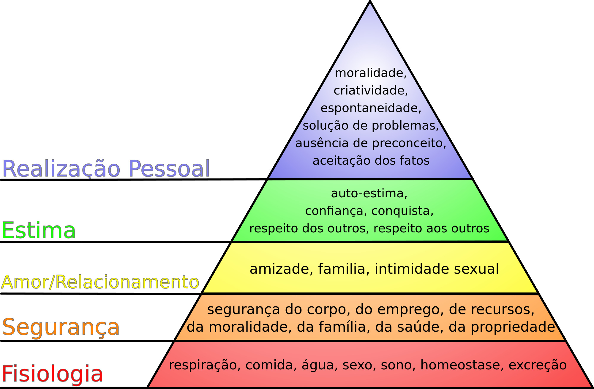

# Um papinho sobre pessoal X profissional, conciliar tarefas e falta de tempo para fazer tudo

Pessoal, queria bater um papo com vocês hoje sobre a questão da manutenção da casa, das rotinas e de tudo o que precisamos fazer com uma determinada frequência para não entrar no caos.

Recebo muitos e-mails de pessoas desesperadas (de verdade) que me perguntam como conciliar as tarefas domésticas com todo o resto: família, estudos, momentos de lazer, trabalho até mais tarde etc.

A primeira coisa que a gente tem que fazer é ter noção do nosso tempo. E a gente faz isso da seguinte forma:

Temos 24 horas no nosso dia. Se tivéssemos 30, gastaríamos as 30. Se tivéssemos 15 horas, daríamos um jeito. Esse “daríamos um jeito” é a chave. Mas vou falar sobre isso daqui a pouco.

Dessas 24 horas, suponhamos que a gente passe 9 horas dedicadas ao trabalho (8 horas + 1 hora de almoço). Eu sei que tem gente que trabalha mais. Estou colocando uma média.

Também vou levar em conta que todos nós dormimos 8 horas por noite. E sim, eu sei que tem gente que dorme menos ou dorme mais. São médias.

Com isso, sobram 7 horas para fazermos todo o restante. Mas inclua aí o tempo que se leva de deslocamento todos os dias. Não só de ida e volta para o trabalho, mas de ida e volta ao mercado, à farmácia, ao shopping, ao restaurante, ao barzinho. Se a gente colocar que leva 2 horas todos os dias se deslocando, teremos 5 horas do nosso dia para fazer TODO o resto, que inclui:

- Cuidar da casa
- Passar um tempo em família
- Atividades de lazer: ver um filme, ler um livro
- Estudar, fazer um curso
- Frequentar a igreja, o centro, fazer práticas religiosas em casa, meditar
- Fazer algum tipo de trabalho voluntário
- Descansar, olhar o céu, ficar com as pernas para cima
- Atualizar planilha de finanças, pagar contas, ir ao banco
- E por aí vai…

Não dá para a gente conciliar pessoal X profissional porque a divisão não é essa. A divisão é entre áreas de responsabilidade, em que apenas uma delas é referente ao trabalho. O “pessoal”, por assim dizer, é dividido em família, casa, finanças, estudos, espiritualidade, saúde, lazer…

Com isso, a gente pode tirar duas conclusões:

1. **Temos tempo mais do que suficiente para fazer as coisas do trabalho**. Não tem motivo para a gente ficar até mais tarde, levar trabalho para casa, esquecer a vida lá fora e se estressar com a quantidade de demanda.
2. **Temos muito pouco tempo para todo o resto**. Se não diminuirmos as expectativas e se não nos organizarmos minimamente, jamais conseguiremos fazer o que é importante mesmo. E aí a gente acaba tirando tempo do sono, fazendo tarefas pessoais durante o trabalho e por aí vai. Gera um desequilíbrio. Precisamos nos organizar para isso não acontecer mais.

Cuidar da casa é apenas uma das coisas que precisamos fazer, igualmente. Portanto, é legal a gente ter essa visão macro da vida e parar de focar em micro problemas – que é o que a gente faz mesmo! É legal fazer essa análise de todas as áreas de foco da sua vida para ver qual está em desequilíbrio – seja porque você está se dedicando muito, seja porque está se dedicando pouco.

E aí você pode perceber que, apesar de toda a preocupação, você está dedicando um tempão da sua vida à sua casa, deixando faltar tempo para o lazer, para o seu descanso, para o seu tempo com a família, para ter algum hobby que te deixe feliz ou mesmo investir em projetos importantes que trarão resultados lá na frente, como começar um curso.

Sabe o que acontece quando a gente quer fazer tudo ao mesmo tempo? Primeiro, a gente não consegue. Segundo, por não conseguir, a gente se frustra. Fica desanimado, achando que a vida está passando. E está mesmo! Então a gente tem que aprender a valorizar as coisas certas e desvalorizar aquilo que não tem tanta importância assim.

Quando um leitor me escreve perguntando o que fazer porque sai de casa às 6h da manhã e volta só depois da meia-noite e não tem tempo para limpar a casa, fazer comida e estudar, eu tenho vontade de responder que não existe milagre. Não dá para fazer tudo. Em primeiro lugar, a gente tem que ter noção do que é transitório (como, por exemplo, os anos dedicados a uma faculdade). Em segundo, diminuir as expectativas. Se não dá tempo, não dá tempo. Simples assim. Então o que é essencial? Isso eu vou fazer.

Para descobrir o que é essencial, gosto de usar uma coisa que aprendi na faculdade de publicidade, que é a Pirâmide de Maslow. Já ouviram falar? É uma pirâmide que mostra as necessidades humanas. Veja:

A base da pirâmide (e da nossa vida) são as nossas necessidades básicas: respirar, comer, beber água, fazer sexo, dormir, equilibrar o organismo, fazer xixi e cocô. Isso são as nossas necessidades mais rudimentares, quase primitivas. Se devemos começar organizando por algum lugar, deve ser por aqui. Como?

- Vivendo sem ansiedade, controlando o que for possível, para conseguir respirar direito. Abrir as janelas, tomar ar puro, talvez até meditar com foco na respiração. Lembrar de sempre respirar direito.
- Se alimentando corretamente, de maneira funcional para cada um, de acordo com o que é considerado saudável. Cuidar da alimentação da família.
- Bebendo água ao longo do dia, para se manter hidratado (não só o corpo como o cérebro). Garantir que haja sempre água para todos.
- Fazendo sexo, nem que seja sozinho!
- Dormindo bem, conhecendo a necessidade de horas de sono que você tem e respeitando o ritmo do seu corpo.
- Aprendendo como funciona o seu metabolismo.
- Regulando o seu corpo para conseguir fazer tudo isso sem desregular nada.

Enquanto isso não estiver organizado, não adianta querer organizar o resto. Ou seja: se você não se alimenta bem, não tem tempo para beber água, não dorme direito etc, como pretende sequer pensar em organizar tarefas? Em casos extremos de falta de tempo, essas necessidades básicas devem ser privilegiadas.

Só depois disso que você começa a pensar na segurança do seu corpo, em se manter estável no trabalho, em garantir estabilidade financeira, moral, da família, da saúde e da sua casa.

Se for para priorizar atividades domésticas nesse meio todo, foque naquelas que proporcionem aquilo que as necessidades básicas pedem: abra as janelas, deixe o ar entrar, cuide da comida, da água, dos seus relacionamentos, arrume sua cama (e troque os lençóis!), limpe os banheiros. O básico também.

O que eu estou querendo dizer é que não adianta se preocupar em passar cera no piso laminado se você não limpou a sua pia da cozinha. Em curtas palavras, é isso. Questão de prioridade, e a prioridade deve começar atendendo as necessidades básicas. O resto vem depois, em uma hierarquia.

Pense nisso antes de surtar por que não consegue fazer tudo, ok?

Boa terça-feira.
