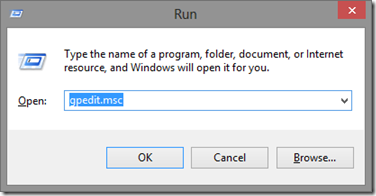
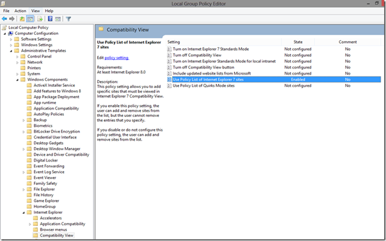
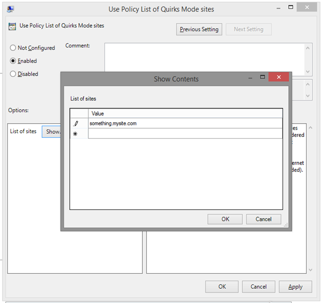

> **Add \*subdomains\* to the Compatibility View List**
>
> (<http://www.codeproject.com/Articles/662444/Add-subdomains-to-the-Compatibility-View-List>)
>
>  
>
> |  |  |  |  |  |
> | --- | --- | --- | --- | --- |
> |  | |  |  |  | | --- | --- | --- | | Rate this: | [vote 1](http://www.codeproject.com/Articles/662444/Add-subdomains-to-the-Compatibility-View-List "vote 1")[vote 2](http://www.codeproject.com/Articles/662444/Add-subdomains-to-the-Compatibility-View-List "vote 2")[vote 3](http://www.codeproject.com/Articles/662444/Add-subdomains-to-the-Compatibility-View-List "vote 3")[vote 4](http://www.codeproject.com/Articles/662444/Add-subdomains-to-the-Compatibility-View-List "vote 4")[vote 5](http://www.codeproject.com/Articles/662444/Add-subdomains-to-the-Compatibility-View-List "vote 5") |  | |
>
> How to add subdomains to the compatibility view list
>
> If you try to add “[something.mysite.com](http://something.mysite.com/)” to the Compatibility List via IE’s Internet Options, you’re met with an error and your only recourse is to add the full domain, “[mysite.com](http://mysite.com/)” to the list instead – which might not be ideal if the rest of [mysite.com](http://mysite.com/) works great, but only [something.mysite.com](http://something.mysite.com/) has compatibility issues.
>
> However, there **is** a way to add just the subdomain to the compatibility list once you understand how the CL works. I’ll spare you those details and get right to the nitty gritty. Before I do, though, **make sure you do not have Compatibility View turned on for the entire domain**.
>
> The secret lies in how a **company** can manage its own compatibility lists: via Group Policy.
>
> To add the problematic subdomain ([something.mysite.com](http://something.mysite.com/)) to your CL, do the following (**you must be an Administrator on your machine in order to perform the following operations**):
>
> Start the Group Policy editor by going to Start | Run (or Window + R) and typing ‘gpedit.msc’:
>
> 
>
> Navigate to *Computer Configuration \ Administrative Templates \ Windows Components \ Internet Explorer \ Compatibility View* and choose *Use Policy List of Internet Explorer 7 sites*:
>
> 
>
> Double-click the option, and set it up as shown:
>
> 
>
> Logout and log back in to your PC and you’ll see that now [mmysite.com](http://mmysite.com/) **won’t** use Compatibility Mode, but [something.mysite.com](http://something.mysite.com/) will! Enjoy!
