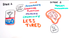
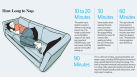

# [Does Napping Change Your Metabolism?](http://lifehacker.com/does-napping-change-your-metabolism-1674109765)

37,5648

[4l](http://lifehacker.com/does-napping-change-your-metabolism-1674109765# "Recommend")

#### Alan Henry

[Profile](http://alanhenry.kinja.com/)[Follow](http://lifehacker.com/does-napping-change-your-metabolism-1674109765#)

[[anexo ausente]](http://alanhenry.kinja.com/)

[Alan Henry](http://alanhenry.kinja.com/)

Filed to: [ask lifehacker](http://lifehacker.com/tag/ask-lifehacker)

- [sleeping](http://lifehacker.com/tag/sleeping)
- [sleep](http://lifehacker.com/tag/sleep)
- [exercise](http://lifehacker.com/tag/exercise)
- [health](http://lifehacker.com/tag/health)
- [metabolism](http://lifehacker.com/tag/metabolism)
- [stress](http://lifehacker.com/tag/stress)
- [losing weight](http://lifehacker.com/tag/losing-weight)
- [naps](http://lifehacker.com/tag/naps)
- [napping](http://lifehacker.com/tag/napping)

 [Monday 10:00am](http://lifehacker.com/does-napping-change-your-metabolism-1674109765)

- [*C*Share to Kinja](http://lifehacker.com/does-napping-change-your-metabolism-1674109765#)
- [*"*Share to Facebook](http://facebook.com/sharer.php?u=http%3A%2F%2Flifehacker.com%2Fdoes-napping-change-your-metabolism-1674109765)
- [Share to Pinterest](http://www.pinterest.com/pin/create/link/?url=http%3A%2F%2Flifehacker.com%2Fdoes-napping-change-your-metabolism-1674109765&media=http%3A%2F%2Fi.kinja-img.com%2Fgawker-media%2Fimage%2Fupload%2Fs--k0nWiSwA--%2Fwi9nvjodly2lq12ipgsh.jpg&description=Dear%20Lifehacker%2C%20I%20hear%20a%20high%20metabolism%20is%20good%20for%20losing%20weight%20and%20keeping%20healthy%2C%20so%20I%20try%20to%20stay%20active.%20However%2C%20I%20love%20my%20afternoon%20naps%21%20Sometimes%20I%27m%20just%20tired%2C%20but%20they%20keep%20me%20productive.%20Sleeping%20slows%20your%20metabolism%20down%20though.%20Am%20I%20undoing%20all%20my%20good%20work%3F)
- [*!*Share to Twitter](http://twitter.com/share?url=http%3A%2F%2Flifehacker.com%2Fdoes-napping-change-your-metabolism-1674109765&text=Does%20Napping%20Change%20Your%20Metabolism%3F)
- [*'*Go to permalink](http://lifehacker.com/does-napping-change-your-metabolism-1674109765)
[))](http://lifehacker.com/does-napping-change-your-metabolism-1674109765#)

[anexo ausente]

Dear Lifehacker,  
I hear a high metabolism is good for losing weight and keeping healthy, so I try to stay active. However, I love my afternoon naps! Sometimes I'm just tired, but [they keep me productive](http://lifehacker.com/5932754/the-science-behind-why-power-naps-help-you-stay-productive-and-creative). Sleeping slows your metabolism down though. Am I undoing all my good work?  N

###### [The Science Behind Why Power Naps Help You Stay Productive and Creative](http://lifehacker.com/5932754/the-science-behind-why-power-naps-help-you-stay-productive-and-creative)

If you've tried taking naps in the afternoon and found yourself feeling groggy after waking—if …
[Read more](http://lifehacker.com/5932754/the-science-behind-why-power-naps-help-you-stay-productive-and-creative)

Sincerely,  
Activity Monitor  N

Dear System Utility,  
That's a tricky question. Naps do
[have lots of benefits](http://lifehacker.com/5932754/the-science-behind-why-power-naps-help-you-stay-productive-and-creative), and [the right kind of nap can have a big impact](http://lifehacker.com/how-long-to-nap-for-the-biggest-brain-benefits-1251546669) on how refreshed, and even how productive and creative you feel afterward. In general, if you can catch a nap during the day, it's a great way to get a little respite from the stress of the day and feel more energized afterward.  N

###### [How Long to Nap for the Biggest Brain Benefits](http://lifehacker.com/how-long-to-nap-for-the-biggest-brain-benefits-1251546669)

Taking a nap, we've seen time and again, is like rebooting your brain. But napping may be as…
[Read more](http://lifehacker.com/how-long-to-nap-for-the-biggest-brain-benefits-1251546669)

That said, it makes sense you're worried about sleep and your metabolism. When we sleep, everything from our heart rate and breathing to our digestion and metabolism slows down so we get some rest. If you're trying to keep your metabolism humming for the biggest possible health benefits, that may seem like a bad idea, right? Well, we asked a couple of experts—Dr. Dan Weiswasser, a primary care physician who's weighed in on medical topics for us in the past, and Alannah DiBona, nutrition consultant and therapist who's also helped us with diet topics. Long story short? Don't be afraid to take a nap when you can catch one. Here's why.  N

### Your Metabolism Isn't *That* Fickle N

[anexo ausente] [1](http://lifehacker.com/this-dog-gets-it-1674133084)

The first thing to remember is that your metabolism isn't something you can just "trick" with a few tweaks to your lifestyle. Similarly, taking an afternoon nap isn't going to have a significant impact on your metabolism either. Yes, your body slows down—your heart rate, breathing, digestion, everything—slows down when you take a nap, but your body's metabolism on the whole isn't so finicky that small things like an hour's nap in the afternoon is going to change it appreciably.  N

The only way to really shift your metabolism is regular activity and exercise. It's also important to remember that muscles grow and fat burns when you're at rest as well. All in all, your metabolism is a pretty difficult thing to tweak appreciably, and a bit more rest, especially when paired with more activity, is important as well.  N

All of our experts agreed on this point—a nap here or there isn't going to put a serious dent in the way your body works, burns fat, or builds muscle. Similarly, don't fall for diet tweaks or tricks that promise to "boost" your metabolism. Dr. Weiswasser specifically called them out—chugging a glass of cold water when you get out of bed, or eating small snacks over the course of the day versus big meals [doesn't appreciably change your metabolism](http://lifehacker.com/eating-many-small-meals-every-day-wont-boost-your-meta-868845439) the way people used to parrot back in the 90s and early 2000s. At the end of the day, [your metabolism just isn't so easily "hacked."](http://lifehacker.com/5847591/10-stubborn-food-myths-that-just-wont-die)  N

[o](http://lifehacker.com/does-napping-change-your-metabolism-1674109765#)

###### [Eating Many Small Meals Every Day Won't Boost Your Metabolism](http://lifehacker.com/eating-many-small-meals-every-day-wont-boost-your-meta-868845439)

As it often happens with popular science, the media can blow a study out of proportion when the…
[Read more](http://lifehacker.com/eating-many-small-meals-every-day-wont-boost-your-meta-868845439)

### Metabolic Changes from Napping Vanish Quickly After You Wake Up N

[anexo ausente]

Perhaps the most important thing to remember though is that just because sleep slows your body down a bit doesn't mean that those effects persist after you wake and get back to work. If you're that worried about the natural metabolic slowdown that comes with sleep—even sleeping for an hour or so if you take an afternoon nap—take comfort in the knowledge that as soon as you wake up and get back to your daily routine, your body will pick the baton right back up and get you where you were before you took that nap. In many cases, you'll be *more* energized, which may make you more active than you would have been anyway, which is an overall win.  N

For those of us who are sedentary during the day, sitting at desks or only getting light activity as we walk around an office or shop, Dr. Weiswasser explains that your metabolism probably can't get much lower than it already is anyway, so a nap won't hurt you anyway:  N

> Intuitively, it would seem that any sedentary activity would slow down your metabolism, i.e. the rate at which your burn energy. Ultimately, I don't see how napping is really any more detrimental to your metabolism than any other form of inactivity.  N

So going from sitting at a computer and typing our TPS reports to taking a nap and back really won't do much in the long run either way. Besides, as soon as you wake up and get out of bed, your body will kick back into gear. You don't have anything to worry about on that front.  N

### Napping's Stress Benefits Can Outweigh Potential Drawbacks N

[anexo ausente]

Alannah DiBona has another take on the issue, and pointed out that napping has benefits that can outweigh any potential drawbacks that come with sleeping during the day. Even if you're still worried about some metabolic impact that a nap might have, you should consider how relaxing and energizing the effects of an afternoon nap can be [from a stress-response](http://lifehacker.com/5836879/what-stress-actually-does-to-you-and-what-you-can-do-about-it) perspective.  N

###### [What Stress Actually Does to You and What You Can Do About It](http://lifehacker.com/5836879/what-stress-actually-does-to-you-and-what-you-can-do-about-it)

Stress is an unpleasant fact of life. We all experience it for various reasons, and we all try to…
[Read more](http://lifehacker.com/5836879/what-stress-actually-does-to-you-and-what-you-can-do-about-it)

She explains:  N

> While a well-timed nap isn't going to do much to impact your metabolism, it can work by reducing your [cortisol](http://en.wikipedia.org/wiki/Cortisol) (stress hormone that, when elevated, can increase the body's fat storage). In addition, when you're exhausted, the hormone that drives hunger ([ghrelin](http://en.wikipedia.org/wiki/Ghrelin)) becomes elevated, which can drive you to eat. Thus, I think the nap is more effective in preventing these two conditions, which are more impactful to your weight and metabolic status.  N

That's an important point that a lot of us overlook when we're considering our health—and how our relationship with food and exercise shapes up. Whether we're stressed out because of the events of the day or we're feeling burnt out, stressful jobs do more than just harm us mentally and emotionally—[they translate into weight gain](http://lifehacker.com/5731406/why-your-crappy-job-is-making-you-fat) and [unhealthy habits](http://lifehacker.com/why-your-brain-craves-junk-food-and-what-you-can-do-ab-1469120841). By contrast, taking a nap gives you an opportunity to recharge, relax, and shut down that stress response. Since stress and its mental implications tend to lead people to eat, skip exercise, sacrifice sleep at night, and indulge in other unhealthy habits, a nap may be more key to helping you stay healthy than skipping one.  N

[o](http://lifehacker.com/does-napping-change-your-metabolism-1674109765#)

###### [Why Your Crappy Job is Making You Fat (and What to Do About It)](http://lifehacker.com/5731406/why-your-crappy-job-is-making-you-fat)

If you're feeling burnt out and overworked lately and you find you're gaining weight,…
[Read more](http://lifehacker.com/5731406/why-your-crappy-job-is-making-you-fat)

---

Hopefully we've managed to soothe your fears a bit, Activity Monitor. As long as you're not napping *instead* of getting some other form of activity (as in, I'll take a nap instead of going to the gym today), you'll be fine putting your head down if you have the opportunity to. If you are, you're lucky. Enjoy that nap, and know you'll wake up healthier for it, not the other way around.  N

Happy napping,  
Lifehacker  N

*[Dr. Daniel Weiswasser](http://www.riverbendmedical.com/practitioner.php?ppid=90) is a board-certified internist and pediatrician who's been in outpatient practice in Western Massachusetts for nine years.*   N

*Alannah Dibona, MA, MS, is a Boston-based nutritionist and wellness counselor.*  N

*Both offered their expertise for this piece, and we thank them.*   N

*Have a question or suggestion for Ask Lifehacker? Send it to [tips+asklh@lifehacker.com](http://lifehacker.com/does-napping-change-your-metabolism-1674109765mailto:tips+asklh@lifehacker.com).*  N

*Title image by [zygotehasnobrain](http://www.shutterstock.com/pic.mhtml?id=185188529&src=id) (Shutterstock). Additional images by [normanack](https://www.flickr.com/photos/29278394@N00/23844169), [dimbledar](https://www.flickr.com/photos/gaz_0981/3818104489), and [Bev Sykes](https://www.flickr.com/photos/basykes/3280970848).*  N

[4l](http://lifehacker.com/does-napping-change-your-metabolism-1674109765# "Recommend") 111[Reply](http://lifehacker.com/does-napping-change-your-metabolism-1674109765#)
