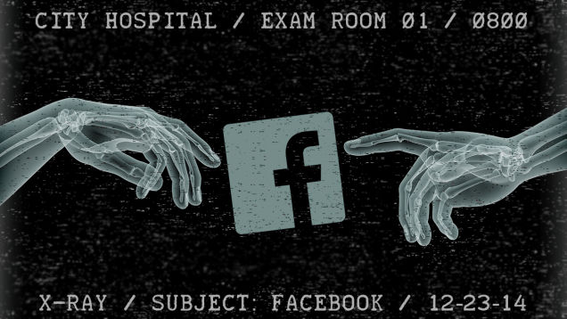
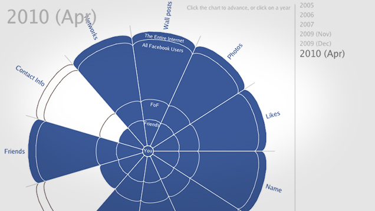
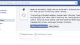
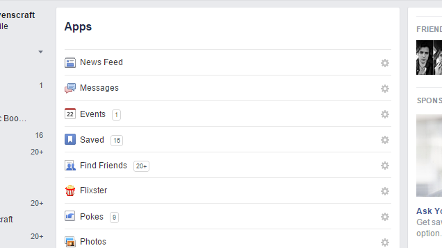
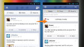
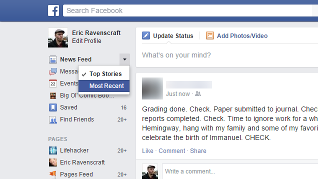

# [What's Really Wrong With Facebook](http://lifehacker.com/whats-really-wrong-with-facebook-1674369938)

182,6808

[20l](http://lifehacker.com/whats-really-wrong-with-facebook-1674369938# "Recommend")

#### Eric Ravenscraft

[Profile](http://ericravenscraft.kinja.com/)[Follow](http://lifehacker.com/whats-really-wrong-with-facebook-1674369938#)

[[anexo ausente]](http://ericravenscraft.kinja.com/)

[Eric Ravenscraft](http://ericravenscraft.kinja.com/)

Filed to: [facebook](http://lifehacker.com/tag/facebook)

- [privacy](http://lifehacker.com/tag/privacy)
- [security](http://lifehacker.com/tag/security)
- [perception](http://lifehacker.com/tag/perception)
- [data](http://lifehacker.com/tag/data)

 [Tuesday 8:00am](http://lifehacker.com/whats-really-wrong-with-facebook-1674369938)

- [*C*Share to Kinja](http://lifehacker.com/whats-really-wrong-with-facebook-1674369938#)
- [*"*Share to Facebook](http://facebook.com/sharer.php?u=http%3A%2F%2Flifehacker.com%2Fwhats-really-wrong-with-facebook-1674369938)
- [Share to Pinterest](http://www.pinterest.com/pin/create/link/?url=http%3A%2F%2Flifehacker.com%2Fwhats-really-wrong-with-facebook-1674369938&media=http%3A%2F%2Fi.kinja-img.com%2Fgawker-media%2Fimage%2Fupload%2Fs--WepKBhBn--%2Fexwedyd0gu5oobbd0mgs.jpg&description=Facebook%20is%20changing%20its%20privacy%20policies%20at%20the%20beginning%20of%20the%20new%20year.%20As%20usual%2C%20everyone%27s%20wondering%20if%20they%20should%20be%20worried%20about%20it..%20When%20it%20comes%20to%20Facebook%2C%20the%20answer%20is%20usually%20yes--but%20not%20for%20the%20reasons%20most%20people%20think.)
- [*!*Share to Twitter](http://twitter.com/share?url=http%3A%2F%2Flifehacker.com%2Fwhats-really-wrong-with-facebook-1674369938&text=What's%20Really%20Wrong%20With%20Facebook)
- [*'*Go to permalink](http://lifehacker.com/whats-really-wrong-with-facebook-1674369938)
[))](http://lifehacker.com/whats-really-wrong-with-facebook-1674369938#)

Facebook is changing its privacy policies at the beginning of the new year. As usual, everyone's wondering if they should be worried about it.. When it comes to Facebook, the answer is usually yes—but not for the reasons most people think.  N

Facebook is no stranger to scandals. With 1.3 billion users, it'd be hard not to attract some false information. (Remember all those times we were worried Facebook would start charging for access?) However, knowing there's a problem and identifying it are two separate things. Today, we're breaking down specifically why Facebook's approach to privacy is so scary.  N

### **Facebook Erodes Your Privacy Regardless of Policy** N

Privacy policies change regularly. In fact, you've probably gotten several notifications this month from various services that will be changing their policies next year. It's difficult to know exactly what changes, and inevitably, armchair lawyers try to "explain" the new panic. If this seems like a familiar dance, that's because it is. In fact, the pattern for Facebook's privacy changes has become very distinct:  N

1. 1[Facebook announces updates to its privacy policy or settings](https://www.eff.org/deeplinks/2009/12/facebooks-new-privacy-changes-good-bad-and-ugly).  N
2. 2[Users are understandably upset](http://bits.blogs.nytimes.com/2009/12/17/privacy-group-files-complaint-on-facebook-privacy-changes/).  N
3. 3[Facebook "simplifies" its privacy settings in response](https://www.facebook.com/notes/facebook/making-control-simple/391922327130).  N
4. 4[Privacy on Facebook is still complicated](http://lifehacker.com/5616395/how-to-disable-facebook-places).  N

Sometimes these new, less private features come shortly after the privacy policy itself has changed. Often, however, they don't. In fact, Facebook changes how its privacy settings behave far more often than the policy itself. Which means that Facebook doesn't need to ask permission every time it wants to try something new. After a decade of changing policies, you've already given enough permission. This may not make you feel better, but it does mean that the privacy policy itself isn't likely to protect your data.  N

Many of us may forget, but back in 2012, Facebook "gave" its users an option to influence privacy policy decisions. We use sarcastic quotes because the challenge was [laughably unwinnable](http://gizmodo.com/5965339/vote-on-facebooks-new-policy-changes-or-youll-never-get-another-chancehttp://gizmodo.com/5965339/vote-on-facebooks-new-policy-changes-or-youll-never-get-another-chance). The company asked that at least 30% of its 1 billion plus users vote on whether or not they'd like the ability to vote on future privacy changes. They [did not meet that threshold](https://www.facebook.com/notes/facebook-site-governance/results-of-the-facebook-site-governance-vote/10151840534290301). If 30% of users had voted (and a majority agreed), they could have had the ability not only to continue voting on policy changes, but on specific features and how they're implemented. Because the company couldn't get [nearly three Super Bowls](http://www.nielsen.com/us/en/insights/news/2014/super-bowl-xlviii-draws-111-5-million-viewers-25-3-million-tweets.html) worth of votes, the option disappeared.  N

###### [Vote On Facebook's New Policy Changes, Or You'll Never Get Another Chance](http://gizmodo.com/5965339/vote-on-facebooks-new-policy-changes-or-youll-never-get-another-chancehttp://gizmodo.com/5965339/vote-on-facebooks-new-policy-changes-or-youll-never-get-another-chance)

In response to user feedback, Facebook is proposing a set of clarified governance and privacy…
[Read more gizmodo.​com](http://gizmodo.com/5965339/vote-on-facebooks-new-policy-changes-or-youll-never-get-another-chancehttp://gizmodo.com/5965339/vote-on-facebooks-new-policy-changes-or-youll-never-get-another-chance)

And therein lies the problem. Facebook largely sets its own rules for what its rules are. Remember, the company's privacy policy only dictates what it's allowed to do in legal terms—not how specific features are implemented. However, Facebook can and has drastically changed how your data is presented without necessarily changing its policies to do it. And whether it's a change to policy or functionality, Facebook is largely unaccountable due to its massive size.  N

Back in 2010 (when Facebook was far smaller), a developer named Matt McKeon made [this interactive graphic](http://mattmckeon.com/facebook-privacy/) showing how Facebook's privacy settings have changed over time. This looks at the default settings, and some can be changed, but for the most part, this is the average Facebook users' experience. In 2005, the only data that was visible to all Facebook users was your name, picture, gender, and which networks you were in. No data was completely public. By April 2010, the general, non-Facebook using public could potentially see your wall posts, photos, likes, friends, and other data unless you intentionally lock it down. It happened gradually over a period of years and some policy changes were required (one notable change added [the previously-absent public tier](http://readwrite.com/2009/12/09/facebook_pushes_people_to_go_public)), but many changes did not.  N

This trend of taking information you intended to be private and turning it public never really stopped. In October of last year, Facebook [eliminated a feature](http://lifehacker.com/reminder-facebook-is-making-everyone-searchable-check-1443876249) that allowed you to prevent someone from looking you up by name. Paired with Facebook's policy of [no fake names](http://lifehacker.com/how-to-use-a-fake-name-on-facebook-without-getting-flag-1637644101) and this made it very hard to have a private Facebook experience.  N

[o](http://lifehacker.com/whats-really-wrong-with-facebook-1674369938#)

###### [Reminder: Facebook Is Making Everyone Searchable, Check Your Privacy](http://lifehacker.com/reminder-facebook-is-making-everyone-searchable-check-1443876249)

Facebook reminded people today that they're removing the "Who can look up your Timeline…
[Read more](http://lifehacker.com/reminder-facebook-is-making-everyone-searchable-check-1443876249)

Facebook has made some very intentional moves to give you more control over who can see your stuff on the site. And if you proactively protect your posts, [constantly audit your privacy settings](http://lifehacker.com/5813990/the-always-up-to-date-guide-to-managing-your-facebook-privacy), and don't post anything you don't want people to see, you might be able to stay ahead. At the end of the day, though, you simply can't know who Facebook is going to show your stuff to over the long term. Even if you have it under control now, a change later may mean stuff that you think is buried is suddenly right on the surface.  N

###### [The Always Up-to-Date Guide to Managing Your Facebook Privacy](http://lifehacker.com/5813990/the-always-up-to-date-guide-to-managing-your-facebook-privacy)

Keeping your Facebook info private is getting harder and harder all the time—mostly because…
[Read more](http://lifehacker.com/5813990/the-always-up-to-date-guide-to-managing-your-facebook-privacy)

### **Facebook Has Access to Tons of Data, and You'll Never Fully Know Why** [1](http://lifehacker.com/because-you-gave-it-to-them-period-1674655179) N

Facebook's grasp on your data isn't limited to what happens on their site, either. Facebook is frequently used to log in to other web services. It also has access to a wide variety of permissions on your phone. While this can make it very useful, there's virtually no accountability for how that data is used.  N

Take phone permissions as an example. As we've [talked about before](http://lifehacker.com/5991099/why-does-this-android-app-need-so-many-permissions), an app needing permissions doesn't necessarily indicate that something nefarious is going on. For instance, when Facebook Messenger came out, there was some concern about how many permissions it had. However, of all the permissions Messenger asked for, there were only four that the main Facebook app didn't also request. In fact, the main Facebook app requests many, many more (you can see [a comparison here](https://docs.google.com/spreadsheets/d/1ORMdj06LLIPEV2Ix-ixBJqPh0UngMWYjBrsEvb1idJg/edit?usp=sharing)). Not only that, but the permissions requested by Messenger—like camera, microphone, and location—were all related to pretty run-of-the-mill, [useful features](http://lifehacker.com/the-best-features-of-facebook-messenger-youre-probably-1620750584/). Even if you're worried that Facebook is going to listen in on your microphone whenever you post a status (which, by the way, [they've played around with](http://www.forbes.com/sites/kashmirhill/2014/05/22/facebook-wants-to-listen-in-on-what-youre-doing/)), seeing a permission in a list doesn't mean it's happening.  N

[o](http://lifehacker.com/whats-really-wrong-with-facebook-1674369938#)

###### [Why Does This Android App Need So Many Permissions?](http://lifehacker.com/5991099/why-does-this-android-app-need-so-many-permissions)

Dear Lifehacker, I read your article about Chrome permissions last week, but I want to know about…
[Read more](http://lifehacker.com/5991099/why-does-this-android-app-need-so-many-permissions)

However, both Android and iOS lack the ability to distinguish *which* feature you're giving permission to. Android users have to accept permissions wholesale. You can't install Facebook if you don't accept the entire app's use of your camera or microphone. iOS is only slightly better. While you can allow permissions piecemeal (and selectively revoke them later), a given permission is either all on or all off. So, while you may give Facebook permission to use your microphone when recording a video, you can't ever know for sure if it's also listening to your TV in the background.   N

If you're worried about which permissions Facebook is asking for, how you react depends on your platform. If you're on iOS, you can take a more active role by turning off permissions when you're done with them. For Android users, until Google improves the situation, it's difficult to do much, but you can send the company feedback in the Play Store (open the slide-out menu and select Help & Feedback) and ask for them to give you more granular controls. (And in the meantime, you can [use the Facebook mobile site](http://lifehacker.com/use-facebooks-mobile-site-for-a-faster-battery-friend-513822070) for a somewhat less intrusive experience.) In either case, though, whether you can trust the mobile apps really boils down to whether you can trust Facebook itself. And Facebook hasn't always proven itself to be trustworthy.  N

###### [Use Facebook's Mobile Site for a Faster, Battery-Friendly Facebook](http://lifehacker.com/use-facebooks-mobile-site-for-a-faster-battery-friend-513822070)

Facebook's app isn't as bad as it used to be, but it still has its fair share of…
[Read more](http://lifehacker.com/use-facebooks-mobile-site-for-a-faster-battery-friend-513822070)

### **Facebook Manipulates Your Feed—A Lot** N

We've all heard it before: Facebook is [replacing *real* relationships](http://lifehacker.com/facebook-is-fine-just-hide-the-noise-512906794), it's too much information, and it makes us "busy" rather than helping us get anything done. It's one of the biggest reasons that people leave Facebook, and it's actually probably one of the best reasons to quit. If you're just wasting time on the site, don't be afraid to quit and get that time back.  N

However, this isn't a problem inherent with Facebook itself. It's a problem with us. Distractions and procrastination existed long before the internet. We've talked a lot about [how to defeat distractions](http://lifehacker.com/top-10-ways-to-defeat-distractions-and-get-your-work-do-1580198318) and get your work done. In fact, Facebook can even be useful. As we've discussed before, [Facebook groups are excellent](http://lifehacker.com/facebook-groups-are-underrated-heres-how-to-make-them-1660643691) at helping you organize people and events. Taking breaks during your workday is also helpful for relaxing your brain, as long as you [keep it limited](http://bigthink.com/big-think-tv/how-not-to-spend-your-whole-day-on-facebook). [2](http://lifehacker.com/just-like-this-article-i-could-be-doing-work-but-i-dis-1674523220) N

[o](http://lifehacker.com/whats-really-wrong-with-facebook-1674369938#)

###### [Top 10 Ways to Defeat Distractions and Get Your Work Done](http://lifehacker.com/top-10-ways-to-defeat-distractions-and-get-your-work-do-1580198318)

No matter how zen you are, it can be hard to focus on the work in front of you--especially when…
[Read more](http://lifehacker.com/top-10-ways-to-defeat-distractions-and-get-your-work-do-1580198318)

What Facebook does show you may not be as much of a problem as what it *doesn't* show you. By its very definition, Facebook's News Feed is a curated list of what your friends and family are posting. You can have some control over this [if you put in the effort](http://lifehacker.com/how-to-declutter-your-facebook-news-feed-once-and-for-a-1449687892), but unless you hunt down the increasingly buried [Most Recent feed](http://lifehacker.com/how-to-show-the-most-recent-news-feed-in-the-new-face-1577443645), you'll probably never see everything.  N

This might not seem like that big of a deal on its face. However, earlier this year, Facebook found itself in hot water for using a small percentage of its users in [a psychological experiment](http://gizmodo.com/facebook-says-whoops-updates-rules-for-news-feed-manip-1641727518). While this isn't the kind of thing that most people assume they're being signed up for when they get on a social network, it's also not uncommon for large sites to conduct tests with user experiences.  N

However, while most people were upset *that* the test was conducted, the results of the study were more noteworthy. According to Facebook's own research, it was possible to [manipulate the moods of users](http://lifehacker.com/your-friends-emotions-on-facebook-can-affect-your-mood-1598500417) by showing them different types of posts. Now, chances are that your feed isn't going to be subject to an experiment. However, much like [with Google](http://lifehacker.com/5814100/the-problem-with-your-google-search-results-and-what-you-can-do-about-it), your usage of the site can create a self-reinforcing feedback loop.  N

[o](http://lifehacker.com/whats-really-wrong-with-facebook-1674369938#)

###### [​Your Friends' Emotions on Facebook Can Affect Your Mood](http://lifehacker.com/your-friends-emotions-on-facebook-can-affect-your-mood-1598500417)

Empathy is a natural human reaction and it's something we experience daily. It can be used for …
[Read more](http://lifehacker.com/your-friends-emotions-on-facebook-can-affect-your-mood-1598500417)

The problem with this may be more subtle, but it's still important. Your perception has a huge [impact on your reality](http://lifehacker.com/5891564/recalibrate-your-reality). If you get into heated political arguments on Facebook a lot, the news feed might assume you're interested in political posts and show you more, tempting you to [argue even more](http://lifehacker.com/5811255/why-you-cant-win-an-argument-on-the-internet). You might see more negative posts that drag you down because supportive people interact with a post and drive it up. And let's not forget the [manipulative effect of advertising](http://lifehacker.com/5824328/how-advertising-manipulates-your-choices-and-spending-habits-and-what-to-do-about-it).  N

Not all of this means Facebook is evil, of course. But it does mean that you have to understand that [your feed is an illusion](http://sploid.gizmodo.com/this-is-why-you-shouldnt-take-peoples-lives-in-facebook-1595563358). It's easy to get yourself down because everyone on Facebook seems happy, or to [feel like an imposter](http://lifehacker.com/overcoming-impostor-syndrome-what-to-do-when-you-feel-1651827849) because everyone else seems to have their lives in order. For better or worse, Facebook is a big part of how most of us perceive our friends and family's lives, which puts it in a unique position to skew our perceptions. Even if it's not intentional.  N

[20l](http://lifehacker.com/whats-really-wrong-with-facebook-1674369938# "Recommend") 2481[Reply](http://lifehacker.com/whats-really-wrong-with-facebook-1674369938#)
