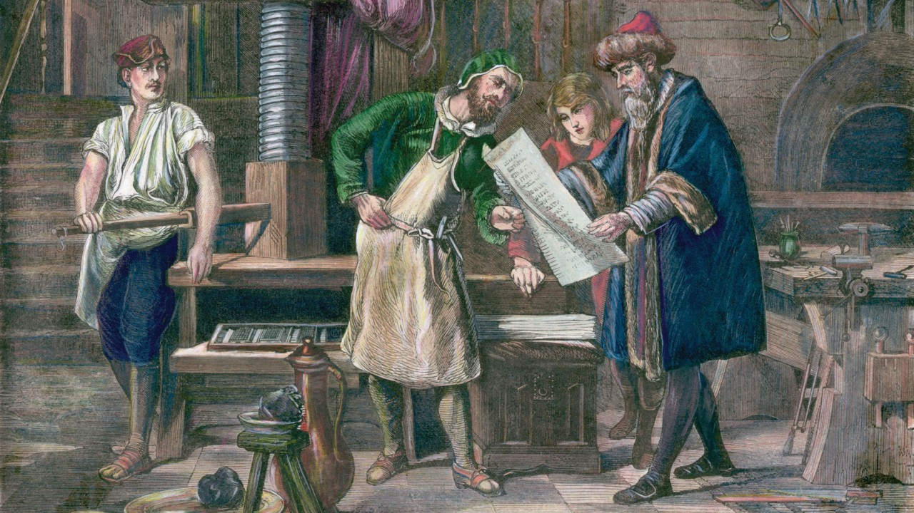
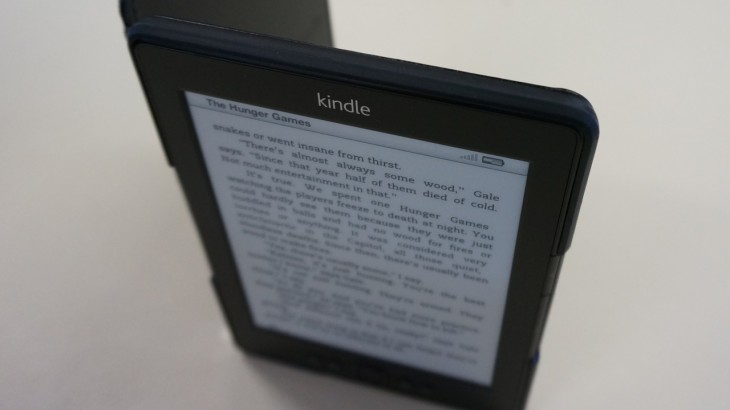
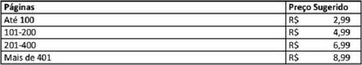

[21/10/2013](http://www.manualdousuario.net/autopublicacao-ebook-brasil/)

/
[17 comentários](http://www.manualdousuario.net/autopublicacao-ebook-brasil/#disqus_thread "Comentário para A odisseia da autopublicação: como lançar um ebook no Brasil")

/
[Marcellus Pereira](http://laboratoriosacme.net/wp/ "Visitar o site de Marcellus Pereira")

# A odisseia da autopublicação: como lançar um ebook no Brasil

**Nota do editor:** O Marcellus, amigo de longa data, está se lançando como escritor e após passar pela odisseia da autopublicação resolveu compartilhar suas experiências por aqui. O livro que serviu de “laboratório” para este artigo, *Viagem a Pindorama*, [está sendo publicado em partes, gratuitamente, no seu blog](http://laboratoriosacme.net/wp/tag/viagem-a-pindorama/ "Viagem a Pindorama, de Marcellus Pereira.").

---

Faz um tempo que ando afastado das redações digitais, desse corre-corre de notícias e rumores, levando uma vida mais calma e analógica. Mas eis que de repente o Ghedin me convida a escrever um artigo para o seu novo Manual do Usuário. Como velhos hábitos nunca morrem, aqui vamos nós!

Durante o meu “recesso”, acabei concluindo a trilogia árvore-filho-livro. Depois de mais de um ano de trabalho intenso, com a obra (literária) finalizada, veio o calvário de procurar e decidir onde publicá-la. Foi a partir desta experiência que nasceu este artigo.

## O Processo Tradicional

Até pouco tempo, havia duas formas de se publicar um livro: convencendo uma editora de que a obra teria público (e, portanto, geraria lucro) ou investindo dinheiro do próprio bolso para uma “tiragem do autor”.

Dessas possibilidades é fácil perceber o poder dos editores: eles eram os donos das chaves douradas que abriam os portões do mercado editorial. Mas a dificuldade de ser visto e, principalmente, lido por algum deles era uma outra verdade conhecida desde os tempos de Gutemberg. (Ou vocês acham que o primeiro livro a ser impresso foi a Bíblia à toa? O autor tinha forte apelo popular…) Jack London, por exemplo, foi rejeitado 600 vezes. SEISCENTAS!

Impacientes e frustrados, a saída para os autores iniciantes era fazer uma tiragem do autor, também conhecida por “publicação independente” ou “autopublicação”. Como toda forma de burlar o sistema, essa também não era bem vista pelos intelectuais, o que continua até hoje. Convenientemente, esquecem que Proust, Thoreau, Shaw e até Anaïs Nin (fortemente recomendada) começaram com publicações independentes.

O grande problema da publicação independente era (e ainda é) o alto custo: nem todo mundo tem uma herança ou pode sacar o FGTS para investir no seu sonho. Mas como a tecnologia existe para resolver os problemas cotidianos, hoje temos…

## Admirável Mundo Novo

…plataformas de publicação digital!

Com o avanço da informática, qualquer um pode escrever e publicar sua obra sem precisar empenhar um rim. E, de fato, há inúmeros exemplos de sucesso.

Amanda Hocking (centro). Foto: [Vivienne/Serendipity Reviews](http://www.serendipityreviews.co.uk/2012/02/switched-by-amanda-hocking.html "Switched by Amanda Hocking").

Vejamos a estadunidense [Amanda Hocking](http://amandahocking.blogspot.com.br/ "Amanda Hocking"). Antes mesmo de ter um domínio com seu nome, a moça já havia faturado US$ 2 milhões. Disso até fechar contrato com uma editora, foi um pulo.

Outro exemplo bem bacana é o do escritor Joseph Konrath, que era defensor ferrenho da publicação tradicional mas agora [prega aos quatro ventos o evangelho da independência](http://jakonrath.blogspot.com.br/2010/12/you-should-self-publish.html "You Should Self-Publish"). E já foram mais de quinhentos mil livros digitais vendidos!

Aqui na terrinha, Bruna Brito foi descoberta pela Random House ao [disponibilizar gratuitamente suas histórias, em inglês, no site Wattpad](http://www.wattpad.com/541006-the-lost-boys-book1-preview-teaser-the-lost-boys "The Lost Boys (Book 1)").

A internet abriu um mundo de possibilidades para os autores independentes e centenas de exemplos pipocam por aí semanalmente. Mas como, exatamente, um aspirante ao Nobel de Literatura poderia começar? Como estamos focados em livros digitais, ou ebooks, então o primeiro nome que vem à mente é a Amazon.

### Amazon

Foto: Rodrigo Ghedin.

A plataforma de publicação independente da empresa, chamada [Kindle Direct Publishing](https://kdp.amazon.com/self-publishing/signin/182-9464443-5128317?ie=UTF8&language=pt_BR "Kindle Direct Publishing"), requer apenas um cadastro e o upload do arquivo de texto e da capa (que você pode criar na hora, usando uma ferramenta fornecida pela loja).

Na Amazon você poderá escolher receber 35% ou 70% referentes aos direitos autorais. Parece bem óbvio escolher a última opção, certo? Só que há duas pegadinhas: seu livro não poderá estar disponível em nenhuma outra livraria digital pelos 90 dias seguintes, sendo que o contrato precisa ser renovado ao final desse período. Além disso, o valor mínimo do livro é de R$ 2,99 (na opção de 35%, o mínimo é de R$ 0,99).

Terminada essa parte burocrática, em 48 horas sua obra estará disponível para compra em Kindles do mundo inteiro. E por “Kindles” entenda não apenas os fantásticos leitores físicos, mas também [o software](http://www.amazon.com.br/gp/feature.html/ref=sv_kinc_1?ie=UTF8&docId=1000828031 "Aplicativos Kindle gratuitos.") que está instalado em milhões de celulares, tablets e computadores.

Se você é das antigas ou quer dar ao seu leitor a opção de ler em papel, a Amazon tem a [CreateSpace](https://www.createspace.com/ "CreateSpace"), que disponibiliza sua obra via impressão por demanda, ou seja, o livro só será impresso quando o leitor fizer a compra. A obra é impressa nos EUA e terá que ser enviado ao Brasil, mas curiosamente o custo para o leitor não é assustadoramente maior que as opções de impressão por demanda nacionais — incluindo o frete!

Como se não bastasse, a empresa ainda lançou o programa [Kindle Matchbook](http://www.amazon.com/gp/feature.html?ie=UTF8&docId=1001373341 "Kindle Matchbook"), em que seu livro digital sai mais barato se o leitor comprar a versão impressa. Quase no estilo “dois pelo preço de um”.

A Amazon é um universo à parte quando se fala em publicação e você pode ter uma ideia melhor dando uma olhada na [página de ajuda deles](https://kdp.amazon.com/self-publishing/help?topicId=A3R2IZDC42DJW6 "Bem-vindo ao Kindle Direct Publishing!"). Há opção para quase tudo: desde como atualizar seu livro de forma transparente (e gratuita) para os leitores, até como [publicar seu blog diretamente em dispositivos Kindle](https://kindlepublishing.amazon.com/gp/vendor/sign-in "Kindle Publishing for Blogs") (infelizmente, apenas em inglês).

Pela minha empolgação, vocês já devem imaginar que esta seja minha opção favorita, certo?

Mas há outras, muitas outras. Por exemplo a [iBookstore](http://www.apple.com/br/apps/ibooks/ "iBooks, o app de compra e leitura de ebooks para dispositivos iOS.") da Apple.

### iBookstore (Apple)

A primeira vez em que experimentei um “livro” no iPad, foi uma experiência transformadora. Enquanto a Amazon encara o livro digital como… um livro, só que digital, a Apple quer transformá-lo num produto interativo. E se o designer (porque não basta ser autor) for bom, pode acabar criando obras-primas como esta abaixo:

A Apple fornece até uma ferramenta gratuita para que o autor possa se aventurar na produção desses ebooks anabolizados, o [iBooks Author](http://www.apple.com/ibooks-author/ "iBooks Author"). Apenas um adendo: por “gratuita” leia-se “embutida no preço de um Mac”.

Obviamente, também é possível ter livros convencionais à venda pela loja da Apple. Aliás, um ponto importante: as vendas são feitas através do aplicativo iTunes e não diretamente como acontece no Kindle. E é preciso pagar uma taxa inicial de US$ 99,00. Ah, e seu livro precisa ser lido, analisado e aprovado na triagem que é feita com todo o conteúdo digital que é posto à venda pela Apple.

### Google Play

O Google, aproveitando a imensa penetração dos dispositivos Android, não poderia ficar de fora e há algum tempo também [vende livros na Play Store](https://play.google.com/store/books?hl=pt_br "Livros na Play Store."), permitindo a publicação independente. Lá o problema é a complicação: para se ter uma ideia, não consegui sequer fazer um teste…

## E no Brasil?

Mais perto de nós, a Livraria Cultura tem parceria com a Kobo, fabricante dos leitores digitais mais bacanas e estilosos que seu rico dinheirinho pode comprar. E a Kobo tem a [Kobo Writing Life](http://ptbr.kobo.com/writinglife "Kobo Writing Life"), onde você pode publicar seus livros sem custos, mais ou menos como na Amazon.

Um diferencial interessante para quem está começando e não quer se preocupar com a parte técnica da coisa, é a formatação automática em ePub: você envia seu documento Word ou OpenOffice e eles cuidam da formatação. Em até 72 horas seu livro estará disponível.

A parte não tão boa é que o pagamento é feito duas vezes ao ano, apenas. Mas, por outro lado, o autor fica com 70% das vendas, para livros que custem entre US$ 1,99 e US$12,99.

A Livraria Saraiva foi um pouco além e criou sua própria plataforma de publicação independente: a [Publique-se!](http://www.livrariasaraiva.com.br/publique-se/ "Publique-se, da Saraiva.") Nela o autor fica com até 35% das vendas, pagos 90 dias depois do mês apurado. Mas nada foi dito sobre como será a promoção da obra pelo site, nem sobre como sair do contrato, mas ela não exige exclusividade.

Se você deseja apenas compartilhar o que escreveu sem maiores preocupações quanto a vendas e lucros, talvez uma alternativa interessante seja o [BookSérie](http://bookserie.com.br/ "BookSérie"), uma espécie de Wattpad nacional. No site você pode enviar sua história para apreciação de editores e, caso seja aprovada, ela será “serializada” e publicada semanalmente, recebendo as críticas e comentários dos leitores.

A ideia é promissora, mas há um senão: ao contrário do Wattpad, apenas o pessoal do BookSérie pode retirar uma obra do ar. Portanto, se você for descoberto por uma Random House da vida, seu texto vai continuar lá no site, sem choro nem vela — a menos que o pessoal seja camarada e concorde em apagá-lo.

Há ainda vários sites de publicação independente que mesclam a produção digital com a “analógica”, ou seja, você pode vender tanto o livro digital quanto o impresso. O que é muito legal para impressionar a família, diga-se de passagem, mas também atinge um mercado que, por um motivo ou por outro, ainda prefere o cheiro de papel e tinta.  
Entre esses, há três de destaque no mercado nacional: o [Clube de Autores](https://clubedeautores.com.br/ "Clube dos Autores"), o [PerSe](http://www.perse.com.br/novoprojetoperse/home.aspx?rf "PerSe") e o [Bookess](http://www.bookess.com/ "Bookess").

Os três, basicamente, oferecem o serviço de impressão sob demanda, em que o livro é efetivamente impresso apenas quando o leitor faz a compra. Isso não significa que também não convertam (e vendam) o livro em formato digital.

Neles, o autor tem o preço básico do livro, que varia de acordo com o tipo de capa, papel, encadernação etc, e sobre esse valor coloca o quanto quer receber a título de direitos autorais. Lembrando que, nesse caso, seria importante imprimir ao menos um livro para verificar a qualidade da impressão, do papel, da capa…

Até agora tudo são flores, certo? Você já deve estar louco para tirar aquele manuscrito da gaveta e faturar horrores na Amazon ou na lojinha da Apple. Parece um sonho prestes a se concretizar!

RÁ! Pegadinha do Mallandro!

## Caindo na real

Foto: [Annie Mole/Flickr](http://www.flickr.com/photos/anniemole/5354202837/in/photostream/ "Reading Kindle at Old Street Tube").

Eu sou do tipo pessimista, que sempre vê o copo 100% cheio, mas com apenas 50% do que realmente importa. Sob essa óptica, o Brasil é um país onde se fatura mais com livros que a Índia, por exemplo. Se levarmos em consideração a desproporção populacional, dá até para se animar. Por outro lado, aqui se vende menos livros que na Espanha, uma gleba menor que estado de Minas Gerais, com pouco mais de 47 milhões de habitantes.

Geralmente, o clima de “oba-oba” quando se fala em publicação independente vem dos Estados Unidos. O volume do mercado lá é absurdamente maior que o nosso: [R$ 81,6 bilhões contra R$ 6,7 bi aqui](http://www1.folha.uol.com.br/mercado/1178540-mercado-brasileiro-de-livros-cresce-e-ja-aparece-como-9-no-mundo.shtml "Mercado brasileiro de livros cresce e já aparece como 9º no mundo") (dados de 2011).

Para piorar, o volume de vendas de livros digitais, apesar de ter aumentado mais de 100% no último ano, [ainda representa pífios 0,29%](http://www.tiposdigitais.com/2013/08/participa%C3%A7%C3%A3o-de-e-books-no-mercado-brasileiro-em-2012.html "Estimada em 0,23 por cento a participação de e-books no mercado brasileiro em 2012") (contra 22% do mercado estadunidense). A própria Bruna Brito revelou que escreveu em inglês “para ser lida”. Portanto, não se engane: fazer dinheiro com literatura, especialmente no Brasil, é como faturar milhões sendo jogador de futebol. Há um Ronaldinho para cada dez mil Zé da Pelada.

Numa rápida conversa por email com Wagner Ribeiro, roteirista de [*Onda Zero*](http://www.2012ondazero.com.br/ "Onda Zero") e autor da ficção científica [*Código 7 Infinidade*](http://codigo7.infinidade.com.br/ "Código 7 Infinidade"), confirmei o que já era muito comentado nos círculos de editores e escritores: o retorno financeiro de livros de ficção é baixo. Wagner, que também faz toda a edição, diagramação e as capas das obras, quando perguntado sobre a publicação “normal”, via editoras, me respondeu o seguinte:

> “Não tentei buscar editoras e publicar direto em papel por entender que seria um caminho extremamente difícil para um iniciante, ainda mais no gênero no qual eu gosto de escrever. Também invisto no ebook por acreditar no formato, e na autopublicação.”.

Outro com quem falei, o engenheiro Landulfo Almeida, autor de [*As Duas Faces do Destino*](http://www.skoob.com.br/livro/276582 "As Duas Faces do Destino, no Skoob.") (que tem versão impressa e digital) contou como foi a procura por uma editora:

> “Primeiro tentei achar um agente literário. Naquele momento esses profissionais eram poucos e difíceis de fazer contato. A maioria não me respondeu e quem o fez não estava aberto ao meu tipo de livro ou mesmo a novos autores.
>
> Passei então a pesquisar as editoras e tentar descobrir quais publicavam livros cuja temática era semelhante à de minha obra, quais recebiam originais e de que forma. Consegui mandar o original, devidamente registrado na Biblioteca Nacional, para cinco editoras. Quase todas me retornaram após alguns meses indicando que não tinham interesse.
>
> No ínterim, através das pesquisas na internet, fechei contrato com uma pequena editora que aceitava publicar os livros em parceria, dividindo os custos. Foi meu grande erro. Perdi tempo e dinheiro e não consegui publicar. Felizmente, nesse processo entendi melhor como o mercado funciona. Conheci alguns autores nacionais através da rede mundial e recebi uma dica sobre a [Editora Novo Século](http://www.novoseculo.com.br/ "Editora Novo Século") e o selo Novos Talentos da Literatura Brasileira. O contato foi fácil e o retorno rápido. Fechamos o contrato pelo selo Novos Talentos. Sugiro que os autores iniciantes conheçam o programa, é muito interessante (o autor participa com parte dos custos de publicação). Estou extremamente feliz em fazer parte do conjunto de autores da Novo Século.”

## A autopublicação vale a pena?

Essa é a pergunta de um milhão de dólares.

Pois bem, vamos a um exemplo pessoal, mais uma da série “aconteceu comigo”: uma editora se aproximou depois que enviei o original para apreciação. Apesar do tempo médio ser de meses, consegui uma aprovação em apenas dez dias! E quando a esmola é demais…

A proposta era a seguinte: a editora faria uma primeira edição com mil exemplares. Eles seriam vendidos, nas bancas, a R$ 36,00. Eu, o autor, teria que comprar 250 exemplares, ao custo de R$ 28,00 e receberia 10% do valor de venda dos outros 750 (ou seja, um lucro de R$ 3,60 por exemplar).

Fazendo as contas, eu teria que desembolsar R$ 7.000,00 e, caso toda a edição fosse vendida, teria um lucro de R$ 2.700,00 (mais R$ 2.000,00 caso vendesse meus 250 exemplares).

Vale ressaltar que a editora arcaria com os custos da capa, edição e diagramação. Mas, ainda assim, é um valor alto para quem está começando, por mais que acredite no potencial.

Partindo para a publicação independente, na Amazon, por exemplo, o investimento é mínimo, praticamente zero. No entanto, uma capa atraente é o melhor chamariz possível e um trabalho profissional gira em torno dos R$ 700,00. E ainda tem a diagramação e a edição.

Para tiragens sob demanda, no Clube de Autores, por exemplo, o valor final do livro (sempre considerando o mesmo exemplo, mas com papel um pouco melhor, 90g) fica em R$ 39,90 com um lucro de R$ 6,00 por exemplar. Claro, sem a editora você também fica sem os serviços profissionais, que terá que contratar por conta própria, e a distribuição.

A autopublicação, como tudo na vida, é uma faca de dois gumes. Mas é um caminho que eu, particularmente, estou propenso a escolher.

## Dicas para quem quiser partir para a autopublicação

Para o aspirante a autor que chegou até aqui, uma dica: em algumas livrarias online, como a Amazon e o Clube de Autores, não é obrigatório que seu livro tenha um [ISBN](http://pt.wikipedia.org/wiki/International_Standard_Book_Number "International Standard Book Number"). Esse é o tipo de coisa, porém, que você deveria procurar — até porque se aparecer a chance de vender em livrarias físicas, elas vão exigir o ISBN.

O registro é simples: aponte seu navegador para o site da Agência Brasileira do ISBN e [siga o passo-a-passo](http://www.isbn.bn.br/solicitacao-de-numero-isbn "Solicitação de Número ISBN - Editoras Já Cadastradas"). O processo não é tão burocrático quanto você espera, as atendentes sabem o que estão falando e não te passam para outra pessoa inúmeras vezes, mas demora até 90 dias para o registro da obra e o tal número.

Outra coisa importante para se pensar é que publicar independentemente é mais ou menos como publicar um blog: muita gente ainda tem certo preconceito, afinal, blog não é jornal…

Se você gosta de escrever ficção científica, fantasia, romances-melosos-de-vampiros-que-brilham, sem problemas. Mas se a sua ideia é concorrer ao Prêmio Jabuti, esqueça: bater na porta de uma editora tradicional ainda é o melhor caminho.

Uma dúvida recorrente entre quem embarca nessa jornada solitária é quanto cobrar pela obra. Não há uma regra fixa e o que vale aqui não vale, por exemplo, para o mercado estadunidense. Mas a Saraiva tem uma dica preciosa:

Eles têm vasta experiência no varejo, devem saber o que falam, não?

E para fechar com chave de ouro: exatamente como nos blogs, quem publica tem que ter a coragem de dar a cara a tapa. Se você acha que o nível de comentários nos maiores portais da internet brasileira é baixo, [dê uma olhada nos comentários de livros na Play Store](http://fuckyeahmarket.tumblr.com/ "Pérolas da Play Store"). Há gente que reclama de ter que colocar o cartão de crédito… e não é pouca. Inclusive, essa é uma das maiores dificuldades de se vender por aqui, mesmo estando no século XXI.

Ainda está motivado? Ótimo! Pergunte a cinco pessoas do seu meio profissional “o que é um Kindle?” Já vi muitos estudantes de Engenharia Elétrica e da Computação que não sabiam responder. Engenheiros e Analistas formados também. Isso é um fator limitante da penetração dos livros digitais, principalmente da Amazon, no Brasil. Está melhorando, mas o ambiente ainda é desolador.

Descontando os alunos da rede pública que entram nas pesquisas sobre “quem lê no Brasil”, temos aí um universo de mais ou menos vinte milhões de leitores que compram livros. E eles estão dispersos em assuntos que variam de ficção científica a esoterismo. Aliás, é consenso entre os editores que autor brasileiro só vende bem se for autoajuda ou gospel. Aventura e ficção, só importados. Pense nisso.

Nas palavras de Landulfo Almeida:

> “Pesquise. Participe dos eventos literários, seja de forma presencial ou virtual. Acompanhe os blogs literários e as páginas das editoras. Consulte os autores já publicados, famosos e desconhecidos. Pergunte! Tem muita gente disposta a passar os conhecimentos e experiências adquiridas. Eu mesmo já respondi a várias pessoas que me contataram e muitas já me ajudaram. Se você ama escrever, não desista diante das dificuldades. É difícil publicar e ser lido, mas os prazeres superam em muito os obstáculos.”

Chegou até aqui? Puxa, então você deve mesmo estar interessado em publicar. Envie-nos o link da obra para que possamos dar uma olhadinha! E lembre-se: *Moby Dick* vendeu apenas 3715 cópias até a morte do autor, Herman Melville.

Imagem da capa: [Press/Autor desconhecido](http://ca.wikipedia.org/wiki/Fitxer:Press_-Bettman.jpg "Colored engraving created in about the 19th century. Artist unknown.").

Nas páginas abaixo você confere as entrevistas completas com Landulfo Almeida e Wagner Ribeiro, autores consultados durante a elaboração desta matéria.

Páginas: 1 [2](http://www.manualdousuario.net/autopublicacao-ebook-brasil/2/) [3](http://www.manualdousuario.net/autopublicacao-ebook-brasil/3/)

Arquivado em: [Especiais](http://www.manualdousuario.net/especiais/)

Tags: 

- [Amazon](http://www.manualdousuario.net/tag/amazon/), [Autopublicação](http://www.manualdousuario.net/tag/autopublicacao/), [Ebook](http://www.manualdousuario.net/tag/ebook/), [Kindle](http://www.manualdousuario.net/tag/kindle/)
