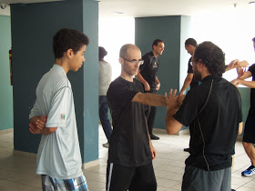
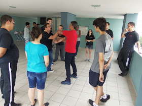
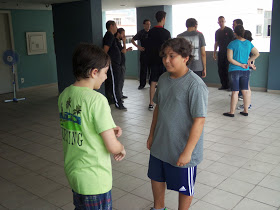
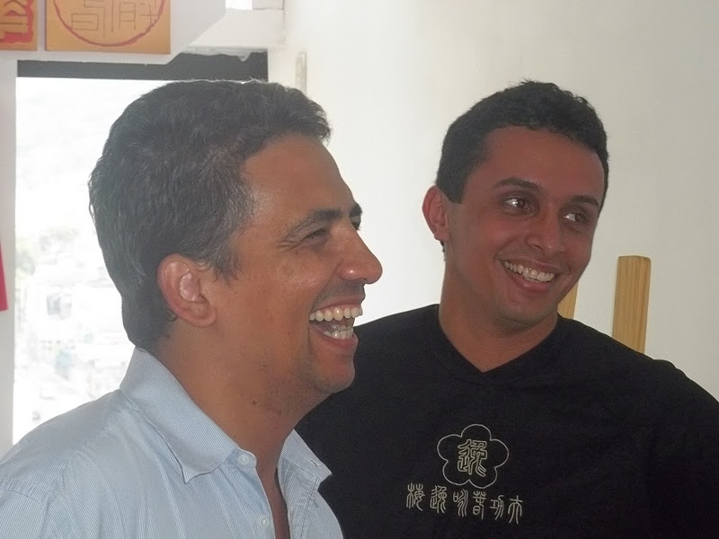

### 2014 year-end celebration in MYVT MEIER SCHOOL (Encerramento do ano no Nucleo Meier!)

*Era uma linda manhã de Sábado! Um dia depois do aniversário de Si Sok Ricardo Queiroz e horas antes do aniversário de Vladimir Anchieta. [Ambos eventos relatados no ultimo post.](http://moyfatlei.blogspot.com.br/2014/12/birthday-master-ricardo-and-vladimir.html)*  
*Neste Sábado encerraríamos as atividades do ano de 2014 no Núcleo Méier e Núcleo Barra.*  
*Sai de casa cedo, e entrei em meu carro rumo a Zona Norte. No rádio tocava ["I´m a Believer" da banda The Monkees.](https://www.youtube.com/watch?v=udX6y-FB3vU)  E enquanto dirigia lembrei de todos os praticantes que ingressaram este ano, dos que já faziam parte e reforçaram seu compromisso, e claro: Também lembrei-me das inevitáveis despedidas que experimentei este ano.*  
  
*It was a beautiful Saturday morning! One day after the Si Sok Ricardo Queiroz's birthday celebration and hours before the anniversary of Vladimir Anchieta. [Both events reported in the last post.](http://moyfatlei.blogspot.com.br/2014/12/birthday-master-ricardo-and-vladimir.html)*  
*In this Saturday we would finish the 2014 year activities in MYVT Meier and Barra Schools*  
*I left home early and got in my car towards the North Zone. In the radio was playing "[I'ma Believer" by The Monkees](https://www.youtube.com/watch?v=udX6y-FB3vU). And as I drove , I remembered all practitioners who joined this year, of which were members who reinforced their commitment, and of course: Also remembered the inevitable "goodbyes" I have experienced this year.*  
  
  
Rodrigo Moreira, discípulo de Si Fu Julio Camacho assim como eu, aparece na foto acima no canto direito orientando José Roberto e Jomarx Soares durante o exercício proposto naquela manhã que reuniu membros da Família Moy Jo Lei Ou dos Núcleos Barra e Méier.  
Rodrigo foi o organizador deste evento , e contou com a ajuda dos seus Si Hing Pedro Freire e Glauco Gavioli.  
  
Rodrigo Moreira,a Si Fu Julio Camacho disciple like me, appears in the picture above on the right side guiding José Roberto  and Jomarx Soares during exercise proposed that morning that brought together members of the Family Moy Jo Lei Ou from MYVT Meier and Barra Schools  
Rodrigo was the organizer of this event, and enlisted the help of his Si Hing Pedro Freire and Glauco Gavioli.  

Si Fu esteve presente, como não poderia deixar de ser, e ele ficou com parte do grupo presente, composto por membros da Família Kung Fu. Dessa forma, muitos praticantes que não tem contato técnico constante com Si Fu por diferentes razões puderam estudar com ele situações que envolvem o estudo do Chi Sau.  
  
Si Fu was present, as it should be, and he got part of this group, composed of members of the Family Kung Fu. Thus, many practitioners who do not have constant technical contact with Si Fu for different reasons could study with him situations involving the study of Chi Sau.  

Em outra área do local estávamos com os praticantes do módulo Ving Tsun Experience e Siu Ye Kuen como Daniel Eustáquio e Maicon Amaro (foto).  
Meu autor favorito, François Julien diz em seu livro "*Tratado da Eficácia*" (Ed. 34, 1997) sobre assuntos marciais: "... *Deve-se dirigir os assuntos militares de modo que se triunfe a cada dia, progressivamente, sem que os outros possam temer. Os outros, isto é, os inimigos, não pensam sequer em nos temer porque não percebem a situação mudar e tornar-se perigosa ( e quando se dão conta disso já é tarde demais, eles estão em nossas mãos). A transformação foi tão insensível , por "acumulação" progressiva...que, mesmo em seu campo, "repousa-se em cima" sem ter consciência de onde vem esse proveito; "segue-se naturalmente a caminho, "sem se dar conta de como é assim*..."  
  
In another area we had practitioners of the Ving Tsun Experience module and Siu Ye Kuen as Daniel Eustaquio and Maicon Amaro (photo).  
My favorite author, François Julien says in his book "*Traité de L'efficacité*" (Ed. 34, 1997) about martial affairs: "... *one should direct military affairs in a way that they triumph every day, gradually, without others fear them. The others, I mean, the enemies do not even think about fear because they do not perceive the situation change and become dangerous (and when they realize it is too late, they are in our hands). the transformation was so insensitive, for "accumulation"  ... that even in its field, "it rests on top of it" without being aware of where this comes out, "it naturally follows the path," without realizing how is so* ... "  

(Si Fu conversa com os membros da Familia Moy Jo Lei Ou e convidados em momento de Vida Kung Fu)

(Si Fu talks to the members of Moy Jo Lei Ou Family and guests in a Kung Fu Life moment)

  
Por isso, o que chamamos de "Saam Faat"(心法) que Si Taai Gung Moy Yat traduziu para o Ocidente como "Vida Kung Fu" não se trata apenas de "dois praticantes de Kung Fu estarem juntos" , como diz Si Gung. Mas que como soube de oitiva de Si Fu : É um momento oportuno de convivência que se desdobrou naturalmente de outro momento.  
E particularmente , vejo essa transformação nas pessoas que se dedicam a esse conceito ser tão natural, que como disse Julien conforme transcrito acima: "...*mesmo em seu campo, "repousa-se em cima" sem ter consciência de onde vem esse proveito; "segue-se naturalmente a caminho, "sem se dar conta de como é assim*..." Ou seja: Muitas vezes o próprio praticante não se dá conta . E aí está o trabalho do Si Fu e do Si hing: Como conduzi-lo a essa tomada de consciência sem manipular as situações.  
  
That´s why what we call "Saam Faat" (心法) that Si Taai Gung Moy Yat translated to the West as "Kung Fu Life" is not only "two practitioners of Kung Fu being together" as Si Gung usually say . But as I heard from Si Fu : It is an opportune time of coexistence that unfolded naturally from another moment.  
And particularly, I see this transformation in people who are dedicated to this concept is so natural, that as  Julien said as transcribed above: "... *even in its field," it rests on top of it "without being aware of where this comes out ; "it naturally follows the path," without realizing how well* ... "In other words: Often the practitioner himself does not realize his progress. And that is the work of Si Fu and Si hing: How to lead you to this awareness without manipulating situations.  

(por do sol no Méier)

(Sunset in Méier neighborhood in Rio)

  
Quando se pega o caminho para Jacarepaguá saindo do Méier , se dirige em direção ao por do sol. Como fiquei mais um tempo sozinho no Mo Gun naquele dia, pude presenciar este lindo espetáculo. No meu rádio tocava *["More than a Feeling" do grupo Boston](https://www.youtube.com/watch?v=SSR6ZzjDZ94).*  
Terminava naquele dia oficialmente, o quarto ano de funcionamento do Mo Gun do Méier. Dá pra acreditar como passa rápido?  
As vezes fantasio comigo que todas as pessoas que por lá já passaram poderiam nunca terem se afastado. Posso imaginar o quão divertido seria no mesmo instante.  
Mas o papel do Mo Gun do Méier é estar lá ano após ano, aguardando aquele que quiser retornar, mas também cuidar de quem está e de quem chega. E o que me deixa feliz é que a cada ano, posso contar com cada vez mais ajuda dos irmãos Kung Fu. E claro: Com a anuência de Si Fu. Sem ela nada disso seria possível!  
  
When someone takes the highway to leaving the Meier neighborhood in Jacarepagua neighborhood direction, heads towards the sunset. As I became more time alone in Mo Gun that day, I could see this beautiful show. On my radio was playing *["More than a Feeling" by Boston group](https://www.youtube.com/watch?v=SSR6ZzjDZ94).*  
That  day ended officially, the fourth year of the Mo Gun in Meier. Can you believe how fast passes?  
Sometimes I fantasize with myself that all the people who have gone there could never have walked away. I can imagine how much fun would be.  
But the role of Mo Gun in Meier is to be there year after year, waiting for the one who want to return, but also taking care of who is there and who will come. And what makes me happy is that every year, I can count on more and more help from Kung Fu brothers. And of course: With the consent of Si Fu. Without it none of this would be possible!  
  

**THE DISCIPLE OF MASTER JULIO CAMACHO**  
**Thiago Pereira "Moy Fat Lei"**  
**moyfatlei.myvt@Gmail.com**

[BLOG DO PEREIRA](http://www.blogger.com/profile/16153233145352960778 "author profile")

at
[11:31](http://moyfatlei.blogspot.com.br/2014/12/2014-year-end-celebration-in-myvt-meier.html?m=1 "permanent link")
