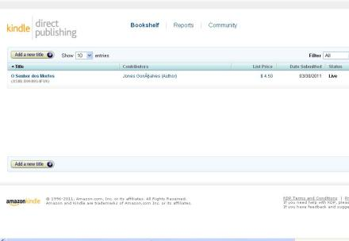
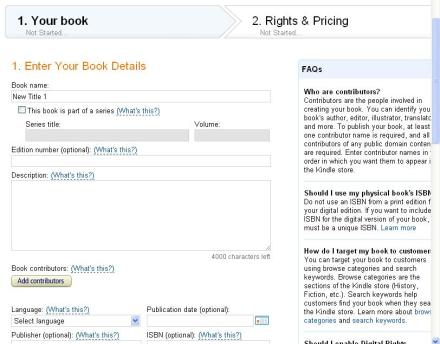

### [Minha experiência no Amazon.Kindle, ou como colocar seus trabalhos no Kindle](http://www.onerdescritor.com.br/2011/04/minha-experiencia-no-amazon-kindle-ou-como-colocar-seus-trabalhos-no-kindle/)

**Autor:** Jones V. Gonçalves

Olá pessoas, meu nome é Jones VG e antes que alguns façam gracinhas a respeito das iniciais do sobrenome é Viana Gonçalves, leu isso Alisson! Pronto resolvido isso vamos ao motivo deste post especial, meu querido amigo J.G.Valério, ou Gunslinger, ou ainda O Nerd Escritor me pediu para colocar em linhas como foi o processo para publicar no formato do Kindle e por isso estou aqui.

Primeiro vamos a o motivo de eu ter feito isso, sim para tudo existe um motivo não é? Estava eu um belo dia olhando os posts de noticias quando me deparei com isso: [Garota ganha milhões](http://www.onerdescritor.com.br/2011/02/esta-garota-de-26-anos-ganha-milhoes-escrevendo-livros-apenas-para-kindle/), olhei a materia, li e reli pensando, mas como é possível, então fui atrás de alguns amigos meus que falam muito sobre eBooks, um deles meu ex-colega de trabalho Ilson Bolzan, o cara me disse que o sistema de venda do Kindle não é apenas para o eReader da Amazon, que existem aplicativos dele para IPhone, IPad, ITouch e Android, pasmem e todos eles vendem bastante, ali os meus olhos se abriram para um novo mercado.

Primeira coisa que fiz, corri para o Deus Google e perguntei ao grande oraculo que tudo sabe como fazer para publicar na Amazon, AppleStore e afins, ai entra em cena um outro amigo, Daniel Zannela, ele me aconselhou a ir de Amazon, pois a AppleStore não abriu sua loja de eBooks para publicações na America Latina, o que a Amazon já havia feito. Corri de volta a divindade que tudo sabe e encontrei este site: [Amazon Kindle Self Publish](https://kdp.amazon.com/self-publishing/signin), sim um site da própria Amazon que te deixa auto publicar.

Fiz meu cadastro no site como autor indie (Não sabe o que é Indie, beleza, é o autor que publica a la loca, sem ter editora por trás dele, o termo serve para desenvolvedores de software, autores e qualquer outro tipo de artista), li o contrato, se você não é bom no inglês arranje alguém de confiança para ler para você, até ali tudo bem, me atiraram nesta pagina: ?

  
A partir dali foi uma correria para conseguir capa, terminar o trabalho de revisão e tudo o mais, para enfim chegar lá e clicar naquele botãozinho de Add a new Title . Então começou novamente o desespero, sim, desespero, diagramar o livro para ficar do tamanho certo, pagina A5, lembrar que tinha de ter índice, agradecimentos, colocar os inícios de capítulos sempre em uma nova página, e lembrar de todos estes detalhes, criar uma sinopse, sim, este é um passo importante, na página de publicação dizer se o trabalho é domínio público ou não, escolher em quais países o titulo será lançado, pois se os direitos não são todos seus para o lançamento em algum país tem de exclui-lo de sua lista, colocar também proteção contra cópia ou não, dizer quem é o autor, co-autor e tudo mais, ai depois de tudo isso terminado mandar continuar. Querem a telinha de criação de um novo título, é uma tela comprida, mas esta ai:

  
Ai depois de fazer o Upload e conversão do arquivo vai pra aba de Rights and Pricing, vou ser sincero, o que mais motivou a publicar no Kindle foram os 70% de direitos autorais, sim, sou mercenário, admito isso. Minha surpresa foi grande quando vi que para o Brasil o valor cai para 35% , é melhor do as editoras oferecem, sim é melhor do que os 10% das editoras, mas ainda não é os 70%. Então nesta pagina você escolhe a porcentagem que quer ter de retorno pela venda da sua obra, nós do Brasil ficamos com os 35%, o pessoal dos EUA podem escolher 70%.  Ai o interessante, você coloca o valor que quer negociar a sua obra, vai lá e coloca seu preço, coloquei U$ 4.50 por que sou iniciante e quero vender né gente. Então a Amazon calcula os encargos e coloca em U$ 6.50, não ficou caro, para um livro de 375 pgs você pagar R$ 11.05 é um precinho bacana.

Depois de fazer tudo isso o seu trabalho vai para uma revisão deles, que leva de três a quatro dias uteis, ali eles vêem por cima se não é uma obra já escrita por outro autor, o conteúdo e então depois destes dias se o livro passar por esta avaliação iniciam o processo de publicação, mais 24 horas de espera para que o livro seja publicado. Ai se tudo deu certo você estará recebendo um e-mail dizendo que seu livro foi publicado e lhe dizendo o link dele dentro do site da Amazon. No meu caso o link é esse: [O Senhor dos Mortos](http://www.amazon.com/dp/B004UG4FVK).

E você acha que acabamos por aqui, não, dentro da tela Direct Publishing você ainda pode ver reports das suas vendas, de todos os livros que tiver publicado, e entrar na comunidade do Kindle. E era isso pessoal, esta foi a minha experiência em publicar na Amazon, já tive vendas você me pergunta, sim já tive vendas, não muitas até agora é verdade, mas como disse sou apenas um iniciante dando a cara a tapa! O que você está esperando para ser mais um?

### Divulgue!

- [Share on Tumblr](http://www.tumblr.com/share/link/?url=http%3A%2F%2Fwww.onerdescritor.com.br%2F2011%2F04%2Fminha-experiencia-no-amazon-kindle-ou-como-colocar-seus-trabalhos-no-kindle%2F&name=Minha%20experi%C3%AAncia%20no%20Amazon.Kindle%2C%20ou%20como%20colocar%20seus%20trabalhos%20no%20Kindle "Share on Tumblr")
.

Categorias: [Sem Assunto](http://www.onerdescritor.com.br/category/sem-assunto/) | Tags: [Jones V. Gonçalves](http://www.onerdescritor.com.br/tag/jones-v-goncalves/), [Kindle](http://www.onerdescritor.com.br/tag/kindle/), [o senhor dos mortos](http://www.onerdescritor.com.br/tag/o-senhor-dos-mortos/)

## 78 Comments[»](http://www.onerdescritor.com.br/2011/04/minha-experiencia-no-amazon-kindle-ou-como-colocar-seus-trabalhos-no-kindle/#postcomment "Leave a comment")

-  [The Gunslinger](http://www.onerdescritor.com.br/)

  [04/04/2011 at 21:23](http://www.onerdescritor.com.br/2011/04/minha-experiencia-no-amazon-kindle-ou-como-colocar-seus-trabalhos-no-kindle/comment-page-1/#comment-53217)

  Vou te dizer, que da mesma forma que você se perguntou como é possível, me perguntei o mesmo quando você twittou dizendo que já tinha colocado um livro seu lá! [anexo ausente]  
  —  
  Ai tive que lhe pedir esta explicacão!

  [Reply](http://www.onerdescritor.com.br/2011/04/minha-experiencia-no-amazon-kindle-ou-como-colocar-seus-trabalhos-no-kindle/#comment-53217)

  -  [JonesVG](http://www.dirtemprium.webs.com/)

    [04/04/2011 at 21:30](http://www.onerdescritor.com.br/2011/04/minha-experiencia-no-amazon-kindle-ou-como-colocar-seus-trabalhos-no-kindle/comment-page-1/#comment-53222)

    He he he he Sim, sim, cara foi meio que rápido, por que tudo é você quem faz, escreveu, revisou, conseguiu uma capa bacana, coloca lá e espera 4 ou cinco dias, pronto! Novamente dei a cara a tapa e vamos ver no que vai dar! he he he he

    [Reply](http://www.onerdescritor.com.br/2011/04/minha-experiencia-no-amazon-kindle-ou-como-colocar-seus-trabalhos-no-kindle/#comment-53222)

    - [anexo ausente] [Sonia](http://www.ipati.org/)

      [02/02/2012 at 10:54](http://www.onerdescritor.com.br/2011/04/minha-experiencia-no-amazon-kindle-ou-como-colocar-seus-trabalhos-no-kindle/comment-page-1/#comment-136017)

      Oi Jones,  
      vi seu relato e me interessei. POderia, por favor, ainda informar qual é o programa requerido para envio do material e se seus compradores foram só brasileiros?  
      grata.

      [Reply](http://www.onerdescritor.com.br/2011/04/minha-experiencia-no-amazon-kindle-ou-como-colocar-seus-trabalhos-no-kindle/#comment-136017)

      -  [JonesVG](http://gamezandmoregamez.webs.com/)

        [20/10/2012 at 21:48](http://www.onerdescritor.com.br/2011/04/minha-experiencia-no-amazon-kindle-ou-como-colocar-seus-trabalhos-no-kindle/comment-page-1/#comment-200274)

        Bah, não faço ideia! Posso dar uma olhada, mas acho que e sem galho!

        [Reply](http://www.onerdescritor.com.br/2011/04/minha-experiencia-no-amazon-kindle-ou-como-colocar-seus-trabalhos-no-kindle/#comment-200274)
-  [STW](http://merhor.blogspot.com/)

  [04/04/2011 at 21:29](http://www.onerdescritor.com.br/2011/04/minha-experiencia-no-amazon-kindle-ou-como-colocar-seus-trabalhos-no-kindle/comment-page-1/#comment-53220)

  Caracas, valeu demais por essa postagem. Eu obtive certo fracasso tentando mexer no Kindle, logo depois de ler aquela mesma notícia.

  Saber que você já conseguiu vendas me anima ainda mais, definitivamente vou tentar aproveitar essa ferramenta!!

  [Reply](http://www.onerdescritor.com.br/2011/04/minha-experiencia-no-amazon-kindle-ou-como-colocar-seus-trabalhos-no-kindle/#comment-53220)

  -  [JonesVG](http://www.dirtemprium.webs.com/)

    [04/04/2011 at 21:32](http://www.onerdescritor.com.br/2011/04/minha-experiencia-no-amazon-kindle-ou-como-colocar-seus-trabalhos-no-kindle/comment-page-1/#comment-53223)

    Cara aproveita, este é o momento de fazer crescer aqui no Brasil este modelo de literatura digital, não que ela vá substituir o papel, não, como a Sammy e o Guns já disseram nada substitui o cheiro de livro novo, mas ainda assim é uma ferramenta muito util para nós iniciantes que não temos uma editora pra auxiliar na jornada.

    [Reply](http://www.onerdescritor.com.br/2011/04/minha-experiencia-no-amazon-kindle-ou-como-colocar-seus-trabalhos-no-kindle/#comment-53223)

    -  [STW](http://merhor.blogspot.com/)

      [04/04/2011 at 21:45](http://www.onerdescritor.com.br/2011/04/minha-experiencia-no-amazon-kindle-ou-como-colocar-seus-trabalhos-no-kindle/comment-page-1/#comment-53225)

      Eu só preciso terminar de escrever meu livro antes, só espero que tudo ainda seja “fácil” desse jeito até ele estar pronto.

      Outra coisa: Se você consegue um certo sucesso numa publicação online como essa, partir para o livro impresso deve se tornar muito mais fácil e fluido, assim que você ganha notoriedade para as editoras.

      [Reply](http://www.onerdescritor.com.br/2011/04/minha-experiencia-no-amazon-kindle-ou-como-colocar-seus-trabalhos-no-kindle/#comment-53225)

      -  [JonesVG](http://www.dirtemprium.webs.com/)

        [04/04/2011 at 21:51](http://www.onerdescritor.com.br/2011/04/minha-experiencia-no-amazon-kindle-ou-como-colocar-seus-trabalhos-no-kindle/comment-page-1/#comment-53226)

        Essa é uma das idéias, como ali você tem certinho o gráfico de suas vendas se ele tiver ido bem consegue apresentar estes números pra eles. E a outra idéia ainda é segredo, mas quando conseguir fazer dar certo eu aviso aqui! he he he he

        [Reply](http://www.onerdescritor.com.br/2011/04/minha-experiencia-no-amazon-kindle-ou-como-colocar-seus-trabalhos-no-kindle/#comment-53226)
    -  [The Gunslinger](http://www.onerdescritor.com.br/)

      [04/04/2011 at 22:21](http://www.onerdescritor.com.br/2011/04/minha-experiencia-no-amazon-kindle-ou-como-colocar-seus-trabalhos-no-kindle/comment-page-1/#comment-53229)

      Um problema na compra itens importados são os impostos brasileiros. E agora com o aumento da IOF, nem os livros digitais da Amazon escapam, pois o pagamento certamente será via cartão de crédito. Dêem uma olhada neste post do Tecnoblog (<http://tecnoblog.net/60586/bia-kunze-iof-tiro-no-pe-do-crescimento-industrial-brasileiro/>)  
      —  
      Os impostos deste país atrasam o desenvolvimento de qualquer coisa. 

      [Reply](http://www.onerdescritor.com.br/2011/04/minha-experiencia-no-amazon-kindle-ou-como-colocar-seus-trabalhos-no-kindle/#comment-53229)

      -  Samila

        [06/04/2011 at 08:51](http://www.onerdescritor.com.br/2011/04/minha-experiencia-no-amazon-kindle-ou-como-colocar-seus-trabalhos-no-kindle/comment-page-1/#comment-53448)

        Malditos impostos! já não bastava eu ter que lidar com eles todo dia no trabalho, tenho que aguentá-los até na literatura?! SHIT

        [Reply](http://www.onerdescritor.com.br/2011/04/minha-experiencia-no-amazon-kindle-ou-como-colocar-seus-trabalhos-no-kindle/#comment-53448)
      - [anexo ausente] [Celson](http://anybit.net/)

        [08/10/2013 at 07:24](http://www.onerdescritor.com.br/2011/04/minha-experiencia-no-amazon-kindle-ou-como-colocar-seus-trabalhos-no-kindle/comment-page-1/#comment-210254)

        De acordo com um post no blog Vida sem papel – <http://www.vidasempapel.com.br/como-migrar-para-a-loja-brasileira-da-amazon/> – você pode migrar para a conta brasileira na Kindle Store e pode comprar com cartão de crédito sem pagar IOF. Veja nos comentários daquele post uma resposta da autora a um visitante.

        [Reply](http://www.onerdescritor.com.br/2011/04/minha-experiencia-no-amazon-kindle-ou-como-colocar-seus-trabalhos-no-kindle/#comment-210254)
-  Marcos Sartori

  [05/04/2011 at 01:56](http://www.onerdescritor.com.br/2011/04/minha-experiencia-no-amazon-kindle-ou-como-colocar-seus-trabalhos-no-kindle/comment-page-1/#comment-53264)

  Nossa muito legal o post…  
  Parabens Jones pela iniciativa e obrigado pelo passo a passo.

  [Reply](http://www.onerdescritor.com.br/2011/04/minha-experiencia-no-amazon-kindle-ou-como-colocar-seus-trabalhos-no-kindle/#comment-53264)

  -  Luis

    [05/04/2011 at 06:38](http://www.onerdescritor.com.br/2011/04/minha-experiencia-no-amazon-kindle-ou-como-colocar-seus-trabalhos-no-kindle/comment-page-1/#comment-53289)

    Valeu Jones pela otima dica !! Graças a voce o meu livro Edryon ja vai se encontrar disponivel na Amazon.Kindle por apenas 2.99 doletas, hehe

    [Reply](http://www.onerdescritor.com.br/2011/04/minha-experiencia-no-amazon-kindle-ou-como-colocar-seus-trabalhos-no-kindle/#comment-53289)

    - [anexo ausente] [Jonevg](http://www.projetodeis.com.br/)

      [05/04/2011 at 07:00](http://www.onerdescritor.com.br/2011/04/minha-experiencia-no-amazon-kindle-ou-como-colocar-seus-trabalhos-no-kindle/comment-page-1/#comment-53293)

      Esse é o espirito Luis, inundar o Kindle com obras nacionais de qualidade, aquecer este mercado também.  
      –  
      Agora depois de publicar vem o segundo passo mais imporrtante: Publicidade! Faça contato com blogues, sites literários e de noticias e espalhe a sua publicação aos quatro ventos.  
      –  
      Ah sim, e não se esqueça de mandar aqui depois o link de publicação do livro! Abraços guri!

      [Reply](http://www.onerdescritor.com.br/2011/04/minha-experiencia-no-amazon-kindle-ou-como-colocar-seus-trabalhos-no-kindle/#comment-53293)

      -  [The Gunslinger](http://www.onerdescritor.com.br/)

        [05/04/2011 at 20:13](http://www.onerdescritor.com.br/2011/04/minha-experiencia-no-amazon-kindle-ou-como-colocar-seus-trabalhos-no-kindle/comment-page-1/#comment-53371)

        Que maneiro, espero que mais escritores aqui do ONE sigam a iniciativa do Jones e publiquem suas obras na Amazon. [anexo ausente]

        [Reply](http://www.onerdescritor.com.br/2011/04/minha-experiencia-no-amazon-kindle-ou-como-colocar-seus-trabalhos-no-kindle/#comment-53371)
-  Hamilton Saraiva

  [05/04/2011 at 16:39](http://www.onerdescritor.com.br/2011/04/minha-experiencia-no-amazon-kindle-ou-como-colocar-seus-trabalhos-no-kindle/comment-page-1/#comment-53353)

  Caro Jones, qual é o tamanho da letra do seu livro?

  Queria saber também se vc o escreveu no word.

  Espero respostas, e talvez eu experimente a ferramenta Kindle por causa deste excelente post.

  Vlw

  [Reply](http://www.onerdescritor.com.br/2011/04/minha-experiencia-no-amazon-kindle-ou-como-colocar-seus-trabalhos-no-kindle/#comment-53353)

  -  [JonesVG](http://www.dirtemprium.webs.com/)

    [05/04/2011 at 16:48](http://www.onerdescritor.com.br/2011/04/minha-experiencia-no-amazon-kindle-ou-como-colocar-seus-trabalhos-no-kindle/comment-page-1/#comment-53355)

    Hamilton, não te preocupa com tamanho de fonte, este dado não importa, pois epub despreza o tamanho de fonte para que o usuário possa seta-lo de acordo com a preferência dele.  
    –  
    Sim, eu submeti um .Doc do word, mas pode-se enviar PDF, RTF, TXT, pois na hora da conversão apenas o texto é o que interessa, as únicas formações que não são desprezadas são Itálico, Negrito, Inicio de parágrafo e sublinhado, o restante é desprezado para que o aparelho que vai receber o arquivo possa acomodar ele da melhor forma possível e que o usuário tenha liberdade de setar cores, fontes e fazer suas marcações no texto da forma que lhe for melhor.  
    –  
    Acho que era isso carinha. Qualquer coisa é só perguntar!

    [Reply](http://www.onerdescritor.com.br/2011/04/minha-experiencia-no-amazon-kindle-ou-como-colocar-seus-trabalhos-no-kindle/#comment-53355)

    -  Hamilton Saraiva

      [06/04/2011 at 13:12](http://www.onerdescritor.com.br/2011/04/minha-experiencia-no-amazon-kindle-ou-como-colocar-seus-trabalhos-no-kindle/comment-page-1/#comment-53465)

      Cara, vc me encorajou a tentar publicar no kindle, mas ao mesmo tempo me assustou :D!

      Toda aquela conversa sobre diagramar o livro e talz, é completamente amedrontadora para alguém como eu que não sabe nem abrir um page maker!

      De qualquer forma, vlw pelas dicas, e seu sei que seu texto vai ajudar muitos escritores aqui no ONE.

      Vlw!

      [Reply](http://www.onerdescritor.com.br/2011/04/minha-experiencia-no-amazon-kindle-ou-como-colocar-seus-trabalhos-no-kindle/#comment-53465)

      -  [JonesVG](http://www.dirtemprium.webs.com/)

        [06/04/2011 at 13:24](http://www.onerdescritor.com.br/2011/04/minha-experiencia-no-amazon-kindle-ou-como-colocar-seus-trabalhos-no-kindle/comment-page-1/#comment-53467)

        Ah não Hamilton, a diagramação que me refiro é aquela coisa de colocar a formatação de parágrafos, arrumar para que os capítulos iniciem sempre em uma página nova e talz, nada de pagemaker e qualquer outra ferramenta. Por que o Kindle vai adequar o texto ao aparelho que esta sendo usado para a leitura, então estes ajustes mais refinados de diagramação se perdem.

        [Reply](http://www.onerdescritor.com.br/2011/04/minha-experiencia-no-amazon-kindle-ou-como-colocar-seus-trabalhos-no-kindle/#comment-53467)
-  Samila

  [06/04/2011 at 08:53](http://www.onerdescritor.com.br/2011/04/minha-experiencia-no-amazon-kindle-ou-como-colocar-seus-trabalhos-no-kindle/comment-page-1/#comment-53449)

  Nhai, que legal! se eu tivesse um Kindle… xD

  [Reply](http://www.onerdescritor.com.br/2011/04/minha-experiencia-no-amazon-kindle-ou-como-colocar-seus-trabalhos-no-kindle/#comment-53449)

  -  [JonesVG](http://www.dirtemprium.webs.com/)

    [06/04/2011 at 09:21](http://www.onerdescritor.com.br/2011/04/minha-experiencia-no-amazon-kindle-ou-como-colocar-seus-trabalhos-no-kindle/comment-page-1/#comment-53452)

    Ah Sammy, mas não precisa ter Kindle he he he, pode ser em um IPad, ou no Galaxi Tab que é Android he he he ou no IPhone, he he he brincadeirinha.

    [Reply](http://www.onerdescritor.com.br/2011/04/minha-experiencia-no-amazon-kindle-ou-como-colocar-seus-trabalhos-no-kindle/#comment-53452)

    -  Samila

      [06/04/2011 at 11:41](http://www.onerdescritor.com.br/2011/04/minha-experiencia-no-amazon-kindle-ou-como-colocar-seus-trabalhos-no-kindle/comment-page-1/#comment-53461)

      Ah, se eu tivesse qualquer um desses XD

      [Reply](http://www.onerdescritor.com.br/2011/04/minha-experiencia-no-amazon-kindle-ou-como-colocar-seus-trabalhos-no-kindle/#comment-53461)

      -  [JonesVG](http://www.dirtemprium.webs.com/)

        [06/04/2011 at 13:25](http://www.onerdescritor.com.br/2011/04/minha-experiencia-no-amazon-kindle-ou-como-colocar-seus-trabalhos-no-kindle/comment-page-1/#comment-53468)

        He he he he confesso que também não tenho, mas o próximo passo é comprar um destes he he he he

        [Reply](http://www.onerdescritor.com.br/2011/04/minha-experiencia-no-amazon-kindle-ou-como-colocar-seus-trabalhos-no-kindle/#comment-53468)

        -  Samila

          [06/04/2011 at 14:45](http://www.onerdescritor.com.br/2011/04/minha-experiencia-no-amazon-kindle-ou-como-colocar-seus-trabalhos-no-kindle/comment-page-1/#comment-53476)

          Ainda tô sem grana até para comprar um celular XD  
          \*anda com um celular remendado com fita adesiva\*
        - [anexo ausente] [Ílson Bolzan](http://twitter.com/ilbolzan)

          [08/06/2011 at 09:19](http://www.onerdescritor.com.br/2011/04/minha-experiencia-no-amazon-kindle-ou-como-colocar-seus-trabalhos-no-kindle/comment-page-1/#comment-68178)

          Samila e Jones,  
          Só lembrando que existe kindle pra PC também.  
          eu leio todos os meus livros no pc, enquanto não consigo um kindle xD
-  Luis

  [08/04/2011 at 04:09](http://www.onerdescritor.com.br/2011/04/minha-experiencia-no-amazon-kindle-ou-como-colocar-seus-trabalhos-no-kindle/comment-page-1/#comment-53769)

  Ateh que enfim ! Meu livro “Edryon” jah foi publicado na Amazon.Kindle, hehe

  Quem quiser conferir, o link para a compra eh este :

  <http://www.amazon.com/Edryon-Portuguese-Edition-ebook/dp/B004VF61VC/ref=sr_1_1?ie=UTF8&qid=1302246450&sr=8-1>

  Ou se achar mais facil, procura por “edryon” lah na barra de buscas.

  Valeu !

  [Reply](http://www.onerdescritor.com.br/2011/04/minha-experiencia-no-amazon-kindle-ou-como-colocar-seus-trabalhos-no-kindle/#comment-53769)
-  [Ana Bourg](http://anahelblack.blogspot.com/)

  [08/04/2011 at 06:16](http://www.onerdescritor.com.br/2011/04/minha-experiencia-no-amazon-kindle-ou-como-colocar-seus-trabalhos-no-kindle/comment-page-1/#comment-53783)

  não sou chegada em produtos da mac.  
  mas usuários da mac são consumistas e se quiserem comprar algum livro que escrevi, estamos aqui para isso [anexo ausente]  
  \*mercenária\*

  Ainda abro uma conta no negócio aí.  
  xD

  [Reply](http://www.onerdescritor.com.br/2011/04/minha-experiencia-no-amazon-kindle-ou-como-colocar-seus-trabalhos-no-kindle/#comment-53783)
-  [Álisson](http://depositodecontos.blogspot.com/)

  [11/04/2011 at 10:59](http://www.onerdescritor.com.br/2011/04/minha-experiencia-no-amazon-kindle-ou-como-colocar-seus-trabalhos-no-kindle/comment-page-1/#comment-54319)

  Muito bom, amigo Jones ViaGara [anexo ausente]

  [Reply](http://www.onerdescritor.com.br/2011/04/minha-experiencia-no-amazon-kindle-ou-como-colocar-seus-trabalhos-no-kindle/#comment-54319)

  -  [JonesVG](http://www.dirtemprium.webs.com/)

    [12/04/2011 at 20:34](http://www.onerdescritor.com.br/2011/04/minha-experiencia-no-amazon-kindle-ou-como-colocar-seus-trabalhos-no-kindle/comment-page-1/#comment-54561)

    Não disse que o engraçadinho ia aparecer huahuahauhauhauhauahuah

    [Reply](http://www.onerdescritor.com.br/2011/04/minha-experiencia-no-amazon-kindle-ou-como-colocar-seus-trabalhos-no-kindle/#comment-54561)
- [anexo ausente] waldon

  [16/04/2011 at 16:55](http://www.onerdescritor.com.br/2011/04/minha-experiencia-no-amazon-kindle-ou-como-colocar-seus-trabalhos-no-kindle/comment-page-1/#comment-55199)

  Pena que eles pagam os direitos autorais por cheque, descontar no Brasil deve ser ruim.

  [Reply](http://www.onerdescritor.com.br/2011/04/minha-experiencia-no-amazon-kindle-ou-como-colocar-seus-trabalhos-no-kindle/#comment-55199)
- [anexo ausente] valmar ferreira mares

  [03/05/2011 at 23:51](http://www.onerdescritor.com.br/2011/04/minha-experiencia-no-amazon-kindle-ou-como-colocar-seus-trabalhos-no-kindle/comment-page-1/#comment-59358)

  Precisa ter conta em algum banco para poder postar o livro no Kindle? Gostaria de saber, pois adoraria postar um livro lá e não tenho conta… :S

  [Reply](http://www.onerdescritor.com.br/2011/04/minha-experiencia-no-amazon-kindle-ou-como-colocar-seus-trabalhos-no-kindle/#comment-59358)
- [anexo ausente] [Matheus palmieri](http://comicandmanga.blogspot.com/)

  [09/05/2011 at 16:01](http://www.onerdescritor.com.br/2011/04/minha-experiencia-no-amazon-kindle-ou-como-colocar-seus-trabalhos-no-kindle/comment-page-1/#comment-60435)

  muito bom, vou publicar em inglês, eu quero destina isso ao publico americano, nada contra o Brasil, mais aqui isso não vinga como lá.  
  uma dica, visitem o meu site, [http://www.comicandmanga.blogspot.com](http://www.comicandmanga.blogspot.com/)  
  lá vcs vão ver como eu sou bom com ilustrações, tenho meu preço, mais a qualidade é excepcional.

  [Reply](http://www.onerdescritor.com.br/2011/04/minha-experiencia-no-amazon-kindle-ou-como-colocar-seus-trabalhos-no-kindle/#comment-60435)

  - [anexo ausente] Jussara

    [20/02/2012 at 21:35](http://www.onerdescritor.com.br/2011/04/minha-experiencia-no-amazon-kindle-ou-como-colocar-seus-trabalhos-no-kindle/comment-page-1/#comment-139477)

    Pessoal! Tudo certo? Tenho uma dúvida que não consigo sanar. Estou com um livro pronto para enviar para a Amazon, mas não consigo saber como receber os royalties. Que banco é possível usar para receber os depositos?  
    Como vocês fizeram? Agradeço desde já.  
    Jussara

    [Reply](http://www.onerdescritor.com.br/2011/04/minha-experiencia-no-amazon-kindle-ou-como-colocar-seus-trabalhos-no-kindle/#comment-139477)
-  Franz Lima

  [12/05/2011 at 17:09](http://www.onerdescritor.com.br/2011/04/minha-experiencia-no-amazon-kindle-ou-como-colocar-seus-trabalhos-no-kindle/comment-page-1/#comment-61094)

  Ótima dica, Jones. Vou, com um certo tempo, preparar algo para publicar através deste método. Valeu, meu amigo!

  [Reply](http://www.onerdescritor.com.br/2011/04/minha-experiencia-no-amazon-kindle-ou-como-colocar-seus-trabalhos-no-kindle/#comment-61094)
-  [wanessa](http://wanessamaciel.wordpress.com/)

  [06/06/2011 at 12:34](http://www.onerdescritor.com.br/2011/04/minha-experiencia-no-amazon-kindle-ou-como-colocar-seus-trabalhos-no-kindle/comment-page-1/#comment-67611)

  Alguem pode me explicar p que é aquele routing number utilizado no amazon pros depositos? estou tentando colocar meu ebook la, mas travei nessa parte. :/

  [Reply](http://www.onerdescritor.com.br/2011/04/minha-experiencia-no-amazon-kindle-ou-como-colocar-seus-trabalhos-no-kindle/#comment-67611)
-  [wanessa](http://wanessamaciel.wordpress.com/)

  [06/06/2011 at 18:00](http://www.onerdescritor.com.br/2011/04/minha-experiencia-no-amazon-kindle-ou-como-colocar-seus-trabalhos-no-kindle/comment-page-1/#comment-67652)

  Pessoal, eu achei na net o “routing number” 066010869, do “BANCO ITAU EUROPA INTERNATIONAL” pq meu banco é o itau, entao procurei o dele, mas essa info esta correta? alguem ae q publicou no amazon tem conta no itau e sabe desse tipo de informação??  
  abs

  [Reply](http://www.onerdescritor.com.br/2011/04/minha-experiencia-no-amazon-kindle-ou-como-colocar-seus-trabalhos-no-kindle/#comment-67652)

  -  [JonesVG](http://www.dirtemprium.webs.com/)

    [08/06/2011 at 09:05](http://www.onerdescritor.com.br/2011/04/minha-experiencia-no-amazon-kindle-ou-como-colocar-seus-trabalhos-no-kindle/comment-page-1/#comment-68175)

    Wanessa, o routing number é um número para se fazer wire transfer, para pagamentos ao Brasil a Amazon não usa este tipo de transferência, mas sim o envio de cheque ou algo assim.

    [Reply](http://www.onerdescritor.com.br/2011/04/minha-experiencia-no-amazon-kindle-ou-como-colocar-seus-trabalhos-no-kindle/#comment-68175)

    -  [wanessa](http://wanessamaciel.wordpress.com/)

      [08/06/2011 at 09:31](http://www.onerdescritor.com.br/2011/04/minha-experiencia-no-amazon-kindle-ou-como-colocar-seus-trabalhos-no-kindle/comment-page-1/#comment-68183)

      Mas Jones, qd eu escolho no meu perfil “amazon.com” como forma d pagamento e venda e tal, ele me da apenas 3 cxs p/preencher: nome do banco, account number e esse routing number, e me obriga a preencher os 3 ou o ebook nao vai a venda.  
      Como vcs fizeram pra dar td certinho? O q precisaram preencher??

      [Reply](http://www.onerdescritor.com.br/2011/04/minha-experiencia-no-amazon-kindle-ou-como-colocar-seus-trabalhos-no-kindle/#comment-68183)

      -  [JonesVG](http://www.dirtemprium.webs.com/)

        [08/06/2011 at 17:46](http://www.onerdescritor.com.br/2011/04/minha-experiencia-no-amazon-kindle-ou-como-colocar-seus-trabalhos-no-kindle/comment-page-1/#comment-68255)

        Pra mim isso não apareceu Wanessa, não sei o que pode ser então.

        [Reply](http://www.onerdescritor.com.br/2011/04/minha-experiencia-no-amazon-kindle-ou-como-colocar-seus-trabalhos-no-kindle/#comment-68255)
-  [wanessa](http://wanessamaciel.wordpress.com/)

  [08/06/2011 at 08:45](http://www.onerdescritor.com.br/2011/04/minha-experiencia-no-amazon-kindle-ou-como-colocar-seus-trabalhos-no-kindle/comment-page-1/#comment-68170)

  Bom, pessoal, finalmente consegui coloar meu ebook no amazon tb, e como pedido, aqui está o link.  
  <http://www.amazon.com/Entre-C%C3%A9u-Inferno-Portuguese-ebook/dp/B0054LOHWM/ref=sr_1_1?s=digital-text&ie=UTF8&qid=1307533170&sr=1-1>

  Mas eu ainda gostaria da confirmação das minhas perguntas anteriores, se alguém pudesse me ajudar. Vlw!

  [Reply](http://www.onerdescritor.com.br/2011/04/minha-experiencia-no-amazon-kindle-ou-como-colocar-seus-trabalhos-no-kindle/#comment-68170)

  - [anexo ausente] [Manoel Amaral](http://osvandir.blogspot.com.br/)

    [05/11/2013 at 16:14](http://www.onerdescritor.com.br/2011/04/minha-experiencia-no-amazon-kindle-ou-como-colocar-seus-trabalhos-no-kindle/comment-page-1/#comment-210423)

    Wanessa,

    Nem sei se vai ler isto, mas o seu link não está funcionando. É bom verificar na Amazon.

    [Reply](http://www.onerdescritor.com.br/2011/04/minha-experiencia-no-amazon-kindle-ou-como-colocar-seus-trabalhos-no-kindle/#comment-210423)
- [anexo ausente] lobaempeledeovelha

  [27/06/2011 at 11:23](http://www.onerdescritor.com.br/2011/04/minha-experiencia-no-amazon-kindle-ou-como-colocar-seus-trabalhos-no-kindle/comment-page-1/#comment-73922)

  Bacana o post ^^

  [Reply](http://www.onerdescritor.com.br/2011/04/minha-experiencia-no-amazon-kindle-ou-como-colocar-seus-trabalhos-no-kindle/#comment-73922)
- [anexo ausente] Stephanie

  [14/12/2011 at 10:58](http://www.onerdescritor.com.br/2011/04/minha-experiencia-no-amazon-kindle-ou-como-colocar-seus-trabalhos-no-kindle/comment-page-1/#comment-124539)

  Ai, ve se vc pode me ajudar…  
  Preciso publicar umas obras, mas de autor falecido, vc sabe como devo fazer?

  [Reply](http://www.onerdescritor.com.br/2011/04/minha-experiencia-no-amazon-kindle-ou-como-colocar-seus-trabalhos-no-kindle/#comment-124539)
- [anexo ausente] [Sonia](http://www.ipati.org/)

  [02/02/2012 at 10:50](http://www.onerdescritor.com.br/2011/04/minha-experiencia-no-amazon-kindle-ou-como-colocar-seus-trabalhos-no-kindle/comment-page-1/#comment-136016)

  Oi Jones,  
  me interessei pelo que vc contou. Poderia informar em que programa deve ser entregue para avaliação?  
  E se quem vem adquirindo seu livro são brasileiros?  
  aguardo.

  [Reply](http://www.onerdescritor.com.br/2011/04/minha-experiencia-no-amazon-kindle-ou-como-colocar-seus-trabalhos-no-kindle/#comment-136016)
- [anexo ausente] Marcia

  [09/02/2012 at 18:13](http://www.onerdescritor.com.br/2011/04/minha-experiencia-no-amazon-kindle-ou-como-colocar-seus-trabalhos-no-kindle/comment-page-1/#comment-137412)

  Oi, publiquei na amazon.com e correu tudo bem, inclusive ja fiz algumas vendas.

  Minha dúvida é quanto ao pg dos direitos, se vc puder me dar uma luz eu agradeço:

  1 – não consigo cadastrar meu banco como opção para receber, o site da amazon pede Número de roteamento que eu não sei o que é, parece que são 9 números. A pergunta é: vc recebe em cheques ? e isso é seguro ?

  2 – vendi alguns exemplares e no relatório aparece tudo direitinho mas no total aparece como 0,00 para mim, sabe pq ?

  [Reply](http://www.onerdescritor.com.br/2011/04/minha-experiencia-no-amazon-kindle-ou-como-colocar-seus-trabalhos-no-kindle/#comment-137412)
- [anexo ausente] [Adalberto Sentinello](http://www.animeris.com/)

  [25/06/2012 at 09:39](http://www.onerdescritor.com.br/2011/04/minha-experiencia-no-amazon-kindle-ou-como-colocar-seus-trabalhos-no-kindle/comment-page-1/#comment-179575)

  Eu montei o www pt animeris pt com que faz tudo isso e é mais fácil de publicar.  
  Não há custo  
  Você coloca o preço  
  Nós coletamos e pagamos via PagSeguro  
  Não é revisão  
  É só salvar a obra completa em PDF e a Capa em JPEG  
  Pode ser lido em qualquer terminal e ainda imprimir

  [Reply](http://www.onerdescritor.com.br/2011/04/minha-experiencia-no-amazon-kindle-ou-como-colocar-seus-trabalhos-no-kindle/#comment-179575)
- [anexo ausente] esdras cordeiro

  [11/08/2012 at 18:41](http://www.onerdescritor.com.br/2011/04/minha-experiencia-no-amazon-kindle-ou-como-colocar-seus-trabalhos-no-kindle/comment-page-1/#comment-194854)

  ei JG, preciso saber como colocar uma conta bancária no site da amazon pq eu não tenho contas nos estados unidos

  [Reply](http://www.onerdescritor.com.br/2011/04/minha-experiencia-no-amazon-kindle-ou-como-colocar-seus-trabalhos-no-kindle/#comment-194854)

  -  JonesVG

    [21/01/2013 at 08:49](http://www.onerdescritor.com.br/2011/04/minha-experiencia-no-amazon-kindle-ou-como-colocar-seus-trabalhos-no-kindle/comment-page-1/#comment-204999)

    Agora não precisa mais ter conta nos estados unidos, com a Amazon Brasil vc pode cadastrar a conta brasileira.

    [Reply](http://www.onerdescritor.com.br/2011/04/minha-experiencia-no-amazon-kindle-ou-como-colocar-seus-trabalhos-no-kindle/#comment-204999)
- [anexo ausente] Ana Liliam

  [02/09/2012 at 15:55](http://www.onerdescritor.com.br/2011/04/minha-experiencia-no-amazon-kindle-ou-como-colocar-seus-trabalhos-no-kindle/comment-page-1/#comment-198847)

  Olá Jones, estou procurando como publicar pela Amazon e encontrei seu post! Muito legal, já dá para tirar muitas dúvidas. Mesmo que seja possível publicar em português, pretendo publicar em inglês, pois creio que há um mercado bem maior. E para colocar no kindle, foi você mesmo que fez? Deu muito trabalho, ou é tranquilo, apenas com a atenção de colocar todas as exigências? Esta foi sua primeira experiência com o kindle? E uma última, você sabe como registrar o livro nos EUA? Desculpe por tantas perguntas, obrigada,Ana Liliam

  [Reply](http://www.onerdescritor.com.br/2011/04/minha-experiencia-no-amazon-kindle-ou-como-colocar-seus-trabalhos-no-kindle/#comment-198847)
- [anexo ausente] [Janete Maia](http://janete-maia.blogspot.com/)

  [20/10/2012 at 14:36](http://www.onerdescritor.com.br/2011/04/minha-experiencia-no-amazon-kindle-ou-como-colocar-seus-trabalhos-no-kindle/comment-page-1/#comment-200263)

  Olá Jones! Gostei muito da sua dica. Já tenho um material escrito e vou tentar. Gostaria de saber se o kindle aceita imagens no livro ou seja, um livro ilustrado.  
  Obrigada!

  [Reply](http://www.onerdescritor.com.br/2011/04/minha-experiencia-no-amazon-kindle-ou-como-colocar-seus-trabalhos-no-kindle/#comment-200263)

  -  [JonesVG](http://gamezandmoregamez.webs.com/)

    [20/10/2012 at 21:49](http://www.onerdescritor.com.br/2011/04/minha-experiencia-no-amazon-kindle-ou-como-colocar-seus-trabalhos-no-kindle/comment-page-1/#comment-200275)

    Bah, não faço, mas acho que não tem galho não!

    [Reply](http://www.onerdescritor.com.br/2011/04/minha-experiencia-no-amazon-kindle-ou-como-colocar-seus-trabalhos-no-kindle/#comment-200275)
  - [anexo ausente] [José Roitberg - jornalista](http://jipemania.com/coke)

    [20/01/2013 at 15:42](http://www.onerdescritor.com.br/2011/04/minha-experiencia-no-amazon-kindle-ou-como-colocar-seus-trabalhos-no-kindle/comment-page-1/#comment-204979)

    <https://kdp.amazon.com/self-publishing/help?topicId=A1B6GKJ79HC7AN> – lembre que são “16 tons de cinza…”

    [Reply](http://www.onerdescritor.com.br/2011/04/minha-experiencia-no-amazon-kindle-ou-como-colocar-seus-trabalhos-no-kindle/#comment-204979)
-  Bruno Vox

  [20/10/2012 at 17:31](http://www.onerdescritor.com.br/2011/04/minha-experiencia-no-amazon-kindle-ou-como-colocar-seus-trabalhos-no-kindle/comment-page-1/#comment-200266)

  Fui no google e procurei: como publicar na Amazon e caí nessa página aqui, muito bacana o site [anexo ausente]

  [Reply](http://www.onerdescritor.com.br/2011/04/minha-experiencia-no-amazon-kindle-ou-como-colocar-seus-trabalhos-no-kindle/#comment-200266)

  -  [The Gunslinger](http://www.onerdescritor.com.br/)

    [22/10/2012 at 18:05](http://www.onerdescritor.com.br/2011/04/minha-experiencia-no-amazon-kindle-ou-como-colocar-seus-trabalhos-no-kindle/comment-page-1/#comment-200411)

    Parabéns! [anexo ausente]

    [Reply](http://www.onerdescritor.com.br/2011/04/minha-experiencia-no-amazon-kindle-ou-como-colocar-seus-trabalhos-no-kindle/#comment-200411)
  -  JonesVG

    [21/01/2013 at 08:57](http://www.onerdescritor.com.br/2011/04/minha-experiencia-no-amazon-kindle-ou-como-colocar-seus-trabalhos-no-kindle/comment-page-1/#comment-205000)

    huahauhauhauhauhauhauhau  
    Só falta dizer que não sabia que tinha isso aqui?????

    [Reply](http://www.onerdescritor.com.br/2011/04/minha-experiencia-no-amazon-kindle-ou-como-colocar-seus-trabalhos-no-kindle/#comment-205000)
- [anexo ausente] [José Roitberg - jornalista](http://jipemania.com/coke)

  [20/01/2013 at 15:40](http://www.onerdescritor.com.br/2011/04/minha-experiencia-no-amazon-kindle-ou-como-colocar-seus-trabalhos-no-kindle/comment-page-1/#comment-204978)

  O que eu entendi pesquisando na Amazon BR é que os direitos de 70% existem para o Brasil também. É a opção de um ebook SELECT, “Selecionado”, que estaria mais corretamente indicado como “Exclusivo”. 70% se seu ebook for exclusivo da Amazon. É preciso pensar e pesar bem. Ser exclusivo da Amazon, significa, provavelmente, que você não poderá publicar também no Google Books, na Barnes & Noble e outras nacionais concorrentes que vieram ao mercado futuramente. Também é provável que signifique que você não irá poder publicar seu livro em papel em contrato com outra editora, caso isso seja interessante para você. Mantendo nos 35%, pelo que entendi, você fica livre para fazer o que quiser. Não é uma decisão simples.

  [Reply](http://www.onerdescritor.com.br/2011/04/minha-experiencia-no-amazon-kindle-ou-como-colocar-seus-trabalhos-no-kindle/#comment-204978)

  -  JonesVG

    [21/01/2013 at 08:47](http://www.onerdescritor.com.br/2011/04/minha-experiencia-no-amazon-kindle-ou-como-colocar-seus-trabalhos-no-kindle/comment-page-1/#comment-204998)

    Sim, agora quando eio a Amazon Brasil os direito no Brasil ficou em 70%, mas quando esta materia foi feita não existia a Amazon Brasil e os direitos eram de 35%, a Ebook Select é outra coisa, seu livro não precisa etar na Ebook Select para receber 70%, o meu não esta e eu recebo este valor, a Ebook select é um sistema de emprestimos de livros da Amazon, eles separam uma verba entre 2 e 3 milhões de reais, dolares ou euros, dependendo de onde é seu livro, e você recebe parte deste valor conforme o seu livro é acessado nos emprestimos, mas tem essa regra de exclusividade durante o periodo que o seu livro estiver no select, o que significa que no momento que vc quiser pode tirar o seu livro do select.

    [Reply](http://www.onerdescritor.com.br/2011/04/minha-experiencia-no-amazon-kindle-ou-como-colocar-seus-trabalhos-no-kindle/#comment-204998)
-  [cmoffatt](http://www.skynerd.com.br/misterk2)

  [20/01/2013 at 17:38](http://www.onerdescritor.com.br/2011/04/minha-experiencia-no-amazon-kindle-ou-como-colocar-seus-trabalhos-no-kindle/comment-page-1/#comment-204983)

  Uma coisa que eu gostaria de saber é como deve ser feito o envio do arquivo. Pode ser como .doc mesmo ou necessariamente é preciso converter para .epub?

  [Reply](http://www.onerdescritor.com.br/2011/04/minha-experiencia-no-amazon-kindle-ou-como-colocar-seus-trabalhos-no-kindle/#comment-204983)

  - [anexo ausente] [José Roitberg - jornalista](http://jipemania.com/coke)

    [20/01/2013 at 18:27](http://www.onerdescritor.com.br/2011/04/minha-experiencia-no-amazon-kindle-ou-como-colocar-seus-trabalhos-no-kindle/comment-page-1/#comment-204984)

    O formato nativo para o Kindle é o AZW da Amazon que é idêntico ao MOBI desprotegido. Não lê ePub. Para todos os que possuem eReaders ou pretendem publicar conteúdo, sugiro baixar o programa gratuito e já antigo, mas completíssimo chamado Calibre (qdo instalar vai ter opção em português). Com ele você pode converter rapidamente entre qualquer formato de livros digitais. ALém disso, gerencia seu eReader. <http://calibre-ebook.com/download>

    [Reply](http://www.onerdescritor.com.br/2011/04/minha-experiencia-no-amazon-kindle-ou-como-colocar-seus-trabalhos-no-kindle/#comment-204984)
  -  JonesVG

    [21/01/2013 at 07:48](http://www.onerdescritor.com.br/2011/04/minha-experiencia-no-amazon-kindle-ou-como-colocar-seus-trabalhos-no-kindle/comment-page-1/#comment-204995)

    Não é preciso converter, o proprio site da amazon converte quando vc envia, mas tem de seguir as normas de formatação de tamanhos de pagina, se não o livro corre o risco de ser banido da Amazon por não se adequar ao tamanho do Kindle.

    [Reply](http://www.onerdescritor.com.br/2011/04/minha-experiencia-no-amazon-kindle-ou-como-colocar-seus-trabalhos-no-kindle/#comment-204995)

    -  [cmoffatt](http://www.skynerd.com.br/misterk2)

      [21/01/2013 at 09:12](http://www.onerdescritor.com.br/2011/04/minha-experiencia-no-amazon-kindle-ou-como-colocar-seus-trabalhos-no-kindle/comment-page-1/#comment-205003)

      A minha dúvida é porque eu estou diagramando meu livro com muitas imagens. Tem uma no rodapé de cada página, mais um conjunto de slides ao final (como um apêndice). Além de usar tipologias diferentes em alguma parte.  
         
      Eu fiz tudo no Word mesmo. E como lá funciona no “What you see is what you get” ao exportar para PDF fica tudo perfeito.  
         
      Como ebooks são baseados em HTML, a minha dúvida é se ele comporta essa complexidade. Tentei ontem o Calibre e o MobiPocket mas são muito confusos e aparentemente limitados (não encontrei forma de embutir mais de um set de tipologia para uma publicação.  
         
      Mas se o próprio programa da Amazon fizer tudo “automagicamente”, ótimo! [anexo ausente]

      [Reply](http://www.onerdescritor.com.br/2011/04/minha-experiencia-no-amazon-kindle-ou-como-colocar-seus-trabalhos-no-kindle/#comment-205003)

      -  JonesVG

        [21/01/2013 at 09:17](http://www.onerdescritor.com.br/2011/04/minha-experiencia-no-amazon-kindle-ou-como-colocar-seus-trabalhos-no-kindle/comment-page-1/#comment-205004)

        Sim, tente exportar lá e ver o resultado ao final da exportação. A conversão é feita na hora mesmo direto do word, ebook, pdf entre outros.

        [Reply](http://www.onerdescritor.com.br/2011/04/minha-experiencia-no-amazon-kindle-ou-como-colocar-seus-trabalhos-no-kindle/#comment-205004)
      - [anexo ausente] [José Roitberg - jornalista](http://jipemania.com/coke)

        [21/01/2013 at 11:22](http://www.onerdescritor.com.br/2011/04/minha-experiencia-no-amazon-kindle-ou-como-colocar-seus-trabalhos-no-kindle/comment-page-1/#comment-205006)

        Toda a minha experiência com ebooks e com a tentativa de publicar algum tipo de periódico nestes formatos mobi, azw, epub etc, mostram que eles são péssimos para imagens. Não era a intenção inicial. É como se estivéssemos diagramando para um site da época do Windows 3.1 e modem lento de acesso discado. As limitações de html são grandes e o maior problema com imagens é que você não tem controle sobre a posição delas no leitor individual de cada cliente. Não é possível saber, prever ou ter uma opção controlável se a pessoa vai ler na vertical, na horizontal, com letras pequenas, com letras grandes, com margens, sem margens. Assim sendo, a única forma que encontrei de colocar imagens é antes e depois de um parágrafo e mesmo assim, quando o texto muda de tamanho, as imagens não mudam e o fluxo se complica. Além disso, as imagens são arquivos grandes demais para o conceito do eBook. Muitas imagens vão criar um arquivo grande e pesado, fora da ideia inicial. Eu possuo muito material que depende das imagens para ser útil, mas ainda não é o momento. Os formatos, lamentavelmente não evoluíram como o hardware evoluiu neste últimos 5 anos. O que vc falou de ter imagens de pé de página tem tudo pra dar errado, até porque cada página, teria então um arquivo de imagem “diferente”, mesmo que sejam absolutamente iguais e o pé de página não está necessariamente no pé da página, quando se lê os livros… Tecnicamente, não era necessário haver este tipo de limitação atualmente. Se eu tenho um livro de 47kb, de 500kb ou um livro cheio de imagens com 2MB, que fosse possível avisar o cliente. O que é um livro ilustrado de 2 ou 5MB com banda larga e os leitores possuindo 4, 8 ou 32GB de memória?

        Faça a conta. Uma imagem colorida de página inteira em 800×600 com 50% de compressão jpg, fica em torno de 100kb, portanto 10 meras imagens ocupariam 1MB. Se formos usar o conceito da diagramação no formato A5 (sem pensar), a imagem de página inteira teria que ser de 1748 x 2480 pixels (para impressão em papel)o que não tem nada a ver com as telas dos eReaders. Curiosamente a mesma imagem colorida, se convertida para 16 tons de cinza com o formato AZW prefere, dará um arquivo MAIOR que o jpg, colorido, com 155kb, se for usado gif ou png-8 (8 bits). Se for usado png-24 (24 bits – com imagem muito superior), uma imagem em 16 tons de cinza e página inteira vai aos 400kb, realmente inviabilizando muita coisa. Para constar, os Luzíadas de Camões é um arquivo de 167kb…

        Só dá para usar imagens posicionadas com precisão no formado pdf, e aí, é exatamente o que não se quer fazer…

        [Reply](http://www.onerdescritor.com.br/2011/04/minha-experiencia-no-amazon-kindle-ou-como-colocar-seus-trabalhos-no-kindle/#comment-205006)

        -  JonesVG

          [21/01/2013 at 11:28](http://www.onerdescritor.com.br/2011/04/minha-experiencia-no-amazon-kindle-ou-como-colocar-seus-trabalhos-no-kindle/comment-page-1/#comment-205007)

          Bom, esta ai uma resposta mais que completa he he he he. Sei bem como é lidar com imagens em ambiente mobile, sou programador de jogos e acredite lidar com a gama de resoluções que os aparelhos Android tem é algo muito, muito trabalhoso, acredito que o Kindle não tenha uma forma fácil de trabalhar com isso também. Não tentei colocar imagens no livro quando o publiquei para kindle, apenas a capa. Então não tenho lá nenhuma experiencia para falar aqui he he he he, valeu pela força ai José, a explicação que deu será de grande valia pro pessoal, abração.
        -  [cmoffatt](http://www.skynerd.com.br/misterk2)

          [21/01/2013 at 12:46](http://www.onerdescritor.com.br/2011/04/minha-experiencia-no-amazon-kindle-ou-como-colocar-seus-trabalhos-no-kindle/comment-page-1/#comment-205009)

          Perfeito meu camarada! Era o que eu temia… Pelo visto, o leitor que comprar meu livro para Kindle terá a experiência reduzida ao ler meu livro. O que valorizará um pouco mais o valor do impresso (repleto de imagens).  
             
          Acredito que o formato na iBookstore seja mais rico. Vou aceitar a ideia de publicar apenas o texto na Amazon, e entregar algo mais fiel ao impresso no iPad…
-  [J.Nóbrega](http://www.onerdescritor.com.br/author/jeffersonnobrega/)

  [21/01/2013 at 08:24](http://www.onerdescritor.com.br/2011/04/minha-experiencia-no-amazon-kindle-ou-como-colocar-seus-trabalhos-no-kindle/comment-page-1/#comment-204996)

  Como diria Gollum: que dica preciosa!!! [anexo ausente]

  [Reply](http://www.onerdescritor.com.br/2011/04/minha-experiencia-no-amazon-kindle-ou-como-colocar-seus-trabalhos-no-kindle/#comment-204996)
- [anexo ausente] Loren

  [30/05/2013 at 19:18](http://www.onerdescritor.com.br/2011/04/minha-experiencia-no-amazon-kindle-ou-como-colocar-seus-trabalhos-no-kindle/comment-page-1/#comment-208280)

  Jones, gostaria de saber se você poderia me informar em quais países ñ temos o direito autoral.

  [Reply](http://www.onerdescritor.com.br/2011/04/minha-experiencia-no-amazon-kindle-ou-como-colocar-seus-trabalhos-no-kindle/#comment-208280)
- [anexo ausente] Carminha Morais

  [10/06/2013 at 14:09](http://www.onerdescritor.com.br/2011/04/minha-experiencia-no-amazon-kindle-ou-como-colocar-seus-trabalhos-no-kindle/comment-page-1/#comment-208446)

  Ola boa tarde.  
  Estou tentando há vários dia publicar na Amazon,cheguei até a página onde pedem a forma de pagamento.Optei po depósito em minha conta poupança.Não estou conseguindo pois digito o número da conta e diz que está errado.Qual a outra dorma de receber os créditos mais fácil para nós que moramos no Brasil?

  [Reply](http://www.onerdescritor.com.br/2011/04/minha-experiencia-no-amazon-kindle-ou-como-colocar-seus-trabalhos-no-kindle/#comment-208446)

  - [anexo ausente] [José Roitberg - jornalista](http://jipemania.com/coke)

    [10/06/2013 at 17:57](http://www.onerdescritor.com.br/2011/04/minha-experiencia-no-amazon-kindle-ou-como-colocar-seus-trabalhos-no-kindle/comment-page-1/#comment-208449)

    Talvez seja mais simples você criar uma conta no PayPal brasileiro e receber por lá, ou deixar seus créditos lá e depois usá-los para pagar outras compras que fizer pela web.

    [Reply](http://www.onerdescritor.com.br/2011/04/minha-experiencia-no-amazon-kindle-ou-como-colocar-seus-trabalhos-no-kindle/#comment-208449)
- [anexo ausente] [Candice Machado](http://www.candiz.com.br/)

  [15/06/2013 at 12:34](http://www.onerdescritor.com.br/2011/04/minha-experiencia-no-amazon-kindle-ou-como-colocar-seus-trabalhos-no-kindle/comment-page-1/#comment-208531)

  Oi, Jones! Adorei a postagem, obrigada! Já corri direto para fazer meu cadastro. Mas aí aconteceu que eu já tinha um (nem lembro como fiz) e não sei se me cadastrei como “como autor indie”. Isso faz diferença no contrato? Tem possibilidade de mudar essas informações após ter sido cadastrada? O contrato ao qual você se refere é aquele que aparece logo que a gente acessa a conta (acho que no meu caso ele ainda aparece, porque não conclui os meus dados).

  Valeu! Aguardo seu retorno!

  [Reply](http://www.onerdescritor.com.br/2011/04/minha-experiencia-no-amazon-kindle-ou-como-colocar-seus-trabalhos-no-kindle/#comment-208531)
- [anexo ausente] [Almir](https://plus.google.com/102896200847814192579/posts)

  [26/07/2013 at 00:41](http://www.onerdescritor.com.br/2011/04/minha-experiencia-no-amazon-kindle-ou-como-colocar-seus-trabalhos-no-kindle/comment-page-1/#comment-209316)

  Olá pessoal!  
  Pois é, publiquei recentemente o meu primeiro livro pela Amazon: A Pergunta de Lino, um conto juvenil com pitadas de Filosofia. Coloquei inicialmente em promoção para que as pessoas pudessem baixar de graça e conhecer melhor o livro> A principio acho que fiz bem, pois 25 pessoas baixaram em cinco dias de promoção. É um primeiro passo de uma longa jornada, espero. Você que não publicou ainda, vamos lá!

  [Reply](http://www.onerdescritor.com.br/2011/04/minha-experiencia-no-amazon-kindle-ou-como-colocar-seus-trabalhos-no-kindle/#comment-209316)
- [anexo ausente] [Almir](https://plus.google.com/102896200847814192579/posts)

  [29/07/2013 at 00:16](http://www.onerdescritor.com.br/2011/04/minha-experiencia-no-amazon-kindle-ou-como-colocar-seus-trabalhos-no-kindle/comment-page-1/#comment-209362)

  Olá pessoal,Acabei de publicar o livro: A Pergunta de Lino. Este é o resultado de muita perseverança e aplicação, além da vontade de compartilhar novas experiências no mundo das letras.  
  Fiquei muito contente com o resultado final e espero que vocês gostem e tenham uma experiência enriquecedora ao terminar de ler. Quando puderem acessem:link:<http://tinyurl.com/aperguntadelino>  
  Um abraço a todos e até o próximo livro!  
  Almir Ferreira Santana( autor)

  [Reply](http://www.onerdescritor.com.br/2011/04/minha-experiencia-no-amazon-kindle-ou-como-colocar-seus-trabalhos-no-kindle/#comment-209362)
- [anexo ausente] [Almir](https://plus.google.com/102896200847814192579/posts)

  [07/08/2013 at 15:19](http://www.onerdescritor.com.br/2011/04/minha-experiencia-no-amazon-kindle-ou-como-colocar-seus-trabalhos-no-kindle/comment-page-1/#comment-209496)

  Olá pessoal!

  Como já havia anunciado na ocasião em que postei pela primeira vez neste espaço,O lançamento do livro : A pergunta de Lino foi o principio de tudo. As vendas estão acontecendo e logo vou começar a receber pelo meu trabalho. Enquanto isto e paralelo a isto, publiquei recentemente o meu segundo livro: Histórias Juvenis de Filosofia.  
  Os lançamentos quase simultâneos dos livros, só pode ser explicado por um longo trabalho feito anteriormente e que só agora começa a dar frutos.  
  Por isto é que reforço aqui a seguinte ideia: é preciso começar! Não perca tempo, trabalhe duro e publique o seu livro!  
  Pesquise no google : Histórias juvenis de filosofia almir ferreira santana. Prestigie o autor comprando o e-book!

  Abraço a todos!  
  Almir Ferreira Santana-Autor

  [Reply](http://www.onerdescritor.com.br/2011/04/minha-experiencia-no-amazon-kindle-ou-como-colocar-seus-trabalhos-no-kindle/#comment-209496)

  - [anexo ausente] Luciene

    [28/08/2013 at 23:44](http://www.onerdescritor.com.br/2011/04/minha-experiencia-no-amazon-kindle-ou-como-colocar-seus-trabalhos-no-kindle/comment-page-1/#comment-209820)

    Me ajuda com a questão das informações de pagamento, escolhi Direct Deposit, Bank Account Country – US (tá certo?), depois Bank Account Number – número da conta que tenho no Brasil, e Bank Routing Number – ????  
    Como fica o Brasil? e as tais informações de taxa?

    SWIFT – <http://www.theswiftcodes.com/brazil/>

    [Reply](http://www.onerdescritor.com.br/2011/04/minha-experiencia-no-amazon-kindle-ou-como-colocar-seus-trabalhos-no-kindle/#comment-209820)

    - [anexo ausente] [José Roitberg - jornalista](http://jipemania.com/coke)

      [29/08/2013 at 19:13](http://www.onerdescritor.com.br/2011/04/minha-experiencia-no-amazon-kindle-ou-como-colocar-seus-trabalhos-no-kindle/comment-page-1/#comment-209828)

      Eu acho que a forma mais simples de todas é abrir uma conta no Paypal (existe no Brasil) e manter seus ganhos separados lá, pois quando vc comprar algo pela web poderá pagar através da grana que tiver na sua conta Paypal. Tudo moeda digital escritural, mas funciona de forma simples. A Amazon e a Paypal são integradas para isso.

      [Reply](http://www.onerdescritor.com.br/2011/04/minha-experiencia-no-amazon-kindle-ou-como-colocar-seus-trabalhos-no-kindle/#comment-209828)
  - [anexo ausente] Luciene

    [29/08/2013 at 00:39](http://www.onerdescritor.com.br/2011/04/minha-experiencia-no-amazon-kindle-ou-como-colocar-seus-trabalhos-no-kindle/comment-page-1/#comment-209821)

    NÃO PRECISA RESPONDER, FIZ O MEU CADASTRO NO AMAZON BRASIL P/ PUBLICAÇÃO.

    [Reply](http://www.onerdescritor.com.br/2011/04/minha-experiencia-no-amazon-kindle-ou-como-colocar-seus-trabalhos-no-kindle/#comment-209821)
- [anexo ausente] [Musiknonstop](http://pinterest.com/musiknonstop81/guide-to-malabarista-ao-som-de-beirut/)

  [28/08/2013 at 23:04](http://www.onerdescritor.com.br/2011/04/minha-experiencia-no-amazon-kindle-ou-como-colocar-seus-trabalhos-no-kindle/comment-page-1/#comment-209818)

  Olá muito legal seu texto!! Uma colega me indicou a amazon para publicar meu livro e meus contos! Adorei! Mas não sei se é só comigo na hora de colocar os dados para forma de pagamento ele só da opção de United States (US) European Union (EU). Estou totalmente perdida de como colocar meus dados de conta!! Se alguém puder dar um HELP. Seria eternamente grata!!

  [Reply](http://www.onerdescritor.com.br/2011/04/minha-experiencia-no-amazon-kindle-ou-como-colocar-seus-trabalhos-no-kindle/#comment-209818)

  - [anexo ausente] [Musiknonstop](http://pinterest.com/musiknonstop81/guide-to-malabarista-ao-som-de-beirut/)

    [28/08/2013 at 23:37](http://www.onerdescritor.com.br/2011/04/minha-experiencia-no-amazon-kindle-ou-como-colocar-seus-trabalhos-no-kindle/comment-page-1/#comment-209819)

    Olá consegui!! As vezes é tão simples!! E não percebemos!! É que quando estava selecionando cheque ele não me direcionava para outra pagina para confirmar meu endereço!! Hoje consegui!

    [Reply](http://www.onerdescritor.com.br/2011/04/minha-experiencia-no-amazon-kindle-ou-como-colocar-seus-trabalhos-no-kindle/#comment-209819)

[RSS feed for comments on this post.](http://www.onerdescritor.com.br/2011/04/minha-experiencia-no-amazon-kindle-ou-como-colocar-seus-trabalhos-no-kindle/feed/)

---

### Leave a Reply

Name (required)

Mail (will not be published) (required)

Website

Notify me of follow-up comments by email.

Notify me of new posts by email.
