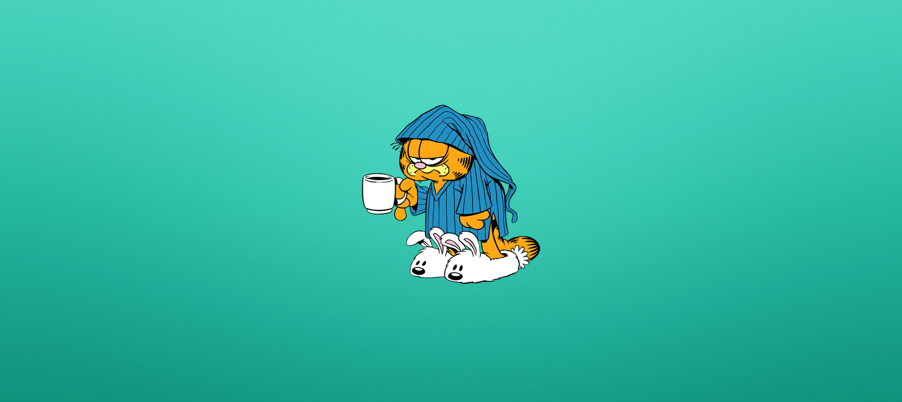
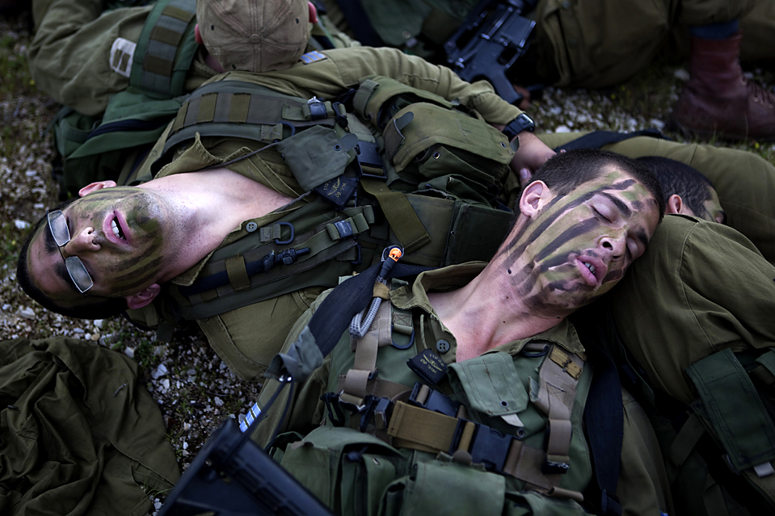
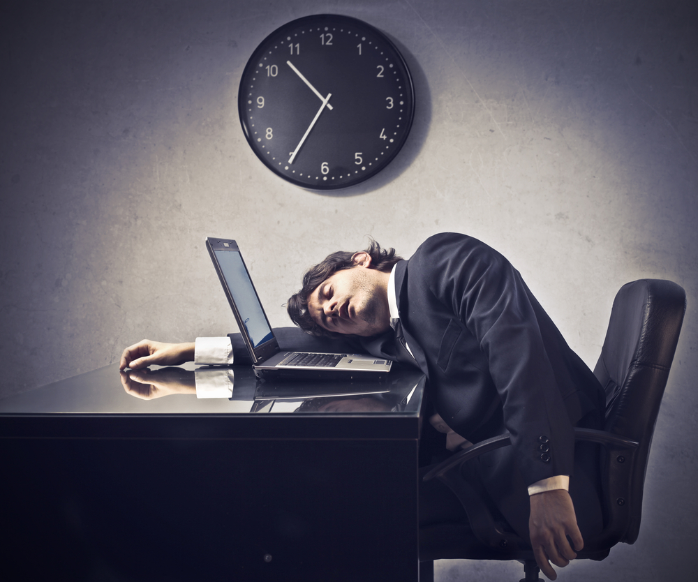
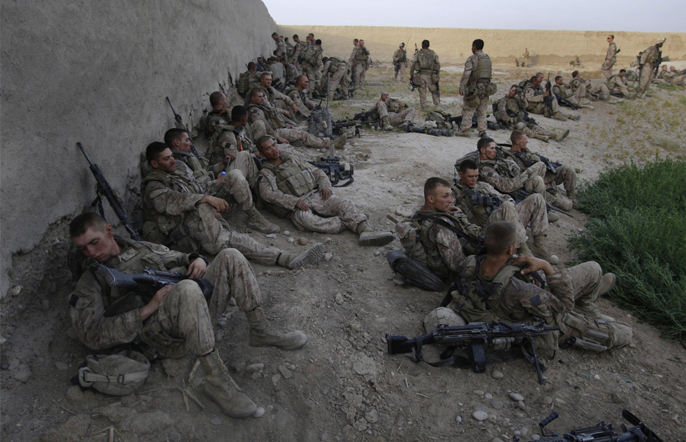
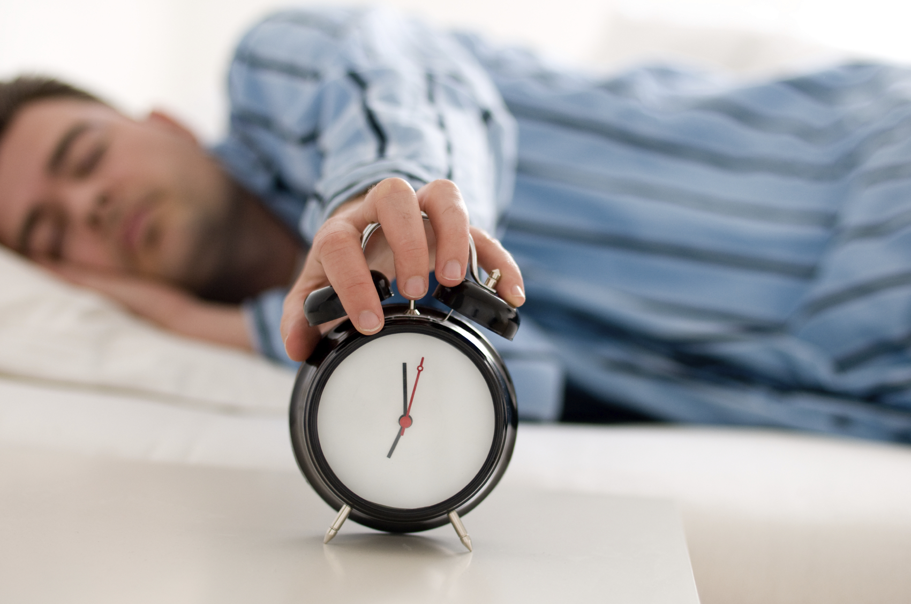

# Como virar a noite: dicas do exército americano para aplicar no dia a dia

Dicas para aguentar a madrugada em claro e se recuperar de uma noite mal dormida

[[anexo ausente]](http://www.papodehomem.com.br/autores/338#artigos)

[Brett McKay](http://www.papodehomem.com.br/autores/338#artigos)

[Traduções](http://www.papodehomem.com.br/colecoes/traducoes), [Corpo são](http://www.papodehomem.com.br/colecoes/corpo), [Guias práticos](http://www.papodehomem.com.br/colecoes/guias-praticos)

- [**0**

  likes](http://www.papodehomem.com.br/como-virar-a-noite-dicas-do-exercito-americano-para-aplicar-no-dia-a-dia#)
- [**0**

  tweets](http://www.papodehomem.com.br/como-virar-a-noite-dicas-do-exercito-americano-para-aplicar-no-dia-a-dia#)
- [**0**

  google +](http://www.papodehomem.com.br/como-virar-a-noite-dicas-do-exercito-americano-para-aplicar-no-dia-a-dia#)
- [**0**

  comentários](http://www.papodehomem.com.br/como-virar-a-noite-dicas-do-exercito-americano-para-aplicar-no-dia-a-dia#disqus_thread)

Passar a noite acordado estudando é quase um rito de
passagem para universitários, especialmente durante o fim do semestre. Mas
mesmo adultos precisam virar a noite algumas vezes – para
terminar um projeto do trabalho ou fazer uma viagem longa dirigindo. Nestes
últimos anos, eu mesmo passei algumas noites em claro escrevendo posts de blog
para o próximo dia. Dado que sou meu próprio chefe e não determinei nenhum
“prazo” para mim mesmo, não sei se isso me configura como maluco, dedicado ou
um maluco dedicado. Provavelmente, só maluco mesmo.

Virar a noite trabalhando não é a coisa mais saudável ou
agradável do mundo ([embora possa produzir sentimentos de euforia)](http://newscenter.berkeley.edu/2011/03/22/pulling-an-all-nighter/), e é algo
que deve ser evitado sempre que possível. Ainda assim, mesmo as pessoas mais
organizadas algumas vezes precisam encarar o fato de que um trabalho vai
demandar mais tempo para chegar ao fim do que o número de horas que ainda
restam no dia.

Para obter uma perspectiva dos prós e contras para virar a
noite com sucesso, pedi a um grupo de ex-soldados, ex-fuzileiros e veteranos
das forças especiais que compartilhassem conosco os métodos que os acompanharam
durante combates e várias outras operações noturnas. Estes homens – que hoje
trabalham no [BluCore Shooting Center](http://www.blucoreshootingcenter.com/) em Denver, no Colorado — serviram como Navy SEALS, Boinas Verdes
ou nas infantarias do exército e da marinha (para manter o anonimato, ele
pediram para serem identificados apenas com seus primeiros nomes). Para estes
veteranos passar a noite acordado era, muitas vezes, questão de vida e morte.
Mas suas dicas também se aplicam ao civil que precisa ralar num projeto de
estudo ou trabalho. Além desses conselhos, também reunimos dicas de
especialistas e pesquisadores do sono.

### Varar a noite: evite sempre que puder

A primeira dica sobre varar a noite é evitar isso o máximo
possível! Ficar sem sono causa todo tipo de efeitos prejudiciais em seu corpo e
mente:

- Diminui a concentração. A falta de sono torna mais lenta a
  área do cérebro responsável pela concentração. Nada bom para o foco.
- Prejudica a memória de trabalho e de longo prazo. A memória
  de trabalho é exigida em tarefas complexas em que se precisa prestar atenção a
  uma coisa enquanto se mantém um bocado de outras coisas bem presentes na mente.
  A falta de sono não só prejudica esse “bloco de notas” mental, ela também
  diminui a memória de longa duração. É durante o sono que nossas memórias
  recentes se transferem para o neocortex para se solidificarem ou serem
  armazenadas. Assim, todos aqueles fatos que você memorizou durante a noite
  podem nem estar mais lá quando chegar a hora da prova pela manhã.
- Enfraquece o sistema imunológico. Embora varar a noite possa
  ajudar a completar aquele trabalho, nos expõe ao risco de ficar doentes logo
  antes de entregá-lo.
- O cortisol aumenta. Varar a noite provavelmente te fará se
  sentir estressado e nervoso. Isso ocorre porque o nível de cortisol (um
  hormônio que é liberado em reação ao estresse) aumenta toda vez que falta
  sono.
- Diminui a testosterona. Como já expusemos em nossa série
  [sobre como aumentar a testosterona](http://www.artofmanliness.com/tag/testosterone/),
  nossos corpos produzem quase toda a testosterona de que precisamos enquanto
  dormimos. Somando isso aos níveis elevados de cortisol (outra coisa que acaba
  com a testosterona), temos uma receita para nos sentirmos menos homens. É bom
  lembrar que a testosterona não serve só para moldar músculos enormes. Homens
  com níveis adequados de testosterona ficam com mentes mais aguçadas e são mais
  confiantes do que seus irmãos com baixos níveis do hormônio. E, claro, essas
  são duas coisas bastante úteis para todo tipo de tarefas.

Enfim. Varar a noite não é uma estratégia sustentável ou efetiva
para o estudo ou para o trabalho, mas algumas vezes os nossos planos não dão
certo e ficar acordado se torna necessário. Quando isso ocorre, os pontos a
seguir indicam o que se deve fazer para ficar de pé e, assim, obter o melhor do
tempo extra que se está roubando do sono.

#### Abasteça-se de sono

> “Assegure-se de não ficar devendo sono. Quando souber que
> precisará varar a noite, tente acumular umas horas extras nos dias anteriores.
> Isso aumenta as reservas para quando se precisa realmente esticar os limites.
> Funciona mesmo.” – Eric, ex- Navy SEAL

Se você sabe com antecedência que vai varar a noite, tente
dormir mais cedo ou acordar mais tarde nos dias anteriores. Se não previu a
necessidade de varar a noite chegando, ainda assim é possível encher o tanque
com o que os pesquisadores chamam de “soneca profilática”. Tirar uma soneca de
qualquer tipo ajuda a melhorar a memória, a criatividade, o temperamento, e a
performance cognitiva – já é conhecido que sonecas preventivas são mais
efetivas em evitar os efeitos negativos da falta de sono do que doses frequentes
de cafeína.

Geralmente, quanto mais tempo você dormir nesse período
melhor. Mas em termos de benefícios de curto prazo, sabe-se que uma soneca de 3
horas (que permite dois ciclos de todos os valiosos estágios do sono) é mais
efetiva para aumentar a performance cognitiva do que uma soneca de 90 minutos
(apenas um ciclo completo). De acordo com a Dr. Sara C. Mednick, [especialista
em sonecas](http://www.amazon.com/gp/product/0761142908/ref=as_li_ss_tl?ie=UTF8&camp=1789&creative=390957&creativeASIN=0761142908&linkCode=as2&tag=stucosuccess-20), **uma hora e meia é o ponto ideal da soneca preventiva** porque “permite um ciclo
completo de sono e leva a pessoa ao REM (do inglês, movimento rápido dos olhos)
ou estágio 2, permitindo que se evite a inércia do sono” – a sonolência que se
sente quando se acorda de um sono profundo. Mednick recomenda fazer uma soneca
entre 1h-3h ou 13h-15h, já que são zonas de “soneca perfeita”, nas quais os
ciclos de soneca serão equilibrados perfeitamente entre REM e SOL” (Sono de
Onda Lenta).

É preciso ter em mente que os efeitos de uma soneca
profilática têm prazo de validade – duram apenas de 8 a 10 horas.

*Para maiores informações sobre o que significam esses termos
de sono, os surpreendentes benefícios da soneca e como deixar as sonecas mais
efetivas para diferentes circunstâncias, [veja esse post](http://www.artofmanliness.com/2011/02/07/unleash-the-power-of-the-nap/).*

#### A ajudante clássica: a cafeína

> “A cafeína funciona melhor quando não se faz uso frequente.
> Se você bebe apenas alguns cafezinhos por dia, não precisa se preocupar. Mas se
> bebe MUITO café ao longo do dia, não espere que o café funcione tão bem à
> noite.” – Eric

Todos os militares de operações especiais com que falamos
recomendaram, sem surpresas, que se consumisse algum tipo de cafeína durante a
noite a ser atravessada. O truque, dizem todos, é **não usar cafeína no dia
anterior e durante o dia em que se vai varar a noite**. Seu corpo e mente
desenvolvem tolerância à cafeína e, se você tem exagerado no café a semana
toda, não obterá um efeito tão forte durante a vigília noturna.

Eric também recomendou **misturar algum tipo de gordura no seu
café**, como manteiga de vacas alimentadas com grama (que contém mais ácidos
graxos Omega-3 do que a variedade alimentada com grão) ou leite de coco. Ele
diz que “ajuda a prolongar o efeito da cafeína.” Quando se adiciona algum tipo
de gordura no café, estamos adicionando triglicerídeos de cadeia média, ou MTC
– tipo de gordura que pode fornecer uma pancada extra de energia duradoura.
Essa mistura também pode ajudar com a fome nas horas
subsequentes, sem que você precise comer outras coisas.

Além do café, claro, há uma grande variedade de energéticos
que se pode tomar. Independentemente de qual você decida usar, só não o use
açúcar, para evitar uma quebra.

Já [usei chiclete energético militar](http://www.amazon.com/gp/product/B0017O19Q2/ref=as_li_ss_tl?ie=UTF8&camp=1789&creative=390957&creativeASIN=B0017O19Q2&linkCode=as2&tag=stucosuccess-20) (que já teve o nome de Stay Alert Gum, “Chiclete Fica Alerta”) com sucesso.
Projetado pela Wrigley para as forças armadas estadunidenses, cada goma de
mascar contém 100mg de cafeína (para efeitos de comparação, um café do
Starbucks de 355ml contém cerca de 260mg) que entram em sua circulação mais
rápido via absorção oral do que na forma de pílulas ou líquidos. O efeito
começa a funcionar imediatamente, e te mantém aceso durante a noite.

Não importa qual seja o sistema de ingestão de cafeína você
escolha, faça um uso discriminado dele. **Em vez de ingerir grandes doses poucas
vezes, tome doses menores e mais frequentes**. Tente algo como 100 a150 mg a cada
2 ou 3 horas.

#### Ajuda não aprovada pelo médicos: nicotina

> “É saudável? Não. Mas varar a noite também não é. A nicotina
> tem sido usada por soldados, marinheiros, pilotos e fuzileiros por DÉCADAS. Te
> mantém ocupado e acordado, até certo ponto. Mas, exatamente como com o café, se
> você está acostumado a usar uma lata inteira todos os dias, mascar durante a
> noite não fará muito efeito. Se você faz uso apenas ocasional e der uma mascada
> durante a noite para terminar um projeto dentro do prazo, isso pode ajudar
> bastante.” – Jeff, ex-Boina Verde

A dica do tabaco surgiu de vários caras ligados a operações
especiais com que falamos, e a estou passando adiante apenas porque a acho
interessante. Se você está ficando acordado para evitar uma bala, a nicotina
pode, nesse caso, ser o menor de dois males. Mas se o único perigo que você
está encarando é tirar C em Cálculo, eu pessoalmente evitaria cigarros ou
tabaco em outras formas. Os especialistas no sono e os médicos estão de acordo
comigo.

#### Coma pouco e evite carboidratos

> “Uma refeição grande e cheia de carboidratos não vai dar
> certo. Algumas vezes, comer em si não ajuda. Se você precisa estar preparado
> para operações de combate, perder refeições não é uma boa opção. Mas passar a
> noite acordado para terminar um trabalho, projeto ou para dirigir não exige
> nenhum ‘combustível’.” – Eric

Especialistas em sono estão de acordo com esse conselho.
Para ficar acordado a noite toda, evite carboidratos e coma proteínas e
gorduras (castanhas, carne seca, etc). Isso te mantém satisfeito e fornece
energia sem causar uma pane.

#### Se movimente

> “Faça exercícios, caminhe ou mesmo trabalhe em pé. Há uma
> resposta fisiológica comprovada após os exercícios. Só não exagere logo antes
> de varar a noite, a ponto de ficar exausto.” – Jeff

> “Quando eu estava em algum tipo de posto de guarda na rua –
> porteiro, bombeiro, ou cuidando de veículos – eu caminhava. Se não pudesse
> caminhar, fazia apoios, agachamentos, alongamentos ou qualquer outro exercício
> rápido. Manter o sangue circulando era a forma mais fácil de ficar acordado por
> períodos longos de tempo.” – Rob, ex-soldado

Para mim, a atividade física é uma das formas mais efetivas
de conseguir varar a noite. Busco fazer intervalos e, a cada 30 minutos, me
levanto e caminho. [Também alterno esses exercícios com trabalhar em pé](http://www.artofmanliness.com/2011/07/05/become-a-stand-up-guy-the-history-benefits-and-use-of-standing-desks/).

#### Provoque desconforto em si mesmo

Jeff recomenda beliscar a coxa: “Dá um estimulozinho nos
receptores de dor!” Matt, um ex-mecânico da aeronáutica e ex-soldado, prefere
beliscar a sobrancelha.

Além dos beliscões, outro jeito de provocar desconforto em
si mesmo é água fria. Quando estiver sentindo torpor, vá ao banheiro e jogue
água fria no rosto. [Se quiser mesmo acordar, tome um banho frio](http://www.artofmanliness.com/2010/01/18/the-james-bond-shower-a-shot-of-cold-water-for-health-and-vitality/).
Tente diminuir a temperatura do ambiente também – manter o ambiente de trabalho
frio nos ajuda a ficar alertas.

#### Sofrer a dois funciona melhor

> “Também ajuda bastante ter alguém para fazer companhia. Nas
> forças armadas, algumas vezes me encontrava na situação de ficar em vigília
> enquanto os outros dormiam após um dia estafante de trabalho. Fazer a vigília
> sozinho pode acabar sendo chato. Tão chato que, se não se toma cuidado, pode
> acabar com você dormindo. Algumas vezes ficar acordado com mais alguém
> realmente ajuda.” – Eric

Ter alguém por perto para conversar e brincar um pouco vez
ou outra pode funcionar muito bem, e deixa seu cérebro bastante desperto.
Companheiros também ajudam a manter a responsabilidade de não dormir.

#### “Anfetamina” sem receita médica

> “Em uma ocasião nos deram alguma forma de ‘rebite’
> legalizado/militarizado, que só havia sido usado em testes. Deram esse troço
> para nós em território inimigo, no Iraque, acho, e então monitoraram nossos
> sinais vitais a noite toda. Nunca o usamos em uma operação. Sei que a
> Aeronáutica há muito tempo dá esse negócio para os pilotos em voos longos (ou
> costumava fazê-lo). A parte mais engraçada de tomar bola legalizada é que TODO
> mundo acabou levando algum tipo de advertência pessoal durante o trabalho
> aquela noite!” – Eric

Arquive essa sugestão na categoria “interessante, mas
(ainda) não prático para um civil”.

A droga a que Eric se refere provavelmente era algo chamado
Modafinil (também conhecido como Provigil). As forças armadas no mundo todo a
têm experimentado como uma forma de aumentar a capacidade dos soldados que
precisam ficar acordados. Modafinil foi desenvolvido originalmente para tratar
narcolepsia, mas os pesquisadores descobriram que, com ela, pessoas normais
podem ficar sem dormir sem sofrer nenhum dos efeitos ruins da falta de sono.

De fato, muitos usuários de Modafinil sentem que o produto
lhes dá um foco quase sobrehumano. Ao contrário de outros estimulantes como
cafeína, nicotina ou anfetaminas, Modafinil é menos viciante, não muda os
padrões normais de sono e não causa tiques ou ressacas. Há um grupo pequeno,
mas cada vez maior, de civis muito empreendedores (banqueiros de Wall Street,
empresários, atletas) que começam a usar Modafinil para aguçar a mente e
encarar as ocupações de suas agendas.

Modafinil está disponível apenas com prescrição: se você
quiser experimentar, precisa pedir a um médico. Mas uma vez que a droga é
principalmente utilizada para tratar narcolepsia ou para ajudar aqueles que
trabalham em turnos de horas irregulares, ele provavelmente vai ficar cabreiro
de prescrever algo assim para você.

Embora as pesquisas não mostrem nenhum efeito colateral ruim
com o uso da droga, existem poucos estudos quanto aos efeitos do uso em longo
prazo. Os cientistas ainda não sabem bem como Modafinil opera, só sabem que
funciona. Mas se você, como eu, acha o assunto “drogas que melhoram a cognição”
– chamados nootrópicos – bem fascinante, vai querer manter um olho nos
resultados de experiências futuras.

### Recuperando-se de uma noite acordado e recompondo o sono

Quando se acumula sono perdido – afinal de contas estamos
dormindo menos horas do que precisamos – viramos alvo das miríades de efeitos
negativos mencionados acima. Felizmente, pagar a dívida de sono pode eliminar
essas consequências prejudiciais.

#### Como ficar acordado no dia seguinte

Eric disse que ele e os colegas de Navy SEALs tinham
períodos em que trabalhavam todas as noites, mas em seguida dormiam durante o
dia (ele tem admiração pelos soldados que “não tinham o luxo de dormir o dia
todo como muitos de nós no SEALs podíamos!”). Como nós também nem sempre temos
o luxo de seguir diretamente para o modo de recuperação depois de um esforço
que dura a noite toda, resolvi falar primeiro sobre como lidar com o dia
seguinte à noite que se passou acordado.

Além de seguir as dicas mencionadas acima – consumir cafeína
sem exagero, movimentar-se, evitar carboidratos – tente também essas táticas:

- Tire sonecas estratégicas. Até mesmo uma soneca muito curta
  durante o dia vai aliviar alguns dos efeitos da falta de sono. Mas é preciso
  fazer isso com estratégia: quando estamos cansados, entramos mais rápido no
  sono REM profundo assim que fechamos o olho. Se acordamos nesse estágio,
  sofremos de inércia do sono e nos sentimos ainda mais cansados do que antes.
  Assim, devemos limitar a soneca a apenas 20 minutos ou menos. Considere também
  fazer uma “soneca de cafeína”, em que você bebe um café e, imediatamente, segue
  para um sono de 15-20 minutos. A cafeína livra seu corpo da adenosina, um
  químico que nos deixa sonolentos. Como a cafeína demora um pouco para circular
  completamente, isso não vai afetar a soneca. Pelo contrário, a cafeína acaba
  funcionando em conjunto com o frescor que se sente logo após acordar de uma
  soneca forte – o que torna possível acordar e seguir o dia.
- Mantenha-se hidratado. Beber água vai te fazer se sentir
  muito melhor.
- Fique num ambiente iluminado. Trabalhe com a luz mais forte
  possível, pois luzes mais fracas causam sonolência. O melhor é se expor a luz
  azul. O site [Marks Daily Apple](http://www.marksdailyapple.com/blue-light-better-than-coffee/#axzz2mda2M100) fez
  recentemente um ótimo artigo sobre como está provado que a luz azul “melhora
  nossas capacidades cognitivas, inclusive a memória, tempo de reação e função
  executiva.” E, convenhamos, todos estes são benefícios necessários durante e
  depois de atravessar uma noite!

Após varar uma madrugada, a hora em que nos sentimos piores
chega cerca de 24h depois da nossa hora usual de acordar. Como o nosso corpo
costuma nos dar um refresco natural **em torno das 10h da manhã e entre as 18h e
19h**, deixe para esses horários as coisas particularmente difíceis que você
tiver de fazer nesse dia.

**Evite dirigir no dia seguinte à noite virada**; [dirigir com sono é tão ruim quanto dirigir bêbado](http://www.ncbi.nlm.nih.gov/pmc/articles/PMC1739867/). E da mesma forma que
acontece com a bebida, normalmente não reconhecemos que não estamos 100%.

#### A rota para a recuperação

Assim que conseguir se desvencilhar das atividades que te
mantiveram acordado, é hora de começar a recuperação da noite perdida e pagar o
sono que se deve. Felizmente, não é preciso pagar na mesma moeda para estar
cheio de energia, com a saúde recuperada e em nosso estado normal o mais rápido
possível (ou seja: se não dormimos as oito horas costumeiras, não será
necessário dormir 16h na noite seguinte para eliminar o sono devido). Quando o
sono é de menos, um reflexo que nos permite dormir mais tempo e mais
profundamente entra em ação, e ajuda a acelerar o processo de recuperação.

Não há um cálculo exato para saber quantas horas serão
necessárias para colocar o sono em dia, e o melhor a fazer é simplesmente
deixar o corpo mostrar o que precisa. Assim que ficar cansado, vá para a cama
(**fique acordado até pelo menos 21h para não acordar no meio da noite**), se
permita acordar naturalmente – **não programe o despertador** – e mantenha esse
padrão até que se sinta bem descansado.

Estudantes universitários e profissionais liberais com
horários variados frequentemente conseguem agir assim, mas se você é daquelas
pessoas que tem uma agenda regular a manter a melhor forma de se recuperar é
adicionar entre uma e duas horas de sono toda noite – até que o brilho retorne
a seus olhos e você esteja “abanando o rabinho” de novo.

A coisa mais importante é voltar a ter uma agenda de sono
regular o mais cedo possível. Varar a noite por um dia não vai matar ninguém,
mas falta crônica de sono pode levar a sérios problemas de saúde como
obesidade, doenças cardíacas, acidentes vasculares e diabetes.

Resumo: vare a noite apenas quando necessário, e não faça
disso um hábito!

\_\_\_\_\_\_\_\_\_\_\_\_\_\_\_

*Um grande obrigado para a [BluCore Shooting Center](http://www.blucoreshootingcenter.com/) por descolar as dicas de seus
funcionários experientes e veteranos. A BluCore foi fundada por dois Navy SEALs
e tem cursos de tiro desportivo e treinamento para o uso de armas. Dêem uma
olhada em sua loja online e, se você estiver na área de Denver, vá visitá-los!*

---

*publicado em 30 de Dezembro de 2014, 09:00*
