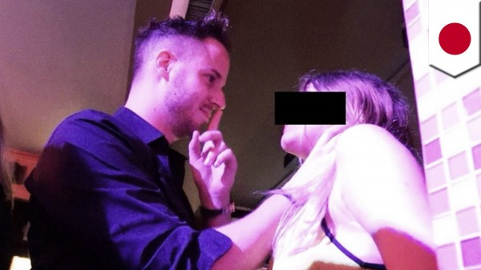
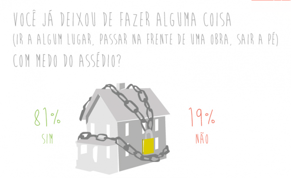
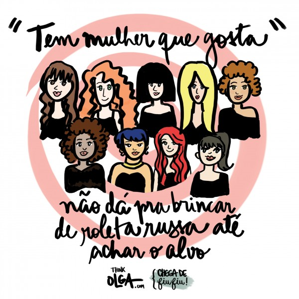
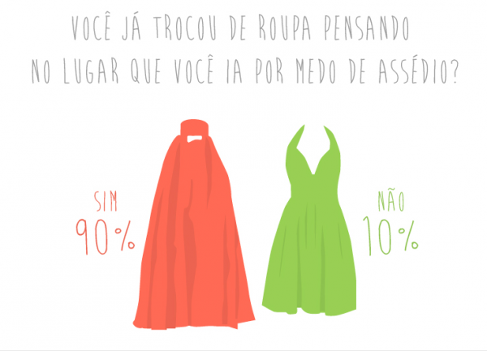

# Intimidade violada

Da cantada de rua aos cursos de formação de predadores, mulheres são alvo de um jogo criminoso de assédio e se insurgem contra a tolerância cúmplice da sociedade

[[anexo ausente]](http://www.papodehomem.com.br/autores/421#artigos)

[Pública](http://www.papodehomem.com.br/autores/421#artigos)

[Mente e atitude](http://www.papodehomem.com.br/colecoes/atitude)

- [**116**

  likes](http://www.papodehomem.com.br/intimidade-violada#)
- [**0**

  tweets](http://www.papodehomem.com.br/intimidade-violada#)
- [**0**

  google +](http://www.papodehomem.com.br/intimidade-violada#)
- [**9**

  comentários](http://www.papodehomem.com.br/intimidade-violada#disqus_thread)

- Nossos atuais Mecenas:
- 

“É ofensivo, é inapropriado, é emocionalmente assustador mas é muito
efetivo” propagandeia o suíço Julien Blanc sobre seu método para “pegar”
mulheres [neste site](http://www.pimpingmygame.com/)
em que vende os cursos de sedução que dá pelo mundo, por até 3600
dólares por cabeça. Entre suas técnicas estão as de abordar mulheres
desconhecidas nas ruas, bares ou casas noturnas pegando-as pelo pescoço e
empurrando em direção aos seus genitais, pedir à mulher que “se
ajoelhe, me chame de mestre e me implore por um beijo”, atacar sua
autoestima, ignorar respostas negativas e fazer ofensas racistas.

Para quem não acompanhou o barulho nas redes sociais no último mês –
ou já esqueceu –, Julien é um pick-up artist (PUA) ou “artista da
pegação” (em uma tradução tosca como o termo merece) e faz parte de uma
comunidade que cresce rapidamente no mundo todo, inspirada no livro “O
Jogo” do jornalista Neil Strauss. De forma romanceada, Strauss conta
como passou de tímido a sedutor usando técnicas de linguagem corporal,
hipnose e abordagens invasivas inspiradas na programação
neurolinguistica e que teoricamente funcionam com qualquer mulher em
qualquer lugar no mundo. É como uma combinação de botões que quando
apertados no console de um videogame destravam um bônus – nesse caso uma
mulher.

Blanc, que diz ter aprimorado as técnicas de PUA “deixando o jogo
ainda mais forte” e chegou a divulgar em seu Twitter fotos pegando
meninas pelo pescoço com a hashtag #ChokingGirlsAroundTheWorld, daria
cursos em Florianópolis no começo do próximo ano. Mas uma [petição no Avaaz](https://secure.avaaz.org/po/petition/Policia_Federal_Brasileira_Explusao_de_Julien_Blance/?pv=43) com
mais de 410 mil assinaturas (até o fechamento dessa reportagem) para
que sua entrada fosse barrada no país chamou a atenção do Itamaraty, que
declarou “já haver elementos suficientes para denegar visto de negócios
para a realização de palestras, caso este venha a ser solicitado em
Consulado ou Embaixada brasileira”. O suíço também teve sua entrada
negada no Reino Unido e foi expulso da Austrália.

Técnica de Julien Blanc inclui pegar mulheres pelo pescoço / Reprodução

Ainda assim não há muito a comemorar. É só digitar a sigla PUA em um
site de buscas para ver quantos cursos da comunidade já existem há anos
no Brasil. Alguns mais violentos, outros com propostas um pouco menos
agressivas (como se comparássemos as diferentes denominações da igreja
evangélica) mas todos extremamente machistas e com algumas
características em comum. A mais importante é abordar mulheres
desconhecidas nas ruas insistindo mesmo depois de obter um “não” como
resposta, como comprovou o repórter Caio Costa, enviado da **Pública** a um desses cursos ([**leia a matéria Escola de Predadores aqui**](http://apublica.org/2014/12/escola-de-predadores/)). As táticas funcionam na lógica de jogo –usam termos como *daygame* e *nightgame*
para definir as abordagens, “escalada” sobre o aumento progressivo de
contato físico que deverá resultar em sexo, assim como outros termos e
passos de conquista que devem ser repetidos à exaustão.

Se portar como “macho alfa”, o “homem que mostra quem é que manda” é o
que se espera dos aprendizes como ensina o livro “A Arte Natural da
Sedução”, de Richard La Ruina, um dos grandes mestres PUA: “Não dê a ela
o poder de tomar decisões, e sim a opção de aceitar suas escolhas”. No
Youtube há centenas de vídeos ensinando essas abordagens, com milhares
de visualizações, muitos mostrando os rostos das meninas. Além dos sites
que vendem os cursos, existem também fóruns de discussão onde os
“pegadores” se gabam de suas conquistas, propõem desafios e trocam
experiência – leitura não recomendada a quem tem estômago fraco. Aliás,
leitura não recomendada em hipótese alguma.

“É necessário se posicionar bem próximo da garota, para ter
‘fisicalidade’. Quando você chegar assim perto dela pra conversar, ela
vai sentir um desconforto, não vai? O que é esse desconforto? Esse
desconforto é tensão sexual. Ela provavelmente vai andar pra trás.
Continua conversando e depois chega perto de novo” **[ouviria o repórter Caio Costa](http://apublica.org/2014/12/escola-de-predadores/)** durante o *bootcamp* (treinamento PUA)*.*
“Se a mulher recuar, o homem avança. Se ela não se mexer, quer ser
beijada. Se a menina não for embora ou ameaçar chamar o segurança, não
há motivo para desistir. Cabe à mulher encerrar a abordagem. Mesmo que
deixe claro que não está interessada, se a presença do homem a incomoda,
é ela quem deve se mover”, ensinava o instrutor. Antes do *nightgame*,
a dica para encorajar o assédio: “Não existe esse negócio de mulher ir
pra balada pra se divertir. Mulher vai pra balada pra dar. Se quisesse
se divertir ficava em casa vendo um filme com as amigas”.

Aulas práticas do curso em um clube noturno de SP. “Tem que ter ‘fisicalidade” / Foto: Chris Von Ameln

Abordar mulheres desconhecidas nas ruas insistindo mesmo depois de
obter um “não” como resposta pode configurar importunação ofensiva ao
pudor segundo o artigo 61 da [**Lei das Contravenções Penais**](http://www.planalto.gov.br/ccivil_03/decreto-lei/del3688.htm)
com pena de multa mas até o momento não se tem notícia da aplicação
dessa lei. Além desse tipo de curso, o Brasil começa a ter os seus
próprios “teóricos”. No livro “Brazilian Natural Game – O manual sobre
jogo natural totalmente desenvolvido para o Brasil”, o autor Eduardo
Playtool diz ter adaptado o método para a “realidade brasileira”.
“Europa e EUA são países de classe média (sic) onde quase todo mundo tem
o mesmo nível seja ele financeiro, social ou educacional (…) Aqui é um
país de intensa desigualdade social e isso pode criar problemas para
alguns e também pode ser algo a ser aproveitado independente de quanto
dinheiro você tenha”. Eduardo continua destilando toda forma de
preconceito no decorrer do livro. “Comparem o nível da mulherada numa
balada de 15 reais e na balada de 150. Comparem o nível da mulherada em
shopping luxuoso e em shopping simples de periferia. É brutal. Isso
ocorre porque geralmente caras ricos se casam com mulheres mais bonitas e
por isso suas filhas são mais bonitas geneticamente e tem acesso fácil a
tratamentos de beleza, dermatologistas, cirurgias plásticas, bons
cabeleireiros, academia, boa alimentação, etc” e “Se um cara da
periferia que se veste como ‘mano’ com a calça caída, usa gírias
ridículas e fala ‘e aí mina, tá ligada nas parada’ acha que vai pegar
uma bailarina do Faustão ou uma patricinha de balada top pode ter
certeza que as chances estão muito contra”. Eduardo também ensina a
atrair mulheres para sua casa sem deixar clara a intenção. No tópico
“Arrastando o alvo para o abatedouro” ele diz: “O princípio é não
deixá-la desconfortável. Ou seja: Eu não falo em ir para a minha casa
jamais. Sou bem cara de pau. Simplesmente a levo, já planejando uma
desculpa plausível para evitar o desconforto na hora em que ela perceber
para onde está indo”. Além do desrespeito evidente, esse tipo de
armadilha aparece em muitos casos de estupro como mostra [esta matéria sobre culpabilização de vítimas](http://apublica.org/2012/01/condenacao-das-vitimas/),
em que uma das entrevistadas conta que foi levada enganada para a casa
do agressor e, quando negou sexo, foi estuprada e torturada.

#### Ilusão de poder

O psicólogo e pesquisador Vitor Muramatsu, chama a atenção para o
descolamento da realidade implícito nos ensinamentos: “O PUA se baseia
na Programação Neurolinguística, que por si só já é um câncer, uma
semirreligião. Ela faz um apanhadão de migalhas de teorias dos grandes
mestres como Reich, Freud, mistura com Gestalt e hipnose e aplica na
reprogramação mental para modelar um comportamento, passar uma tinta. No
livro ele [Eduardo Playtool] diz que para ter sucesso é preciso repetir
‘eu sou o cara’, ‘eu sou foda’, ‘todas as mulheres querem dar pra mim’
para construir uma persona artificial. Quando diz ‘Sei que sou foda
independente de como as pessoas reagem’ você tem uma questão com a
relação do feedback do real. Ou você ignora ele ou você absorve e isso
tem um efeito na sua personalidade, no seu comportamento”. E dá um
exemplo: “Digamos que eu aborde a mulher da padaria e não dê certo. Ou
eu absorvo aquilo ou eu blindo aquela rejeição. São duas posturas
totalmente diferentes. A primeira é mais humana, dialética,
contemplativa e estruturante, cria uma modificação real, te traz para o
real e a outra não, você é um pirado. E a tendência é que você se blinde
da realidade, porque você se blinda da resposta que ela te traz. Quando
ele fala em ‘ir para o contato físico’ invade a privacidade das
pessoas. Os alunos podem entender qualquer coisa dessas instruções. E se
não tem limite, podem causar dano para a sociedade ou a si mesmos por
viverem em um mundo de loucura, igual jogador viciado. E aí o perigo é
estarmos criando uma seita de violadores irrefreáveis”.

Capa do livro de Eduardo Playtool que “atualiza” as técnicas PUA para a “realidade brasileira” / Reprodução

“Uma coisa é eu autorizar você a falar comigo e a gente começar a
flertar. Na rua eu não autorizei, não te conheço e não quero te
conhecer. Mas a sociedade autoriza e legitima que um homem aborde uma
mulher, porque historicamente o espaço público sempre foi masculino. E é
contraditório que antes o espaço público era dos homens e o privado das
mulheres mas nem no espaço privado a mulher era respeitada. Ela também
sofria – e ainda sofre – violência onde é chamada de ‘rainha”, explica a
a antropóloga Izabel Gomes.

Para ela, a raiz de todas as violências – da doméstica ao estupro, do
feminicídio ao assédio – é a mesma: “Não tem discurso novo. É violência
de gênero, é patriarcado e é condição de não sujeito. Vem tudo da mesma
estrutura de dominação. Como os homens podem querer nos manipular,
fazer um jogo e vencer etapas para conquistar? Tomar nossa liberdade na
rua? Acho que só em um esquema de dominação ainda tão forte e
estruturado isso é possível. E aí não dá pra não falar das relações de
patriarcado, que tratam a mulher não como sujeito ou, na melhor das
hipóteses, como alguém de menor valor. Os avanços das últimas décadas
nas leis – temos igualdade na lei salarial, temos uma lei para violência
doméstica, temos uma mulher presidente – fazem com que a gente não
perceba os retrocessos (Alô Bolsonaro). A impressão que se tem é que por
conta desses direitos conquistados não se tem violência contra a mulher
e quando tem, a própria mulher é responsabilizada. Nós temos hoje uma
mulher sendo estuprada a cada dez minutos no Brasil. Nesse contexto, um
curso desse tipo é ainda mais grave” define a antropóloga.

#### Violência Reiterada

“Eu tinha uns 11 anos. Era Carnaval, as ruas cheias. Eu era uma
criança. Um homem passou a mão em mim e acariciou meu cabelo dizendo
‘fooofa’ mostrando a língua depois”.

“Já estava perto de dobrar a esquina da rua onde moro a noite. Um
cara vinha na direção contrária a minha. Quando chegou perto disse ‘quer
chupar meu pau?’ Pensei logo que seria estuprada porque a esquina da
minha rua é bem deserta”.

“Eu tinha 10 anos, estava andando de bicicleta e um cara, que veio
andando de bicicleta, passou do meu lado e apalpou minha bunda. Fui para
casa chorando muito. Eu tinha me sentido invadida, mas não tinha
entendido o que tinha acontecido”.

“Andava a pé até a academia quando tinha 15 anos. Como, com o tempo,
comecei a ficar muito incomodada com as cantadas, olhares, motoqueiros
buzinando, acabei decidindo colocar uma calça de moletom e uma camiseta
por cima da roupa de academia”.

“Escolho minhas roupas todos os dias pensando nos lugares por onde vou andar, que ônibus vou pegar para evitar cantadas”.

Esses são alguns depoimentos obtidos na [pesquisa realizada pelo site Think Olga](http://thinkolga.com/2013/09/09/chega-de-fiu-fiu-resultado-da-pesquisa/) com 7762 mulheres no segundo semestre de 2013 para a campanha [“Chega de Fiu Fiu”](http://thinkolga.com/chega-de-fiu-fiu/).
A intenção era fazer com que as mulheres falassem sobre os sentimentos e
experiências ao receber “cantadas” nas ruas. Se você é mulher,
certamente tem ao menos um relato parecido e, se não for, pode perguntar
para a mulher que está ao seu lado agora ou para sua mãe, amiga,
namorada, filha, colega de trabalho: todas terão histórias semelhantes
para contar. Nenhuma delas envolverá alegria ou gratidão. A maioria
falará em raiva e medo. Na pesquisa citada, 81% das mulheres disseram
que já deixaram de fazer alguma coisa (ir a algum lugar, passar na
frente de uma obra) com medo de assédio, 90% disseram já ter trocado de
roupa pensando no lugar onde iriam por medo de assédio e 83% declararam
não gostar de receber cantadas.

Na pesquisa do site Think Olga, 73% das entrevistadas disseram não responder às cantadas na rua. A maioria por medo / Reprodução Think Olga

Em entrevista à Pública, a jornalista Juliana de Faria, idealizadora da campanha, conta que decidiu dar voz às mulheres a respeito do assédio de rua depois de ter passado por situações abusivas e perceber o quanto isso era naturalizado pelas pessoas: “Eu sempre fui vítima de assédio sexual. A primeira vez aconteceu quando eu tinha 11 anos, foi um assédio verbal e me chocou muito. Eu estava esperando para atravessar a rua de casa e um carro diminuiu a velocidade e começou a falar coisas que eu nem entendi na hora mas me assustaram tanto que eu comecei a chorar. Aí no caminho de volta uma senhora me perguntou porque eu estava chorando, eu contei e ela disse ‘ah que bobagem, você deveria estar feliz, na minha idade você vai sentir falta’ e ali eu já entendi que não podia falar a respeito disso. Com 13 anos eu sofri um abuso físico, quase um estupro. Saindo do metrô o cara me puxou pelo braço falando que ia me comer e eu consegui me desvencilhar porque ele estava bêbado demais. Mas se ele não estivesse tão bêbado como isso iria acabar? Nunca falei disso publicamente porque sentia essa resistência, quase como se fosse uma frescura. Aí quando teve aquele caso do Gerald Thomas, que enfiou a mão por dentro do vestido da Panicat, que foi horrível, eu vi amigos meus defendendo aquilo. Gente que eu conhecia, amigos meus defendendo essa cultura de estupro. Foi um wake up call para começar esse trabalho”.

Trecho de infográfico da pesquisa Chega de Fiu Fiu / Reprodução Think Olga

O site começou a publicar ilustrações e abriu espaço para as mulheres contarem suas experiências. O próximo passo foi montar um [mapa interativo](http://chegadefiufiu.com.br/)
para que as mulheres apontem os locais onde sofreram assédio. “Uma
menina me escreveu dizendo que viu que em um bar na rua dela tinha muita
denúncia, então ela imprimiu e levou pro dono do bar”. A Chega de Fiu
Fiu está preparando um documentário – atualmente [aberto a doações no Catarse](http://www.catarse.me/pt/videochegadefiufiu) **-,** com
meninas usando óculos com câmaras que gravam as abordagens que sofrem
ao longo do dia. Recentemente, a campanha também publicou, em parceria
com o Núcleo Especializado de Promoção e Defesa dos Direitos da Mulher
da Defensoria Pública de São Paulo (Nudem) [uma cartilha](http://www.defensoria.sp.gov.br/dpesp/repositorio/41/FolderAssedio.pdf)
explicando o que é assédio sexual, porque é um comportamento nocivo,
como denunciar e como encaixá-lo na lei. A cartilha está sendo
distribuída em São Paulo e pode ser compartilhada, reproduzida e
impressa.

Reprodução Think Olga

Recentemente, o Instituto Avon, em parceria com o Data Popular,
anunciou os resultados da pesquisa “Violência Doméstica: o jovem está
ligado?” que entrevistou 2000 jovens entre 16 e 24 anos. Do total, 68%
mulheres declararam já ter levado uma cantada ofensiva; 96% reconhecem a
existência de machismo no Brasil; 66% das mulheres afirmaram
positivamente quando questionadas (com base em uma lista de agressões
apresentadas) terem sofrido algum tipo de ataque; 55% dos homens
admitiram ter xingado, empurrado, ameaçado, ter dado tapa, impedido de
sair de casa, proibido de sair à noite, impedido o uso de determinada
roupa, humilhado em público, obrigado a ter relações sexuais, entre
outras agressões e 44% mulheres afirmaram terem sido tocadas ou
assediadas por homens em festas.

#### **Fora da Lei**

A defensora pública Ana Rita Souza Prata explica que se a abordagem
PUA invade o espaço da mulher na rua ou em uma casa noturna a ponto de
incomodar a mulher encaixa-se no contexto de assédio e se houver contato
físico pode caracterizar violência. “Se o cara pega na mulher sem ela
dar abertura isso já é uma violência. ‘Ah, mas eu só flertei, só
paquerei’. Se não há consentimento e abertura é uma violência” define.
“E a gente sabe que por trás disso está uma forma de dominação. O espaço
público é meu, é masculino e eu vou fazer aqui o que eu quiser. Os
crimes sexuais não são só os de filme americano ou o maníaco do parque.
As violências acontecem dentro dos relacionamentos e nas ruas todos os
dias e por isso você treinar homens para esse tipo de abordagem é um
absurdo. Com a cartilha a gente quer conscientizar de que o assédio é
uma violência sexual e pode sim ser caracterizada como crime”, detalha a
defensora.

Perante a lei, o assédio sexual se restringe ao ambiente de trabalho,
mas existem as tipificações de importunação ofensiva ao pudor e
atentado ao pudor (no caso de não haver contato físico) que podem ser
aplicadas caso a vítima deseje denunciar esse tipo de abuso. A
reportagem entrou em contato com a Secretaria de Segurança Pública de
São Paulo, o Ministério da Justiça, a Secretaria de Políticas para as
Mulheres, a 1ª e a 2ª delegacias de Defesa da Mulher de São Paulo e a
Delegacia de Polícia do Metropolitano e foi informada de que não existem
estatísticas específicas sobre estas contravenções. Mas a recomendação
do Nudem e da própria SPM é a de que as mulheres denunciem esse tipo de
assédio. “A sociedade ainda naturaliza a cantada de rua, até porque
justifica essa violação de direitos das mulheres pela roupa curta, pelo
decote. Como se a mulher fosse culpada. Mas quanto mais as mulheres
denunciarem ao 180 ou às delegacias especializadas pra colocar isso em
pauta pra a gente mobilizar o sistema de justiça, mais a gente vai
conseguir combater essa impunidade” defende a secretária adjunta de
Enfrentamento à Violência da Secretaria, Rosangela Rigo. Ela reconhece
que o 180 ainda não recebe muitas denúncias desse tipo mas lembra que
por muito tempo a violência doméstica também não era denunciada por ser
naturalizada. “Por isso essas campanhas, marchas e caminhadas de
mulheres são tão importantes. Para que aumente essa conscientização e o
empoderamento das mulheres e diminua a naturalização desse tipo de
comportamento”.

A doutora em psicologia Daniela Rozados, que faz parte do PoliGen,
grupo de estudos de gênero da Escola Politécnica da USP, vai além. Para
ela, muitas vezes a própria agredida não se reconhece como vítima,
tamanha é a naturalização do assédio. “Por vezes a mulher não percebe o
quanto o ir e vir dela no espaço público está condicionado a esse papel.
Isso que eu acho mais grave em termos psicológicos. Porque ela fica
aprisionada no discurso machista de que ela não existe como sujeito.
Isso em si já é bastante sofrido mas muitas vezes a vitima não percebe
que isso é produtor de sofrimento. Nessas abordagens do PUA ou no
assédio de rua, o corpo está ali para satisfazer desejos. Mas quando não
é física, essa violência está tão incrustada que é de baixa percepção
por parte da própria vítima. E pra quem reconhece como violência gera
nervosismo, ansiedade, medo de andar por determinados lugares”.

Trecho de infográfico da pesquisa Chega de Fiu Fiu mostra que mulheres trocam de roupa com medo de assédio / Reprodução Think Olga

Daniela lembra um estudo da engenheira Haydee Svab para explicar como
homens e mulheres se apropriam de forma diferente da cidade: “O mapa
mental da cidade da mulher é menor do que o mapa mental do homem, o
espaço público é extremamente condicionado ao gênero. Horários, regiões
da cidade, meios de transporte, pontes. Mulheres têm medo de andar em
pontes por causa das reiteradas histórias de estupro, por exemplo.
Deixam de aceitar trabalhos porque teriam que andar a pé a noite ou
pegar um ônibus em um lugar ermo”. Ela lembra que para o homem às vezes é
difícil perceber a gravidade do assédio porque nunca acontece quando
ele está junto. “Quando o homem é o agente da agressão, acha que está
tudo bem. E quando está com sua companheira não vê acontecer porque um
macho respeita o outro macho. Tem um discurso de que ‘o homem não pode
se conter’, que além de tudo culpabiliza a mulher mas na minha percepção
isso tem mais a ver com uma punição. ‘Você saiu do esperado, usou uma
roupa mais curta, foi mais longe, circula sozinha, então a gente vai ter
que te punir da forma mais tosca que a gente conhece’. Porque a rua é
do homem. E se você está lá, seu corpo está à disposição. Se você usa
seu peito pra vender cerveja ou desfilar no carnaval ok, porque todo
mundo está lucrando. Se quiser deixar o peito de fora porque está calor,
quer fazer um topless na praia ou simplesmente amamentar seu bebê, não.
Porque teu corpo não te pertence. Ele pertence aos homens ou ao Estado,
no caso do aborto, por exemplo”.

Sobre o PUA, acrescenta: “Se você com o mesmo discurso conquista todas,
não tem um sujeito ali, não existe autonomia. É um ser destituído de
individualidade, de desejo, um objeto. Uma pessoa pra dizer ‘não’
precisa ser um sujeito. Pode ser que essas pessoas nem estejam
necessariamente querendo ser violentas, o problema é você estar andando
na rua e ter sua intimidade violada constantemente pelo desejo do outro
que acha que pode te abordar. É a afirmação dessa violência constante,
dessa cultura do estupro que acua as mulheres todos os dias. E isso tem
que parar”.

---

*publicado em 16 de Dezembro de 2014, 12:18*
