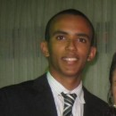
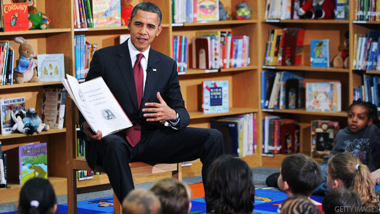

# O que aprendi com os livros que li em 2014

“O conhecimento mais importante é aquele que guia o modo como você conduz sua vida.” — Sêneca

[Paulo Ribeiro](http://www.papodehomem.com.br/autores/305#artigos)

[Mente e atitude](http://www.papodehomem.com.br/colecoes/atitude), [Listas](http://www.papodehomem.com.br/colecoes/listas), [Cultura e arte](http://www.papodehomem.com.br/colecoes/cultura)

- [**0**

  likes](http://www.papodehomem.com.br/o-que-aprendi-com-os-livros-que-li-em-2014#)
- [**0**

  tweets](http://www.papodehomem.com.br/o-que-aprendi-com-os-livros-que-li-em-2014#)
- [**0**

  google +](http://www.papodehomem.com.br/o-que-aprendi-com-os-livros-que-li-em-2014#)
- [**2**

  comentários](http://www.papodehomem.com.br/o-que-aprendi-com-os-livros-que-li-em-2014#disqus_thread)

Não é novidade que [leitura alimenta a alma](http://www.papodehomem.com.br/leitura-alimenta-ou-nao-desista-de-comecar-a-ler/) e pode ser um dos melhores investimentos para seu tempo. Algumas das lições mais importantes que aprendemos em nossas vidas [vêm de livros](http://estrategistas.com/10-conselhos-100-livros/).
Pode ser aquele romance que ajudou você a passar por um momento difícil
na vida, um livro de poesias que te lembra alguém especial ou algum
livro obscuro que forneceu um *insight* para resolver determinado problema.

Eu
aprendi bastante com os livros que li em 2014. Mais de alguns do que de
outros, claro, mas eu retirei pelo menos uma ideia importante de cada
bom livro que li.

Algo
que notei, no entanto, é que o conhecimento em livros segue algo
parecido com o Princípio de Pareto: uma pequeno número vai fornecer a
maior parte de lições para você. Desde que eu comecei a [extrair as partes mais importantes e colocá-las no papel](http://www.papodehomem.com.br/como-melhor-interpretar-e-absorver-suas-leituras/) para me ajudar com o aprendizado, eu pude notar isso na prática.

Pode
ser que eu crie 4 ou 5 cartões com passagens/ideias importantes em um
bom livro. Para um livro excelente, no entanto, esse número sobe para
25, 30 cartões. A proporção é ridícula. Por isso, embora eu tenha pego
perto de 100 livros esse ano, eu gostaria de selecionar os 3 melhores,
aqueles mais densos em aprendizado.

Nem todo mundo tem a oportunidade de ler tanto quanto eu, por isso, além da minha [lista de recomendações mensal](http://estrategistas.com/recomendacoes-de-leitura/), gosto de fazer a lista dos melhores do ano ([a de 2013 está aqui](http://www.papodehomem.com.br/tres-leituras-que-vao-mudar-sua-visao-de-mundo)) para que você passe por pelo menos parte da transformação que a leitura me promove todos os anos.

E também por um outro motivo: quero ouvir de você quais foram seus livros favoritos nos comentários!

Barack Obama contando sobre suas leituras

### 1. [Antifrágil](http://www.fnac.pt/Antifragil-Nassim-Nicholas-Taleb/a754039), de Nassim Taleb

Esse
é um daqueles livros sobre os quais é complicado discutir, simplesmente
por não haver ponto de referência lá fora. Não há com o que comparar, é
único em seu próprio jeito.

A
ideia-chave do livro é o conceito de antifragilidade. Basicamente,
antifrágil são coisas que se beneficiam de desordem, obstáculos, eventos
inesperados, etc - o contrário do que é frágil, que quebra diante do
inesperado.

Apesar
de ter um apêndice com uma matemática rigorosa mostrando de onde ele
deriva as ideias que discute, o que não se pode dizer de muitos livros
populares hoje, a obra em si é muito acessível.

Outra
razão de sua importância é que o conceito de antifragilidade foi
aplicado no livro em várias áreas de nossas vidas. Revisitamos conceitos
e ideias com que nos deparamos no dia a dia e descobrimos muitos pontos
de melhora, desde saúde, exercicios e alimentação, até tomada de
riscos, educação e ética.

Algumas ideias são bem inesperadas:

- Livros clássicos são [provavelmente melhores](http://www.wikiwand.com/en/Lindy_Effect)
  que os recém-lançados, pois o tempo funciona como um filtro para coisas
  perecíveis. Em uma menor escala, basta ver os livros destaque dos
  últimos vinte anos das listas de “bestsellers do ano” – quase nenhum
  ainda é discutido hoje, enquanto Sêneca e Marco Aurélio não envelhecem
  (vide abaixo).
- [A tecnologia envelhece “ao contrário”](http://www.wired.com/2012/12/worlds-not-ending-but-technologys-aging-backwards/).
- Remover a influência do acaso em muitos sistemas (como a nossa vida) [pode piorar as coisas](http://www.carlosmiceli.com/touristification/).
- [Universidades e grandes empresas são horríveis em nos preparar para a vida](http://www.carlosmiceli.com/touristification/) por criarem um ambiente artificial e “previsível”, quando a vida é tudo, menos isso.
- [Por que você deveria evitar os alimentos geneticamente modificados](https://medium.com/the-physics-arxiv-blog/genetically-modified-organisms-risk-global-ruin-says-black-swan-author-e8836fa7d78).

  

Fica difícil mostrar algumas passagens interessantes. já que o livro não traz muitas ideias autocontidas;  trata-se mais da apresentação de  novos conceitos e modos diferentes de enxergar as coisas. Esse trecho, contudo, é interessante e trata da [nova geração de meninos mimados](http://www.papodehomem.com.br/a-nova-geracao-de-homens-mimados/) e como as “[mamães-futebol](http://www.papodehomem.com.br/uma-geracao-de-homens-criados-pelas-maes/)” têm estragado as crianças, coisas que já discutimos por aqui.

> “O
> biólogo e intelectual E.O. Wilson foi uma vez perguntado o que
> representava a maior obstáculo ao desenvolvimento das crianças; a
> resposta dele foi a ‘mamãe-futebol’. Ele não usou a noção da cama de
> Proscuto, mas ele a descreveu quase perfeitamente. Seu argumento é que
> elas reprimem a biophilia natural das crianças, o amor delas por coisas
> vivas. Mas o problema é mais geral; mamães-futebol tentam eliminar a
> tentativa e erro, a antifragilidade, da vida das crianças, movendo-as
> para longe do ecológico e as transformando em nerds trabalhando em
> pre-existentes mapas da realidade (compatíveis com mamães-futebol).
>
> Bons
> estudantes, mas nerds - ou seja, eles são como computadores, só que
> lentos. Além disso, eles agora estão totalmente destreinados para lidar
> com ambiguidade. Como uma criança da guerra civil, eu não acredito em
> aprendizado estruturado… contanto que tenhamos o tipo certo de rigor,
> nós precisamos de aleatoriedade, bagunça, aventuras, incertezas,
> autodescoberta, episódios quase-traumáticos, todas essas coisas que
> fazem a vida válida de viver, comparada com a vida estruturada, falasa e
> inefetiva de um CEO de terno vazio com uma agenda pre-organizada e um
> despertador.”
>
> — Nassim Taleb

### 2. [Cartas a Lucílio](http://www.livrariacultura.com.br/p/cartas-a-lucilio-68977), do Sêneca

Lucius
Annaeus Seneca foi um filósofo romano, um dos maiores ícones do
Estoicismo. Diferente dos outros nomes dessa escola, que viveram sem
deixar registros escritos, ele não tinha problema algum em dar conselhos
e temos acesso a uma vasta coletânea de seus escritos.

Esse
livro, mais conhecido pela sua edição inglesa [Letters From a Stoic](http://www.amazon.com/Letters-Stoic-Epistulae-Lucilium-Classics-ebook/dp/B002RI99KK/), é
composto por um conjunto desses ensinamentos, na forma de cartas
escritas a amigos. Esse foi um artifício literário masterizado por
Sêneca, que lhe permitia tratar  da filosofia em temas mundanos e passar
um ar de proximidade ao leitor, por esse estar lendo cartas, uma
comunicação supostamente privada.

Embora
Sêneca tenha sido tutor de Nero, conseguindo ser uma influência
positiva durante o começo da adolescência do Imperador, a relação deles
se degradou. Para evitar problemas mais sérios, Sêneca pediu autorização
para cuidar da própria saúde, em suas propriedades.

Esse
período representou o desabrochar de sua filosofia, quando ele escrevia
como se estivesse correndo contra o tempo (e estava).  Na Antiguidade,
filosofia era vivida, não apenas fontes de discussões sem sentido (como a
maioria das pessoas a vê hoje). [Veja a vida de Sócrates](http://estrategistas.com/socrates-coragem-filosofia-aplicada-ao-dia-a-dia-e-o-poder-da-educacao/): ser filósofo
significava viver de maneira virtuosa dentro das próprias crenças e
todas as escolas buscavam ajudar o homem a ter uma vida melhor.

Por
isso, ao ler tais cartas, observamos conselhos práticos para problemas
reais, que facilmente estão presentes em nosso dia a dia, mesmo 2000 mil
anos mais tarde.

Por exemplo, ele foi um dos primeiros a formular sobre como a esperança é o que nos fode.

> “'Cesse
> o esperar’, ele diz, ‘e você cessará o temer.’ ‘Mas como,’ você
> perguntará, ‘podem coisas tão diferentes como estas estarem ligadas?’
> Bem, o fato é, Lucilius, que elas estão conectadas uma a outra, por mais
> desconectadas que pareçam. Embora sejam extremamente diferentes, as
> duas marcham uníssonas como um prisioneiro e o escolta a quem ele está
> algemado. O medo se mantém ao lado da esperança. Eles se moverem juntos
> não me surpreende; ambos pertencem a uma mente em suspense, a uma mente
> em um estado de ansiedade por olhar para o futuro. Ambos são
> principalmente devidos a projetar os pensamentos bem adiante de nós ao
> invés de nos adaptarmos ao presente.”
>
> — Sêneca

Sêneca
também discutiu como [não é no dinheiro, nem nas noitadas, bebidas,
mulheres](http://www.papodehomem.com.br/o-que-tanto-buscamos-em-noitadas-bebidas-mulheres-trabalhos-e-viagens/) que vamos encontrar a felicidade. Como estóico, felicidade para
ele estava em viver uma vida virtuosa, independente das circunstâncias.
A [passagem sobre viagens](http://www.papodehomem.com.br/o-seu-estilo-de-vida-ja-foi-projetado/) chama especial atenção, nesse mundo em que
tentamos escapar da rotina passando o feriadão na praia ou na Disney:

> "Aqui
> está o que Sócrates disse a alguém fazendo a mesma queixa: “ como você
> pode questionar que suas viagens não lhe fazem nenhum bem, quando você
> se carrega por aí consigo mesmo? Você está selado justamente com aquilo
> que te fez querer ir para longe.” Como pode uma mudança de ambiente e se
> familiarizar com cenas ou cidades estrangeiras ser de qualquer ajuda?
> Toda essa correria se mostrar ser bem fútil. E se você quer saber porque
> fugir não pode lhe ajudar, a resposta é simples esta: você está fugindo
> em sua própria companhia. Você tem que descarregar o que peso em seu
> espírito. Até que você faça isso, nenhum lugar irá satisfazer você."
>
> — Sêneca

Poucas
leituras que já fiz possuem tanto aprendizado condensado como esse
livro. Por não haver uma versão em português brasileiro, apenas em
Portugal, pode ser trabalhoso conseguir uma cópia. Se você [souber
inglês](http://www.papodehomem.com.br/se-eu-fosse-aprender-ingles-de-novo-e-assim-que-faria), pode pegar a sua agora.

Mas
não se prenda a esse livro! Qualquer coisa escrita pelo Sêneca vale a
pena, há outros ensaios famosos, como "[Sobre a brevidade da vida](http://www.lpm.com.br/site/default.asp?Template=../livros/layout_produto.asp&CategoriaID=816351&ID=845380)" e "[A vida
feliz](http://www.saraiva.com.br/da-vida-feliz-2725399.html)".

Ainda
na linha da “filosofia prática para viver uma vida melhor”, o mais
recente do Ryan Holiday, [The Obstacle is The Way](http://www.amazon.com/Obstacle-Way-Timeless-Turning-Triumph-ebook/dp/B00G3L1B8K/) é muito valioso e
acessível ao mesmo tempo. Escrevi a respeito do passo a passo que ele
propõe para transformar obstáculos em oportunidades, baseado no
Estoicismo.

Meditações,
do Marco Aurélio, livro no qual a obra de Ryan se baseou, [pode ser uma
leitura muito poderosa](http://estrategistas.com/lendo-meditacoes-por-marco-aurelio-algo-estranho-aconteceu/), se você escolher a [edição certa](http://www.amazon.com/Meditations-New-Translation-Marcus-Aurelius/dp/0812968255/).

### 3. [Letters from a self-made merchant to his son](http://www.amazon.com/Letters-Self-Made-Merchant-His-Son/dp/B003YHBET2), por George Lorimer

Escrito
pelo jornalista George Lorimer, esse livro é uma coletânea das cartas
que John Graham, chefe da família Graham, escreveu ao filho, Pierrepont,
enquanto ele crescia, pois este tinha se mudado para estudar longe.

Nos
dias de hoje, quando se há muita discussão sobre os caminhos para o
sucesso, observar um pai milionário, que saiu do zero, dando conselhos
ao próprio filho não tem preço. Especialmente porque os conselhos não
eram apenas sobre dinheiro; tratavam de tudo, desde como se portar como
um homem, manter-se íntegro, se relacionar com as pessoas, até como
desenvolver a ética de trabalho e buscar uma futura esposa.

Se
você “espremer” as páginas desse livro, experiência de vida vai jorrar
aos montes. O que surpreende é que ele foi escrito há mais de 100 anos: o
jornalista coletou as cartas, provavelmente escritas na década de 1890,
e publicou o livro no começo do século passado.

Mesmo sendo centenário, o livro se mantém muito atual. Por exemplo:

> "Sua
> mãe voltou em segurança essa manhã e ela quer que eu diga a você sem
> falta para não estudar demais, e eu quero dizer a você para garantir que
> não estude de menos. Nós estamos mandando você para Harvard para que
> pegue um pouco de educação que é tão boa e vasta lá.
>
> Quando
> passar por lá não se acanhe, mas se estenda e pegue uma boa porção
> todas as vezes, porque eu quero que você pegue sua parte. Você
> descobrirá que educação é praticamente a única coisa por aí solta no
> mundo, e que é praticamente a única coisa que um homem pode ter tanto
> quanto ele esteja disposto a pegar. Todo o resto está parafusado e a
> chave-de-fenda, perdida."
>
> — John Graham

É
também curioso observar a postura do pai diante de riqueza na educação
do filho. Por ter saído de baixo e ralado muito para construir seu
negócio, o velho Graham entendia o valor real do dinheiro e queria
instilar isso no filho. Por isso, o garoto teve que trabalhar de baixo
para cima e só era promovido quando mostrava resultados o suficiente
para conversar seu superior.

> “O
> jeito para você chegar ao primeiro lugar é correndo de forma justa e
> honesta, não por usar seu velho papai como um trampolim do qual pular
> sobre a cabeça deles. O filho de um homem tem o direito a uma chance no
> negócio dele, mas não à moleza.”

A
filosofia era de que "Não há nada que vem sem ser chamado nesse mundo e
depois de você ter chamado você geralmente tem que levantar e ir buscar
por si mesmo”. Se você se interessou, [separei minhas passagens
favoritas](http://estrategistas.com/10-conselhos-de-um-milionario/). Há também [um complemento com ainda mais cartas](http://www.amazon.com/Gorgon-Graham-Letters-Self-Made-Merchant-ebook/dp/B0084C3F6C/) do velho
Graham ao seu filho, tratando a partir do momento em que o filho se
casa.

Curioso ouvir alguns dos conselhos para a vida de casal! Passagens como essa chamam atenção:

> “Depois
> que você estiver casado por um tempo você notará que há dois tipos de
> felicidade que você pode ter - felicidade de casa e felicidade de moda.
> Com o primeiro tipo você tem muitas crianças e com o segundo, muitos
> cachorros. Enquanto cachorros se cuidam mais e parecem mais carinhosos,
> porque eles bejam você com a face inteira, eu sempre preferi me associar
> com crianças. Então, para o primeiro tipo de felicidade você mantém uma
> casa para si mesmo, e para o segundo tipo, você mantém a casa para os
> vizinhos.
>
> Você
> pode comprar muita felicidade de casa com um salário modesto, mas
> felicidade de moda sempre custa um pouco mais do que você está ganhando.
> Você não consegue controlar os gastos quando você tem que subir as
> aparências - quer dizer, a aparência de ser algo que você não é.”
>
> - John Graham

### Não dá para falar só de três livros

Eu tento manter a lista pequena, mas fica difícil falar de apenas três livros; são títulos demais!

[Os
Ensaios](http://www.livrariacultura.com.br/p/os-ensaios-22288717), do filósofo Michel de Montaigne, são uma excelente fonte de
reflexão sobre os mais diversos temas, vindas do autor que inventou o
gênero de ensaios. Montaigne deve ter preparado algum tipo de livro de
notas, pois seus textos são muito bem pesquisados e repletos de
referências dos clássicos gregos e romanos.

Em
termos de biografias, o livro [O Grande Herói](http://www.livrariacultura.com.br/p/o-grande-heroi-42231270), do Marcus Lutrell é
imperdível. Conta a história real de um soldado Navy SEAL, a tropa de
elite da marinha americana, que ficou preso no Afeganistão com uma
equipe de 4 soldados contra um exército de dezenas de terroristas por
fazer o que achava certo. É uma das histórias mais empolgantes que já li
e, sempre que me lembro que é um caso real, tenho calafrios. Há um
filme excelente e razoavelmente fiel, mas não deixe de ler o livro!

  

Há
uma boa conversa por aqui sobre [planejamento financeiro](http://www.papodehomem.com.br/percursos/planejamento-financeiro) para você
planejar bem 2015.  Se você quiser um livro para te ajudar no processo, o
“[Dinheiro é um santo remédio](http://www.editoragente.com.br/livro/246/dinheiro-e-um-santo-remedio)” do Conrado Navarro ([Dinheirama](http://dinheirama.com/)) é uma
leitura acessível e prática.

Para
quem curte ficções históricas, [Portões de Fogo](http://www.amazon.com/Gates-Fire-Steven-Pressfield-ebook/dp/B000NJL7QO/), do Steven Pressfield, é
uma obra-prima reconstruindo a famosa batalha dos 300. A ficção é tão
bem escrita que é utilizada por escolas de guerra ao redor do mundo como
referência.

Pronto, melhor parar por aqui. Já foram muito mais de três!

Agora quero ouvir de você: quais foram os melhores livros que leu em 2014?

---

*publicado em 30 de Dezembro de 2014, 16:54*
