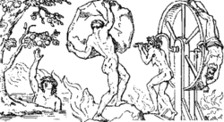
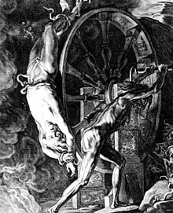

# Íxion – Wikipédia, a enciclopédia livre

Origem: Wikipédia, a enciclopédia livre.

Tântalo, Sísifo e Íxion.

**Íxion** figura entre os três maiores [vilões](http://pt.wikipedia.org/wiki/Vil%C3%A3o "Vilão") da [mitologia grega](http://pt.wikipedia.org/wiki/Mitologia_grega "Mitologia grega"), ao lado de [Sísifo](http://pt.wikipedia.org/wiki/S%C3%ADsifo "Sísifo") e [Tântalo](http://pt.wikipedia.org/wiki/T%C3%A2ntalo "Tântalo"). Tanto a culpa de Tântalo quanto a justiça no castigo de Sísifo são questionáveis, contudo, não há argumentos capazes de defender Íxion.

Íxion, filho de [Flégias](http://pt.wikipedia.org/wiki/Fl%C3%A9gias "Flégias"), descendente do deus-rio [Peneu](http://pt.wikipedia.org/w/index.php?title=Peneu&action=edit&redlink=1 "Peneu (página não existe)") foi rei dos [Lápitas](http://pt.wikipedia.org/wiki/L%C3%A1pitas "Lápitas"), um povo que habitava a [Tessália](http://pt.wikipedia.org/wiki/Tess%C3%A1lia "Tessália"), próximo aos [montes Pélios](http://pt.wikipedia.org/wiki/Montes_Pindo "Montes Pindo") e [Ossa](http://pt.wikipedia.org/w/index.php?title=Monte_Ossa&action=edit&redlink=1 "Monte Ossa (página não existe)"). Tendo-se apaixonado por [Dia](http://pt.wikipedia.org/wiki/Dia_(mitologia) "Dia (mitologia)"), filha de [Eioneu](http://pt.wikipedia.org/wiki/Eioneu "Eioneu"), prometeu-lhe seus [cavalos](http://pt.wikipedia.org/wiki/Cavalo "Cavalo") em troca da mão de sua filha. Após o [casamento](http://pt.wikipedia.org/wiki/Casamento "Casamento"), Íxion negou ao seu sogro os cavalos que lhe havia prometido, ao que este reagiu com a tomada à força do que lhe era devido, fazendo com que Íxion jurasse [vingança](http://pt.wikipedia.org/wiki/Vingan%C3%A7a "Vingança"). Não tendo conseguido decidir entre a morte e o sofrimento para seu sogro, Íxion optou por ambos: construiu uma [câmara](http://pt.wikipedia.org/wiki/C%C3%A2mara "Câmara") [incendiária](http://pt.wikipedia.org/wiki/Inc%C3%AAndio "Incêndio") e camuflou-a em sua casa como um cômodo. Dioneu, tendo aceitado um convite de Íxion para uma reconciliação dirigiu-se à casa deste e caiu em sua [armadilha](http://pt.wikipedia.org/wiki/Armadilha "Armadilha"). Enquanto era [incinerado](http://pt.wikipedia.org/wiki/Incinera%C3%A7%C3%A3o "Incineração"), seus gritos de desespero levaram Íxion ao arrependimento, mas era tarde. Ao abrir a porta da câmara, Íxion se deparou com o corpo carbonizado de seu sogro.

Após seu crime, o remorso fez com que Íxion enlouquecesse, e sua loucura o fez errar pelo mundo como [mendigo](http://pt.wikipedia.org/wiki/Mendigo "Mendigo"). A única maneira de recobrar a sanidade seria submetendo-se a uma [purificação](http://pt.wikipedia.org/wiki/Purifica%C3%A7%C3%A3o "Purificação") para a expiação do crime, porém ninguém conhecia o [ritual](http://pt.wikipedia.org/wiki/Ritual "Ritual") próprio para o caso, já que nunca antes ninguém havia [assassinado](http://pt.wikipedia.org/wiki/Assassinato "Assassinato") um membro de sua própria família.

.jpg)

Íxion preso na roda.

Ao ver o sofrimento de Íxion, [Zeus](http://pt.wikipedia.org/wiki/Zeus "Zeus") apiedou-se. Restitui-lhe a sanidade e convidou-o a partilhar do banquete dos [Deuses](http://pt.wikipedia.org/wiki/Deus_grego "Deus grego"), convite que foi prontamente aceito pelo mortal. Tendo-se embriagado pelo [néctar](http://pt.wikipedia.org/wiki/N%C3%A9ctar "Néctar"), Íxion passou a assediar a esposa de seu anfitrião, a própria [Hera](http://pt.wikipedia.org/wiki/Hera "Hera") [Crônida](http://pt.wikipedia.org/wiki/Cronos "Cronos"). Esta, ao perceber as intenções do visitante alertou seu esposo a respeito das intenções de seu convidado. Ao que parece Zeus encontrava-se com um bom-humor anormal neste dia, pois, em lugar de irritar-se, achou divertida a situação, e para testar seu hóspede forjou um [simulacro](http://pt.wikipedia.org/w/index.php?title=Simulacro&action=edit&redlink=1 "Simulacro (página não existe)") de sua própria esposa usando uma [nuvem](http://pt.wikipedia.org/wiki/Nuvem "Nuvem"), e deixou-a a sós com Íxion, que a possuiu. Desse [conúbio](http://pt.wikipedia.org/wiki/Con%C3%BAbio "Conúbio") nasceu a raça dos [Centauros](http://pt.wikipedia.org/wiki/Centauros "Centauros"), metade homens, metade cavalos. Todos os Centauros são descendentes de Íxion, exceto [Quíron](http://pt.wikipedia.org/wiki/Qu%C3%ADron "Quíron") (preceptor de [Aquiles](http://pt.wikipedia.org/wiki/Aquiles "Aquiles") entre outros) e [Folo](http://pt.wikipedia.org/w/index.php?title=Folo&action=edit&redlink=1 "Folo (página não existe)").

Após ter possuído [Néfele](http://pt.wikipedia.org/wiki/N%C3%A9fele "Néfele") crendo ser esta Hera, Íxion despediu-se dos Deuses e voltou para a [Terra](http://pt.wikipedia.org/wiki/Terra "Terra") e, tendo chegado, divulgou para os primeiros mortais que encontrou que havia possuído a esposa do próprio Zeus. Este, enfim, irritou-se ao ver a possibilidade de angariar a fama de ter sido traído por um mortal. Imediatamente Íxion foi fulminado por um [raio](http://pt.wikipedia.org/wiki/Raio "Raio") e lançado no [Tártaro](http://pt.wikipedia.org/wiki/T%C3%A1rtaro_(mitologia) "Tártaro (mitologia)"), onde foi preso a uma roda em chamas e condenado a nela girar pela eternidade.

| [[Expandir](http://pt.wikipedia.org/wiki/%C3%8Dxion#)] Mitologia grega | |
| --- | --- |
