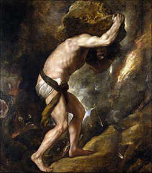

# Sísifo – Wikipédia, a enciclopédia livre

Origem: Wikipédia, a enciclopédia livre.

Na [mitologia grega](http://pt.wikipedia.org/wiki/Mitologia_grega "Mitologia grega"), **Sísifo**, filho do rei [Éolo](http://pt.wikipedia.org/wiki/%C3%89olo_(filho_de_Heleno) "Éolo (filho de Heleno)"), da [Tessália](http://pt.wikipedia.org/wiki/Tess%C3%A1lia "Tessália"), e [Enarete](http://pt.wikipedia.org/wiki/Enarete "Enarete"),[1](http://pt.wikipedia.org/wiki/S%C3%ADsifo#cite_note-apolodoro.1.7.3-1) era considerado o mais astuto de todos os mortais.

Foi o fundador e primeiro rei de [Éfira](http://pt.wikipedia.org/wiki/Corinto "Corinto"), depois chamada Corinto[2](http://pt.wikipedia.org/wiki/S%C3%ADsifo#cite_note-apolodoro.1.9.3-2) , onde governou por diversos anos. Casou-se com [Mérope](http://pt.wikipedia.org/wiki/M%C3%A9rope "Mérope"), filha de [Atlas](http://pt.wikipedia.org/wiki/Atlas_(mitologia) "Atlas (mitologia)"), sendo pai de [Glauco](http://pt.wikipedia.org/wiki/Glauco_(filho_de_S%C3%ADsifo) "Glauco (filho de Sísifo)") e avô de [Belerofonte](http://pt.wikipedia.org/wiki/Belerofonte "Belerofonte")[2](http://pt.wikipedia.org/wiki/S%C3%ADsifo#cite_note-apolodoro.1.9.3-2) .

## Família[editar](http://pt.wikipedia.org/w/index.php?title=S%C3%ADsifo&amp;veaction=edit&amp;vesection=1 "Editar secção: Família")[editar código-fonte](http://pt.wikipedia.org/w/index.php?title=S%C3%ADsifo&amp;action=edit&amp;section=1 "Editar secção: Família")

Éolo foi um dos filhos de [Heleno](http://pt.wikipedia.org/wiki/Heleno_(filho_de_Deucali%C3%A3o) "Heleno (filho de Deucalião)"), filho de [Deucalião](http://pt.wikipedia.org/wiki/Deucali%C3%A3o "Deucalião"), e reinou sobre a [Tessália](http://pt.wikipedia.org/wiki/Tess%C3%A1lia "Tessália").[1](http://pt.wikipedia.org/wiki/S%C3%ADsifo#cite_note-apolodoro.1.7.3-1) Enarate era filha de *Deimachus*.[1](http://pt.wikipedia.org/wiki/S%C3%ADsifo#cite_note-apolodoro.1.7.3-1)

Éolo e [Enarete](http://pt.wikipedia.org/wiki/Enarete "Enarete") tiveram vários filhos: [Creteu](http://pt.wikipedia.org/wiki/Creteu "Creteu"), Sísifo, [Deioneu](http://pt.wikipedia.org/wiki/Deioneu "Deioneu"), [Salmoneu](http://pt.wikipedia.org/wiki/Salmoneu "Salmoneu"), [Atamante](http://pt.wikipedia.org/wiki/Atamante "Atamante"), [Perieres](http://pt.wikipedia.org/wiki/Perieres "Perieres"), [Cercafas](http://pt.wikipedia.org/w/index.php?title=Cercafas&amp;action=edit&amp;redlink=1 "Cercafas (página não existe)") e [Magnes](http://pt.wikipedia.org/wiki/Magnes "Magnes"), e filhas, [Calice](http://pt.wikipedia.org/wiki/Calice "Calice"), [Peisidice](http://pt.wikipedia.org/w/index.php?title=Peisidice&amp;action=edit&amp;redlink=1 "Peisidice (página não existe)"), [Perimele](http://pt.wikipedia.org/wiki/Perimele "Perimele"), [Alcione](http://pt.wikipedia.org/wiki/Alcione_(cantora) "Alcione (cantora)") e [Cânace](http://pt.wikipedia.org/wiki/C%C3%A2nace "Cânace").[1](http://pt.wikipedia.org/wiki/S%C3%ADsifo#cite_note-apolodoro.1.7.3-1)

## A história de Sísifo

Mestre da malícia e da felicidade, ele entrou para a tradição como um dos maiores ofensores dos deuses.

Segundo [Higino](http://pt.wikipedia.org/wiki/Higino "Higino"), ele odiava seu irmão [Salmoneu](http://pt.wikipedia.org/wiki/Salmoneu "Salmoneu"); perguntando a [Apolo](http://pt.wikipedia.org/wiki/Apolo "Apolo") como ele poderia matar seu inimigo, o deus respondeu que ele deveria ter filhos com [Tiro](http://pt.wikipedia.org/wiki/Tiro_(mitologia) "Tiro (mitologia)"), filha de Salmoneu, que o vingariam. Dois filhos nasceram, mas Tiro, descobrindo a profecia, os matou. Sísifo se vingou ...[Nota 1](http://pt.wikipedia.org/wiki/S%C3%ADsifo#cite_note-3) e, por causa disso, ele recebeu como castigo na [terra dos mortos](http://pt.wikipedia.org/wiki/Hades_(reino) "Hades (reino)") empurrar uma pedra até o lugar mais alto da montanha, de onde ela rola de volta[3](http://pt.wikipedia.org/wiki/S%C3%ADsifo#cite_note-higino.60-4) [4](http://pt.wikipedia.org/wiki/S%C3%ADsifo#cite_note-higino.239-5) .

Segundo [Pausânias](http://pt.wikipedia.org/wiki/Paus%C3%A2nias_(ge%C3%B3grafo) "Pausânias (geógrafo)"), ele tornou-se rei de Corinto após a partida de [Jasão](http://pt.wikipedia.org/wiki/Jas%C3%A3o "Jasão") e [Medeia](http://pt.wikipedia.org/wiki/Medeia "Medeia"); nesta versão, Medeia não matou os próprios filhos por vingança, mas escondeu-os no templo de Hera esperando que, com isso, eles se tornassem imortais.[5](http://pt.wikipedia.org/wiki/S%C3%ADsifo#cite_note-pausanias.2.3.11-6)

Sísifo casou-se com [Mérope](http://pt.wikipedia.org/wiki/M%C3%A9rope "Mérope"), uma das sete [Plêiades](http://pt.wikipedia.org/wiki/Pl%C3%AAiades_(mitologia) "Plêiades (mitologia)"), tendo com ela um filho, [Glauco](http://pt.wikipedia.org/wiki/Glauco_(filho_de_S%C3%ADsifo) "Glauco (filho de Sísifo)").[2](http://pt.wikipedia.org/wiki/S%C3%ADsifo#cite_note-apolodoro.1.9.3-2) Ele também teve outros filhos, [Ornitião](http://pt.wikipedia.org/wiki/Orniti%C3%A3o "Ornitião"), [Tersandro](http://pt.wikipedia.org/wiki/Tersandro_(filho_de_S%C3%ADsifo) "Tersandro (filho de Sísifo)") e *Almus*[6](http://pt.wikipedia.org/wiki/S%C3%ADsifo#cite_note-pausanias.2.4.3-7) .

Certa vez, uma grande águia sobrevoou sua cidade, levando nas garras uma bela jovem. Sísifo reconheceu a jovem [Égina](http://pt.wikipedia.org/wiki/%C3%89gina "Égina"), filha de [Asopo](http://pt.wikipedia.org/wiki/Asopo "Asopo"), um deus-rio. Mais tarde, o velho Asopo veio perguntar-lhe se sabia do rapto de sua filha e qual seria seu destino. Sísifo logo fez um acordo: em troca de uma fonte de água para sua cidade, ele contaria o paradeiro da filha. O acordo foi feito e a fonte presenteada recebeu o nome de Pirene[2](http://pt.wikipedia.org/wiki/S%C3%ADsifo#cite_note-apolodoro.1.9.3-2) [7](http://pt.wikipedia.org/wiki/S%C3%ADsifo#cite_note-pausanias.2.5.1-8) .

Assim, ele despertou a raiva do grande Zeus, que enviou o deus da Morte, [Tânato](http://pt.wikipedia.org/wiki/T%C3%A2nato "Tânato"), para levá-lo ao mundo subterrâneo. Porém o esperto Sísifo conseguiu enganar o enviado de Zeus. Elogiou sua beleza e pediu-lhe para deixá-lo enfeitar seu pescoço com um colar. O colar, na verdade, não passava de uma coleira, com a qual Sísifo manteve a Morte aprisionada e conseguiu driblar seu destino.

Durante um tempo não morreu mais ninguém. Sísifo soube enganar a Morte, mas arrumou novas encrencas. Desta vez com Hades, o deus dos mortos, e com Ares, o deus da guerra, que precisava dos préstimos da Morte para consumar as batalhas.

Tão logo teve conhecimento, Hades libertou Tânato e ordenou-lhe que trouxesse Sísifo imediatamente para as mansões da morte. Quando Sísifo se despediu de sua mulher, teve o cuidado de pedir secretamente que ela não enterrasse seu corpo.

Já no inferno, Sísifo reclamou com Hades da falta de respeito de sua esposa em não o enterrar. Então suplicou por mais um dia de prazo, para se vingar da mulher ingrata e cumprir os rituais fúnebres. Hades lhe concedeu o pedido. Sísifo então retomou seu corpo e fugiu com a esposa. Havia enganado a Morte pela segunda vez.

Outra história a respeito de Sísifo trata do ocorrido quando [Autólico](http://pt.wikipedia.org/wiki/Aut%C3%B3lico "Autólico"), o mais esperto e bem-sucedido ladrão da Grécia (que era filho de Hermes e vizinho de Sísifo), tentou roubar-lhe o gado. Autólico mudava a cor dos animais. As reses desapareciam sistematicamente sem que se encontrasse o menor sinal do ladrão, porém Sísifo começou a desconfiar de algo, pois o rebanho de Autólico aumentava à medida que o seu diminuía. Sísifo, um homem letrado (teria sido um dos primeiros gregos a dominar a escrita), teve a ideia de marcar os cascos de seus animais com sinais de modo que, à medida que a res se afastava do curral, aparecia no chão a frase "Autólico me roubou". Posteriormente, Sísifo e Autólico fizeram as pazes e se tornaram amigos. Sísifo também seduziu [Anticleia](http://pt.wikipedia.org/wiki/Anticleia "Anticleia"), filha de Autólico, que mais tarde se casou com o rei de [Ítaca](http://pt.wikipedia.org/wiki/%C3%8Dtaca "Ítaca"), [Laerte](http://pt.wikipedia.org/wiki/Laerte_de_%C3%8Dtaca "Laerte de Ítaca"); por este motivo, [Odisseu](http://pt.wikipedia.org/wiki/Odisseu "Odisseu") é considerado, por alguns autores, como filho de Sísifo[8](http://pt.wikipedia.org/wiki/S%C3%ADsifo#cite_note-higino.201-9) .

Sísifo morreu de velhice e [Zeus](http://pt.wikipedia.org/wiki/Zeus "Zeus") enviou [Hermes](http://pt.wikipedia.org/wiki/Hermes "Hermes") para conduzir sua alma a Hades. No tártaro, Sísifo foi considerado um grande rebelde e teve um castigo, juntamente com [Prometeu](http://pt.wikipedia.org/wiki/Prometeu "Prometeu"), [Tício](http://pt.wikipedia.org/wiki/T%C3%ADcio "Tício"), [Tântalo](http://pt.wikipedia.org/wiki/T%C3%A2ntalo "Tântalo") e [Íxion](http://pt.wikipedia.org/wiki/%C3%8Dxion "Íxion").

Sísifo recebeu esta punição: foi condenado a, por toda a eternidade, rolar uma grande pedra de [mármore](http://pt.wikipedia.org/wiki/M%C3%A1rmore "Mármore") com suas mãos até o cume de uma montanha, sendo que toda vez que ele estava quase alcançando o topo, a pedra rolava novamente montanha abaixo até o ponto de partida por meio de uma força irresistível, invalidando completamente o duro esforço despendido[3](http://pt.wikipedia.org/wiki/S%C3%ADsifo#cite_note-higino.60-4) [9](http://pt.wikipedia.org/wiki/S%C3%ADsifo#cite_note-10) . Por esse motivo, a expressão "trabalho de Sísifo", em contextos modernos, é empregada para denotar qualquer tarefa que envolva esforços longos, repetitivos e inevitavelmente fadados ao fracasso - algo como um infinito ciclo de esforços que, além de nunca levarem a nada útil ou proveitoso, também são totalmente desprovidos de quaisquer opções de desistência ou recusa em fazê-lo.

## Trabalho de Sísifo[editar](http://pt.wikipedia.org/w/index.php?title=S%C3%ADsifo&amp;veaction=edit&amp;vesection=3 "Editar secção: Trabalho de Sísifo")[editar código-fonte](http://pt.wikipedia.org/w/index.php?title=S%C3%ADsifo&amp;action=edit&amp;section=3 "Editar secção: Trabalho de Sísifo")

Sísifo tornou-se conhecido por executar um trabalho rotineiro e cansativo. Tratava-se de um castigo para mostrar-lhe que os mortais não têm a liberdade dos deuses. Os mortais têm a liberdade de escolha, devendo, pois, concentrar-se nos afazeres da vida cotidiana, vivendo-a em sua plenitude, tornando-se criativos na repetição e na monotonia.

*Árvore genealógica baseada em Apolodoro (parcial):*

## Ver também[editar](http://pt.wikipedia.org/w/index.php?title=S%C3%ADsifo&amp;veaction=edit&amp;vesection=4 "Editar secção: Ver também")[editar código-fonte](http://pt.wikipedia.org/w/index.php?title=S%C3%ADsifo&amp;action=edit&amp;section=4 "Editar secção: Ver também")

## Notas e referências[editar](http://pt.wikipedia.org/w/index.php?title=S%C3%ADsifo&amp;veaction=edit&amp;vesection=5 "Editar secção: Notas e referências")[editar código-fonte](http://pt.wikipedia.org/w/index.php?title=S%C3%ADsifo&amp;action=edit&amp;section=5 "Editar secção: Notas e referências")

### Notas[editar](http://pt.wikipedia.org/w/index.php?title=S%C3%ADsifo&amp;veaction=edit&amp;vesection=6 "Editar secção: Notas")[editar código-fonte](http://pt.wikipedia.org/w/index.php?title=S%C3%ADsifo&amp;action=edit&amp;section=6 "Editar secção: Notas")

1. [Ir para cima ↑](http://pt.wikipedia.org/wiki/S%C3%ADsifo#cite_ref-3) O texto de Higino não inclui a vingança

## Referências

| [[Expandir](http://pt.wikipedia.org/wiki/S%C3%ADsifo#)] Mitologia grega | |
| --- | --- |
