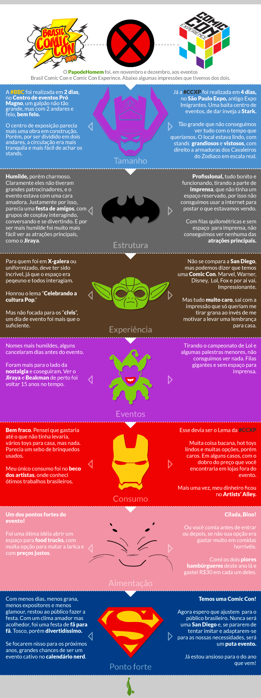

Existe um mundo que eu não conhecia. A fantasia nas histórias, a ficção científica, a mítica por trás do homem com super poderes, tudo isso combinado com uma entrega sem igual faz do mundo dos nerds, um universo realmente único.

Digo, eu gosto de histórias em quadrinhos, eu escrevo ficção — sobre o cotidiano e não em mundos inventados, mas ainda assim — e piro em jogos e em cinema e a coisa toda. Eu realmente gosto. Mas preciso me justificar sempre que me encontro em meio a esse pessoal que encontrei nas duas Comic Con que fui este ano, a Brasil e a Experience.

A explicação vem por eu ser comedido. Consumo, converso com pessoas que também gostam e é isso. Abismo entre mim e a entrega de se vestir a caráter, a pegar horas de filas para um contato com o ator ou então por uma versão assinada da série favorita das HQs. E isso parte do tipo de cultura consumida por eles. Ora, pra você efetivamente botar fé no que está escrito em *O Senhor dos Anéis* ou em qualquer revistinha da Marvel, precisa da entrega. Se não, é um monte de furo e incongruências. Muitos filmes pecam nisso e muitos expectadores pecam nisso, botando entrega demais ou de menos, o que acaba com qualquer equilíbrio e vira a famosa frustração.

Então essa galera embarca. Vestidos de Batman e Homem-Aranha ou algum personagem de jogo de videogame e até fantasiados como os bonecos dos Comandos em Ação — famosos nos anos 80 e 90 –, eles se reúnem e trocam e vivem aquilo.

É intenso.

Na Comic Con Brasil, que rolou em novembro, a coisa estava mais para uma reunião de aficionados. Milhares de cosplayers com o intuito de estarem juntos, bater fotos, trocar informações sobre roupas e outros eventos. Uma festa.

A Comic Con Experience, a CCXP, que aconteceu nesse último final de semana, o intuito era mesmo tentar chegar perto do que é a Comic Con de San Diego, a mais famosa e respeitada, evento anual onde acontecem todas as notícias para o ano no quesito HQ, séries de TV, cinema de super heróis. Aqui, sem as novidades bombásticas, mas com stands de miniaturas (que chegavam a custar 5, 6 mil reais), livros com capas exclusivas do evento (tinha, feita pela Editora Aleph, um especial do clássico Laranja Mecânica com capa exclusiva de venda da CCXP). Era coisa pra gente mais velha e abastada, ou seja, menos celebração de encontro e mais arroubo por novidades e situações únicas.

Ambos tem seus méritos. Fizemos, aqui, um comparativo pra entendermos melhor a intenção de cada evento, com arte e opiniões do [Felipe Franco](http://instagram.com/felipefr):

E, para quem foi, coloquei aqui noa comentários o que achou de cada evento.

  
por Jader Pires  
  
[[anexo ausente]](http://pubads.g.doubleclick.net/gampad/jump?iu=1051165/PdH_Feed_superbanner/leaderboard&amp;sz=728x90&amp;c=455167246) [anexo ausente]  
  
  
[[anexo ausente]](http://da.feedsportal.com/r/214612583515/u/49/f/530922/c/32911/s/4146d9b7/sc/27/rc/1/rc.htm)  
[[anexo ausente]](http://da.feedsportal.com/r/214612583515/u/49/f/530922/c/32911/s/4146d9b7/sc/27/rc/2/rc.htm)  
[[anexo ausente]](http://da.feedsportal.com/r/214612583515/u/49/f/530922/c/32911/s/4146d9b7/sc/27/rc/3/rc.htm)  
  
 [anexo ausente]

[[anexo ausente]](http://feeds.feedburner.com/~ff/PapodehomemLifestyleMagazine?a=WJvYkshwLiM:CVOCQOkK2Gs:yIl2AUoC8zA) [[anexo ausente]](http://feeds.feedburner.com/~ff/PapodehomemLifestyleMagazine?a=WJvYkshwLiM:CVOCQOkK2Gs:D7DqB2pKExk) [[anexo ausente]](http://feeds.feedburner.com/~ff/PapodehomemLifestyleMagazine?a=WJvYkshwLiM:CVOCQOkK2Gs:qj6IDK7rITs) [[anexo ausente]](http://feeds.feedburner.com/~ff/PapodehomemLifestyleMagazine?a=WJvYkshwLiM:CVOCQOkK2Gs:-BTjWOF_DHI)

[anexo ausente]
