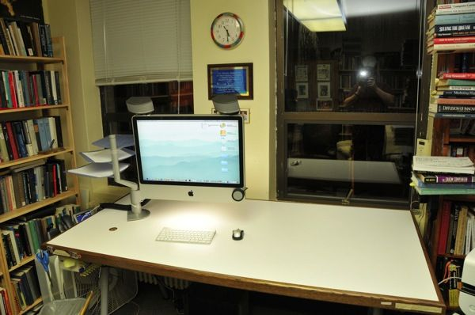
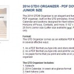

Imagem: Restart GTD

Eu estava relendo alguns pontos do livro do GTD essa semana e me deparei com uma orientação que o David Allen diz sobre como colocar em prática o GTD no seu espaço físico, especialmente home-office. Achei tão legal que quis escrever um post sobre essas recomendações.

- Arrume todo o seu espaço de trabalho pessoal. Se você trabalha em casa, seu home-office. Organize a sua estação de trabalho. Deixe nela somente o que você realmente usa – e eu sei que essa é uma dica manjada, mas nem sempre ela é seguida. Gosto de deixar computador, telefone, luminária, caneta, bloquinho e só. Veja o que funciona para você.
- Providencie caixas de entrada – em casa e no trabalho.
- Crie um bom sistema pessoal de arquivamento. Digitalize o que puder, livre-se do papel, mas organize direitinho aquilo que ainda precisa manter impresso (certidões, documentos).
- Utilize, para administrar suas listas de tarefas e projetos, um programa que seja agradável para você, que você goste de usar. Você sabe que a ferramenta é a certa para você porque você fica com vontade de brincar com ela, mexer, descobrir coisas.
- Rearranje o seu espaço de trabalho, promova mudanças, jogue tralha fora.
- Reserve um tempinho ao longo da sua semana para atacar uma área específica do seu escritório. Depois, vá aplicando ao resto da casa, até ter organizado tudo. Jogue isso dentro do GTD: colete, processe, organize, revise e execute.
- Divida com alguém o que você vem aprendendo nesse processo, não só para inspirar outras pessoas e trocar ideias, mas porque ensinar é a melhor maneira de absorver o que aprendeu.
- Releia o livro do GTD sempre que tiver oportunidade. A cada leitura, com suas experiências, será um novo livro. Por experiência própria, isso é muito verdade.
- Fique em contato com pessoas que usem o GTD e estão discutindo sobre melhorias da produtividade.

Achei as orientações simples e bem legais, para fazer hoje mesmo. Até me animei a reorganizar o escritório.

### Textos relacionados:

- [Como fazer: planejamento de projetos no GTD](http://vidaorganizada.com/solucoes/produtividade/gtd/como-fazer-planejamento-de-projetos-no-gtd/)
- [O que é o tickler e como funciona?](http://vidaorganizada.com/solucoes/produtividade/gtd/o-que-e-o-tickler-e-como-funciona/)
- [Guia definitivo do Vida Organizada para usar o GTD no Evernote – Parte 6 – Metas, objetivos e visão](http://vidaorganizada.com/solucoes/produtividade/gtd/guia-definitivo-do-vida-organizada-para-usar-o-gtd-no-evernote-parte-6-metas-objetivos-e-visao/)
- [Ideia do David Allen para usar cadernos no Evernote](http://vidaorganizada.com/solucoes/produtividade/gtd/ideia-david-allen-para-usar-cadernos-evernote/)
- [Como fazer a revisão semanal do GTD](http://vidaorganizada.com/organizacao/como-fazer-a-revisao-semanal-do-gtd/)
