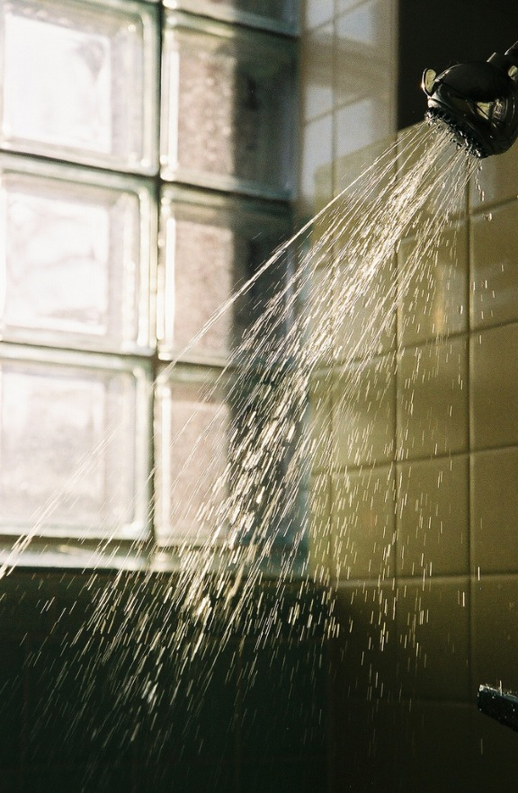

# Como aproveitar os dias de folga no final do ano de maneira produtiva

Imagem: Vintage Paradise (Tumblr)

Eu procuro tomar bastante cuidado com essa coisa de ter dias de folga produtivos porque acho que dia de folga é para descansar mesmo! Antes, gostava de aproveitar cada tempo livre para fazer determinadas coisas mas (felizmente) consegui organizar minha vida para não depender de dias de folga esporádicos para fazer isso. No entanto, apesar de aproveitar para descansar, também acabo sempre arrumando alguma coisa para fazer e, pensando sobre o assunto, tive a ideia para escrever este post. Seguem então sugestões para você tornar seus dias de folga no final do ano um pouco mais produtivos:

- **Resolva assuntos no banco**. Mudar de agência, trocar o gerente, buscar cheques, resolver qualquer coisa, solicitar informações sobre financiamentos, empréstimos e investimentos. Sempre é bom ter um dia livre durante a semana para conseguir investir tempo nisso. Se for o seu caso, apenas verifique o horário de funcionamento do banco onde é cliente.
- **Organize o seu home-office**. [Ontem eu publiquei um post](http://vidaorganizada.com/solucoes/produtividade/gtd/aplicando-o-gtd-ao-seu-espaco-fisico-como-comecar/ "Aplicando o GTD ao seu espaço físico – como começar") com recomendações para fazer isso dentro do GTD.
- **Destralhe a sua casa**. Pegue uma sacola grande e circule pela sua casa, jogando dentro o que for lixo. Você vai se surpreender com a quantidade de embalagens, papéis e coisas avulsas que vai querer se desfazer.
- **Estude um idioma**. Em casa mesmo, ou pela Internet.
- **Leia o livro do GTD**. De verdade!
- **Conheça os pontos turísticos da sua própria cidade**. Geralmente como as pessoas viajam no final do ano, as cidades que não são ponto turístico ficam vazias, como no caso de São Paulo. Aproveite o que a cidade tem de melhor sem trânsito, sem muita gente, mas com muito calor.
- **Faça o seu planejamento para o ano seguinte**. Veja aqui um post sobre as [minhas revisões do GTD](http://vidaorganizada.com/solucoes/produtividade/gtd/como-fazer-as-revisoes-no-gtd/ "Como fazer as revisões no GTD") – mesmo se você não usar o método, pode servir como guia.
- **Organize suas caixas de entrada de e-mails**. Essa é boa, hein, mas precisa manter ao longo do ano para não crescer absurdamente (de novo).
- **Faça backup dos seus equipamentos eletrônicos**. Computador, tablet, celular.
- **Monte uma planilha para registrar seus gastos e receitas em 2015**. Há diversos modelos disponíveis na Internet.
- **Ajude alguém de alguma maneira**. Aquele amigo a pintar a casa, o outro que está de mudança, um morador de rua pedindo comida.
- **Digitalize a papelada que está acumulando** e coloque no Evernote, que agora dá 4Gb por mês para usuários premium. Utilize o aplicativo Cam Scanner para isso.
- **Faça uma super limpeza na sua casa**. Pegue um dia em que estiver bem avulso e aproveite para esfregar chão, arrastar sofá, limpar embaixo da cama e todas aquelas tarefas que podem ser esquecidas ao longo do ano.
- **Agradeça pelo ano que passou**. De preferência, bebendo água de coco e olhando para o céu, de pernas para o ar. Descanse. Você merece.

Boas festas!
