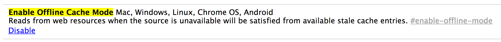
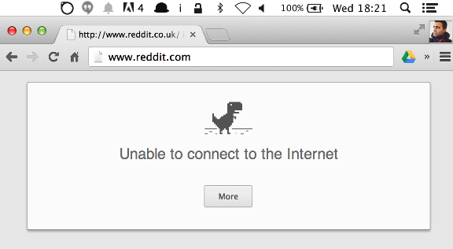

# [Offline Browsing Secrets In Chrome](http://addyosmani.com/blog/offline-mode-chrome/ "Permalink to Offline Browsing Secrets In Chrome")

If you travel, you’ve probably found yourself stuck with **zero network connectivity** on more than one occasion. This sucks, especially if you just want to look up a few previously viewed pages to get some work done. Who are we kidding?…you want to look at kittens shooting lasers out of their eyeballs.

Unfortunately, in Chrome attempting to request something from the network while offline doesn’t quite work out so well.

Want to hear the shortest **horror** story ever? Here we go:

It’s TERRIFYING. Just look at that expressionless face.

I kid I kid. We love the dinosaur. That said, planes, the subway, hotel and conference wifi all present opportunities for your connection to flat out call it a day and you generally have to wait for the network to come back online in order to request pages you want to view.

Firefox and IE have had a “Work offline” option for close to forever and we’ve wanted something similar in Chrome that doesn’t force us to save static copies of our pages all over the place.

For many, it may seem like Chrome users are out of luck, unless a site supports an offline experience through AppCache, which has it’s own [problems](http://alistapart.com/article/application-cache-is-a-douchebag) or [Service Worker](https://github.com/slightlyoff/ServiceWorker/), which will ultimately give apps more fine-grained control over how to respond to network requests.

## Chrome already supports an offline mode. What?!

It turns out that back in early 2013, Chrome networking engineer Randy Smith implemented support for an Offline Cache Mode (behind [flags](http://addyosmani.com/blog/offline-mode-chrome/chrome://flags/#enable-offline-mode)). With the feature enabled, if you’re offline and navigate to a page with (stale) data in the cache, we’ll show you the cached content.

So for reddit.com, we go from this offline experience:

to this:

The feature also happens to work just fine in Chrome for Android:

**Wooooooo. THIS IS SOOO GOOD.**

Testing across Chrome for Android (phone/tablet) and desktop I was able to use this feature to offline issue pages for some of my repos on GitHub during my last trip. It worked like a charm.

What we mean by “offline” here is that the initial network request for a site returns an error that could indicate a network connectivity failure and so we display the last stored entry for the page (generally listed in `about:cache`).

**So, how do you enable this?**

## Enable Offline Cache Mode for Chrome 35

- Visit [about:flags](http://addyosmani.com/blog/offline-mode-chrome/chrome://flags/#enable-offline-mode)
- Find “Enable Offline Cache Mode”, click on the “Enable” button and scroll down to the bottom and and click on the “Relaunch Now” button to restart Chrome.
- Disconnect from the web and try loading in a page you previously visited. If in the cache, it should correctly load up.

## Gotchas

Offline Cache Mode worked great in my tests, but there are a few gotchas worth being aware of.

- In Chrome stable (35 at the time of writing), there’s no indication that a site has a cached version available. Instead, you’ll be shown the stale/cached copy without warning if you try navigating to a page while offline. Read on to learn about how we’re approaching this in Chrome 37.
- POST requests are obviously not handled nor queued. It’s best to think of the feature as a cache reader.
- The feature doesn’t play great with AppCache (what does?), meaning that if you attempt to use it with a site that uses a cache manifest, we can’t guarantee that you’ll see the content you’re expecting so caveat emptor.
- The feature works best with static resources, so it’s most useful for offline viewing of HTML/CSS/JS/images and less so with say, streaming media like video.

That said, it still serves my purposes and is worth trying out.

## Improved Offline Mode In Chrome 37

What’s even better is in Chrome 37, we are currently experimenting with enabling the Offline Cache Mode by default, showing you a “Show saved copy” button when you attempt to request a site which has a copy in the stale cache. This **fixes** the first of the issues mentioned in my gotchas.

Clicking on “Show saved copy”, as expected, takes you to the cached version of the page:

**Offline Auto-Reload Mode**

Something I ran into using Offline Cached Mode was that I’d often try navigating from a cached page to a non-cached page and be bummed to find it wasn’t available.

Another option available in about:flags is “Offline Auto-Reload Mode”, which basically will keep track of pages that failed to load while we are offline which Chrome will auto-reload (and populate an entry for in the cache) when the browser is back online.

For those concerned about auto-reloading tabs that aren’t visible, another experimental flag “Only Auto-Reload Visible Tabs” is also currently available in Chrome 37:

## Go forth and offline all the cats

I personally love Offline cache mode and imagine for most users, seeing some data while offline is better than none.

That said, we’re always interested in hearing about any cases where cached mode doesn’t quite work as expected (e.g an error page is displayed rather than the cached data) and where it can be improved.

So, go have a play with the feature and let us know how you get on!

*With thanks to Matt Gaunt on the Chrome Developer Relations team for his review.*
