[[8](http://www.akitaonrails.com/2008/02/12/git-para-cientistas-da-computa-o# "Mais...")](http://www.akitaonrails.com/2008/02/12/git-para-cientistas-da-computa-o#)

12 Fevereiro 2008, 15:54 h

# Git para Cientistas da Computação

[Git](http://www.akitaonrails.com/Git) [Iniciante](http://www.akitaonrails.com/Iniciante)

Este artigo é bem introdutório e mais uma curiosidade de como funciona parte dos intestinos do Git. Apenas para quem tem interesse e começar a entender o raciocínio do Linus na arquitetura desse tipo de repositório.

Eu traduzi do [artigo](http://eagain.net/articles/git-for-computer-scientists/) de Tommi Virtanen, do blog Tv’s cobweb. Mas para quem quer aprender a utilização do Git, eu sugiro esses outros artigos:

- [Git – SVN Crash Course](http://git.or.cz/course/svn.html)

- [Learning git-svn in 5min](http://tsunanet.blogspot.com/2007/07/learning-git-svn-in-5min.html)

- [An introduction to git-svn for Subversion/SVK users and deserters](http://utsl.gen.nz/talks/git-svn/intro.html)

- [Using Git SCM to manage and deploy Rails applications](http://www.vimeo.com/369095 "screencast")

- [Peepcode: GIT](http://peepcode.com/products/git)

- [Hosting Git repositories, The easy (and Secure) Way](http://scie.nti.st/2007/11/14/hosting-git-repositories-the-easy-and-secure-way)

Porque eu acho que Git está rapidamente pegando velocidade nas comunidades em detrimento de Darcs, Mercurial ou Bazaar? Não acho que seja uma única resposta, mas alguns fatores que contribuem: Git, de fato, é uma tecnologia excelente, com um enfoque novo a um problema antigo. Assim como Rails não seria Rails sem DHH, acho que faz diferença ter o Linus como criador do Git.

Finalmente, [git-svn](http://www.flavio.castelli.name/howto_use_git_with_svn). Acho que este é o **principal** motivo. Outras ferramentas conseguem integrar com SVN, eu não conheço os outros em detalhes, mas a maioria acho que só tem acesso read-only a um repositório remoto Subversion. Já o git-svn tem integração read-write. Você literalmente pode trabalhar com Git e Svn em paralelo sem nenhum grande problema. Se precisar pode até ter equipes mistas, com alguns trabalhando em Git e outros – que preferem – em Svn. Isso é importantíssimo porque hoje quase todos usam Subversion nas empresas. Integrar com o SVN é como o Mac bootar Windows. O que os outros precisam fazer é uma integração decente com Svn primeiro.

Claro, não é 100% que vai funcionar. Um dos obstáculos pode ser svn:externals, mas este [artigo](http://www.flavio.castelli.name/howto_use_git_with_svn) dá algunas alternativas que podem ser até melhores. Railers que usam Piston agora tem [Giston](http://evil.che.lu/2007/11/27/ann-giston-piston-lookalike-for-git) e assim por diante.

O único “problema” aparente do Git é que ele tem baixo suporte em Windows. Mas pelo menos lá fora isso não é um problema já que parece que a maioria dos que são “desenvolvedores” usam ou Linux ou Mac. Portanto, como os americanos dizem, isso é um *non-issue*. Quem desenvolve em Windows acaba tendo que usar Team System :-P eca

Bom, vamos à tradução:

[Veja todos os links deste artigo](http://www.akitaonrails.com/2008/02/12/git-para-cientistas-da-computa-o#links)

Recomendado para você

[AkitaOnRails.com](http://www.akitaonrails.com/2015/01/28/ruby-e-rails-no-ubuntu-14-04-lts-trusty-tahr#at_pco=smlrebh-1.0&at_si=54c9fd0d21c3abe8&at_ab=per-2&at_pos=0&at_tot=auto "AkitaOnRails.com")

www.akitaonrails.com

[AkitaOnRails.com](http://www.akitaonrails.com/2015/01/28/ruby-e-rails-no-ubuntu-14-04-lts-trusty-tahr#at_pco=smlrebh-1.0&at_tot=auto&at_ab=per-2&at_pos=1&at_si=54c9fd0d21c3abe8 "AkitaOnRails.com")

www.akitaonrails.com

[AkitaOnRails.com](http://www.akitaonrails.com/2015/01/28/ruby-e-rails-no-ubuntu-14-04-lts-trusty-tahr#at_pco=smlrebh-1.0&at_si=54c9fd0d21c3abe8&at_ab=per-2&at_pos=2&at_tot=auto "AkitaOnRails.com")

www.akitaonrails.com

[AkitaOnRails.com](http://www.akitaonrails.com/2015/01/28/ruby-e-rails-no-ubuntu-14-04-lts-trusty-tahr#at_pco=smlrebh-1.0&at_tot=auto&at_ab=per-2&at_pos=3&at_si=54c9fd0d21c3abe8 "AkitaOnRails.com")

www.akitaonrails.com

[AddThis](http://www.addthis.com/?utm_source=dyntr&utm_medium=img&utm_content=AT_main_WT&utm_campaign=AT_main)

### Introdução

Rápida introdução ao interior do [git](http://git.or.cz/) para pessoas que não tem medo de palavrões como [Directed Acyclic Graph](http://en.wikipedia.org/wiki/Directed_acyclic_graph) (DAG).

**Nota do Akita:** Em ciência da computação, um DAG é um grafo direcionado sem ciclos diretos. Podem ser consideradas uma generalização de árvores onde certas sub-árvores podem ser compartilhadas por diferentes partes da árvore. Em uma árvore com muitas sub-árvores idênticas, isso pode a levar uma drástica queda em requerimento de espaço de armazenamento. Algumas aplicações: árvores de parse de compiladores, redes bayeasianas, grafos de referência usadas por garbage collectores de contagem de referência … git :-)

### Armazenamento

De forma simplificada, o armazenamento de objetos do git é “apenas” um DAG de objetos, com diversos tipos diferentes de objetos. Eles são todos salvos comprimidos e identificados por um hash SHA-1 (que, incidentalmente, não é o SHA-1 do conteúdo do arquivo que eles representam, mas de sua representação no git).

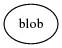

*blob:* o objeto mais simples, apenas um punhado de bytes. Isso é normalmente um arquivo, mas pode ser um symlink ou qualquer outra coisa. O objeto que aponta para o blob determina sua semântica.

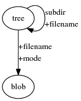

*tree (árvore):* diretórios são representados como árvores de objetos. Eles se referem a blobs que tem o conteúdo de arquivos (filename (nome de arquivo), modo de acesso, etc é tudo armazenado na árvore), e para outras árvores para sub-diretórios.

Quando um nó aponta para outro nó no DAG, ele depende de outro nó: ele não pode existir sem ele. Nós para os quais ninguém aponta podem ser coletados pelo garbage collector (gc) do git, ou resgatados de forma parecida com inodes de um filesystem sem filenames apontando a eles com o git lost-found.

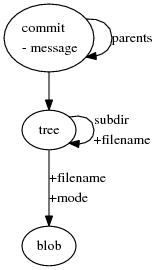

*commit*: um commit se refere a uma árvore que representa o estado dos arquivos no momento do commit. Também se refere a 0 ou mais outros commits que são seus parents (pais). Mais de um pai significa que o commit é um merge, nenhum pai significa que é um commit inicial, e uma coisa interessante é que podem haver mais de um commit inicial; isso normalmente significa dois projetos separados sendo mesclados (merged). O corpo do objeto de commit é a mensagem de commit.

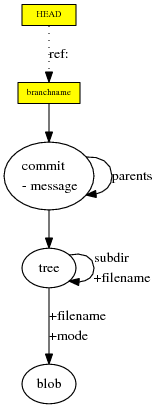

*refs*: referências, ou cabeças (heads) ou branches (galhos), são como anotações de post-it anexados ao um nó no DAG. DAGs somente podem ser adicionados a nós existentes e são imutáveis, já os post-its podem ser movimentados livremente. Eles não são armazenados no histórico, e não são transferidos diretamente entre repositórios. Eles agem como um tipo de bookmark, “Estou trabalhando aqui”.

*git commit* adiciona um nó ao DAG e move a anotação de post-it do branch atual para esse novo nó.

A ref de *HEAD* é especial porque ele realmente aponta para outra ref. É um ponteiro para o branch atualmente ativo. Refs normais estão realmente em um namespace heads/XXX, mas você normalmente pode pular as partes heads/.

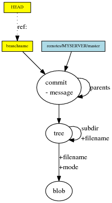

*remote refs*: referências remotas são post-its de uma cor diferente. A diferença com refs normais é o namespace diferente, e o fato que refs remotas são essencialmente controladas pelo servidor remoto. *git fetch* as atualiza.

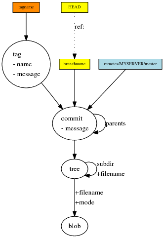

*tag*: um tag é tanto um nó no DAG quanto um post-it (de mais outra cor). Um tag aponta para um commit, e inclui uma mensagem opcional e uma assinatura GPG.

O post-it é somente uma maneira rápida de acessar um tag, e se perdida pode ser recuperada diretamente do DAG com *git lost-found*.

Os nós de um DAG podem ser movimentadas de repositório para repositório, podem ser armazenadas de forma mais efetiva (packs), e nós não usados podem ser coletados como lixo (gc). Mas no fim, um repositório git é sempre somente um DAG e post-its.

### Histórico

Então, armado com esse conhecimento de como git armazena o histórico de versões, como visualizamos coisas como mergs, e como git difere de ferramentas que tentam gerenciar o histórico como mudanças lineares por branch.

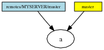

Esse é o repositório mais simples. Fizemos um clone de um repositório remoto com um commit nele.

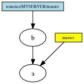

Aqui puxamos (fetched) o remoto e recebemos um novo commit, mas ainda não fizemos merge.

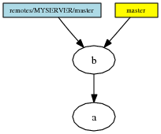

A situação depois de *git merge remotes/MYSERVER/master*. Como esse merge foi um fast forward (ou seja, não tínhamos nenhum novo commit em nosso branch local), a única coisa que aconteceu foi mover o post-it e mudar os arquivos em nosso diretório de trabalho, respectivamente.

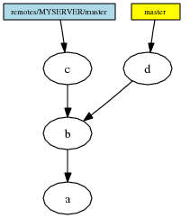

Um *git commit* local e um *git fetch* depois. Temos tanto um novo commit local e um novo commit remoto. Claramente, um merge é necessário.

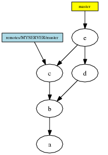

Resultado de um *git merge remotes/MYSERVER/master*. Como tivemos novos commits locais, isso não foi um fast forward, mas de fato um novo nó de commit foi criado no DAG. Note como ele tem dois commits pais.

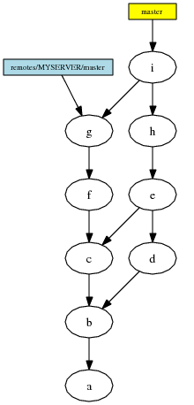

Eis como a árvore se parece depois de alguns commits em ambos os branches e outro merge. Vê o padrão de “costura” (stitching) emergindo? O DAG do git registra exatamente qual foi o histórico de ações tomadas.

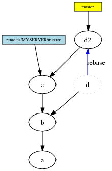

O padrão de “costura” é meio tedioso de se ler. Se você ainda não publicou seu branch, ou comunicou claramente para outras pessoas não basearem seus trabalho nele, você tem uma alternativa. Você pode rebasear (rebase) seu branch, onde em vez de merge, seu commit é substituído por outro commit com um pai diferente, e seu branch é movido para lá.

Seus antigo(s) commit(s) permanecem no DAG até um gargage collector limpar. Ignore-os por enquanto, mas apenas saiba que existe uma saída caso você faça uma grande besteira. Se tiver post-its extras apontando para seu antigo commit, eles permanecerão apontando para lá, mantendo-os vivos indefinidamente. Isso pode ser um pouco confuso.

Não rebaseie branches onde outros criaram novos commits por cima. É possível recuperar-se disso, não é difícil, mas o trabalho extra pode ser frustrante.

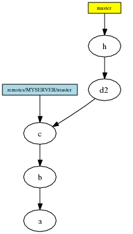

A situação depois de um garbage collection (ou simplesmente ignorar o commit inalcançável), e criar um novo commit por cima de seu branch rebaseado.

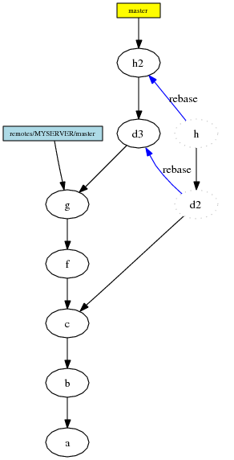

*rebase* também sabe como rebasear múltiplos commits com um comando.

Esse é o fim de nossa breve introdução ao git para pessoas não intimidadas por Ciência da Computação. Espero que tenha ajudado!

#### Todos os links do Artigo

- [ANN: giston - piston lookalike for git - evil.che.lu](http://evil.che.lu/2007/11/27/ann-giston-piston-lookalike-for-git)
- [An introduction to git-svn for Subversion/SVK users and deserters](http://utsl.gen.nz/talks/git-svn/intro.html)
- [Directed acyclic graph - Wikipedia, the free encyclopedia](http://en.wikipedia.org/wiki/Directed_acyclic_graph)
- [Git](http://git.or.cz/)
- [Git - SVN Crash Course](http://git.or.cz/course/svn.html)
- [Git Tutorial | PeepCode Screencast](http://peepcode.com/products/git)
- [Git for Computer Scientists](http://eagain.net/articles/git-for-computer-scientists/)
- [Git with Rails Tutorial on Vimeo](http://www.vimeo.com/369095)
- [Hosting Git repositories, The Easy (and Secure) Way - scie.nti.st](http://scie.nti.st/2007/11/14/hosting-git-repositories-the-easy-and-secure-way)
- [Tsuna's blog: Learning git-svn in 5min](http://tsunanet.blogspot.com/2007/07/learning-git-svn-in-5min.html)
- [artigo](http://www.flavio.castelli.name/howto_use_git_with_svn)
- [git-svn](http://www.flavio.castelli.name/howto_use_git_with_svn)
