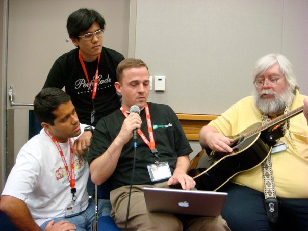
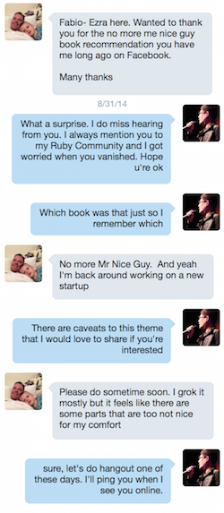

# Lembrando os Heróis Ruby que se foram em 2014

[RIP](http://www.akitaonrails.com/RIP)

Em muitos aspectos o ano de 2014 foi extremamente triste para a comunidade internacional de Ruby e para mim pessoalmente já que conheci os 3 pessoalmente.

[Check out all related links](http://www.akitaonrails.com/2015/01/02/lembrando-os-herois-ruby-que-se-foram-em-2014#links)

Recomendado para você

[AkitaOnRails.com](http://www.akitaonrails.com/2014/12/29/presente-de-natal-ruby-2-2-0-lancado#at_pco=smlrebh-1.0&at_si=54a6c4a35159b228&at_ab=per-2&at_pos=0&at_tot=auto "AkitaOnRails.com")

www.akitaonrails.com

[AkitaOnRails.com](http://www.akitaonrails.com/2014/12/29/presente-de-natal-ruby-2-2-0-lancado#at_pco=smlrebh-1.0&at_tot=auto&at_ab=per-2&at_pos=1&at_si=54a6c4a35159b228 "AkitaOnRails.com")

www.akitaonrails.com

[AkitaOnRails.com](http://www.akitaonrails.com/2014/12/29/presente-de-natal-ruby-2-2-0-lancado#at_pco=smlrebh-1.0&at_si=54a6c4a35159b228&at_ab=per-2&at_pos=2&at_tot=auto "AkitaOnRails.com")

www.akitaonrails.com

[AkitaOnRails.com](http://www.akitaonrails.com/2014/12/29/presente-de-natal-ruby-2-2-0-lancado#at_pco=smlrebh-1.0&at_tot=auto&at_ab=per-2&at_pos=3&at_si=54a6c4a35159b228 "AkitaOnRails.com")

www.akitaonrails.com

Primeiro foi a perda do venerado [Jim Weirich](https://news.ycombinator.com/item?id=7270098), em 20 de Fevereiro de 2014. Ele foi o autor do projeto Rake. Veja seu [Github](https://github.com/jimweirich) para ver no que ele contribuía. E de curiosidade, leia um pouco da [história do Rake](https://github.com/ruby/rake/blob/master/doc/rational.rdoc) que está dentro do seu código-fonte. Jim sempre foi uma presença essencial nos eventos de Ruby e Rails e tem diversas palestras excepcionais que [vale a pena assistir](https://www.youtube.com/results?search_query=jim+weirich). Antes de partir, ele era Chief Scientist da consultoria NEO.

Em 30 de Novembro de 2014, foi a vez de [Ezra Zygmuntowicz](https://news.ycombinator.com/item?id=8676140), ele foi um dos co-fundadores da famosa Engine Yard. Na época em que ele e Tom Mornini dirigiam a empresa, eles tiveram as equipes do JRuby e do Rubinius sob seu patrocínio e tutela. Ezra foi quem pegou o Mongrel de Zed Shaw e explorou o mundo de evented I/O antes de Node.js, com o Evented Mongrel (que depois foi substituído pelo projeto Thin), foi um dos primeiros a explorar e ajudar a popularizar o [Redis](https://github.com/redis/redis-rb), ele trouxe a tona a idéia de Platform as a Service antes do Heroku, a idéia de infraestrutura como software (antes da onda Devops), trouxe o projeto Merb (que depois viria a ser [incorporado ao Rails 3](http://www.akitaonrails.com/2008/12/23/bomba-merb-e-rails-se-fundem)). Depois disso, ele saiu da Engine Yard e passou um tempo desaparecido em Portland, Oregon. Começou uma startup de impressão 3D (quando impressão 3D estava começando) mas acabou não dando certo. Pouco antes de partir ele estava twitando que iria empreender uma nova idéia. Ezra foi um visionário como poucos que existem hoje, e o mundo vai sentir sua falta. Assista algumas de [suas palestra no YouTube](https://www.youtube.com/results?search_query=ezra+zygmuntowicz).

Finalmente, em 28 de Dezembro de 2014, perdemos [James Golick](https://news.ycombinator.com/item?id=8804624), um grande companheiro de outro rubista que talvez seja mais conhecido, [Joe Damato](http://gilesbowkett.blogspot.com.br/2014/12/james-golick-rest-in-peace.html). Talvez muitos dos rubistas mais novos não tenham ouvido falar dele, mas ele ficou conhecido alguns anos atrás principalmente por causa do projeto [Resource Controller](https://github.com/jamesgolick/resource_controller), que ele resolveu parar em 2009 por causa de uma alternativa chamada [Inherited Resources](https://github.com/josevalim/inherited_resources) apareceu para substituí-lo. Eu mesmo cheguei a contribuir um pouco nesse projeto na época. Mas ele era um contribuidor open source prolixo, vejam seu [Github](https://github.com/jamesgolick) para ver as últimas coisas em que trabalhou. Eu fiz uma video entrevista com ele na Railsconf 2010 em Baltimore, [assistam aqui](http://www.akitaonrails.com/2010/06/17/railsconf-2010-video-entrevistas-parte-1#.VKawMXRHnxg).

Todos os 3 eram programadores queridos na comunidade, com reconhecimento pelos seus feitos, e principalmente pelo exemplo de seus bons caráters. Devem ser relembrados nos anais da história desta comunidade e vamos sentir muita falta deles.

Vamos trabalhar em 2015 e adiante para que seus esforços não tenham sido em vão.

PS: fiquei particularmente triste com a perda de Ezra porque coisa de algumas semanas antes dele partir, estávamos combinando de trocar idéias, um Hangout que nunca mais vai acontecer:

