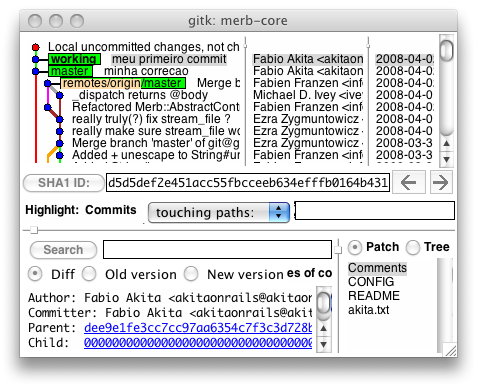

# Clone do Github

Pra começar, o Github é quase um ‘social networking para programadores’. Ele torna fazer forks e contribuir para projetos algo trivial. Porém, ele ainda está fechado em Beta e é preciso convite para se cadastrar.

Mas isso não significa que você precise disso. Para começar, a do repositório Git de cada projeto está acessível para quem quiser. Você precisa, sim, se quiser contribuir patches de volta para o repositório original de forma automatizada. Senão, mãos-à-obra:

Não vou reexplicar como se [instala Git](http://git.or.cz/gitwiki/WindowsInstall). Por favor abram o [Google](http://www.google.com/search?client=safari&rls=en-us&q=how+install+git+windows&ie=UTF-8&oe=UTF-8) e procurem as dezenas de receitas que já existem. Para usuários de Windows, uma dica, prefiram o método que usa Cygwin. Sem isso vocês não terão a outra excelente razão para se usar Git: o git-svn que permite usar Git com repositórios Subversion.

Por exemplo, digamos que você goste do projeto Merb. Mas quer fazer modificações pessoais que só servem para você.

O código do Merb fica no Github também, nesta :

http://github.com/wycats/merb-core/tree/master

|  |
| --- |
| ``` Em cada projeto lá, você encontra o "Clone URL" que é tudo que você precisa. Com o git instalado, vá ao seu diretório de desenvolvimento e faça:  <macro:code>git clone git://github.com/wycats/merb-core.git merb-core ``` |

Pronto, quando ele terminar você terá um clone do repositório original. Literalmente: porque de brinde você ainda ganha todo o histórico desde o primeiro commit! Esse é o equivalente a se fazer um ‘svn checkout’.

Feito isso, entre no diretório ‘merb-core’. Digite:

>> git branch -a  
  
\* master  
origin/  
origin/master

|  |
| --- |
| ``` O asterisco indica em qual branch você está. Os outros branches eu não mexeria se fosse você, eles servem para puxar novas atualizações do repositório original.  h1. Manipulando Branches Locais  A primeira coisa que recomendo é criar um novo branch. Pode ser qualquer nome, no meu caso eu sempre crio um chamado 'working'.  <macro:code>>> git checkout -b working Switched to a new branch "working"  >> git branch   master * working ``` |

Esse comando cria o novo branch e já te muda para lá. Note como o asterisco mudou de branch. Agora você pode fazer as loucuras que quiser. Por exemplo, vou editar alguns arquivos aleatoriamente. Como sei o que mudou? Simples:

>> git status  
# On branch working  
# Changed but not updated:  
# (use “git add …” to update what will be committed)  
#  
# modified: CONFIG  
# modified: README  
# modified:   
#  
# Untracked files:  
# (use “git add …” to include in what will be committed)  
#  
# akita.txt  
no changes added to commit (use “git add” and/or “git commit -a”)

|  |
| --- |
| ``` Os arquivos que já existiam no repositório e que você mexeu, aparecem como 'modified', ou 'deleted'. Se você criou alguma arquivo novo, ele aparece em 'Untracked files'.  Você precisa adicionar ele ao repositório antes de dar commit. Da mesma forma como você precisaria fazer 'svn add'.  <macro:code>>> git add akita.txt ``` |

Outra forma, caso você tenha vários novos arquivos é usar a seguinte linha:

>> git add -i  
staged unstaged path  
1: unchanged +3/-1 CONFIG  
2: unchanged +2/-0 README  
3: unchanged +1/-0   
  
**\* Commands \***  
1: status 2: update 3: revert 4: add untracked  
5: patch 6: diff 7: quit 8: help  
What now>

|  |
| --- |
| ``` A opção "-i" significa 'interativo'. Ele abre um sisteminha onde você pode digitar a opção "4". Daí ele mostrará uma lista de arquivos cada um com um número na frente. Para adicioná-lo, digite o número de cada arquivo que quiser. No final dê enter sem digitar nada e ele volta para o menu acima. Quando acabar digite '7' para voltar ao shell.  <macro:code>What now> 4   1: akita.txt Add untracked>> 1 * 1: akita.txt Add untracked>>  added one path ``` |

Pronto. Com os arquivos adicionados, basta fazer o commit:

>> git commit ~~a -m “meu primeiro commit”  
Created commit 457f597: meu primeiro commit  
4 files changed, 7 insertions(+), 1 deletions(~~)  
create mode 100644 akita.txt

|  |
| --- |
| ``` O git commit funciona parecido com svn commit, mas você tem o -a para que ele adicione automaticamente todo arquivo que foi modificado. O -m é como no svn, para colocar mensagens de commit.  Vejamos como isso se parece:  <p style="text-align: center; margin: 3px">!http://s3.amazonaws.com/akitaonrails/assets/2008/4/3/Picture_3.png!</p>  Note como o branch master ficou para trás e o nosso 'working' subiu: isso porque agora ele tem modificações que não existem no master.  Vamos brincar mais um pouco. Digamos que você descubra um bug no master que precisa corrigir rapidamente e colocar em produção mas não quer colocar também o que você acabou de fazer no 'working' porque ainda não está pronto. O que fazer?? Não se preocupe, é aqui que o Git começa a brilhar:  <macro:code>>> git checkout master Switched to branch "master"  >> git checkout -b meufix Switched to branch "meufix"  >> ls akita.txt ls: akita.txt: No such file or directory ``` |

Vamos lá! Na primeira linha eu voltei ao branch master. De lá vou criar meu novo branch, com git checkout novamente, como já fizemos antes. Nesse ponto, o branch ‘meufix’ virou uma cópia exata do master, sem o código que eu estava trabalhando, que ficou no branch separado ‘working’. Como disse antes, o git checkout -b cria o novo branch e já me coloca nele.

O último comando é um ‘ls’ (o equivalente de ‘dir’, para quem é de Windows). Lembram que no branch ‘working’ eu criei um arquivinho ‘akita.txt’? Como esse arquivo só existe no branch ‘working’, quando criei o branch ‘meufix’ a partir do ‘master’ ele não veio, claro. Estou com uma cópia exata do branch principal.

Agora, vou fazer as correções que preciso.

>> git commit ~~a -m “minha correcao”  
Created commit 760873a: minha correcao  
3 files changed, 6 insertions(+), 1 deletions(~~)

|  |
| --- |
| ``` Pronto! Fiz minhas correções, fiz o commit e agora posso jogar em produção. Meu chefe me deixa em paz e eu posso voltar ao que estava fazendo antes.  h1. Merges Triviais  Espere um instante, e agora? Em que situação estou. Vamos ver:  <p style="text-align: center; margin: 3px">!http://s3.amazonaws.com/akitaonrails/assets/2008/4/3/Picture_4.png!</p>  Que bagunça! Agora eu tenho o branch 'master', que ainda é a cópia exata do repositório no Github. Tenho o branch 'working' onde eu acrescentei meu código novo. E tenho o branch 'meufix' com a correção sobre o master.  Ambos 'working' e 'master' tem um ancestral em comum, o 'master'. O que vou fazer agora não é o comum, mas faça de conta que você tenha permissão de escrita no repositório central do Github e quer jogar essa correção que fizemos para lá. Ou seja, preciso pegar a correção, jogar no master e dali empurrar para o servidor online:  <macro:code>>> git branch   master * meufix   working  >> git checkout master Switched to branch "master"  >> git merge meufix Updating a83054c..dee9e1f Fast forward  CHANGELOG |    1 +  CONFIG    |    3 ++-  TODO      |    1 +  3 files changed, 4 insertions(+), 1 deletions(-)  >> git branch -d meufix Deleted branch meufix. ``` |

Apenas para ter certeza, na primeira linha usamos o comando git branch para ver quais branches existem e em qual estou. Feito isso, mudo de volta para o branch master.

O comando git merge faz o que esperamos: traz as correções que fizemos no branch ‘meufix’ de volta para o master. Finalmente o último comando, git branch -d apaga o branch ‘meufix’, já que não vamos mais precisar dele. Veja como é tudo muito rápido!! E sem precisa mexer em mais nada.

Bom, vamos voltar para nosso branch ‘working’ e continuar trabalhando nele.

>> git status  
# On branch working  
# Changed but not updated:  
# (use “git add …” to update what will be committed)  
#  
# modified: LICENSE  
# modified: akita.txt  
#  
no changes added to commit (use “git add” and/or “git commit -a”)

|  |
| --- |
| ``` Pronto, estamos em 'working' e continuamos trabalhando. Veja como eu mexi em dois arquivos. Eis que me dou conta: _"As correções que acabei de dar merge no master!!"_ Pois é, eu preciso trazer as correções do master para o working. Mas agora estou no meio de uma codificação e ainda não estou a fim de fazer commit. O que fazer? Eis a resposta:  <macro:code>>> git stash Saved "WIP on working: 457f597... meu primeiro commit" HEAD is now at 457f597... meu primeiro commit ``` |

Pense em ‘stash’ como uma pilha temporária de coisas. Eu não quis fazer commit dos dois arquivos me mexi acima, então simplesmente joguei para o stash e ele vai ficar lá por um momento. Agora vamos pegar as correções que estão no master:

>> git rebase master  
First, rewinding head to replay your work on top of it…  
is now at dee9e1f… minha correcao  
  
Applying meu primeiro commit  
  
error: patch failed: CONFIG:1  
error: CONFIG: patch does not apply  
error: patch failed: :0  
error: : patch does not apply  
Using index info to reconstruct a base tree…  
Falling back to patching base and 3-way merge…  
Auto-merged CONFIG  
CONFLICT (content): Merge conflict in CONFIG  
Auto-merged   
CONFLICT (content): Merge conflict in   
Failed to merge in the changes.  
Patch failed at 0001.  
  
When you have resolved this problem run “git rebase —continue”.  
If you would prefer to skip this patch, instead run “git rebase —skip”.  
To restore the original branch and stop rebasing run “git rebase —abort”.

|  |
| --- |
| ``` Uau! Quanta coisa! Dois conflitos! _"Droga, mas não disseram que o Git faz merges inteligentes?"_ Exatamente, ele fará o melhor merge possível. Já explico isso melhor. Mas de qualquer forma, ocasionalmente sempre haverá o caso onde o Git não tem como decidir, por exemplo, quando dois desenvolvedores modificam exatamente a mesma linha: qual dos dois tem prioridade? Então, vamos corrigir os erros na mão. Você pode usar qualquer ferramenta GUI que manipula Diffs, é a mesma coisa:  <macro:code>teste <<<<<<< HEAD:CONFIG =======  >>>>>>> meu primeiro commit:CONFIG ``` |

No primeiro arquivo, CONFIG, felizmente era apenas uma linha branca a mais. Então vamos apenas retirar as marcações do diff de lá e salvar.

<<<<<<< :  
TESTE  
===  
outra modificacao  
>>>>>>> meu primeiro commit:

|  |
| --- |
| ``` O segundo arquivo, TODO, tinha dois conteúdos diferentes para a mesma linha. Vou escolher a primeira e tirar as marcações de diff, e salvar o arquivo.  <macro:code>git status # On branch working # Changes to be committed: #   (use "git reset HEAD <file>..." to unstage) # #        modified:   README #        new file:   akita.txt # # Changed but not updated: #   (use "git add <file>..." to update what will be committed) # #        unmerged:   CONFIG #        modified:   CONFIG #        unmerged:   TODO #        modified:   TODO # # Untracked files: #   (use "git add <file>..." to include in what will be committed) # #        .dotest/ ``` |

Pronto. Os dois arquivos conflitados aparecem na lista ‘Changed but not updated’. Para continuar, precisamos usar git add para indicar ao Git que já resolvemos os conflitos:

>> git add CONFIG   
>> git add   
>> git rebase —continue  
  
Applying meu primeiro commit  
  
Wrote tree ba231cbcbb1c61e67b4871e09be67b744559d28d  
Committed: d5d5def2e451acc55fbcceeb634efffb0164b431

|  |
| --- |
| ``` Agora sim, terminou sem nenhum erro! O que ele fez? Ele continuou a operação de 'rebase' que começamos lá em cima e foi até o fim. Quando os conflitos apareceram vocês devem ter notado que no git status que dei antes apareceu um cara estranho chamado .dotest/. Ele guardou o que faltava aplicar no nosso branch e o comando git rebase --continue segue a partir de onde parou usando o que ficou gravado em .dotest/. Agora que o rebase terminou, esse diretório também some.  h1. Merge vs Rebase  E por que antes eu fiz 'merge' e agora eu usei esse tal de 'rebase'?  Isso é importante! Prestem atenção. Rebase é o seguinte: ele dará rollback até o commit onde eu fiz o branch. Ou seja, o primeiro commit que eu fiz no começo do artigo será guardado e o branch voltará ao estado inicial. Sobre ele, ele pegará os commits novos que apareceram no branch original, o 'master', e o aplicará sobre meu branch 'working'.  Dessa forma o 'working' ficará sincronizado com o principal. Agora, sobre isso, ele reaplicará todos os commits que eu fiz exclusivamente dentro do branch 'working'.   Agora, o merge é o contrário: você trabalhou no branch e agora quer trazer as modificações de volta ao 'master', então você faz merge. Eu decorei assim: do master para meu branch, rebase. Do meu branch para o master, merge.  Fazendo isso, você normalmente terá mais conflitos quando fizer o rebase no seu branch temporário, mas resolvendo os conflitos ali, quando fizer o merge para o master, ele será automático e sem erros.  Agora, faltou uma coisa: o stash!! Lembram dos dois arquivos que eu guardei no stash, que eu ainda não havia feito commit? Vamos buscá-lo:  <macro:code>>> git stash apply # On branch working # Changed but not updated: #   (use "git add <file>..." to update what will be committed) # #        modified:   LICENSE #        modified:   akita.txt # no changes added to commit (use "git add" and/or "git commit -a")  >> git stash clear ``` |

Pronto. O comando git stash apply trará nossas modificações de volta. Também poderia haver conflitos, o procedimento é o mesmo de antes. O último comando é para limpar o espaço do stash, é bom fazer isso sempre que aplicar as modificações de volta. O stash é muito útil e você pode ter quantos stashes quantos quiser, inclusive pode dar nome a eles.



Vejamos mais sobre o rebase na prática. Antes disso, vamos fazer o commit desses 2 arquivos que recuperamos do stash:

>> git add .   
>> git commit ~~a -m “mais um commit”  
Created commit 69bc9a8: mais um commit  
2 files changed, 3 insertions(+), 1 deletions(~~)

|  |
| --- |
| ``` O git add . (ponto) significa _"adicione todo novo arquivo que apareceu agora e que não estava no repositório antes."_ O segundo comando vocês já conhecem. Cuidado ao adicionar tudo de uma vez só, você pode acabar adicionando arquivos que não queria como logs e outras sujeiras. Use git status para se certificar do que está adicionando.  h1. Rebaseando seu Branch  <macro:code>>> git checkout master Switched to branch "master"  >> git pull        Merge made by recursive.  lib/merb-core/bootloader.rb                        |   18 +++++--  lib/merb-core/controller/abstract_controller.rb    |   10 +- ``` |

lib/merb-core/controller/exceptions.rb | 8 ++—
lib/merb-core/controller/mixins/controller.rb | 10 ++—
lib/merb-core/controller/mixins/render.rb | 49 ++++++++++++++++++—
lib/merb-core/core\_ext/string.rb | 11 ++++-
lib/merb-core/dispatch/router/route.rb | 2 +-
lib/merb-core/rack/handler/mongrel.rb | 2 +-
…/abstract\_controller/controllers/render.rb | 12 +++++
spec/public/abstract\_controller/render\_spec.rb | 12 +++++
10 files changed, 105 insertions(+), 29 deletions(-)

|  |
| --- |
| ``` Na primeira linha, voltamos ao branch master. Acho que não precisa, mas eu prefiro seguir esse fluxo. Em seguida damos simplesmente git pull, que irá buscar novidades no repositório online do Github. Veja que vieram novas modificações!   Como eu ainda não terminei minha nova funcionalidade no branch 'working', quero que essas novidades estejam lá também para que eu possa testar contra meu código. Vamos repetir o que eu expliquei acima:  <macro:code>>> git checkout working Switched to branch "working"  >> git rebase master First, rewinding head to replay your work on top of it... HEAD is now at 76969b2... Merge branch 'master' of git://github.com/wycats/merb-core  Applying meu primeiro commit  Wrote tree 0f9f0e2b72f45f14a7b941b8e064de8dba678566 Committed: 9c35dc1cead3f50c8b96494b01cf2b7a29fdb2fa  Applying mais um commit  Wrote tree 104dd17852e815cfc4e23345ae123ea390c997e3 Committed: c9a4f27905d47d57798ee2b3239eec1e162cb452 ``` |

Pronto. Agora meu branch ‘working’ está sincronizado com o ‘master’.

# Reusando e Resincronizando seus Repositórios

Façamos de conta que eu acabei o código que estava trabalhando no ‘working’. Agora gostaria de utilizá-lo em outro projeto meu. Ou seja, em vez de usar o Merb original, quero usar o meu Merb customizado. Como fazer isso?

Antes de mais nada, ‘working’ não é um nome legal, quero mudar de nome para refletir o código que acabei de terminar. Para isso faça:

>> git branch -m working meu\_merb  
  
>> git branch  
master  
\* meu\_merb

|  |
| --- |
| ``` Veja, como o branch 'working' sumiu e apareceu o 'meu_merb'. Esse comando é mais ou menos um rename simples.  Agora, vou sair desse diretório, porque quero reusar esse branch de outro lugar, em outro projeto meu:  <macro:code>>> cd ..  >> git clone merb-core projeto-merb Initialized empty Git repository in /Users/akitaonrails/rails/sandbox/merb/projeto-merb/.git/ ``` |

Então, primeiro dou um cd .. para voltar para meu diretório-raíz. De lá faço o clone do *branch atual onde eu estava, no caso meu\_merb*.

>> cd projeto-merb  
  
>> git branch   
\* meu\_merb

|  |
| --- |
| ``` Agora, entro novamente em meu projeto. Veja como só temos o branch meu_merb lá, com todas as customizações que eu tinha feito.  Vamos modificar e fazer um commit nesse novo projeto:  <macro:code>>> vi README  >> git status # On branch meu_merb # Changed but not updated: #   (use "git add <file>..." to update what will be committed) # #        modified:   README # no changes added to commit (use "git add" and/or "git commit -a")  >> git commit -a -m "modificacao no projeto" Created commit a730a96: modificacao no projeto  1 files changed, 1 insertions(+), 1 deletions(-)  >> git push updating 'refs/heads/meu_merb'   from c9a4f27905d47d57798ee2b3239eec1e162cb452   to   a730a9698905fd6f9a933feca6777198bde2eb9e  Also local refs/remotes/origin/meu_merb Generating pack... Done counting 3 objects. Deltifying 3 objects...  100% (3/3) done Writing 3 objects...  100% (3/3) done Total 3 (delta 0), reused 0 (delta 0) Unpacking 3 objects...  100% (3/3) done refs/heads/meu_merb: c9a4f27905d47d57798ee2b3239eec1e162cb452 -> a730a9698905fd6f9a933feca6777198bde2eb9e ``` |

Ok, até o git commit todo mundo deve ter entendido. Mas e esse git push? Bom, se git pull trás tudo do repositório original, git push empurra as modificações de volta, se você tiver permissão de escrita nele, claro. Vamos voltar ao projeto original e checar isso:

>> cd ../merb-core/

|  |
| --- |
| ``` <p style="text-align: center; margin: 3px">!http://s3.amazonaws.com/akitaonrails/assets/2008/4/3/Picture_7.png!</p>  Está vendo? Veja a descrição do commit que eu fiz fora do projeto e que agora está no meu branch!   Sabe o que isso significa? Digamos que você gosta de algum projeto open source, como Merb, Mephisto, Rubinius e qualquer outro que está em Git. Agora digamos que você quer mudar ele para melhor servir suas necessidades pessoais, ou seja, coisas que não é interessante contribuir de volta porque só serve para você.  Antigamente você tinha um problema: você fazia um svn checkout mas não tinha como fazer commits para lugar algum. Pior, toda vez que viesse uma mudança a partir do servidor original, era aquela bagunça.  Agora não só você pode fazer modificações num branch separado, fazer commits, merges e rebases locais, como também ainda fazer um clone do seu clone!! E tudo funciona perfeitamente.  h1. Limpando a Casa  Finalmente, mais algumas dicas. Digamos que me arrependi de tudo que fiz! Quero que meu projeto Merb volte a ser como era antes. Bom, sempre podemos apagar o diretório original e fazer um clone do servidor online de novo, mas isso não seria esperto, façamos do jeito certo:  <macro:code>>> git checkout master Already on branch "master"  >> git branch -d meu_merb error: The branch 'meu_merb' is not a strict subset of your current HEAD. If you are sure you want to delete it, run 'git branch -D meu_merb'.  >> git branch -D meu_merb Deleted branch meu_merb.  >> git reset --hard HEAD^1 HEAD is now at dee9e1f... minha correcao  >> git reset --hard HEAD^1 HEAD is now at a83054c... Added Time#to_json to Core Extensions, making the default JSON formatted output for Time objects ISO 8601 compatible. ``` |

Vamos entender. Primeiro, eu me certifico que estou no branch ‘master’. Em seguida tento apagar o branch ‘meu\_merb’. Ele se recusa porque eu fiz modificações nele que ainda não joguei de volta ao master, mas eu quero mesmo perder tudo então forço com a opção -D (“D” maiúsculo).

Agora, um comando novo, git reset —hard ^1. é o topo da lista de commits. ^1 significa, um commit para trás. ^2 significa dois commits para trás, e assim por diante. Você também pode usar o nome do commit (que é um identificador -1 meio longo). Cada vez que você dá reset para apagar um commit que você fez, ele mostra a descrição do commit que virou o novo . Eu fiz uma vez, e na segunda vez ele mostrou que o é um commit que não fui eu quem fez. É onde eu páro.

Esse comando serve para outra coisa também, digamos que fiz várias coisas bizarras como apagar o que não devia e tal. Se você se der conta disso antes de fazer um commit, basta digitar somente git reset —hard. Assim ele vai retornar tudo o que você fez até o último commit.

Prestem atenção! Ele vai desfazer **tudo** que você fez! Inclusive, se você apagou diretórios e renomeou um monte de coisas, ele vai recuperar **tudo** para você. E isso sem precisar ir online uma única vez!

# Golpe de Mestre!!

Agora, apenas para demonstrar algumas das inteligências do Git, vou criar um novo branch a partir do master e fazer uma alteração que o Subversion provavelmente choraria:

>> git checkout -b working  
Switched to a new branch “working”  
  
>> vi LICENSE   
>> mv LICENSE licenca.txt  
  
>> git status  
# On branch working  
# Changed but not updated:  
# (use “git add/rm …” to update what will be committed)  
#  
# deleted: LICENSE  
#  
# Untracked files:  
# (use “git add …” to include in what will be committed)  
#  
# licenca.txt  
no changes added to commit (use “git add” and/or “git commit -a”)

|  |
| --- |
| ``` Vejam: eu alterei o conteúdo do arquivo LICENSE e ainda por cima renomeei para licenca.txt. No git status ele viu que eu *apaguei* o LICENSE e que apareceu um novo arquivo licenca.txt. Só de curiosidade, eis o trecho que adicionei no topo do arquivo, agora licenca.txt:  <macro:code>Fabio Akita www.akitaonrails.com  Copyright (c) 2008 Ezra Zygmuntowicz ... ``` |

Vou fazer o commit (não esquecer da opção -a !):

>> git add licenca.txt  
  
>> git commit ~~a -m “Novo arquivo”  
Created commit a2e52ec: Novo arquivo  
2 files changed, 23 insertions(+), 20 deletions(~~)  
delete mode 100644 LICENSE  
create mode 100644 licenca.txt

|  |
| --- |
| ``` Agora o golpe de misericórdia. Vou retornar ao branch master e modificar o *mesmo arquivo* LICENSE em um lugar diferente - faça de conta que outro desenvolvedor fez modificações e eu dei git pull para trazê-las para o master.  <macro:code>>> git checkout master Switched to branch "master"  >> vi LICENSE  >> git commit -a -m "modificando LICENSE" Created commit 6c74941: modificando LICENSE  1 files changed, 2 insertions(+), 8 deletions(-) ``` |

O que aconteceu aqui? Vamos recordar: no branch ‘working’ eu modifiquei o conteúdo de LICENSE e renomei para licenca.txt. No branch ‘master’ eu apenas modifiquei o conteúdo de LICENSE e, de curiosidade eis o que eu fiz:

Copyright © 2008 Ezra Zygmuntowicz  
  
Artigo sobre Git  
  
The above copyright notice and this permission notice shall be  
included in all copies or substantial portions of the Software.  
…

|  |
| --- |
| ``` Eu acrescentei uma linha e apaguei um parágrafo. Agora é a hora da verdade. Farei o merge do branch 'working' sobre o 'master'. Se fosse o Subversion aconteceria o seguinte: o arquivo LICENSE do master ia continuar lá e apareceria um novo arquivo licenca.txt, mas os dois conteúdos não seria misturados, que é o que gostaríamos que acontecesse. _"Lógico, nenhum sistema pode saber isso!"_ é o que alguém diria. Tolinho:  <macro:code>>> git merge working Renamed LICENSE => licenca.txt Auto-merged licenca.txt Merge made by recursive.  LICENSE => licenca.txt |    3 +++  1 files changed, 3 insertions(+), 0 deletions(-)  rename LICENSE => licenca.txt (94%) ``` |

Prestem atenção ao que o comando git merge disse. Primeiro, vejamos se o arquivo LICENSE ainda existe:

>> ls LICENSE  
ls: LICENSE: No such file or directory

|  |
| --- |
| ``` Agora, vejamos o que tem no arquvo licenca.txt.  <macro:code>Fabio Akita www.akitaonrails.com  Copyright (c) 2008 Ezra Zygmuntowicz  Artigo sobre Git  The above copyright notice and this permission notice shall be included in all copies or substantial portions of the Software. ... ``` |

Estou vendo cara de espanto de alguém aí na platéia?? Entenderam o que aconteceu? Eu não fiz um svn delete nem um svn rename, nem dei nenhuma dica ao Git sobre o que eu fiz, mas ele entendeu que o conteúdo de licenca.txt tem como antecessor o LICENSE, e ele entendeu que alguém mexeu no LICENSE em outro branch, portanto, ambos deveriam ser mesclados e, claro, ele inteligentemente fez isso!!

Estão vendo? São coisas como essas que fazem o Git tão popular.

# Conclusão Arrebatadora

Percebam outra coisa: eu criei branches, apaguei commits, apaguei os branches e tudo isso sem sair do mesmo diretório. Nada de sub-diretórios bagunçando tudo. Posso trabalhar em branches paralelos sem nenhum problema. Mais do que isso: tudo muito rápido! Posso até apagar as coisas e recuperar com um reset ou de outro branch sem precisar tocar a minha rede! Está tudo dentro do único diretório de sistema que ele precisa, chamado .git.

Melhor ainda, nada de .cvs ou .svn em **todo** sub-diretório do meu projeto. Apenas um pequeníssimo .git na raíz e mais nada. Querem ver quão pequeno isso é?

Lembrem-se que o .git guarda o histórico do projeto desde o primeiro commit. Bom, com o .git dentro o projeto merb-core tem 2.7Mb.

Se retirar o .git, o projeto fica com 1.5Mb. Novamente o histórico do repositório. 800kb, pouco mais da metade do código-fonte, contendo todas as modificações feitas por todos os desenvolvedores do projeto desde o primeiro dia, e tudo off-line na sua máquina. Por isso que mesmo o clone inicial, que buscou tudo do repositório Github, é tão rápido.

Espero que isso tenha dado uma luz sobre como usar o Git no dia a dia. Em [outro artigo](http://www.akitaonrails.com/2008/2/4/akitaonrails-on-mephisto-0-8-on-git) eu demonstrei como fazer um clone de um repositório Subversion em vez de Git. Uma vez feito isso, localmente são todos os mesmos fluxos que mostrei acima.

Branches são instantâneos, merges são instantâneos, clones são muitos rápidos, clones locais são instantâneos. É tudo absurdamente rápido. E não é porque mexi em poucos arquivos, o Linus Torvalds faz mais de 20 mil merges de arquivos por dia, tudo com velocidade – e ele é exigente, vocês sabem disso.

Agora com o Edge Rails migrando para Github, qualquer um pode fazer um clone de lá, criar uma versão customizada para seus projetos, e continuar sincronizando com o repositório original, mantendo seu repositório local sempre em dia, coisa que era impossível de fazer com Subversion sem fazer muito malabarismo.

Eu escrevi esse artigo ao mesmo tempo em que ia digitando os exemplos acima, não travei um único minuto preso em algum beco sem saída. O Git é absurdamente flexível e performático (pois é escrito em C, não dá para ser mais rápido do que isso). Definitivamente o da nova geração.

Como aprender mais? Procure [no meu site](http://www.google.com/search?hl=en&client=safari&rls=en-us&q=site%3Awww.akitaonrails.com+git&btnG=Search) os artigos que falei sobre Git (são vários!). Compre o [screencast do Peepcode](http://www.akitaonrails.com/2007/10/26/aprenda-git-pelo-peepcode) ensinando Git, é a forma mais rápida! E procure os vários artigos e tutoriais pela internet, tem muito material.
