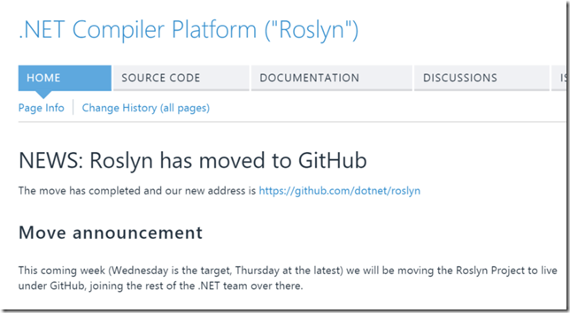

# Roslyn mudou para o Github

Após diversos pedidos, solicitações de todos os lados, algumas rezas bravas, finalmente o time de linguagens da Microsoft resolveu mover o projeto Roslyn, que contempla as novas versões do C# e do VB, para o Github, saindo do Codeplex. O projeto pode ser encontrado em <https://github.com/dotnet/roslyn>, debaixo da organização dotnet (da .NET Foundation), que também abriga o .Net Framework no repositório <https://github.com/dotnet/corefx> (se você ainda mora nessa planeta deve ter ouvido falar que o .NET Framework agora é Open Source). A .NET Foundation tem inclusive um site no github pages listando todos os seus projetos: <http://dotnet.github.io/>.

A mudança aconteceu ontem, dia 14 de Janeiro, e agora já podemos acompanhar o projeto no Github, ver issues, wiki, tudo mais. Não sei o que vai acontecer com as design notes que o time costumava postar no Codeplex, imagino que vão parar em issues do Github, já que as dicussões que acontecem nessas notas são excelentes (veja [essa](https://roslyn.codeplex.com/discussions/570614) sobre interpolação de strings).

Quem chega no endereço antigo do Codeplex ([http://roslyn.codeplex.com/](http://roslyn.codeplex.com/ "http://roslyn.codeplex.com/")) vê a nota que está na imagem que abre esse post, dizendo de que o projeto mudou de endereço. Os Pull Request todos vão aconecer agora no Github, e segundo a nota, agora ele estão aproveitando para rever o processo de PRs, então devem ficar um tempo sem aceitar PRs.

O Roslyn Reference Source segue no site do Codeplex em [http://source.roslyn.codeplex.com/](http://source.roslyn.codeplex.com/ "http://source.roslyn.codeplex.com/"). Não imagino que isso saia de lá tão cedo.

Sem dúvida isso é algo a ser comemorado. A Microsoft está indo onde os desenvolvedores estão. Já tínhamos visto isso acontecendo com o time do ASP.NET e recentemente com o .NET Framework, faltava o time do Roslyn. Muitos vão se perguntar o que está acontecendo com o Codeplex, se vai sumir, e acho que com o tempo devemos ver outros projetos da Microsoft indo para o Github, até o ponto que o Codeplex se torne irrelevante (ainda mais). Não os vejo desligando o Codeplex por alguns anos pelo menos, mas eu chutaria que vai acontecer em algum momento. Se for pradar um chute diria menos de 5 anos. Se você tinha dúvidas de onde hospedar seu projeto Open Source (eu não tinha faz tempo), a decisão está clara: Github. Usei o Codeplex no começo, apoiei, mas o Github ganhou faz tempo, e por mérito próprio: é melhor. O Github é sem dúvida uma excelente plataforma para projetos Open Source, a comunicação que temos tido no projeto [CodeCracker](https://github.com/code-cracker/code-cracker) tem me mostrado muito isso, por exemplo.

É muito bom também porque haverá mais envolvimento da comunidade com o projeto Roslyn. Sem dúvida o time receberá mais Pull Requests, mais comentários nos issues, enfim, terá mais envolvimento da comunidade, o que no fim se traduzirá num C# (e VB, não vamos esquecer dele) ainda melhor.

Vá lá, baixe o código, leia os issues, participe.

E aí, o que achou da mudança? Conte nos comentários.
