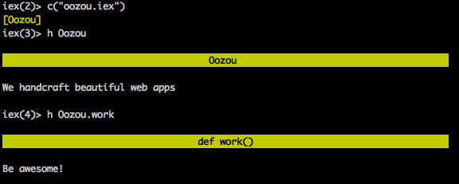

[](http://blog.oozou.com/)

# Why we are excited about Elixir


By Michael Kohl - November 18, 2014

After more than 3.5 years of work, the [Elixir](http://elixir-lang.org/) team [released version 1.0.0](http://elixir-lang.org/blog/2014/09/18/elixir-v1-0-0-released/) on September 18th 2014. Congrats guys!

Having several polyglots and programming language nerds in our ranks, an announcement like this is obviously pretty exciting, so we wanted to share some of the reasons why we are looking forward to experiment with the language in the months to come.

## The platform

In terms of maturity, not many of today’s platforms can compete with [Erlang](http://www.erlang.org/), which was originally released in 1986 and open sourced in 1988.

Age alone is of course not that important, but considering that Erlang was developed with the aim of developing telephony applications, it has many features that come in handy for modern day web application development. Concurrency primitives based on the [Actor model](https://en.wikipedia.org/wiki/Actor_model) as well as [message passing IPC](https://en.wikipedia.org/wiki/Message_passing) allow Erlang developers to easily scale not only across multiple cores on the same machine, but also across machines.

This example taken from the Elixir web site illustrates how easy dealing with IPC can be:

```
parent = self()

# Spawns an Elixir process (not an operating system one!)
spawn_link(fn ->
  send parent, {:msg, "hello world"}
end)

# Block until the message is received
receive do
  {:msg, contents} -> IO.puts contents
end
```

Another very neat feature of the Erlang runtime is hot code loading (aka [code replacement](http://www.erlang.org/doc/reference_manual/code_loading.html#id86381)), which allows for changing code in running application.

The Erlang ecosystem has one more trick up its sleeve though: OTP, the [Open Telecom Platform](http://www.erlang.org/doc/design_principles/users_guide.html), which the documentation describes as a
“set of modules and standards designed to help you build applications”. OTP provides some great abstractions, like modules for writing generic server applications ([gen\_server](http://elixir-lang.org/getting_started/mix_otp/3.html)) where only a clearly defined sets of handler functions need to be implemented, [gen\_fsm](http://www.erlang.org/doc/design_principles/fsm.html) for defining Finite State Machines, or the [Supervisor](http://elixir-lang.org/getting_started/mix_otp/5.html), which allows easy management of child processes.

Erlang is powering projects like Facebook Chat, WhatsApp, and Amazon SimpleDB, which demonstrates both the scalability and stability of the platform. It’s pretty exciting to imagine that Elixir may be able to provide many new developers with easier access to it.

## Ruby-like syntax

> The Love Child of Ruby and Erlang
> — Benjamin Tan Wei Hao ([@bentanweihao](https://twitter.com/bentanweihao))

Syntax certainly shouldn’t be the decisive factor in picking a programming language, but familiarity certainly does help in attracting new developers. Elixir’s Ruby inspired syntax will probably appeal to a wider audience than the Prolog style employed by Erlang, a critique of which can be found in Damien Katz’ (in)famous blog post [“What Sucks About Erlang”](http://damienkatz.net/2008/03/what_sucks_abou.html).

While Elixir’s main author [José Valim](https://twitter.com/josevalim) is a very prolific Rubyists, he decided not to “just” port Ruby to the Erlang VM, but instead created a syntax that should feel familiar to people with Ruby as well as Erlang backgrounds (pattern matching, guard clauses). He also added a certain symmetry that Ruby is lacking (e.g. `do` keywords for class and module definitions), which allowed for an easier implementation of Elixir’s macro system.

Yes, that’s right, Elixir offers [hygienic macros](http://elixir-lang.org/getting_started/meta/2.html). While it’s an old saying amongst Lispers that the first rule of macros is to not write macros, they do occasionally come in handy and add powerful meta-programming and DSL capabilities to the language. Here’s an example of an `unless` statement taken from the project’s web site:

```
defmacro macro_unless(clause, expression) do
  quote do
    if(!unquote(clause), do: unquote(expression))
  end
end
```

It would not be possible to implement the same behavior as a function, since the body would always unconditionally be evaluated as argument to the call.

This easy way to make additions to the language that look like core language constructs also allows for easy [DSL creation](http://elixir-lang.org/getting_started/meta/3.html), as demonstrated by Elixir’s unit testing library:

```
defmodule MyTest do
  use TestCase

  test "arithmetic operations" do
    4 = 2 + 2
  end

  test "list operations" do
    [1, 2, 3] = [1, 2] ++ [3]
  end
end

MyTest.run
```

## Good tooling

For a comparatively young language, Elixir already has pretty good tools to support it.

One example of this is [mix](http://elixir-lang.org/getting_started/mix_otp/1.html), which Rubyists can imagine like a combination of Rake and Bundler like features. Here’s an abbreviated list of predefined tasks:

```
mix clean             # Delete generated application files
mix cmd               # Executes the given command
mix compile           # Compile source files
mix deps              # List dependencies and their status
mix deps.clean        # Remove the given dependencies' files
mix deps.compile      # Compile dependencies
mix deps.get          # Get all out of date dependencies
mix deps.unlock       # Unlock the given dependencies
mix deps.update       # Update the given dependencies
mix new               # Create a new Elixir project
mix run               # Run the given file or expression
mix test              # Run a project's tests
```

As you can see `mix` covers all bases, from project generation, to dependency management, test running, compilation and execution.

Fans of unit testing will be happy to hear that Elixir by default ships with [ExUnit](http://elixir-lang.org/docs/stable/ex_unit/ExUnit.html), a basic unit testing framework in the `Test::Unit` style, an example of which could already be seen in the section on DSLs.

Another nifty feature is the support for [doc tests](http://elixir-lang.org/getting_started/mix_otp/9.html#9.1-doctests). Simply embed one or more examples in a function’s documentation:

```
defmodule Oozou do
  @doc ~S"""
  Adds two numbers

  ## Examples

      iex> Oozou.add(2, 2)
      4

  """
  def add(a, b), do: a + b
end
```

The corresponding test file is extremely simple:

```
defmodule OozouTest do
  use ExUnit.Case, async: true
  doctest Oozou
end
```

## Great documentation

Another topic the Elixir team seems to be very serious about is documentation, which is a first-class citizen:

```
defmodule Oozou do
  @moduledoc """
    We handcraft beautiful web apps
  """

  @doc """
    Be awesome!
  """
  def work(), do: :beautiful_web_app
end
```

This will render the following way in `iex`, Elixir’s [REPL](http://en.wikipedia.org/wiki/Read%E2%80%93eval%E2%80%93print_loop):



The project’s web site also has some excellent documentation, like the [getting started](http://elixir-lang.org/getting_started/1.html) guide which covers the core language, Mix, OTP, as well as metaprogramming.

On top of that [API docs](http://elixir-lang.org/docs.html) for Elixir, the EEx templating library, ExUnit, IEx and several other tools and libraries are available.

## Now show me some code

While it’s maybe not the best example to showcase Elixir’s distributed capabilities, [FizzBuzz](https://en.wikipedia.org/wiki/Fizz_buzz) is a familiar exercise for many developers and does show off some basic language concepts rather nicely.

```
defmodule FizzBuzz do
  def compute(n) do
    s = case {rem(n, 3), rem(n, 5)} do
      {0, 0} -> :FizzBuzz
      {0, _} -> :Fizz
      {_, 0} -> :Buzz
      _      -> n
    end
    IO.puts(s)
  end
end

Enum.map(1..15, &FizzBuzz.compute/1)
# or as list comprehension:
# for i <- 1..15, do: FizzBuzz.compute(i)
```

In the above code we define a module called `FizzBuzz`, which has only one function, `compute`. Note that unlike in Erlang functions will be exported by default, if you want to define a private module function use `defp` instead of `def`.

## Resources

If you now got curious and want to try out Elixir for yourself, here are some of our favorite resources:

- [Website](http://elixir-lang.org/)
- [Elixir Dose](http://www.elixirdose.com/)
- [Elixir Sips](http://elixirsips.com/)
- [Introducing Elixir](http://shop.oreilly.com/product/0636920030584.do) (Simon St. Laurent, J. David Eisenberg)
- [Programming Elixir](https://pragprog.com/book/elixir/programming-elixir) (Dave Thomas)
- [The Little Elixir & OTP Guidebook](http://www.exotpbook.com/) (Benjamin Tan Wei Hao)
- [Erlang and OTP in Action](http://www.manning.com/logan/) (Martin Logan, Eric Merritt, and Richard Carlsson)
