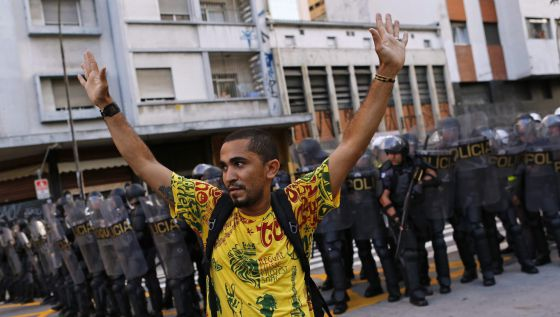

[ELIANE BRUM »](http://brasil.elpais.com/autor/eliane_brum/a/ "ELIANE BRUM")

# *Meu ‘confronto’ com a polícia de Alckmin*

## Na primeira grande manifestação de 2015, em São Paulo, um dos ”vândalos” era eu

[Eliane Brum](http://brasil.elpais.com/autor/eliane_brum/a/ "Ver todas as notícias de Eliane Brum")
[10 ENE 2015 - 11:35 BRST](http://brasil.elpais.com/tag/fecha/20150110 "Ver todas as notícias de esta fecha")

#### Arquivado em:

- [Geraldo Alckmin](http://brasil.elpais.com/tag/geraldo_alckmin/a/ "Ver mais notícias de [Geraldo Alckmin]")
- [PSDB](http://brasil.elpais.com/tag/psdb_partido_social_democracia_brasilena/a/ "Ver mais notícias de [PSDB]")
- [Fernando Haddad](http://brasil.elpais.com/tag/fernando_haddad/a/ "Ver mais notícias de [Fernando Haddad]")
- [Opinião](http://brasil.elpais.com/tag/opinion/a/ "Ver mais notícias de [Opinião]")
- [São Paulo](http://brasil.elpais.com/tag/sao_paulo/a/ "Ver mais notícias de [São Paulo]")
- [PT](http://brasil.elpais.com/tag/pt_partido_trabajadores_brasil/a/ "Ver mais notícias de [PT]")
- [Ônibus urbanos](http://brasil.elpais.com/tag/autobuses_urbanos/a/ "Ver mais notícias de [Ônibus urbanos]")
- [Estado São Paulo](http://brasil.elpais.com/tag/estado_sao_paulo/a/ "Ver mais notícias de [Estado São Paulo]")
- [Protestos sociais](http://brasil.elpais.com/tag/protestas_sociales/a/ "Ver mais notícias de [Protestos sociais]")
- [Metrô](http://brasil.elpais.com/tag/metro/a/ "Ver mais notícias de [Metrô]")
- [Brasil](http://brasil.elpais.com/tag/brasil/a/ "Ver mais notícias de [Brasil]")
- [Mal-estar social](http://brasil.elpais.com/tag/malestar_social/a/ "Ver mais notícias de [Mal-estar social]")
- [Transporte urbano](http://brasil.elpais.com/tag/transporte_urbano/a/ "Ver mais notícias de [Transporte urbano]")
- [América do Sul](http://brasil.elpais.com/tag/sudamerica/a/ "Ver mais notícias de [América do Sul]")
- [América Latina](http://brasil.elpais.com/tag/latinoamerica/a/ "Ver mais notícias de [América Latina]")
- [Partidos políticos](http://brasil.elpais.com/tag/partidos_politicos/a/ "Ver mais notícias de [Partidos políticos]")
- [Transporte ferroviário](http://brasil.elpais.com/tag/transporte_ferroviario/a/ "Ver mais notícias de [Transporte ferroviário]")
- [América](http://brasil.elpais.com/tag/america/a/ "Ver mais notícias de [América]")
- [Transporte](http://brasil.elpais.com/tag/transporte/a/ "Ver mais notícias de [Transporte]")
- [Política](http://brasil.elpais.com/tag/politica/a/ "Ver mais notícias de [Política]")
- [Problemas sociais](http://brasil.elpais.com/tag/problemas_sociales/a/ "Ver mais notícias de [Problemas sociais]")
- [Sociedade](http://brasil.elpais.com/tag/sociedad/a/ "Ver mais notícias de [Sociedade]")

Manifestante diante de um cordão policial em São Paulo. / NACHO DOCE (REUTERS)

[Recomendar no Facebook](# "Recomendar no Facebook")
13.540

[Twittear](# "Twittear")
[764](# "Ver quem já a twitou")

[Enviar para LinkedIn](# "Enviar para LinkedIn")
1

[Enviar para Tuenti](# "Enviar para Tuenti")
[Enviar para Eskup](# "Enviar para Eskup")

[Enviar](# "Você tem que estar cadastrado no EL PAÍS e estar logado para poder enviar por e-mail.")
[Imprimir](# "Versão para imprimir")
[Salvar](# "Você tem que estar registrado no EL PAÍS e estar logado para poder salvar notícias")

Alguns minutos antes de virar “vândala”, eu parei de caminhar, me virei de costas e olhei a multidão que ocupava a Consolação, [na primeira manifestação contra o aumento de 50 centavos da tarifa de ônibus](http://brasil.elpais.com/brasil/2015/01/08/politica/1420742186_706207.html), em São Paulo. Era sexta-feira, 9 de janeiro, no início da noite. Como é horário de verão, ainda estava claro. Pensei como era bonito milhares de pessoas se reapropriando das ruas, do espaço público, da cidade, para exercer seu direito democrático de protestar contra o que consideram injusto. São Paulo, vista a pé, andando por ruas sem carros, é uma outra cidade. É humana. Das janelas e sacadas dos prédios, as pessoas abanavam. Pouco antes, eu tinha ouvido de dois manifestantes: “E aí, até quando isso aqui vai parecer uma romaria?”. E, quando voltei a me virar para recomeçar a caminhar, o clima na minha frente era outro. Os black blocs e alguns outros tinham se adiantado e começavam a dar chutes em portas de ferro, arrancavam latas de lixo e espalhavam o conteúdo no meio da rua. Foi quando o vi.

#### mais informações

- [Manifestantes voltam às ruas de São Paulo e enfrentam repressão da polícia](http://brasil.elpais.com/brasil/2015/01/08/politica/1420742186_706207.html)
- [Haddad: “Não aumentar a tarifa de ônibus seria demagogia, puro eleitoralismo”](http://brasil.elpais.com/brasil/2015/01/07/politica/1420670314_213018.html)
- [“Não adianta ter ônibus rodando se você não tem 3,50 para pagar”](http://brasil.elpais.com/brasil/2015/01/07/politica/1420650843_647139.html)
- [As colunas de Eliane Brum](http://brasil.elpais.com/autor/eliane_brum/a/)

Vestido de amarelo, ele estava alheio aos mascarados de preto. Mas seguia-os. Sabendo como os black blocs agem nos protestos, ele me contaria em seguida, costuma segui-los para recolher as latinhas de refrigerante e cerveja. E assim fazia esse balé surreal em que ele parecia recortado de uma outra cena, alheio ao que acontecia, atento apenas ao chão, caminhando lentamente na vanguarda da marcha enquanto ao redor o caos se instalava. Abordei-o, me apresentei como jornalista, e ele me disse que se chamava Ailton da Silva, tinha 58 anos e morava em São Miguel Paulista, na Zona Leste, uma das regiões mais pobres da capital. Aquela que alaga a cada chuva e é a primeira a ficar sem água nas torneiras nesses tempos em que São Paulo se aproxima mais e mais de um cenário de distopia.

Para juntar o equivalente ao valor de uma passagem de ônibus, depois do aumento – R$ 3,50 –, Ailton precisaria, pelos seus cálculos, de quase 100 latinhas. Ele estava bem longe disso. [Algo para aqueles que dizem “é só 50 centavos” pensarem](http://brasil.elpais.com/brasil/2015/01/07/politica/1420650843_647139.html). “Só” para quem?

Perguntei da camisa amarela, ele me disse que a que importava era a que estava por baixo. E me mostrou uma camisa do Corinthians que já tinha visto jogos demais. Despediu-se, então: “Preciso continuar. Vou seguir, me arriscando ao perigo”. Deu um passo, olhou para trás e abanou. Então seguiu, olhando para o chão, no brutal pragmatismo da sobrevivência, que encontra todas as brechas possíveis, como a de seguir black blocs para catar latinhas no lixo que espalham pelas ruas como forma de protesto.

No medo, a solidariedade é uma das primeiras a morrer

No momento em que o catador de latinhas desapareceu confusão adentro, alguns black blocs quebraram a porta de uma agência do Santander. Eu ainda andei mais uns passos. Então manifestantes que estavam na frente começaram a correr na direção contrária a da marcha. E eu vi – e senti – as primeiras bombas de gás lacrimogêneo. Por instinto, eu e todos que estavam ali começamos a correr em direção à esquina, para pegar a rua paralela e escapar de sermos atingidos. Mas a [Polícia Militar do governo de Geraldo Alckmin](http://brasil.elpais.com/tag/geraldo_alckmin/a/) (PSDB) nos encurralou. A ação da PM mostrava que ela não queria que os manifestantes se dispersassem, mas sim que fossem atingidos. Passaram a lançar bombas também na nossa única rota de fuga, impedindo que saíssemos por ali.

Em certo momento, havia quatro bombas quase juntas na minha frente. E não precisa ser nem especialista nem muito inteligente para saber que esse não é o “procedimento”. Nesse momento, eu já sufocava e, sem conseguir respirar pelo nariz, tentava pegar o ar pela boca, o que não se deve fazer. Meu rosto inteiro e meus braços queimavam, minha sensação era a de que minha pele se desmanchava. Meus olhos ardiam. Era difícil respirar, enxergar e não havia como fugir. Nos jogamos contra as portas de ferro, as grades, os vidros dos prédios e lojas fechados, que não se abriam para nós. No medo, a solidariedade é uma das primeiras a morrer.

A polícia estava atirando bombas em nós. Era assustador. Aqueles homens, pagos com o nosso dinheiro para nos proteger, nos atacavam deliberadamente. Nós, desarmados, indefesos, amontoados junto às paredes, com o corpo inteiro doendo, continuávamos sendo atingidos. Era bem claro que não havia nenhuma ameaça ali, só cidadãos acuados e aterrorizados. E eles continuavam jogando bombas e impedindo que fôssemos embora.

Tinha tanto gás que comecei a ficar tonta e a sentir que perderia a consciência

O Estado nos atacava. Essa foi a percepção que me fez sentir mais pavor. Era bem claro que os policiais atiravam bombas em nós por ódio. Nós éramos os seus inimigos. É a lógica da Polícia Militar, e ela se expressava com clareza quase didática naquele momento. Percebi que, com aquele nível de raiva e com aquele total despreparo, o descontrole poderia aumentar ainda mais e poderíamos ser mais machucados do que fomos. Poucas coisas são mais assustadoras do que um Estado violento, do que a consciência de que aqueles que detêm o uso da força estão armados, despreparados e com ódio. Alguém poderia, inclusive, ser morto. E ali era o que sentíamos. Amontoados como ratos de laboratório de um experimento sádico, tínhamos medo de morrer nas mãos de uma polícia que se mostrava criminosa. E que parecia ter esperado apenas um pretexto para atacar aqueles que também deveria proteger.

Nesse momento tinha tanto gás que comecei a ficar tonta e a sentir que perderia a consciência. Pensei que se desmaiasse ali poderia morrer ou pisoteada ou pelas mãos da PM. Imagino que algum instinto de sobrevivência tenha me salvado, porque consegui continuar consciente, apesar de sufocada. Ao meu lado, um senhor de cerca de 70 anos tentava não cair. Algumas pessoas vomitavam. Um garoto gritava: “Me ajudem, eu preciso de ajuda”. Outro dizia: “Não estou enxergando nada.” E bateu contra a parede. Eram estes os “vândalos”, eu inclusive.

Não sei quanto tempo durou até eu conseguir fugir dali. Me pareceu uma eternidade. Não sei quem chamou essas coisas de “bombas de efeito moral”. Assim como as bombas de gás lacrimogêneo, como já está provado, podem causar danos à saúde a médio e a longo prazo. Em casa, enjoada, com o rosto vermelho, eu pesquisava sobre elas para saber o que deveria fazer e descobri que em pessoas que têm bronquite, como eu, elas podem causar edema pulmonar. Quase desmaiei duas vezes antes de finalmente conseguir dormir.

Fico muito espantada, como jornalista e como cidadã, com o uso da palavra “confronto” para definir o que aconteceu na primeira grande manifestação de 2015. E em muitas outras antes dela. Qual era a minha condição e a dos manifestantes de nos “confrontarmos” com centenas de policiais armados? Qual era o confronto quando estávamos estatelados contra uma parede levando bombas de gás e balas de borracha? Que confronto é este entre as forças de repressão do Estado e cidadãos exercendo seu direito legítimo de protestar? Esse discurso do “confronto” lembra os tempos da ditadura e de uma imprensa submetida à censura. Deveria ser inadmissível na democracia. Que se chame essa violação da lei pela polícia, no cumprimento de ordens superiores, de “confronto” é um desrespeito também com a História.

Ao final da noite de ontem, depois de ter sido vítima de violência policial, minha sensação era a de ter sido abusada. A pessoa que estava comigo revivia o mesmo sentimento que tinha tido, anos atrás, quando sofreu um sequestro relâmpago e ficou sob a mira de armas e ameaçado de morte. Não conseguiu dormir. Como jornalista que cobre direitos humanos, sei muito bem que, na periferia, as balas não são de borracha e o terror é cotidiano. E fiquei torcendo para que o catador de latinhas tenha conseguido escapar.

Quando tudo acabou – e, ao mesmo tempo, nada acabou –, eu entrei pelo portão de grades do meu prédio, igual a todos aqueles que antes não se abriram para mim, e me entreguei à ilusão de proteção. O catador de latinhas está entregue ao desamparo, os portões não se abrem para ele e ele só come se continuar olhando para o chão.

Uso aqui a única arma que tive na vida. Minha escrita.

**Eliane Brum** é escritora, repórter e documentarista. Autora dos livros de não ficção *Coluna Prestes - o Avesso da Lenda, A Vida Que Ninguém vê, O Olho da Rua, A Menina Quebrada, Meus Desacontecimentos* e do romance *Uma Duas*. Site: **desacontecimentos.com** Email: **elianebrum.coluna@gmail.com** Twitter: **@brumelianebrum**
