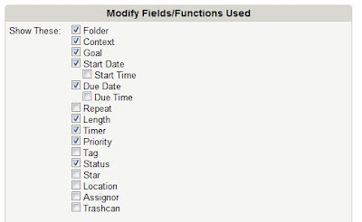
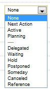

# Como eu uso o Toodledo

Há já alguns meses que larguei a agenda de papel e comecei a usar apenas a agenda do Google para compromissos e o Toodledo para organizar os meus projectos e acções.

O Toodledo tem imensas opções que tenho andado a explorar para ver o que mais se adequa à minha vida. Gosto tanto daquilo que acho que não me vejo a organizar as minhas tarefas de outra forma. Mal aderi ao Toodledo comprei logo a opção Pro Plus, que permite dividir as tarefas em sub-tarefas e tem outras funcionalidades não disponíveis na versão grátis. Existe também a versão Pro, que é quase igual à Pro Plus, mas mais barata, e é essa que vou comprar quando terminar a minha subscrição anual (acho que a grande diferença entre as duas é que a Pro Plus permite fazer upload de ficheiro e associá-los a tarefas específicas).

O Toodledo está pensado para os utilizadores do GTD e permite dividir os projectos em acções, assim como estabelecer contextos e até objectivos de curto, médio e longo prazo.

Então, em primeiro lugar, o Toodledo tem vários campos/funções que podemos escolher para caracterizar as nossas tarefas:

Em primeiro lugar, defini o campo **Folder (pasta)**. Tenho 4 pastas, que têm a ver com as minhas áreas de responsabilidade ou áreas de actuação:

*work* - tudo o que seja relacionado com trabalho

*home & family* - tudo o que seja relacionado com a família, os miúdos e a casa

*blog* - coisas para fazer no blog, posts para escrever

*moi* - tarefas que têm a ver só comigo, tipo ir à depilação, cabeleireiro, etc.

De seguida, o **Context**, ou seja, o contexto da tarefa. Os meus contextos, auto-explicativos, são:

*computer*

*home*

*lab*

*microscope*

*out*

*phone*

O campo seguinte é um que comecei a usar há dias mas que se tem revelado extremamente útil para perceber se os projectos em que estou envolvida contribuem para os meus objectivos de vida (os tais que finalmente pus por escrito). É o campo **Goal (objectivo)**. O Toodledo diferencia objectivos de longo, médio e curto prazo, mais ou menos equivalente aos níveis 50.000, 40.000 e 30.000 pés do David Allen. Escrevemos os nossos objectivos e o seu tipo e depois, para cada tarefa ou sub-tarefa, podemos escolher o objectivo para o qual essa tarefa vai contribuir. Comecei a fazer isto com as minhas tarefas todas e percebi que tinha lá tarefas que não interessam para nada, que não contribuem para nenhum dos meus objectivos de curto, médio ou longo prazo... Umas simplesmente apaguei; outras, que envolvem outras pessoas, tenho que as fazer porque já me comprometi, mas a partir de agora vai ser mais fácil perceber se a tarefa é ou não importante e lá terei que praticar o dizer **não** mais vezes.

De seguida, tenho dois campos: **start date** e **due date**. No início usava só o due date, ou seja, a data limite para completar a tarefa, mas agora uso o start date para estabelecer o período em que vou começar e terminar cada tarefa.

Uso também o **Length**, ou seja, a duração estimada de cada tarefa. Faço sempre uma estimativa para mais, pois acontecem sempre imprevistos que prolongam a duração da tarefa... Este campo também é útil quando usamos a função **Scheduler**: dizemos ao Toodledo quanto tempo temos disponível para trabalhar, por exemplo, ao computador, e ele sugere-nos que tarefas devemos fazer nesse período de tempo.

Tenho também o **Timer**, mas devo dizer que raramente o uso, se bem que deve ser muito prático para ver quanto tempo gasto em cada tarefa ou sub-tarefa, e depois posso usar a função **Statistics** para ver em que tipo de tarefas gasto mais tempo e assim perceber se o meu tempo está a ser bem direccionado.

Finalmente, tenho o campo **Status** que também está direccionado para o GTD. Está dividido em tarefas activas (next action, active, planning) e tarefas diferidas (as 7 seguintes):

Geralmente tenho só 3 tarefas classificadas como Active. O Leo Babauta no seu livro Focus diz que devemos trabalhar apenas em 3 projectos ao mesmo tempo (o ideal é trabalhar num só projecto de cada vez e não fazer mais nada enquanto esse não for terminado, mas é difícil quando as coisas não dependem só de nós). Assim, estas 3 tarefas activas são os 3 grandes projectos em que estou a trabalhar no momento. Os projectos seguintes estão classificados como Next action. O Someday corresponde às coisas que quero fazer no futuro, mas não agora, como explicado [aqui](http://busywomanstripycat.blogspot.pt/2011/09/agenda-gtd-como-comecar.html) (o someday/maybe do GTD). O Waiting é também o Waiting for do GTD - o Toodledo foi mesmo pensado para os utilizadores do GTD!

O Toodledo permite também adicionar notas a cada tarefa. Por exemplo, na pasta do blog tenho uma tarefa "blog posts", cujo status é Reference, que se usa para tarefas que não são bem tarefas, mas sim informação de referência. Nas notas dessa tarefa tenho as ideias para posts. Se decido escrever um post específico, faço disso uma tarefa.

Há mais alguns campos que se podem adicionar, como o **Priority**, que já tive, mas tirei. Nesse campo podia definir as tarefas em termos de prioridades: 3 (top), 2 (high), 1 (medium), 0 (low) e -1 (negative). Ajustei estes números para o método ABCDE do livro "[Eat that frog](http://busywomanstripycat.blogspot.pt/2012/03/leituras-para-o-fim-de-semana.html)" do Brian Tracy:

3 = A - Muito importante. Algo que tenho mesmo que fazer. Os meus "sapos".

2 = B - Algo que devo fazer, mas se não o fizer, as consequências não são assim tão más...

1 = C - Algo que seria bom fazer.

0 = D - Algo que posso delegar.

-1 = E - Algo que posso eliminar

O ideal, claro, é só ter tarefas do tipo 3 e 2... Por isso, deixei de usar o campo, porque todas as minhas tarefas são desse tipo, então não fazia muito sentido...

Quando abro o Toodledo posso ver as tarefas da maneira que quiser. Posso vê-las todas organizadas por pastas, posso vê-las por ordem de prioridade, de due date, de status, posso vê-las da maneira que me der mais jeito, o que é muito bom, pois abrir o programa e ver dezenas de tarefas é um completamente avassalador. Eu gosto de vê-las por status e depois por due date.

Por fim, como paguei a versão Pro Plus, posso fazer upload de ficheiros e associá-los a determinadas tarefas. Não uso muito, pois tenho todos os ficheiros no Dropbox, mas às vezes dá jeito quando recebo ficheiros por email que exigem alguma acção.  Também dá para enviar uma tarefa via email para o Toodledo. Por exemplo, às vezes recebo emails com ficheiros com dados que tenho que passar para os meus ficheiros. Envio esse email para o Toodledo, que o transforma numa tarefa!

O Toddledo é bom, muito bom mesmo!

E como diz o GTD, a revisão semanal é essencial para que tudo isto funcione. Eu estou mais do lado do Zen to Done, o sistema desenvolvido pelo Leo Babauta, baseado no GTD, mas que se foca mais nos hábitos e no fazer, do que no sistema e nas ferramentas. Mas isto fica para um próximo post...
