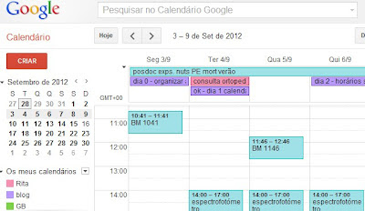

# Dia 1 - Calendário familiar

Criar um calendário familiar é o primeiro passo para organizar e simplificar a vida e tirar um grande peso dos ombros (ou, neste caso, da cabeça). Um dos princípios do famoso método [Getting Things Done](http://pt.wikipedia.org/wiki/Getting_Things_Done) é tirar tudo da cabeça, ou seja, escrever, seja onde for, tudo aquilo que temos armazenado cá dentro. Compromissos, reuniões, consultas médicas, aniversários... chega a um ponto, sobretudo quando a família aumenta, em que é praticamente impossível lembrarmo-nos de tudo... Um calendário familiar é, sem dúvida, a melhor maneira de coordenar as movimentações de todos os membros da família.

E, para mim, o melhor calendário familiar (e pessoal e profissional e seja do que for) é o **[Google Calendar](http://www.google.com/calendar)** (Gcal).

O Gcal permite criar vários calendários, com cores diferentes, os quais podem ou não ser visualisados ao mesmo tempo, enviar lembretes para o Gmail, integrar com o Google Tasks e partilhar com outros utilizadores (além de muitas outras funcionalidades).

Neste momento, tenho 6 calendários (os nomes não são bem estes):

pessoal - para coisas só minhas

miúdos - horários, festas, consultas, e outras actividades dos meus filhos

work1 - para o trabalho, como expliquei aqui

blog - onde tomo nota dos posts agendados e posts para escrever

home - onde tomo nota dos menus e das limpezas

work2 - calendário do trabalho partilhado com os outros membros do grupo de investigação

Tenho também o calendário do J. e a maior parte dos meus calendários são partilhados com ele. Tenho ainda um calendário público com os feriados nacionais (há vários que podemos adicionar, com feriados, fases da lua, desportivos, etc.).

Aqui ficam os **principais passos para criares o teu calendário familiar:**

**1. Criar o calendário no Gcal**

Necessário ter conta do Google, claro. Podes usar calendários em papel ou outros calendários online (há uma infinidade deles), mas já sabes que eu sou fã dos produtos Google, pela sua simplicidade e funcionalidade (e, claro, design minimalista).

**2. Criar calendários para as diversas áreas da vida**

Um pessoal, um para o trabalho, um para as crianças, etc. É útil ter vários calendários para assuntos diferentes, pois podemos seleccionar os calendários que queremos visualizar - ver todos os calendários ao mesmo tempo pode ser visualmente perturbador...

**3. Escrever TUDO no calendário**

Tudo que tenha data marcada! Os calendários não servem para fazer listas de coisas a fazer. Essas faço no [Evernote e no Google Tasks](http://busywomanstripycat.blogspot.pt/2012/08/o-meu-sistema-de-gestao-do-tempo.html).

**4. Partilhar os calendários com quem tenha interesse neles**

O da casa e dos miúdos com a cara-metade, o do trabalho com colaboradores, etc. Assim, ninguém tem desculpa para se esquecer de um compromisso...

**5. Olhar para o calendário todos os dias**

De nada adianta se te esqueceres de olhar para o calendário... Eu verifico os meus todos os dias.

**6. Manter os calendários actualizados**

Qualquer novo compromisso deve ser imediatamente apontado no calendário. Quando não tenho o computador por perto, aponto as coisas num caderno que anda sempre comigo e depois passo para o Gcal.

#### 24 comentários:

1. Anónimo[04/09/12, 07:22](http://busywomanstripycat.blogspot.com/2012/09/dia-1-calendario-familiar.html?showComment=1346739768312#c8085500575032211063)

   Duas sugestões:  
   Activar os avisos para o telemóvel das actividades importantes.   
   Activar o recebimento da agenda do dia por mail.

   [Responder](#)[Eliminar](http://www.blogger.com/delete-comment.g?blogID=4433841309035893907&postID=8085500575032211063)
2. Optimo post...Eu já estou a começar a utilizar por aconselhamento teu em post anteriores.

   [Responder](#)[Eliminar](http://www.blogger.com/delete-comment.g?blogID=4433841309035893907&postID=7709047639544824013)
3. o dificil ... manter o calendário actualizado.  
   tenho esta opção depois de não ter acesso o dia todo à minha agenda de familia (em papel) que está permanentemente em casa para todos que lá estão também terem acesso.  
   comecei a actualizar o calendário e pedi para todos fazerem o mesmo, os calendários estavam partilhados e até era fácil reconhecer por cores de quem era cada actividade, ... mas depois ... tudo passou, ao final de um mês já ninguém actualiza. a criança prefere ir à de papel ... e eu contento-me quando chego a casa a actualizar e a ler o que já lá existe para os dias seguintes

   [Responder](#)[Eliminar](http://www.blogger.com/delete-comment.g?blogID=4433841309035893907&postID=4411376736666987906)
4. Sim, é uma ferramenta muito importante e claro tenho avisos diários para a caso de me esquecer (a minha memória é horrível).

   [Responder](#)[Eliminar](http://www.blogger.com/delete-comment.g?blogID=4433841309035893907&postID=8463113720257575258)
5. Rita, essa semana eu conheci esse calendário no Flylady: http://www.flylady.net/d/cozi/ . Ele é perfeito para administrar as rotinas da família!!!!

   [Responder](#)[Eliminar](http://www.blogger.com/delete-comment.g?blogID=4433841309035893907&postID=8430054093898469570)
6. Muito bom o Gcal. Eu uso bastante mas apenas para compromissos, aniversários ou situações com data marcada, tal como dizes. De resto tenho uma agenda GTD (muito influenciada por ti, obrigada!), que é a minha salvação (ainda hei-de falar nela detalhadamente, no blog). É que abro aquilo vezes sem conta ao longo do dia.   
     
   Como não consigo ter o computador ligado o dia inteiro, o papel (com uma técnica para o reaproveitar ao máximo) é a minha forma de fazer tudo o que preciso (ou consigo) atempadamente. Como a amálgama de ideias é tanta, o facto de ter usar agenda de papel permite-me escrever tudo o que me vem à cabeça, tudo o que descubro e sei lá mais o quê, de forma rápida e em qualquer lado. Eu e a minha agenda GTD somos amigas inseparáveis.   
     
   Bjs e muito boa ideia esta. Venham mais assim.  
   Anabela

   [Responder](#)[Eliminar](http://www.blogger.com/delete-comment.g?blogID=4433841309035893907&postID=5201418795803429780)
7. Este eu já utilizo faz tempo. Pra mim é muito fácil uma vez que a minha "família" agora sou eu sozinha. ;-)

   [Responder](#)[Eliminar](http://www.blogger.com/delete-comment.g?blogID=4433841309035893907&postID=1608583600454461683)
8. Anónimo[04/09/12, 16:54](http://busywomanstripycat.blogspot.com/2012/09/dia-1-calendario-familiar.html?showComment=1346774054369#c4420432321948171837)

   Obrigada pelas preciosas dicas. Já criei os meus calendários e algo me diz que vão ser uma ajuda preciosa.

   [Responder](#)[Eliminar](http://www.blogger.com/delete-comment.g?blogID=4433841309035893907&postID=4420432321948171837)
9. Eu uso o calendário do Google. É bastante completo e tem a favor a ativação de lembretes com envio de sms para o telemóvel.  
   Agora que adquiri um smartphone com sistema android, a situação melhorou ainda mais. Tenho o calendário do google sincronizado no smartphone, podendo ativar os alertas sonoros e consultar mesmo não tendo um pc por perto. Para sincronizar, basta ter internet ativa ou aceder a uma rede wifi gratuita.

   [Responder](#)[Eliminar](http://www.blogger.com/delete-comment.g?blogID=4433841309035893907&postID=416646116916610272)
10. Oi Rita,   
      
    Também uso o Gcalendar e abri mão da agenda em papel...Uma dúvida acerca dos calendário "home"... vc anota o menu em cada dia da semana?

    [Responder](#)[Eliminar](http://www.blogger.com/delete-comment.g?blogID=4433841309035893907&postID=5690264088024756297)

    [Respostas](#)

    - Anoto, mas não quer dizer que nesse dia faça esse prato. Pode ser segunda-feira e apetecer-me o prato da quarta-feira... Mas aponto mais para me guiar...

      [Eliminar](http://www.blogger.com/delete-comment.g?blogID=4433841309035893907&postID=2354874163164683061)

    [Responder](#)
11. Já utilizava. De acordo com as suas sugestões fiz algumas alterações, nomeadamente nas categorias.  
      
    Estou a seguir passo a passo este desafio no meu blog :)  
      
    Uma boa semana para si!

    [Responder](#)[Eliminar](http://www.blogger.com/delete-comment.g?blogID=4433841309035893907&postID=1084723377085281968)
12. Olá!  
    Também já utilizo um sistema de calendários bastante similar. Opto por ter os lembretes todos desactivados no smartphone, com excepção dos que me avisam para efectuar as leituras da EDP, água...  
      
    Aliás, tenho quase todas as notificações do telefone desligadas, incluindo e-mail, twitter e outros. Com notificações por todo o lado, a distracção fica ainda mais facilitada.

    [Responder](#)[Eliminar](http://www.blogger.com/delete-comment.g?blogID=4433841309035893907&postID=5003408342411092625)
13. Para ter a certeza que não me esqueço de olhar para o calendário ao entrar na conta Google faço-o directamente para o Gcal através de shortcut no desktop: www.google.com/calendar/

    [Responder](#)[Eliminar](http://www.blogger.com/delete-comment.g?blogID=4433841309035893907&postID=2867952636292245317)
14. Obrigada Rita!   
    Vou guardar estas informações pois só começarei a metê-las em prática quando regressar a casa.   
    Em tempos idos tinha um calendário desse género, em papel, onde anotava tudo e mais alguma coisa. Quando engravidei e com o nascimento das piolhas, deixei tudo... Mantive a questão da organização espacial mas não ligava muito ao tempo que dispendia para isso. E, quando tenho as piolhas em casa, acabo por ter que alterar uma série de atividades para estar mais tempo com elas. A minha grande dificuldade é planear pois, se isso envolver as piolhas, nem sempre posso levar o plano avante (basta elas estarem num dia mau ou terem birras ou o seu estado sensorial estar alterado, etc.) o que implica logo um backup plan ou uma mudança mesmo de planos.   
    Anyway, irei, certamente, usar e abusar de muitas das tuas sugestões. Obrigada!

    [Responder](#)[Eliminar](http://www.blogger.com/delete-comment.g?blogID=4433841309035893907&postID=5200067855656063076)
15. Ora bem, uma das coisas a que tenho que me habituar nisto da organização - e já levos anos e anos - é à ideia de que é um processo constante, especialmente hoje em dia em que as tecnologias à nossa disposição estão em constante evolução e o nosso dia-a-dia também, em função das diferentes fazes da vida por que vamos passando, dos empregos que temos, enfim, pelo que o que é útil e eficaz hoje pode não o ser amanhã. Umas das imensas coisas que este teu cantinho me ensinou foi que essa constante actualiação e procura do melhor método é normal. Já não me sinto tão freak com estas coisas. É que eu tinha tendência para desistir com muita facilidade porque percebia que o método escolhido (encontrado algures em leituras e pesquisas) não era o mais adequado e a verdade é que um bocadinho graças à frustração e a sentir-me meio engolida no dia-a-dia, nunca parei para pensar realmente num método que se adequasse ao meu quotidiano.  
      
    Agora, contigo e com esta onda de simplificar e organizar a vida que vamos vendo por aí, sinto-me integrada num grupo e custa menos, motivo-me mais.   
      
    Isto tudo para dizer que tenho estado a explorar o GCal e o GTasks e já tenho tudo direitinho para arrancar, neste (também meu) início de ano. ;)  
      
    Obrigada!

    [Responder](#)[Eliminar](http://www.blogger.com/delete-comment.g?blogID=4433841309035893907&postID=5206044004195011338)
16. Anónimo[05/09/12, 20:11](http://busywomanstripycat.blogspot.com/2012/09/dia-1-calendario-familiar.html?showComment=1346872284081#c1929050597745743327)

    Isto tem que ir devagarinho... mas esta semana comecei a usar as tuas dicas: Comecei a usar os lembretes do e-mail do trabalho e acabei de conhecer o calendário do gmail!  
      
    Não vou dizer que a minha vida é um stress, não é... mas não gosto de andar com agenda e sou muito despistada, estas dicas ajudam muito! Obrigada!  
      
    Marlene

    [Responder](#)[Eliminar](http://www.blogger.com/delete-comment.g?blogID=4433841309035893907&postID=1929050597745743327)
17. Anónimo[06/09/12, 17:06](http://busywomanstripycat.blogspot.com/2012/09/dia-1-calendario-familiar.html?showComment=1346947560540#c4626197114009688027)

    Olá Rita,  
    Já conheço o toodledo e preciso da tua ajuda para o comparar com o gcal para ver vantagens e desvantagens de um e de outro.  
      
    No gcal não dá para fazer como no toodledo em que clico no calendário no dia 13 de setembro e vejo as tarefas que estipulei para fazer naquele dia?   
      
    Há dois aspetos que gostei mais no gcal que é o facto de funcionar como agenda, com marcação de compromissos atendendo ao agendamento de horas e o facto de eu escrever as tarefas pela ordem que eu quero, trocando a ordem muito facilmente, mas por exemplo se eu quiser que uma determinada tarefa se repita todos os dias ou todas as quintas-feiras tal como faço no toodledo, para isso o gcal não dá ou dá?  
      
    Há mais alguma coisa que o toodledo faça que o gcal não faça?  
      
    Obrigada  
    Anuskas

    [Responder](#)[Eliminar](http://www.blogger.com/delete-comment.g?blogID=4433841309035893907&postID=4626197114009688027)

    [Respostas](#)

    - Olá Anuskas,  
      O Gcal é uma agenda, não uma lista de tarefas, mas podemos ter a lista de tarefas do Google Tasks no Gcal, como falei aqui:  
      http://busywomanstripycat.blogspot.pt/2012/08/to-do-lists-minimalistas-mas-eficazes-o.html  
        
      Assim, podes carregar num determinado dia e ver as tarefas para esse dia. Também dá para repetir acontecimentos no Gcal, mas se a tarefa for só uma tarefa e não tiver hora marcada no Gcal, acho que não dá para pôr a repetir.   
      O Toodledo tem muito mais funcionalidades que o Gcal e o Gtasks, mas o que me agrada nestes últimos é a sua simplicidade - o Toodledo estava a tornar-se demasiado perturbador para mim, por fazer tantas coisas...

      [Eliminar](http://www.blogger.com/delete-comment.g?blogID=4433841309035893907&postID=3054290729269849161)
    - Anónimo[10/09/12, 09:42](http://busywomanstripycat.blogspot.com/2012/09/dia-1-calendario-familiar.html?showComment=1347266534156#c7093098677613958516)

      Obrigada Rita,  
      Já ando a perceber melhor o Google Tasks e para o utilizar mais facilmente no telemóvel instalei uma APP que me mostra apenas as tarefas. Quando utilizo no PC também estou a gostar muito porque já vi como fazer para me aparecerem apenas as tarefas de um determinado dia. Tenho de explorar melhor é o calendário pois andei a errar nos agendamentos, como por exemplo, escrevi para que todos os anos me lembrasse que tenho de pagar o IUC em Agosto da data X à data Y, mas não atinei com aquilo à primeira, mas agora já está. É muito útil! Vou passar as anotações do Toodledo para o Google. Mais uma vez obrigada por me dares a coonhecer estas novas tecnologias.  
      Anuskas

      [Eliminar](http://www.blogger.com/delete-comment.g?blogID=4433841309035893907&postID=7093098677613958516)

    [Responder](#)

[Carregar mais...](#)

Obrigada pelo comentário!

#### Hiperligações para esta mensagem

[Criar uma hiperligação](http://www.blogger.com/blog-this.g)
