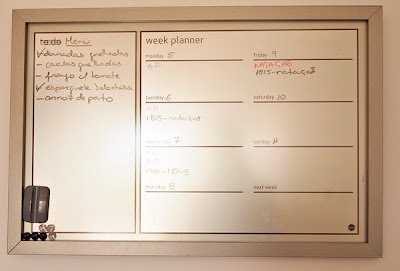

# Dia 5 - Menus e compras

Planear as refeições é aquela coisa que toda a mulher e família organizada faz. Há uma infinidade de posts pela blogosfera fora sobre o planeamento dos menus e as suas inúmeras vantagens, sendo as mais importantes poupar dinheiro e fazer refeições mais saudáveis.

Eu tenho planeado as nossas refeições *on and off* nos últimos anos, mas recentemente comecei a levar esta tarefa mais a sério. Nem é pelo poupar dinheiro ou comer de forma mais saudável - é mesmo porque não gosto nada do stress de chegar a casa à tarde e não saber o que vamos comer e nem ter sequer tirado nada para o jantar...

Sendo minimalista, a minha relação com a cozinha e a comida quer-se simples (além disso, não gosto nada de cozinhar e o J. é que costuma ocupar-se dessa tarefa a maior parte dos dias). Quer isto dizer que não tenho dezenas de frascos de especiarias nem várias marcas de pacotes de bolachas nem diversos tipos de queijos em casa. E como não tenho assim tanta coisa na cozinha, não faço inventários da despensa nem do congelador nem do frigorífico.

Como quase tudo na minha vida, a minha abordagem ao planeamento das refeições é simples. Os passos que aconselho são estes:

**1. Faz uma lista de comidas que gostam de comer em casa**

Pega num papel e numa caneta (ou no computador), puxa pela cabeça e tenta lembrar-te dos pratos que gostam de comer aí em casa. Uma lista-mestra das vossas comidas preferidas torna muito mais fácil a tarefa de planear os menus. Podes também referir na lista se determinado prato é fácil ou difícil de fazer, ou o tempo que leva a confeccionar, para puderes ajustar as refeições aos dias mais ou menos ocupados da semana.

**2. Planeia uma semana inteira de refeições**

Eu faço menus semanais, mas há quem faça quinzenais ou mesmo mensais. Faz como te der mais jeito, mas para começar acho que semanalmente é mais fácil - tem a ver com a periodicidade das idas ao supermercado.

**3. Planeia as refeições por temas**

Escolhe um tema diferente para cada dia da semana: carne, peixe, chinês, italiano, e por aí fora... Geralmente eu planeio só 5 refeições e aponto-as no quadro magnético. Os fins-de-semana são livres e podemos comer restos, ir comer fora ou fazer o que nos apetecer. Durante a semana gosto de fazer 2 dias de aves, 1 de carne vermelha ou caça, 1 de peixe e 1 de porcarias (hamburgueres, salsichas, pizza, etc.). (por mim comia peixe grelhado e frango todos os dias...)

**4. Planeia as refeições de acordo com o calendário**

Não planeies fazer uma comida muito complicada num dia em que sabes que vais chegar mais tarde a casa.

**5. Antes de ires às compras, faz uma lista de acordo com o planeamento das refeições**

Vê bem as receitas que vais fazer e verifica o que tens em casa e o que precisas comprar. Faz a lista de compras com base no menu que planeaste para a semana e, no supermercado, mantém-te fiel à lista. Cá em casa, o J. começou a ir às compras sozinho quando eu parti o pé, há 2 meses atrás. Este novo arranjo agradou-me tanto que é para manter. Eu faço a lista de compras com o nome, quantidade e, se necessário, marca do produto, e ordeno a lista pelos corredores do supermercado. Assim, é fácil para ele encontrar as coisas e, ao contrário de mim, só compra o que está na lista.  
  
**6. Faz uma [lista de compras mestra](http://busywomanstripycat.blogspot.pt/2012/03/criar-uma-lista-de-compras-mestra.html)**  
  
Em vez de escreveres todas as semanas uma lista imensa de produtos, elabora no computador uma lista mestra, com todos os produtos que costumas comprar; na altura de fazer a lista, é só marcar com uma cruzinha o produto em falta.

#### 14 comentários:

1. Olá Rita. Tenho mudado muita coisa a nível de organização mas esta questão dos menus pré concebidos é onde estou a ter muita dificuldade em concretizar. Sempre que vem alguém cá a casa sou motivadíssima em preparar algo, mas talvez por viver sozinha nem sempre tenho horários definidos para a refeição (por vezes nem dou pelo tempo passar quando estou em estúdio ou cozinho consoante a minha disposição já que é só para mim). É um descuidado, eu sei.  
   Acho que senti alguma força no teu post quando falaste em escrever uma lista das refeições que mais gosto/faço e, ainda, em pré-visualizar os gastos no supermercado com esse planeamento...  
   Um bom dia para ti,

   [Responder](#)[Eliminar](http://www.blogger.com/delete-comment.g?blogID=4433841309035893907&postID=272808650808076011)
2. Fiz a experiência dos menus durante o tempo suficiente para chegar à conclusão que vale a pena continuar a fazê-los e, tal como tu, sobretudo porque não gostava de chegar tarde e não ter nada minimamente preparado para a refeição. Claro que, como consequência, os improvisos acabam por sair também mais caros.  
     
   Embora o tema não seja novidade na blogosfera gostei da forma como o apresentaste aqui, muito bem esquematizado e explicado. Gostei da sinceridade do dia dedicado às porcarias :) porque a vida real -e ainda mais com crianças em casa - é mesmo assim, embora nem todos os assumam e essa sinceridade/ transparência passa para o lado "de cá".  
     
   Beijinho

   [Responder](#)[Eliminar](http://www.blogger.com/delete-comment.g?blogID=4433841309035893907&postID=6482461169591999873)
3. Anónimo[11/09/12, 09:18](http://busywomanstripycat.blogspot.com/2012/09/dia-5-menus-e-compras.html?showComment=1347351488132#c7723778492049468635)

   Bom dia Rita,  
   Eu também faço o menu da semana pelos mesmos motivos que tu e com flexibilidade, podendo fazer para quarta o que inicialmente estava estipulado para sexta (o que interessa é ter cá os ingredientes em casa, depois na véspera decido). No fim de semana cá em casa também não há agendamentos. No sábado come-se sobras, frango assado ou o que apetecer e no domingo normalmente é almoço de família nos meus pais e às vezes jantar nos meus sogros.  
   Ainda bem que o teu marido segue a tua lista. Cá em casa evito pedir ao marido pois ele não segue a lista, é uma criança a comprar guloseimas e até coisas a mais compra havendo em casa só porque se lembrou que nesse dia quer ir para a cozinha fazer um prato que leva, por exemplo, molho de soja (que temos em casa mas ele não sabe portanto compra outro frasco).  
     
   Bjs  
   Anuskas

   [Responder](#)[Eliminar](http://www.blogger.com/delete-comment.g?blogID=4433841309035893907&postID=7723778492049468635)
4. Olá Rita,  
     
   Sou das visitantes sempre atenta e a tirar apontamentos mas caladinha! Hoje quebrei a regra só para dizer que há aplicações informáticas gratuitas (para smartphones) bem práticas para fazer a tal lista de compras "mestra". Inspirada por ti fiz a minha lista de compras geral, mas continuava a não dar grande resultado: ou me esquecia dela, ou tinha de imprimir e levar uma folha gigante para o supermercado, ou estava no trabalho lembrava-me que alguma coisa me fazia falta e não tinha onde anotar... Depois de pesquisar e testar umas quantas, descobri uma aplicação que me serve às mil maravilhas. Dou ar de croma agarrada ao telemóvel entre o corredor dos iogurtes e afins, mas a verdade é que me poupa imenso trabalho, tempo e nunca falha. Posso actualizar a lista em qualquer momento (em vez de estar a escrever num papel algures que depois fica perdido no meio da agenda ou da carteira e nunca chega à lista), posso partilha-la com o meu homem e ele também aponta o que faz falta!  
     
   Desculpa o testamento!  
     
   Bjs

   [Responder](#)[Eliminar](http://www.blogger.com/delete-comment.g?blogID=4433841309035893907&postID=1102994158757567779)

   [Respostas](#)

   - Anónimo[11/09/12, 23:35](http://busywomanstripycat.blogspot.com/2012/09/dia-5-menus-e-compras.html?showComment=1347402908097#c7625091397570278542)

     Olá! Eu também uso um APP. O meu chama-se fivefly mas talvez o seu seja mais completo. Qual é o que usa?  
     Obrigada  
     Anuskas

     [Eliminar](http://www.blogger.com/delete-comment.g?blogID=4433841309035893907&postID=7625091397570278542)
   - Olá. Qual é essa aplicação? Fiquei com vontade de experimentar. Bjs e obrigada.

     [Eliminar](http://www.blogger.com/delete-comment.g?blogID=4433841309035893907&postID=9206028016523935038)
   - Olá,  
       
     Peço desculpa de só agora estar a responder.  
       
     A aplicação que uso é para iphone e gratuita. Chama-se mesmo shopping list. É a que resulta melhor comigo mas não será necessariamente a melhor!

     [Eliminar](http://www.blogger.com/delete-comment.g?blogID=4433841309035893907&postID=2810151613218396431)

   [Responder](#)
5. Bom dia!  
   Eu também tenho andado no "on and off" (mais off, muito mais...), mas uma vez fiz uma experiência que acho que é muito facilitadora. Fiz uma ementa para seis semanas, de modo a poder repeti-la sem que nos cansássemos de nenhum prato (salvo algumas exeções, cada refeição só se repetia passadas seis semanas). Tem de haver espaço para alguma flexibilidade, isto é, a ementa é apenas uma referência e serve, sobretudo, para evitar o stress do "o que é que vou fazer para o jantar?", para além de ajudar a poupar. Na minha opinião, a ementa, feita desta forma, não tem de ser seguida religiosamente. As épocas "off" acontecem, porque se entra noutra estação e não apetece aqueles pratos e então, destrambelha-se tudo! Temos é de encontrar a técnica que mais se adapta a nós (no meu caso, o risco de não fazer a ementa semanalmente é tão grande, que é preferível fazer uma para mais tempo) e ser disciplinadas.  
   Até amanhã!

   [Responder](#)[Eliminar](http://www.blogger.com/delete-comment.g?blogID=4433841309035893907&postID=550893200592156428)
6. Anónimo[11/09/12, 11:07](http://busywomanstripycat.blogspot.com/2012/09/dia-5-menus-e-compras.html?showComment=1347358046575#c5554762338766480117)

   Os menus tb têm sido a parte mais díficil. Ando há meses a tentar e umas semanas até corre bem, mas depois esqueço-me de fazer para a próxima e volta tudo ao mesmo. Tenho um longo caminho a percorrer.

   [Responder](#)[Eliminar](http://www.blogger.com/delete-comment.g?blogID=4433841309035893907&postID=5554762338766480117)
7. Estou a fazer isso à uns dois meses...mas na férias fui mais flexível...comecei mesmo a fazer um blog com receitas económicas, o link está no meu blog...n coloco aqui pq talvez fosse indelicado...depois vês...  
     
   Mas ajuda-me mt ter o robot Lady Master Future, pq posso programar de um dia para o outro...e uso menos loiça...  
     
   Os miúdos vão para a escola segunda e tenho q iniciar listas novas e diferentes :)

   [Responder](#)[Eliminar](http://www.blogger.com/delete-comment.g?blogID=4433841309035893907&postID=1735806524876993834)
8. Por falar em cozinhar, temos um PASSATEMPO na nossa página de facebook! Com uma simples frase pode ganhar-se um voucher de 35€ para fazer um WORKSHOP de cozinha ou comprar utensílios de cozinha na Kiss de Cook no LX Factory! Espreitem!

   [Responder](#)[Eliminar](http://www.blogger.com/delete-comment.g?blogID=4433841309035893907&postID=8677735724211804566)
9. Anónimo[18/09/13, 04:28](http://busywomanstripycat.blogspot.com/2012/09/dia-5-menus-e-compras.html?showComment=1379474929362#c5807410966583934979)

   Peco lhe a gentileza de me conseguir o blog desta mãe que tem umas receitas econômicas e achou indelicado postar.  
   Eu não acharia indelicado rsrs acho que ajudaria a nos todas.  
   Agradeço Célia Regina

   [Responder](#)[Eliminar](http://www.blogger.com/delete-comment.g?blogID=4433841309035893907&postID=5807410966583934979)

[Carregar mais...](#)

Obrigada pelo comentário!

#### Hiperligações para esta mensagem

[Criar uma hiperligação](http://www.blogger.com/blog-this.g)
