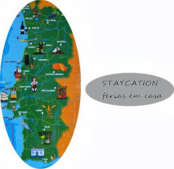

# Não procrastinar

|  |
| --- |
| [no_lab.jpg](http://3.bp.blogspot.com/-ToZuTniXWiE/VLUeAqMzV9I/AAAAAAAAJKM/oMRYHUUe8V0/s1600/no_lab.jpg) |
| O meu espaço de trabalho no laboratório. |

Quando temos uma tarefa muito importante para fazer, é quando conseguimos fazer muitas outras coisas que não interessam. A tarefa importante é relegada para segundo plano e conseguimos sempre arranjar outras coisas para fazer que naquele momento parecem mais urgentes. Isto é procrastinar e acontece com a maioria de nós. A procrastinação é um dos temas emergentes na investigação psicológica - porque é, de facto, um comportamento mal-adaptativo que pode ter consequências graves.

Esta semana ([a 2ª semana do 52 Changes](http://busywomanstripycat.blogspot.pt/2015/01/planos-para-2015-disciplina-um-habito.html), ebook que estou a seguir para adoptar uma hábito simples por semana) estou focada no combate à procrastinação. Procrastinação, produtividade, gestão do tempo - têm sido temas recorrentes aqui no blog. Já escrevi sobre [como combater a procrastinação](http://busywomanstripycat.blogspot.pt/2013/09/combater-procrastinacao.html), como [combater as distrações](http://busywomanstripycat.blogspot.pt/2014/04/sobre-o-foco.html) e como uso os [pomodoros](http://busywomanstripycat.blogspot.pt/2012/08/a-tecnica-do-tomate-aka-tecnica-pomodoro.html).

Neste últimos anos evoluí bastante a nível da procrastinação, do foco e da eliminação das distrações:

> Vejo redes sociais e email logo de manhã, em casa; assim, quando chego ao trabalho, começo logo a trabalhar.

> Escrevo no meu caderno as tarefas mais importantes (e as outras) para o dia. E sigo o plano.

> Continuo a usar os pomodoros. Quando estou a fazer tarefas que me entusiasmam, faço pomodoros de 45 ou 50 minutos com 15 ou 10 minutos de descanso. Quando são tarefas mais chatas, faço os pomodoros originais de 25 minutos com 5 de descanso. De pomodoro em pomodoro, consigo geralmente cumprir o plano de trabalho diário.

> Os intervalos dos pomodoros não são para redes sociais nem coisas dessas. São para descansar a cabeça. É para alternar entre tarefas em que preciso estar totalmente concentrada (que são basicamente todas as minhas tarefas...) e tarefas em que praticamente não preciso pensar. Por exemplo, tenho andado a escrever uma proposta de projecto de investigação; nas pausas, e como tenho estado no laboratório, aproveito para arrumar e limpar prateleiras...

> Às vezes, as distrações são inevitáveis - ou é o telefone que toca ou é alguém que vem pessoalmente falar comigo. Desde que estas distrações não estejam constantemente a acontecer, mais vale não nos chatearmos por causa delas... É olhar para a distração como uma forma de fazer uma pausa e relaxar a cabeça...

> Quando tenho uma tarefa mesmo chata para fazer, a solução é comprometer-me durante apenas 5 ou 10 minutos. O pior mesmo é começar, mas a partir do momento em que damos esse primeiro passo, persistir na tarefa torna-se muito mais fácil.

*E tu, que estratégias usas para combater a procrastinação?*

>>>>>

Gostaste deste post? Podes partilhá-lo usando os botões abaixo.

Não queres perder outros posts? Subscreve as actualizações do blog usando uma das opções da barra lateral.

Podes também {[subscrever a newsletter](http://eepurl.com/IiQoX)} e receber de oferta dois ebooks sobre organização e simplificação!

Obrigada!!

#### 10 comentários:

1. Não é nada fácil! Principalmente quando temos de arrancar com algo que ainda não sabemos bem qua a estrutura que lhe queremos dar. Mas como dizes a solução é arrancar! Então, quando inicio um projecto que vai exigir muito de mim, marco um dia especifico e um período especifico simplesmente para arrancar. Sem expectativas de produzir muito. Só arrancar. E depois de conseguir fazer isto, tudo flui muito melhor e deixo de ter "medo" de pegar naquele trabalho específico. O meu grande problema são as interrupções para as redes sociais. Isto estou a ter mais dificuldade em controlar...

   [Responder](#)[Eliminar](http://www.blogger.com/delete-comment.g?blogID=4433841309035893907&postID=7954210784161735568)
2. Como foi certeiro este post para mim! Esse útimo ponto é realmente muito verdadeiro... :) Vou tentar adoptar as restantes dicas.

   [Responder](#)[Eliminar](http://www.blogger.com/delete-comment.g?blogID=4433841309035893907&postID=123951823721600405)
3. Sempre me debati com o problema da gestão do tempo e revejo-me neste post! Já sou seguidora do blog há alguns anos mas ainda não consegui encontrar o meu método ideal para gerir o tempo...vou tentando! Quando li o primeiro paragrafo parecia que me estava a ver ao espelho!!! Quando tenho algo que tenho mesmo que fazer, parece que tudo o resto ganha importância... enfim!!! É mesmo muito difícil começar, mas é a parte fundamental!!! Ver as redes sociais e o e-mail logo pela manhã parece-me uma boa estratégia, quando tenho o que fazer parece que vou à procura de notificações a toda a hora!!!  
   Continuação de bom trabalho e obrigada pelas dicas!!!

   [Responder](#)[Eliminar](http://www.blogger.com/delete-comment.g?blogID=4433841309035893907&postID=1013013283852660949)
4. Tenho tido imensas dificuldades em combater a procrastinação nos últimos tempos, muito em culpa da falta de serviço/clientes, que temos nesta altura do ano no Hotel onde trabalho.   
     
   Trabalhar com um computador, também não ajuda em nada, pois é sempre uma distração o ícone do Mozilla Firefox, ali no canto. E como agora só tenho usado o computador no trabalho (é raro o dia em que o use em casa), tenho usado o tempo e espaço do trabalho para tratar das minhas "coisas" (estou a escrever este comentário em hora de expediente).  
     
   Tenho tentado combater isto com a organização do ficheiro de clientes, verificação das reservas que já estão feitas para o ano inteiro, limpar a recepção (que é a minha área de trabalho), ajudar a rouparia, etc. Mas, isto esvanece-se num instante, pois quando me embrenho no trabalho, é até acabar. Por isso há dias que entro às 16 e são 17:30 e já tenho tudo feito. E depois, só me resta mesmo, procrastinar :(  
     
   Depois das 21 por norma, consigo sempre ler um bocadinho, pois fico sozinho e não acontece muito por aqui. E é isto.  
     
   Tenho que ver se dou uma espreitadela mais a fundo ao teu blog. Pode ser que encontre algo que me ajude :)

   [Responder](#)[Eliminar](http://www.blogger.com/delete-comment.g?blogID=4433841309035893907&postID=2458470730151067883)
5. tenho grande dificuldade em combater a procrastinação..... em 2015 será foco combate -la adore o post viu,,ajuda bastante bjs  
   www.antestardedoquenunca1.blogspot.com

   [Responder](#)[Eliminar](http://www.blogger.com/delete-comment.g?blogID=4433841309035893907&postID=1001382307130943591)
6. Ai, é tão complicado! Honestamente tarefa quase impossível. Ultimamente com o cansaço e a perda de duas pessoas próximas procrastino ainda mais. Quase como que a 'oferecer-me' esse mimo e depois... fico frustrada porque não concretizo nada. Trabalhar a partir de casa é tão complicado e difícil que nem sei o que dizer sobre procrastinar...

   [Responder](#)[Eliminar](http://www.blogger.com/delete-comment.g?blogID=4433841309035893907&postID=2144661132130182083)
7. Cara Rita, revejo-me no teu post, pois padeço deste mal que é a procrastinação. Digo que é um mal, pois tenho consciência que me deixo subjugar a ela e não faço o meu trabalho ou outras coisas pessoais a que me proponho. Já li muito sobre o assunto, procuro encontrar cursos de gestão do tempo, mas creio que o 'problema' está em nós e não na quantidade de cursos que faças. A minha última relação sobre este assunto é que não devo combater a procrastinação, mas entender de onde vem e porquê. Vem da mente, em que digo a mim própria para fazer outra actividade que parece ser muito interessante, mas naquele momento, é desnecessária, pois estás a braços com outra actividade realmente importante. Ou seja, estou a enganar-me. Se fizer mindfulness ou meditação não estarei a ir mais à raiz da questão? Obrigada pelos teus posts sobre este assunto e outros tantos que gosto de ler.

   [Responder](#)[Eliminar](http://www.blogger.com/delete-comment.g?blogID=4433841309035893907&postID=4491835843060705149)
8. Anónimo[15/01/15, 14:22](http://busywomanstripycat.blogspot.com/2015/01/nao-procrastinar.html?showComment=1421331721607#c4963993021876068709)

   E Rita os posts sobre madrugadores de portugal? gostaria de saber mais sobre isso

   [Responder](#)[Eliminar](http://www.blogger.com/delete-comment.g?blogID=4433841309035893907&postID=4963993021876068709)
9. Este início de 2015 tem sido MUITO 'procastinante' pra mim. kkk   
   Aqui no Brasil é verão e particularmente no Rio de Janeiro está um calor de 40 graus. Com isso, não estou conseguindo produzir como em Dezembro e estou ficando chateada. Estou lenta e pensar parece um sacrifício. Já tentei usar os pomodoros mas não me adaptei muito. Entretanto, continuo tentando lutar contra a 'preguiça'.

   [Responder](#)[Eliminar](http://www.blogger.com/delete-comment.g?blogID=4433841309035893907&postID=2116294446418896520)

[Carregar mais...](#)

Obrigada pelo comentário!

#### Hiperligações para esta mensagem

[Criar uma hiperligação](http://www.blogger.com/blog-this.g)

Subscrever:
[Enviar comentários (Atom)](http://busywomanstripycat.blogspot.com/feeds/131743644114859201/comments/default)

## Translate this page

Powered by

## The Busy Woman and the Stripy Cat

The Busy Woman and the Stripy Cat é um blog sobre as coisas que me interessam. Aqui escrevo sobretudo sobre minimalismo e yoga como estilos de vida.

Chamo-me Rita, sou mãe de dois rapazes, cientista, minimalista, yogini, amante de música clássica e jazz, viciada em ebooks e chocolate, e apaixonada por todas as coisas zen.

Vivo no soalheiro Algarve com os meus filhos, companheiro e vários animais.

## Destralhar a casa em 7 dias

## Organizar a vida em 7 dias

## Reclama o teu tempo em 5 dias

## Staycation - férias em casa

## Search

CURRENT MOON

[moon phases](http://www.calculatorcat.com/moon_phases/moon_phases.phtml)

## Follow by Email

## Followers - Seguidores

## Subscrever

[anexo ausente]
[anexo ausente]
Mensagens

[anexo ausente]
[anexo ausente]
Comentários

**© 2011-2015 Rita Domingues. Todos os direitos reservados.**

Por favor, se quiser reproduzir o conteúdo (texto e/ou fotos) deste blog, peça-me permissão ANTES de o fazer.

Nenhum conteúdo poderá ser usado para fins comerciais.

Todos os textos e fotos deste blogue são da minha autoria, se não houver indicação em contrário.

Muitos dos links para livros ou outros produtos apresentados aqui são links afiliados (significa que recebo uma pequena percentagem do valor da venda se o produto for comprado através do link).

**© 2011-2015 Rita Domingues. All rights reserved.**

Please ask me for permission BEFORE reproducing text and/or photos from this blog.

No commercial uses are allowed.

Unless otherwise stated, all texts and photos were produced by me.

Many of the links for books and other products are affiliate links (means that if you buy the product via my link, I'll receive a small percentage of the sale).
