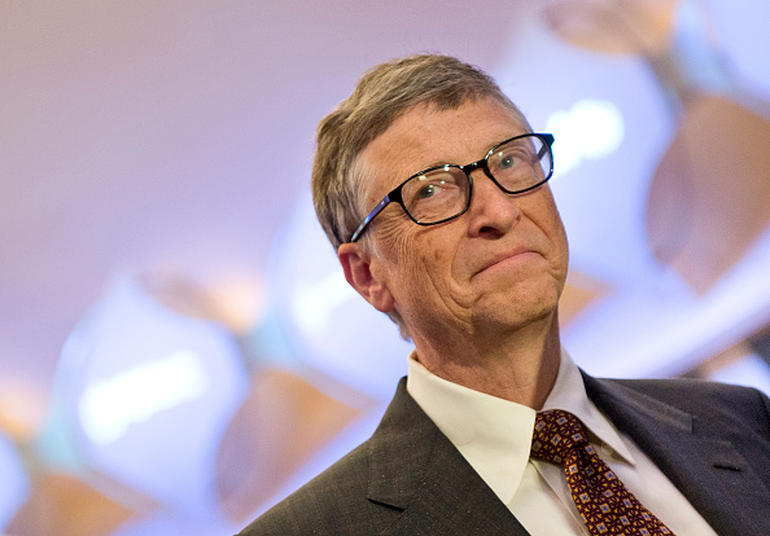

# Bill Gates is worried about artificial intelligence too

Microsoft's co-founder and former CEO is the latest luminary from the world of technology and science to warn against the threat of smart machines.

- by
  [Nick Statt](http://www.cnet.com/au/profiles/nickstatt/)

  [@nickstatt](https://twitter.com/intent/user?screen_name=nickstatt)
- /29 January 2015, 7:55 am AEDT

- comments

  56/
- facebook

  2.1K
  /
- twitter

  364
  /
- linkedin

  0
  /
- googleplus

  /
- more

  more
  +

Microsoft co-founder Bill Gates joins entrepreneur Elon Musk and physicist Stephen Hawking with a warning about machine intelligence.
Getty Images

Bill Gates has a warning for humanity: Beware of artificial intelligence in the coming decades, before it's too late.

Microsoft's co-founder joins a list of science and industry notables, including famed physicist Stephen Hawking and Internet innovator Elon Musk, in calling out the potential threat from machines that can think for themselves. [Gates shared his thoughts on AI on Wednesday in a Reddit "AskMeAnything" thread](https://www.reddit.com/r/IAmA/comments/2tzjp7/hi_reddit_im_bill_gates_and_im_back_for_my_third/), a Q&A session conducted live on the social news site that has also featured President Barack Obama and World Wide Web founder Tim Berners-Lee.

"I am in the camp that is concerned about super intelligence," Gates said in response to a question about the existential threat posed by AI. "First, the machines will do a lot of jobs for us and not be super intelligent. That should be positive if we manage it well. A few decades after that, though, the intelligence is strong enough to be a concern."

Gates, who is co-chair of the Bill & Melinda Gates Foundation, isn't the only one worried. Musk, the billionaire inventor and founder of SpaceX and CEO of electric car maker Tesla Motors, is not an expert in AI. But he did join a growing list of hundreds of researchers and professors in the field who [signed an open letter earlier this month](http://futureoflife.org/misc/open_letter) that proposed proper safeguards be put in place to research and develop such intelligence without humans losing control.

"I agree with Elon Musk and some others on this and don't understand why some people are not concerned," Gates said.

### Fearing the worst

The reason they're worried is that AI isn't science fiction anymore. In stories and movies, AI is often presented as a good idea gone horribly wrong. In "The Matrix" movie trilogy, machines deem humanity a threat and enslave people in a virtual existence so they can feed off the electricity generated by the human body. When the Skynet computer system in "The Terminator" movie series becomes sentient, it wages a multiyear war using human-like robots designed to kill. HAL 9000, the socio-pathic supercomputer from "2001: A Space Odyssey," is now a cinematic icon -- HAL's robotic tone and malevolent quotes have become pop culture tropes.

Back in the real world, Apple's voice-based personal assistant Siri may seem a little dumb now, but AI is getting smarter as researchers develop ways to let machines teach themselves and mine the deep trove of data produced by our many connected gadgets. IBM's Watson supercomputer has moved on from [besting Jeopardy contestants to conducting medical research and diagnosis](http://www.cleveland.com/healthfit/index.ssf/2014/10/cleveland_clinic-ibm_watson_collaboration_highlighted_at_medical_innovation_summit.html), and researchers earlier this month detailed a [new computer program that can beat anyone at poker](http://www.npr.org/blogs/alltechconsidered/2015/01/08/375736513/look-out-this-poker-playing-computer-is-unbeatable). A need to worry? Of course not, but Gates and others are trying to imagine the worst.

Musk in October called AI development "summoning the demon," and has invested in the space to keep his eye on it. Hawking, [writing for The Independent in May 2014](http://www.independent.co.uk/news/science/stephen-hawking-transcendence-looks-at-the-implications-of-artificial-intelligence--but-are-we-taking-ai-seriously-enough-9313474.html), also expressed his concerns. "Whereas the short-term impact of AI depends on who controls it, the long-term impact depends on whether it can be controlled at all," Hawking wrote.

Microsoft's Cortana personal assistant has a few hundred years until it catches up with its fiction video game counterpart, but it marks the beginning of the company's consumer artificial intelligence efforts.
Juan Garzón/CNET

Gates' warning comes as Microsoft is developing a machine intelligence called Cortana. The software, based off the well-known AI character from the company's Halo series of video games, is available in Microsoft's Windows Phone mobile software. Cortana will soon make its way onto PCs as part of [Windows 10](http://www.cnet.com/au/products/microsoft-windows-10/), the new version of the company's popular operating system. Windows 10 with Cortana is due later this year.

Though Gates stepped down as CEO in 2000 and left his role as chairman last year when CEO Satya Nadella took over as chief, he remains a technology adviser in the company, which is the world's largest maker of software. Gates is also working on what he calls Microsoft's Personal Agent project, a kind of software secretary designed to help you remember things and advise you on what to pay attention to.

"The idea that you have to find applications and pick them and they each are trying to tell you what is new is just not the efficient model - the agent will help solve this," he said. "It will work across all your devices."

Gates offered a glimmer of hope for those fearful of our future robot overlords.

A Reddit user asked whether computer programming was a smart career choice for people who aren't expert-level coders, because automation and AI will likely replace all lower-level programmers in the future.

"It is safe for now! It is also a lot of fun and helps shape your thinking on all issues to be more logical," he answered. "Understanding how to program will always be useful."

**Tags:**
:   [Sci-Tech,](http://www.cnet.com/au/topics/sci-tech/)
:   [Tech Culture,](http://www.cnet.com/au/topics/tech-culture/)
:   [Artificial intelligence,](http://www.cnet.com/au/tags/artificial-intelligence/)
:   [Bill Gates,](http://www.cnet.com/au/tags/bill-gates/)
:   [Microsoft/](http://www.cnet.com/au/tags/microsoft/)

###### About the author

[Nick Statt](http://www.cnet.com/au/profiles/nickstatt/)

- twitter
- facebook
- googleplus

Nick Statt is a staff writer for CNET. He previously wrote for ReadWrite and was a news associate at the social magazine app Flipboard. He spends a questionable amount of his free time contemplating his relationship with video games while continuously exploring the convergence of tech, science and pop culture.
[See full bio](http://www.cnet.com/au/profiles/nickstatt/)
