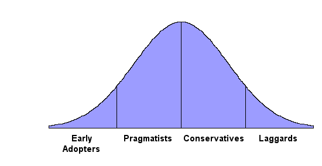
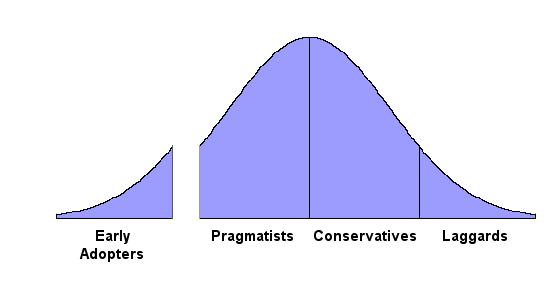

# Why your F# evangelism isn't working

## Ouch. Eric, you're one of those anti-F# people, aren't you?

Nope.

If you skim this blog entry too quickly or just read the title, you might
think I am someone
who does not like F#. Nothing could be further from the truth.
Over the last several months, I have become a big F# fan.
It has become my preferred language for personal projects.

My [current side project](https://github.com/ericsink/LSM) is a
key-value store in F#. I have learned a lot by writing it, and I am
even starting to think it might end up becoming useful. **:-)**

Mostly, I find coding in F# to be extremely satisfying.

I am writing this article not as an opponent of F#, but rather,
as someone who hopes that F# will become a mainstream .NET language.

## Eric, you're wrong. F# is mainstream already.

Of course it is. For some definition of "mainstream".

F# is gaining traction really fast. People are using F# for
real stuff. The language is improving. Xamarin is supporting it.
By nearly any measure, F# is showing a lot of momentum
over the last few years. If you are an F# fan, there just isn't
any bad news running around.

But for this article, I am using a definition of "mainstream",
(which I'll explain below) which I believe F# has not yet reached.

If, when you arrive at the end of this article, you
do not like my definition of mainstream, that's okay.
Just take a copy of this article, and
do a search and replace all instances of the word
"mainstream" with "purple".
I have no desire to argue with you about what "mainstream"
means, but if you want to argue about the meaning of "purple",
I'll be happy to. **:-)**

## You're wrong again. My F# evangelism IS working

Of course it is. To a certain extent.

But in marketing terminology, as far as I can tell, most F# users today are
"early adopters". Very few are "pragmatists". And F# has not yet "crossed
the chasm".

## What is "the chasm"?

The term originates from a 1991 book by Geoffrey Moore.

The main point of Moore's book is that the classical
marketing bell curve has a problem. Typically (and, prior
to Moore's book, always), that bell curve is drawn like this:

The basic idea of this curve is that when a market adopts a new techology,
it follows a pattern. The technology moves from left to right
on the bell curve, becoming adopted by four groups in the following order:

- the "early adopters" (people who like trying
  new technologies)
- the "pragmatists" (people who only care about
  technology to get something done)
- the "conservatives" (pragmatists,
  but even more risk-averse)
- the "laggards" (people who actively
  avoid new things)

Together, the pragmatists and conservatives are the definition
of "mainstream" for the purpose of this article.

Moore's key observation is that moving from the early adopters
to the pragmatists is very hard. Some technologies never make
it. To illustrate this problem, Moore suggests drawing the
bell curve differently, with a "chasm" between the early adopters
and the pragmatists:

His book explains why the chasm exists, why some technologies
"die at the bottom of the chasm", and how some technologies
successfully "cross the chasm". It is a marketing classic and
highly recommended.

For the purpose of this blog entry, the main thing you need
to know is this: The chasm exists because pragmatists
generally adopt new techologies as a herd. They don't adopt
a new technology until they see other pragmatists using it.
This creates a chicken-and-egg problem.

## How does this herd thing work?

Pragmatists have an annual conference where they all agree
to stay with their existing technologies. The actual vote is
not formal, but consensus gets reached.

A lot of this process happens in hallways and the dining hall:
"Are you considering
Windows 8 or should we all just stay with Windows 7 and
see what happens next?"

Some of the process happens in the conference itself,
where you'll see session titles like, "Why it's safe for
you to ignore mobile for another year."

At PragmatiCon 2014, the ratified platform looked something
like this:

- SQL is still the only safe choice.
- Keep an eye on your developers to make sure they're not using Ruby.
- Exchange is still the best email solution.
- The cloud is okay for some things, but important data needs to stay in your own server room.
- Let's ignore BYOD and hope it goes away.
- Building a mobile app is still too expensive and too risky.

## So the pragmatists don't care about the ways that F# is better?

No, not really.

This point is where the title of this blog entry comes from. If you
are trying to explain the benefits of F# to pragmatists, you are probably
frustrated. It probably seems like they're not listening to you. That's because they're not.

Pragmatists don't make technology decisions
on the basis of what is better. They prefer the safety of the herd.
A pragmatist wants to be using the same technology as all the other
pragmatists, even if everybody is somewhat unhappy with it. They
will choose "predictably disappointing" over "excellent and unproven"
every time.

## Maybe we just need to do a better job of explaining the benefits of F#?

Wouldn't it be great if it were that simple?

But no. As an early adopter, there is nothing you can say to a
pragmatist that will make a difference. They know that your opinion
and experience are not to be trusted, because they do not share your
values.

## So these pragmatists are just stupid then?

Not at all. Their decision-making process is quite rational. It
is a natural consequence of being someone who uses technology to get
something done rather than using technology for its own sake.

Near the top of this blog entry, I said that I find coding in F# to be extremely satisfying.
That remark identifies me as an early adopter. It is something
a pragmatist would never say. If any pragmatists accidentally stumbled
across this blog entry, they stopped reading right there.

Pragmatists don't care about the
craft of software. They don't care about how cool something is.
They care about cars and investments and law
and soap and oil rigs and health care and construction and transportation and insurance.
Technology is just a tool.

BTW, if you find the word "pragmatists" to be too tedious to pronounce,
you can just refer to these folks by their more commonly-used label: "normal people".

## Fine. We don't need those pragmatists anyway, right?

Maybe not. Some things stay in the land of early adopters
forever.

But the area under the bell curve matters. It is roughly
equivalent to revenue. Together, the pragmatists and conservatives
represent almost all of the money in the market.

If your situation allows you to be successful with a given
technology even though it only gets used by early adopters,
great. But many people are (directly or indirectly) placing
bets (financial or otherwise) which will only pay off when
their technology get used by the majority of the market.

## So this chicken-and-egg situation is hopeless then?

Not quite.

Sometimes a pragmatist can be convinced to break with the herd.
The key is to find what Moore calls a "pragmatist in pain".

A pragmatist in pain is someone whose needs are not being well
met by whatever technology is current popular among pragmatists.
The current technology is not merely annoying them. It is failing
them.

A pragmatist in pain actually does care about how F# is
better, even though this goes against their nature.
They really hate the idea of listening to some F# nerd
prattle on about immutability and type inference. But
they have reached their last resort. Their pain has forced them
to look for hope from somebody outside
the herd.

This is how a new product gets across the chasm. Find a pragmatist
in pain. Do whatever-it-takes to make them happy with your
product. Then go back and do it again. Repeat until you have enough customers
that they can go to PragmatiCon without being shunned and ridiculed.

## Why will it be especially hard for F# to cross the chasm?

Because C# is really, really good.

I love C#, but I hold the opinion that F# is better.

Kirk: "Better at what?"   
Khan: "Everything."  
**:-)**

I also understand that F#'s awesomeness is basically
irrelevant to the question of whether it will go mainstream
or not. If the pragmatists are not in pain, they are not
interested. C# doesn't cause very much pain.

## Will the hybrid functional-first languages cross the chasm together?

Mostly, no.

Certainly it is true that F# is part of a trend. The Java world
has Scala. The Apple/iOS world has Swift. It is not merely true
that F# is gaining momentum. It is also true that functional programming
is gaining momentum.

But in terms of going mainstream, these three languages will
be related-but-separate. If Swift cross the chasm first (and it will),
that will add a bit more momentum to F#, simply because the two
languages will be seen as comparables in different ecosystems.
But F# will have to cross the chasm on its own.

## Why will Swift go mainstream before F#?

Yes, F# has a seven year head start, but Swift will cross the
chasm first. This has nothing to do with the relative merits
of these two languages.

As of January 2015, F# is quite stable
and trustworthy for most use cases, while Swift is mostly an unstable
mess that isn't ready for prime time. This too is irrelevant.

The simple fact is that C# is kinda great and Objective-C is
kinda dreadful. Swift will go mainstream first because you can't
swing a 9-iron in the Apple/iOS ecosystem without hitting a
pragmatist in pain.

## Eric, you're wrong. I know some pragmatists who are using F#.

Really? Great! Please spread the word.
