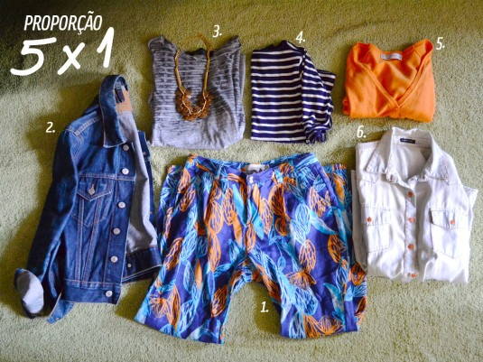

# Qual é o número ideal de roupas que a gente precisa?

No início do ano eu recebi um email da Sarah Lopes com uma sugestão de pauta pro blog que eu achei muito interessante! Ela quer descobrir qual é a proporção ideal de roupas no armário para que ele seja eficiente:

*“Oi, Ana Carolina! tudo bem?*

*Foi assim, essa semana fiz um limpa no meu armário, e, desde o ano passado, comecei com aquele negócio de “chegou um, foi um”, tipo, se compro uma blusa, tenho que doar/vender outra, não pode entrar cabide novo no meu armário!*

*Mas ainda não to achando suficiente.. fiquei pensando: **qual será o “número ideal” de peças de roupa que a gente precisa?** você já pensou nisso? tem alguma ideia? eu contei minhas coisas e tenho umas 60 blusas… mas não tenho noção de se isso é muito ou pouco… quero desapegar e ter um guarda-roupas eficiente, sabe? mas gosto de números, e queria uma ajudinha ;-)”*

Eu fiquei um tempãooooo pensando na resposta, mas o lance, Sarah, é que não tem um número certinho, depende de muitos fatores! Não existe uma métrica, nem como medir com exatidão um número legal tipo: 2 blusas, 1 jaqueta, três calças…depende demais do seu estilo, seu estilo de vida, onde você vive, sua profissão. Eu já montei 30 looks com um armário de meia porta de uma cliente e já vi armários de 6 portas lotados de roupas que não renderiam nem 15 looks, de tanta roupa que não coordenava entre si!

Uma proporção que usamos em consultoria é a de termos **5 partes de cima para uma parte de baixo** que definimos quando uma peça entra ou tem que sair do armário. Praticamente tudo que você tem no armário tem que ser coordenável entre si, por ex: se você tem 3 calças neutras que combinam com todas as blusas e tiver 10 blusas, tá valendo!

Nessa montagem que fiz com minhas roupas peguei como parte de baixo uma calça não muito básica (1), hehe! A partir dela reuni mais 5 partes de cima que funcionariam numa produção:

*2) 1 jaqueta jeans  
3) 1 camiseta*  
*4) 1 blusa de manga*  
*5) 1 cardigan*  
6) 1 camisa de botão

Essa é a proporção que trabalhamos, mas na real eu tenho muuuuuuitas partes de cima que ainda poderiam entrar aí: 1 blazer branco, 2 camisas de cores lisas, mais umas 6 camisetas, 2 coletes, 3 tricôs, mais 2 cardigans…ou seja, essa calça estampada poderia ser complicada se eu tivesse só vestido, ou camisas estampadas ou casacos de lã! Aí teríamos uma proporção errada, pois ela não renderia no mínimo 3 looks.

Outro exemplo: se você tiver um armário com

- 8 calças  
- 4 saias  
- 5 vestidos  
- 10 camisetas  
- 1 jaqueta de couro, você tem muito mais parte de baixo do que parte de cima e quando essa conta não fecha, o resultado é nosso velho conhecido: a sensação de **não ter roupa**!

Por exemplo, se você mora numa cidade quente como o Rio de Janeiro, dificilmente você vai conseguir usar a mesma blusa por mais outro dia nessa época do ano – o suor não vai deixar, hehe. Aí se você lava roupa a cada 15 dias e vai precisar de uma blusa por dia, às vezes duas nesse calor, pode jogar umas 25 blusas aí.

Um número bom é o número de roupas que você usa!

Se você trabalha 5x por semana e tem os finais de semana pra sair, logicamente precisará mais de camisas pro trabalho (dependendo do seu emprego) do que blusinhas para lazer, como camisetas. O que eu aprendi é que não é focar tanto em números, mas **se a pessoa tem muita coisa igual e o que ela precisa**.

Se você tiver 60 blusas, sendo 50 camisetas e 10 camisas, mas precisa de camisa pra trabalhar, essa proporção está errada!

No mais, **sempre achamos que armário lotado é sinônimo de mais opções para vestir** e na prática esse conceito **não funciona**. Quando temos mais do que precisamos, acabamos com preguiça de pensar nas coordenações, não sabemos exatamente do que precisamos e repetimos por comodismo os mesmos looks.

Será que consegui explicar direitinho? Quem tiver mais dúvidas, manda ver nos comentários! [anexo ausente]

*Obrigada à consultora Érica Minchin que me ajudou nesse post! <3*
