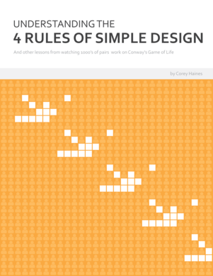

# Understanding the Four Rules of Simple Design

## and other lessons from watching thousands of pairs work on Conway's Game of Life

The only thing we truly know about software development is that we can expect changes to our system.
Through concrete examples, let's explore ways to build flexible, adaptable software systems by better understanding Kent Beck's 4 Rules of Simple Design.

1824
readers

by
[Corey Haines](https://leanpub.com/u/coreyhaines)

[## Understanding the Four Rules of Simple Design](https://leanpub.com/4rulesofsimpledesign#)

Happiness guarantee
[Learn more](https://leanpub.com/4rulesofsimpledesign#happiness_guarantee)

[Buy Now](https://leanpub.com/4rulesofsimpledesign#buying_options)

Suggested:
$17.99+

- ### The Book, Single Copy License

  - #### Includes three convenient formats

    - **PDF** (for Mac or PC)
    - **EPUB** (for iPad, iPhone, Android, and other ebook readers)
    - **MOBI** (for Kindle)

  [Buy Now](https://leanpub.com/4rulesofsimpledesign/packages/thebook-1copylicense/purchases/new)

  Suggested:
  $17.99+

  [100% Happiness guarantee](https://leanpub.com/4rulesofsimpledesign#happiness_guarantee)
- ### The Book, 10-Copy License

  Use this to purchase a licenses for 10 copies of the book at a discounted rate! Great for classes, workshops and companies.

  - #### Includes three convenient formats

    - **PDF** (for Mac or PC)
    - **EPUB** (for iPad, iPhone, Android, and other ebook readers)
    - **MOBI** (for Kindle)

  [Buy Now](https://leanpub.com/4rulesofsimpledesign/packages/thebook-10copylicense/purchases/new)

  Minimum:
  $140.00

  Suggested:
  $155.00+

  [100% Happiness guarantee](https://leanpub.com/4rulesofsimpledesign#happiness_guarantee)

- **Free sample**
  [download](http://samples.leanpub.com/4rulesofsimpledesign-sample.pdf)
- **1824**
  readers
- **88**
  pages
- **Book language:**
  English

## About the Book

**Note: I'll be donating 10% of proceeds to support kids programming events.**

**Check out some [early feedback from readers](http://articles.coreyhaines.com/posts/i-wrote-a-book/).**

Modern software development is a game of ever-increasing frequency of change. This is why it is imperative to build systems that are flexible and can adapt to changing requirements, both expected and (more often) unexpected. That is why I've written this book.

From 2009 to 2014, I traveled the world working with software developers, both individually and in teams, to improve their craft. Primarily, I did this through a training workshop format called coderetreat. Over those years, I had the opportunity to watch 1000's of pairs of programmers work on exactly the same system, Conway's Game of Life. As time progressed, I began to see patterns arise. I noticed common techniques and designs that spanned languages and companies and crossed national borders.

As co-founder and a facilitator of coderetreat workshops, I had the unique opportunity to provide feedback, both direct and through questions, on improving the act of writing adaptable, simple code. Through the day, we worked on improving our ability to make good choices around the minute-by-minute decisions made while writing code.

This book is about those things I learned from watching these 1000's of pairs working on the same problem. It contains a large part of the feedback that I provide during a typical coderetreat. The primary focus is on the thought process behind refactoring, and how that is influenced by the 4 rules of simple design.

This book is not about Conway's Game of Life. Instead, it uses its domain as a backdrop to discuss the thoughts and ideas behind the 4 rules of simple design. It focuses on the small decisions made while designing your code with the goal of building robust, adaptable codebases that can stand the test of time.

With forewords by Joe Rainsberger and Kent Beck.

### Curious what the book is like?

I've put together a [free downloadable sample of the book](http://samples.leanpub.com/4rulesofsimpledesign-sample.pdf) with one of the examples (having test names influence the api) and a section on the ping-pong pair-programming style.

## Buy A Bundle, And Save

- 
  +

  - 

  ### Simplicity

  2 books for
  ~~$42.98~~
  **$24.99**

  [Buy Now](https://leanpub.com/b/simplicity/purchases/new)

  [Learn more](https://leanpub.com/b/simplicity)

## About the Author

### [Corey Haines](https://leanpub.com/u/coreyhaines) [@coreyhaines](https://twitter.com/coreyhaines)

I'm Corey Haines. I've been developing software professionally since 1995. I've also spent the past 10 years, and the past 5 in particular, mentoring and training software developers around the world.

I also love cats!

## The Leanpub Unconditional, No Risk, 100% Happiness Guarantee

### ♥♥♥♥♥

Within **45 days of purchase** you can get a **100% refund** on any Leanpub purchase, in **two clicks**. We process the refunds manually, so they may take a few days to show up. See [full terms](https://leanpub.com/terms#returns).

If you buy a Leanpub book you get **all the updates to the book for free!** All books are available in **PDF**, **EPUB** (for iPad) and **MOBI** (for Kindle). There is **no DRM**. There is **no risk**, just **guaranteed happiness** or your money back.

## Table of Contents

- - Foreword: Kent Beck
  - Foreword: Joe Rainsberger
  - Acknowledgements
  - Introduction
  - This Book
    - Who It Is For
    - What It Is (And Isn’t) About
    - Format
    - Why Ruby?
- Where do these thoughts come from?
  - - Good Design?
    - Coderetreats
    - Conway’s Game of Life
    - 4 Rules of Simple Design
- Examples
  - - Test Names Should Influence Object’s API
    - Duplication of Knowledge about Topology
    - Behavior Attractors
    - Testing State vs Testing Behavior
    - Don’t Have Tests Depend on Previous Tests
    - Breaking Abstraction Level
    - Naive Duplication
    - Procedural Polymorphism
    - Making Assumptions About Usage
    - Unwrapping an Object
    - Inverted Composition as a Replacement for Inheritance
- Other Good Stuff
  - Other Design Guidelines
  - Example constraints
  - Some Thoughts On Pair-Programming Styles
    - Driver-Navigator
    - Ping-Pong Pairing
    - Which Style Should You Choose?
  - Further Reading
    - 4 Rules of Simple Design
    - General Design
    - Testing
    - Other Things You Probably Should Most Definitely Read

Last updated
2014-06-04

 - Copy embed code
  <>

#### Leanpub

- [Home](https://leanpub.com/)
- [About](https://leanpub.com/team)
- [Authors](https://leanpub.com/authors)
- [Publishers](https://leanpub.com/p)
- [Causes](https://leanpub.com/causes)
- [Help](https://leanpub.com/help)
- [Affiliates](https://leanpub.com/affiliates)
- [Manifesto](https://leanpub.com/manifesto)

#### Bookstore

- [Bestsellers](https://leanpub.com/bestsellers)
- [New Releases](https://leanpub.com/new_releases)
- [Browse](https://leanpub.com/c/software)
- [Bundles](https://leanpub.com/bundle_bestsellers)
- [Search](https://leanpub.com/book_search)

#### Connect

- [Blog](http://blog.leanpub.com/)
- [Buzz](https://leanpub.com/buzz)
- [Twitter](https://twitter.com/leanpub)
- [Contact Us](https://leanpub.com/contact)

#### Legal

- [Terms of Service](https://leanpub.com/terms)
- [Privacy Policy](https://leanpub.com/privacy)
- [Copyright Take Down Policy](https://leanpub.com/takedown)

Leanpub is copyright © 2010-2015 Ruboss Technology Corporation. All rights reserved.
